# Kubernetes

## 为什么需要 Kubernetes 以及它可以做什么

解決大規模集群中各種任務之間各種各樣關係（比如web應用與數據庫之間的訪問關係，一個負載均衡器和他的後端之間的代理關係）的處理（編排和管理）。Docker 应用于庞大的业务实现，存在的困难编排、管理和调度问题。

該項目的設計思想就是：以統一的方式抽象底層基礎設施的能力（計算、存儲、網絡），定義任務編排的各種功能（親密關係、訪問關係、代理關係），將這些抽象一聲明API的凡是對外暴露，從而允許平臺構建者基於這些抽象進一步構建自己的pass乃至任何上岑平臺（本質就是平臺的平臺，一個用來幫助用戶構建上層平臺的基礎平臺）

Kubernetes 为您提供：

- **服务发现和负载平衡** Kubernetes 可以使用 DNS 名称或使用自己的 IP 地址公开容器。如果容器的流量很高，Kubernetes 能够负载均衡和分配网络流量，从而使部署稳定。
- **存储编排** Kubernetes 允许您自动挂载您选择的存储系统，例如本地存储、公共云提供商等。
- **自动推出和回滚** 您可以使用 Kubernetes 描述已部署容器的所需状态，并且它可以以受控的速率将实际状态更改为所需状态。例如，您可以自动化 Kubernetes 为您的部署创建新容器、删除现有容器并将其所有资源用于新容器。
- **自动装箱** 你为 Kubernetes 提供了一个节点集群，它可以用来运行容器化的任务。你告诉 Kubernetes 每个容器需要多少 CPU 和内存 (RAM)。Kubernetes 可以将容器安装到您的节点上，以充分利用您的资源。
- **自我修复** Kubernetes 会重新启动失败的容器、替换容器、杀死不响应用户定义的健康检查的容器，并且在它们准备好服务之前不会将它们通告给客户端。
- **秘密和配置管理** Kubernetes 允许您存储和管理敏感信息，例如密码、OAuth 令牌和 SSH 密钥。您可以部署和更新机密和应用程序配置，而无需重新构建容器映像，也无需在堆栈配置中公开机密。

### 傳統與容器與kubernetes

傳統的虛擬環境中很多功能不相關的應用被一股腦的部署到同一臺虛擬機上，只因爲他們會偶爾的交互發送幾個http請求，一個應用北部屬到虛擬機裏之後你還得手動維護跟他協作的守護進程（Daemon），用來護理他的日志搜集、災難回復、數據備份等輔助工作

容器技術把原先擠在一臺虛擬機裏的各個應用、組件、守護進程作爲鏡像，在意一個專屬的容器中運行，他們之間互不干涉，擁有各自的配額，可以被調度在整個及群裏的任何一臺機器上。（這也是微服務的思想）

kubernetes抽象迪岑設施能力，定義任務編排的各種關係（對容器間的訪問精選了抽象和分類），以API方式對外暴露，允許平臺構建這基於這些抽象進一步構建自己的pass乃至任何上層平臺。

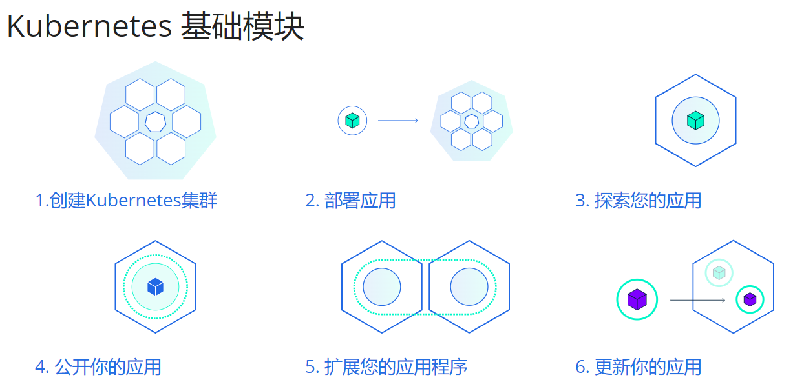


### kubernetes的構建

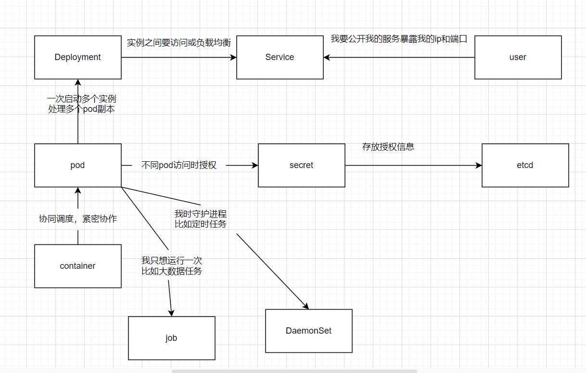


##    组件

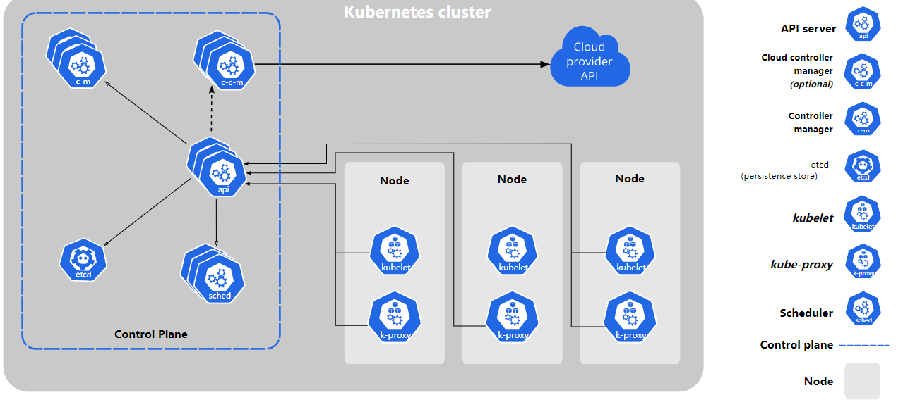


## 基础知识

### kubernetes集群（cluster)

**Kubernetes 协调计算机集群，这些计算机连接起来作为一个单元工作。**Kubernetes 中的抽象允许您**将容器化应用程序部署到集群**，而无需将它们专门绑定到单个机器。Kubernetes 是一个生产级的开源平台，**可在计算机集群内和跨计算机集群协调应用程序容器的放置（调度）和执行**。

cluster 是计算、存储和网络资源的集合，kubernetes利用这些资源运行各种基于容器的应用。

一个 Kubernetes 集群由两种类型的资源组成：

master(control plane)和node

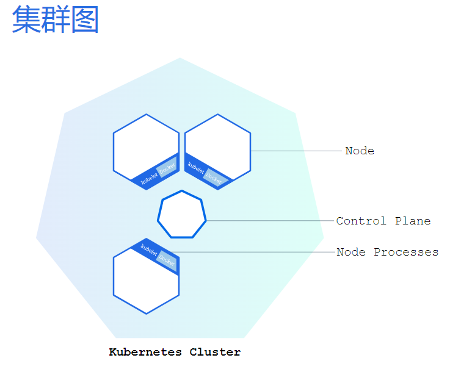

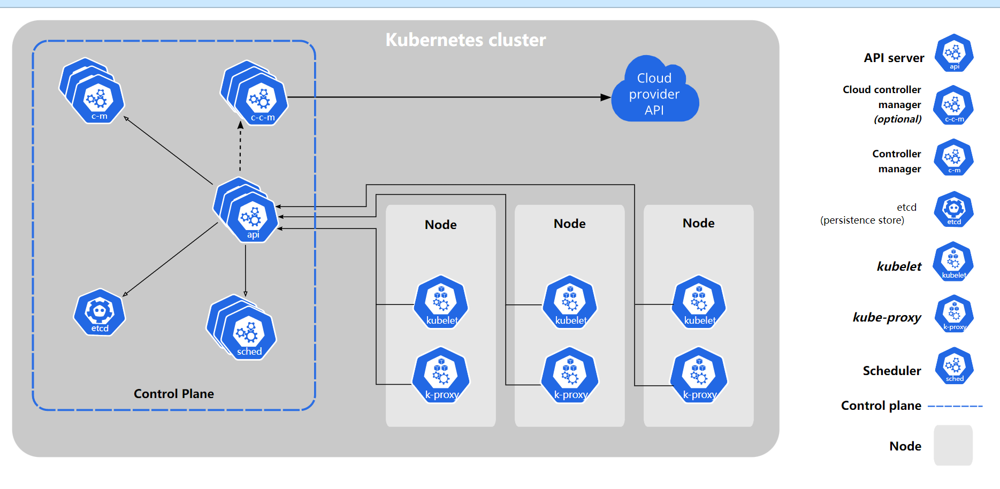

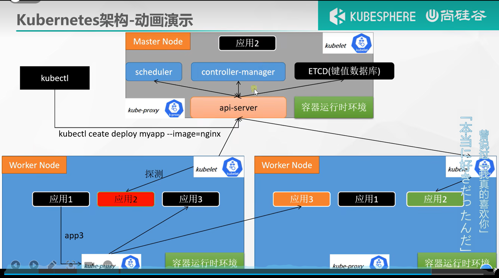

### **控制面板**（master/control plane)

**控制平面负责管理集群。**控制平面协调集群中的所有活动，例如**调度**应用程序、**维护**应用程序的所需状态、**扩展**应用程序和推出新的更新。

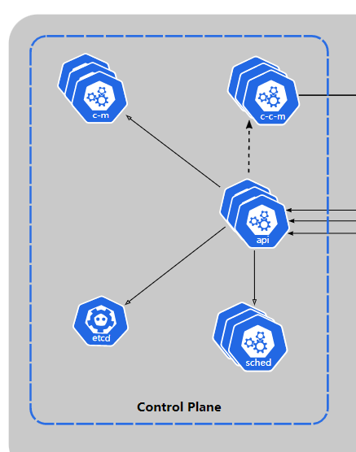

master运行着的daemon服务包括kube-apiserver、kube-scheduler、kube-controller-manager、etcd和pod网络。

#### API Server(kube-apiserver)

提供HTTP/HTTPS RESTful API，即KubenetesAPI。该服务时kubernetes cluster的前端接口，各种客户端接口以及其他组件用它管理cluster的各种资源。管理集群中所有的交互。

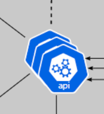

#### Scheduler（kube-scheduler）

调度程序负责决定将pod放在哪个node上运行，scheduler在调度室会充分考虑cluster的拓扑结构，调度决策考虑的因素包括：个人和集体资源需求、硬件/软件/策略约束、亲和性和反亲和性规范、数据局部性、工作负载间干扰和截止日期。

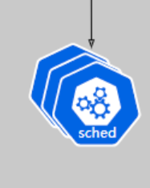

- controller manager（kube-controller-manager）

负责管理cluster各种资源，保证资源处于预期状态。controller manager由多种controller组成：replication controller、endpoints controller、namespace controller、serviceaccounts controller等。

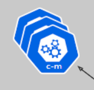

#### cloud-controller-manager

云控制器管理器

云控制器管理器允许您将集群链接到云提供商的 API，并将与该云平台交互的组件与仅与您的集群交互的组件分开。

cloud-controller-manager 仅运行特定于您的云提供商的控制器。

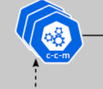

#### etcd

etcd负责保存kubernetes cluster的配置信息和各种资源的状态信息。当数据发生变化时，etcd会快速通知kubernetes。

一致且高度可用的键值存储，用作 Kubernetes 的所有集群数据的后备存储。

如果您的 Kubernetes 集群使用 etcd 作为其后备存储，请确保您为这些数据制定了 [备份](https://kubernetes.io/docs/tasks/administer-cluster/configure-upgrade-etcd/#backing-up-an-etcd-cluster)计划。

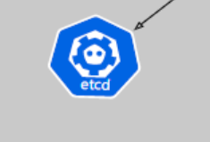


### **节点**（node）

**节点是在 Kubernetes 集群中充当工作机器的 VM 或物理计算机。**每个节点都有一个 **Kubelet，它是一个代理，用于管理节点并与 Kubernetes 控制平面进行通信**。Kubernetes 通过将容器放入在节点（Node）上运行的 Pod 中来执行你的工作负载。 节点可以是一个虚拟机或者物理机器，取决于所在的集群配置。 每个节点包含运行 [Pod](https://kubernetes.io/zh-cn/docs/concepts/workloads/pods/) 所需的服务； 这些节点由 [控制面](https://kubernetes.io/zh-cn/docs/reference/glossary/?all=true#term-control-plane) 负责管理。

在 Kubernetes 上部署应用程序时，您告诉控制平面启动应用程序容器。控制平面安排容器在集群的节点上运行。**节点使用控制平面公开的[Kubernetes API](https://kubernetes.io/docs/concepts/overview/kubernetes-api/)**与控制平面通信。最终用户也可以直接使用 Kubernetes API 与集群进行交互。

Pod 总是在Node上运行。节点是 Kubernetes 中的工作机器，可以是虚拟机或物理机，具体取决于集群。每个节点都由控制平面管理。一个 Node 可以有多个 Pod，Kubernetes 控制平面会自动处理跨集群中 Node 的 Pod 调度。控制平面的自动调度会考虑每个节点上的可用资源。
 每个 Kubernetes 节点至少运行：  Kubelet，负责 Kubernetes 控制平面和 Node 之间通信的进程；它管理机器上运行的 Pod 和容器。
一个容器运行时（如 Docker），负责从注册表中拉取容器镜像、解压容器并运行应用程序。

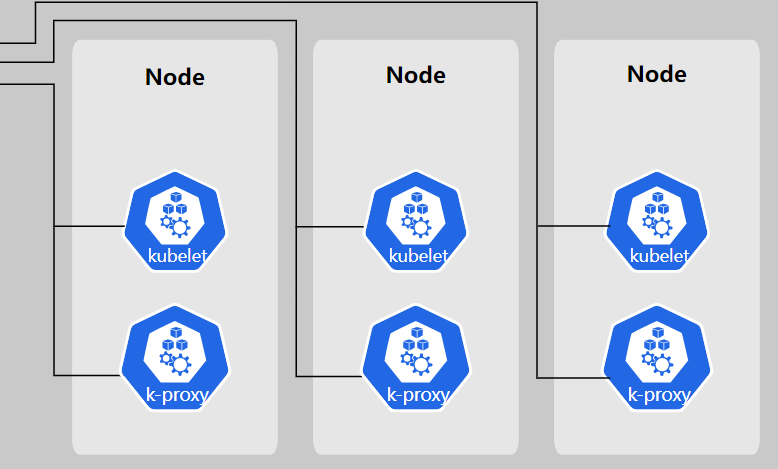

#### Kubelet

`kubelet` 会在集群中每个[节点（node）](https://kubernetes.io/zh-cn/docs/concepts/architecture/nodes/)上运行。 它保证[容器（containers）](https://kubernetes.io/zh-cn/docs/concepts/overview/what-is-kubernetes/#why-containers)都运行在 [Pod](https://kubernetes.io/zh-cn/docs/concepts/workloads/pods/) 中。

kubelet 接收一组通过各类机制提供给它的 PodSpecs， 确保这些 PodSpecs 中描述的容器处于运行状态且健康。 kubelet 不会管理不是由 Kubernetes 创建的容器。

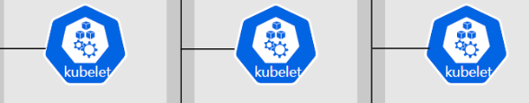

#### kube-proxy

[kube-proxy](https://kubernetes.io/zh-cn/docs/reference/command-line-tools-reference/kube-proxy/) 是集群中每个[节点（node）](https://kubernetes.io/zh-cn/docs/concepts/architecture/nodes/)所上运行的网络代理， 实现 Kubernetes [服务（Service）](https://kubernetes.io/zh-cn/docs/concepts/services-networking/service/) 概念的一部分。

kube-proxy 维护节点上的一些网络规则， **这些网络规则会允许从集群内部或外部的网络会话与 Pod 进行网络通信。**

如果操作系统提供了可用的数据包过滤层，则 kube-proxy 会通过它来实现网络规则。 否则，kube-proxy 仅做流量转发

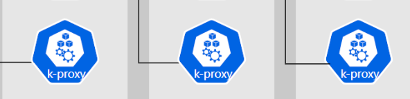

#### *Pod*

是可以在Kubernetes*中创建和管理的最小可部署计算单元。

相互頻繁訪問的交互的幾個任務往往會被直接部署在同一個機器上，甚至通過localhost通信，通過本地磁盤目錄交換文件，而在kubernetes中這些容器會被劃分到一個pod中，pod裏的容器共享同一個network namesapce，同一組volume，從而實現搞笑的信息交換。

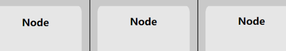

A *Pod* (as in a pod of whales or pea pod) 是一组一个或多个 [容器](https://kubernetes.io/docs/concepts/containers/)，包括共享存储（卷）、IP 地址和有关如何运行它们的信息，具有共享存储和网络资源，以及如何运行容器的规范。**Pod 的内容始终是共同定位和共同调度的**，并在共享上下文中运行。通常会把紧密相关的一组容器放到一个pod中，每个 Pod 都与调度它的节点绑定，并一直保留在那里直到终止（根据重启策略）或删除。如果一个节点发生故障，相同的 Pod 会被调度到集群中的其他可用节点上。

引入pod好处：

1. 可管理性：kubernetes以pod为最小单位进行调度、扩展、共享资源、管理生命周期。
2. 通讯和资源共享：同一个pod中的容器共享ip地址和port空间，也就是说他们在一个network namespace中。可以直接用localhost通讯，可以共享存储，当kubernetes挂载volume到pod中，实际是将volume挂载到pod中每一个容器上。

**注意：**虽然 Kubernetes 支持更多 [容器运行时](https://kubernetes.io/docs/setup/production-environment/container-runtimes) 不仅仅是 Docker，[Docker](https://www.docker.com/)是最常见的运行时，它有助于使用 Docker 中的一些术语来描述 Pod。


The shared context of a Pod is a set of Linux namespaces, cgroups, and potentially other facets of isolation - the same things that isolate a [container](https://kubernetes.io/docs/concepts/containers/). Within a Pod's context, the individual applications may have further sub-isolations applied.

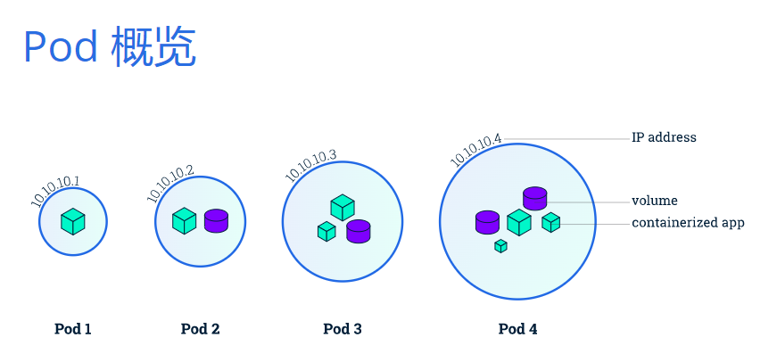

pod是单一(ine-container-per-pod)亦或一组容器的合集

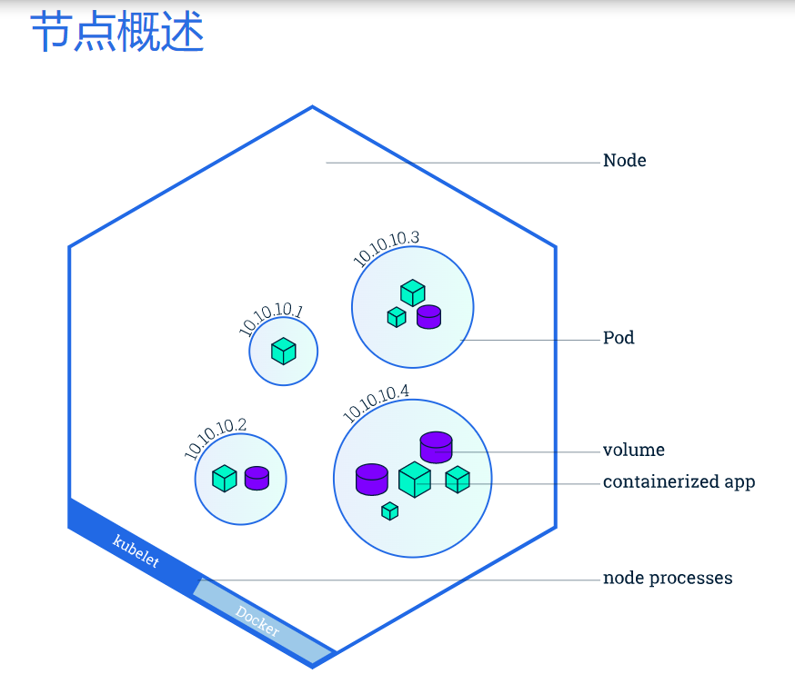

deployment是pod版本管理的工具 用来区分不同版本的pod，单独创建pod时不会自动创建deployment，但是创建deployment的时候一定会创建pod,因为pod是一个基础的单位。即deployment可以区别同一个应用的不同版本

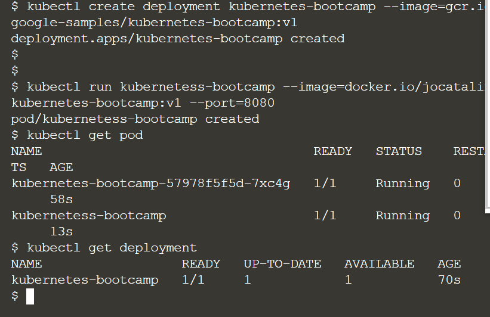

#### 容器运行时（Container Runtime）

容器运行环境是负责运行容器的软件。

Kubernetes 支持许多容器运行环境，例如 [containerd](https://containerd.io/docs/)、 [CRI-O](https://cri-o.io/#what-is-cri-o) 以及 [Kubernetes CRI (容器运行环境接口)](https://github.com/kubernetes/community/blob/master/contributors/devel/sig-node/container-runtime-interface.md) 的其他任何实现。

### controller

kubernetes controller用于运行pod

kubernetes不会直接创建pod而是通过controller来管理pod，controller定义了pod部署特性，比如有几个副本，在什么样的node上运行。常见的controller有:Deployment、ReplicaSet、DaemonSet、StatefuleSet、Job等

#### Deployment 

*负责创建和更新应用程序的实例*管理pod多个副本，确保pod按照预期状态运行

一旦你有一个正在运行的 Kubernetes 集群，你就可以在它上面部署你的容器化应用程序。为此，您需要创建一个 Kubernetes**部署**配置。Deployment 指示 Kubernetes 如何创建和更新应用程序的实例。创建部署后，Kubernetes 控制平面会安排该部署中包含的应用程序实例在集群中的各个节点上运行。

创建应用程序实例后，Kubernetes 部署控制器会持续监控这些实例。如果托管实例的节点出现故障或被删除，部署控制器会将该实例替换为集群中另一个节点上的实例。**这提供了一种自我修复机制来解决机器故障或维护问题。**

##### 扩展部署

当流量增加时，我们将需要扩展应用程序以满足用户需求。
 **通过更改部署中的副本数量来实现扩展**

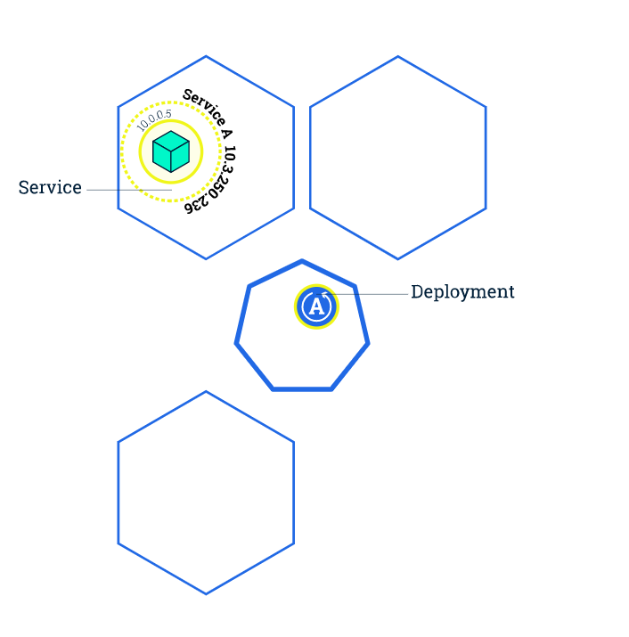

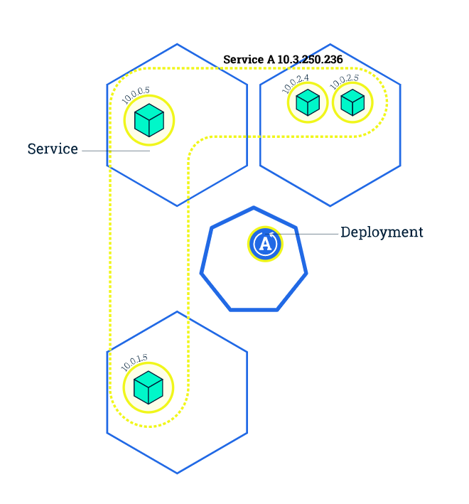

##### 更新应用程序

用户希望应用程序始终可用，并且开发人员希望每天多次部署它们的新版本。在 Kubernetes 中，这是通过滚动更新完成的。滚动更新通过使用新的 Pod 实例增量更新 Pod 实例，允许 Deployments 的更新在零停机时间的情况下进行。新的 Pod 将安排在具有可用资源的节点上。

滚动更新允许以下操作：  将应用程序从一个环境提升到另一个环境（通过容器映像更新） 回滚到以前的版本 零停机时间的应用程序的持续集成和持续交付

如果部署公开，则服务将在更新期间仅将流量负载均衡到可用 Pod。

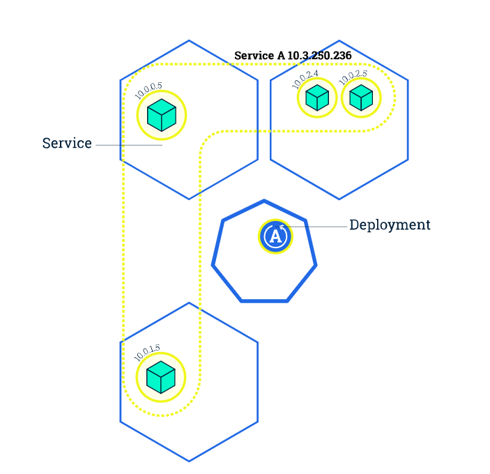

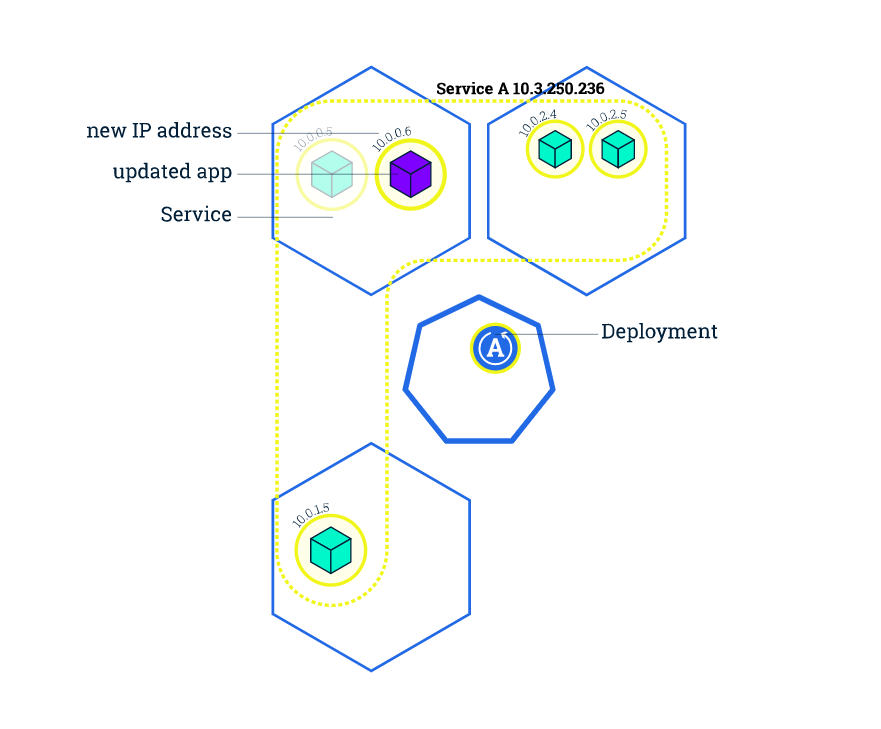

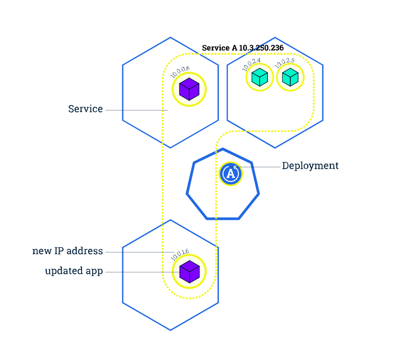

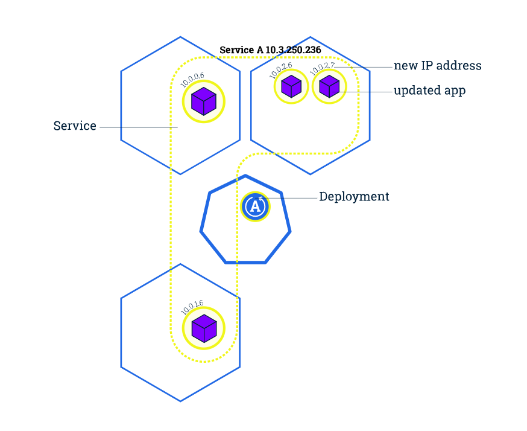

#### ReplicaSet

实现了pod多副本管理，使用Deployment时会自动创建ReplicaSet，即Deployment是通过ReplicaSet来管理pod的多个副本

#### DaemonSet

用于每个node最多只运行一个pod副本的场景，DaemonSet用于运行daemon（守护进程）。

#### StatefuleSet

保证pod的每个副本在整个生命周期中名称是不变的，当某给pod发生故障需要删除并重新启动时pod名称会发生变化，同时statefuleset会保证副本按照固定的顺序启动、更新或者删除.

#### Job

用于运行结束就删除的应用，而其他controller中的pod通常时长期持续运行。

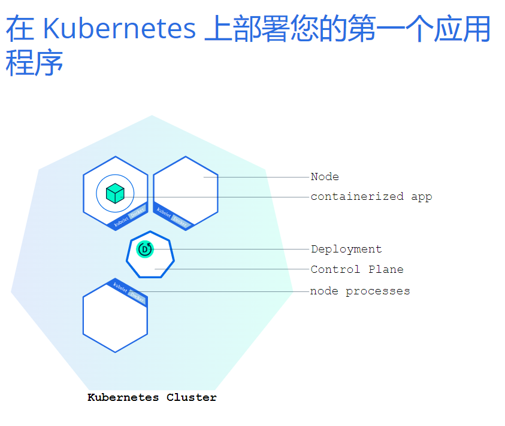

*应用程序需要打包成一种受支持的容器格式才能部署在 Kubernetes 上*


### Service

kubernetes service用于访问pod

kubernetes的service服務讓往往讓故意不部署在同一主機上的幾個應用（web應用和數據庫）交互，對於web應用來説他只需要知道數據庫pod的service就可以交互，這樣web應用宕機了，數據庫也完全不受影響。

Kubernetes Service 是一个抽象层，kubernetes給每个 Pod 綁定了一個service服務，**service服務申明的 IP 地址等信息是固定不變的**，這個service服務主要作用就是作爲pod的代理入口（Portal），從而代替pod對外暴露一個固定的ip地址。

service後端真正代理的pod的ip地址端口等信息的自動更新、維護則是由kubernetes項目負責。

即service是用于外界访问这些副本，service定义了外界访问一组特定pod的方式，service有自己的ip和端口，service为pod提供了负载均衡

service支持依赖 Pod 之间的松散耦合。与所有 Kubernetes 对象一样，service是使用 YAML （首选）或 JSON 定义的。

service使用标签和选择器匹配一组Pod，这是一种允许对 Kubernetes 中的对象进行逻辑操作的分组。

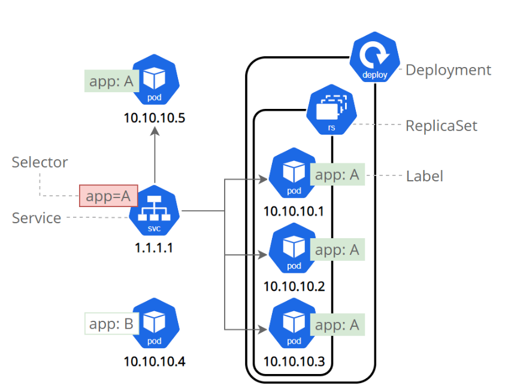


## 原理

### kubelet

(最核心的組件)

kubelet用於與容器運行時交互

kubelet通過CRI(container runtime interface)的遠程調用接口與容器運行時交互，該接口定義了容器運行時的核心操作，比如啓動一個容器所學的所有參數

kubelet通過gPRC協議與Device Plugin插件交互，該插件用於管理GPU等宿主機物理設備。

kubelet通過CNI(container networking interface)調用網絡插件為容器配置網絡

kubelet通過CSI(container storage interface)調用存儲插件為容器配置持久化存儲

### kubeadm

直接在宿主機運行kubelet，然後使用容器部署其他kubernetes組件。
#### kubeadm init

1. 首先kubeadm進行perflight checks檢查，檢測通過后就會生成kubernetes對外提供服務的所需的各種證書和對應的目錄。

   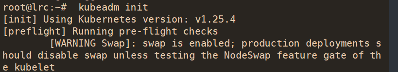

kubernetes對外提供服務除非專門開啓非安全模式，否則都通過https才可訪問kube-apiserver，kubeadm會為kubernetes項目生成證書文件放在master節點的/etc/kubernetes/pki下，最重要的是ca.crt和對應私鑰ca.key

kubeadm為kubectl獲取容器日志等streaming操作生成了apiserver-bubelet-client.crt對應的私鑰是apiserver-kubelet-client.key文件，因爲需要通過kube-apiserver向kubelet發起請求。

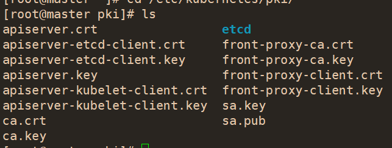

證書生成之後kubeadm回味其他組件生成訪問kube-apiserver所需的配置文件。這些文件的路徑是： /etc/kubernetes/xxx.conf

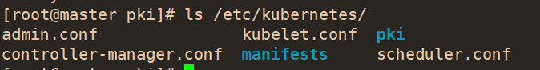

這些配置文件記錄的是當前這個matser節點的服務器地址、監聽端口、證書目錄等信息。這樣，對應的客戶端（scheduler、bubelet等）就可以直接加載響應文件，使用其中的信息與kube-apiserver建立安全的鏈接。


3. 接下來kubeadm會為master生成pod配置文件，kubernets有三個master組件：kube-apiserver、kube-controller-manager和kube-scheduler，他們都會通過pod的形式部署。完成之後kubeadm還會生成一個etcd的pod YAML文件，用來通過同樣的static pod方式啓動etcd。


kubernetes通過static pod 啓動容器，他允許你把要部署的pod的yaml文件放到一個指定的目錄中。儅這臺機器上的kubelet啓動時，它會自動檢查該目錄，加載所有pod yaml文件并在這臺機器上啓動它。在kubeadm中，master組件的yaml文件生成在/etc/kubernetes/manifests下。

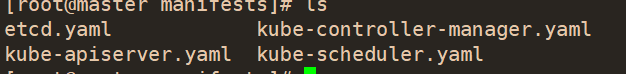

這些YAML出現在被kubelet監控的/etc/kubernetes/manifests目錄下，kubelet就會自動創建這些YAML定義的pod，即matser組件的容器。

4. Master容器啓動之後，kubeadm會通過薑茶localhost:6443/healthz這個master組件的健康來檢查URL，等待matser組件完全運行起來。

然後kubeadm就會為集群生成一個bootstrap token。之後只要持有這個token，任何安裝了kubelet和kubadm的節點都可以通過kubeadm join加入這個集群。

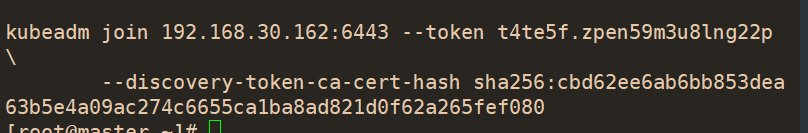

token生成之後，kubeadm會將ca.crt等Master節點的重要信息，通過configMap的方式保存在etcd中，供後續部署node節點使用，這個configmap名字是cluster-info。

此外,kubeadm還會提示我們第一次使用用kubernetes集群所需要配置的命令，因爲kubernetes集群默認需要以加密的方式訪問，所以這些命令是將剛剛部署生成的kubernetes集群的安全哦欸之文件，保存到當前用戶的.kube目錄下，kubectl默認會使用這個目錄下的授權信息訪問集群。

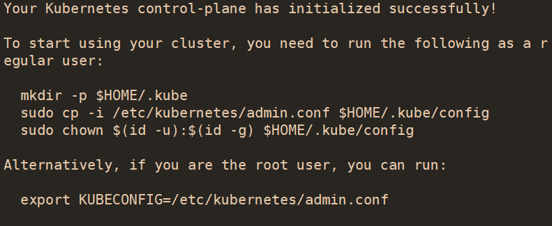

最後一步就是安裝默認插件。kubernetes默認必須安裝kube-proxy和dns這兩個插件。他們分別用來提供整個集群的服務發現和dns功能。這兩個插件也是鏡像，kubeadm用kubenetes客戶端創建了兩個pod而已。

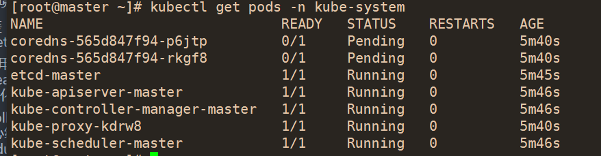

#### kubeadm join

任何一臺機器想要成爲kubernetes集群中的一個節點，就必須在集群的kube-apiserver上注冊。要和apiserver打交道就需要證書文件（ca文件）。所以kubeadm通過bootstrap token安全驗證使用“非安全模式”（即沒有證書模式）訪問到apiserver從而拿到保存在configmap中的cluster-info（它保存了api server的授權信息）。

只要有了apiserver的地址，端口，證書，kubelet就可以以安全模式連接到apiserver上了，這樣一個新節點就部署好了。


## 命令

### [kubeadm](https://kubernetes.io/docs/reference/setup-tools/kubeadm/)

为了方便部署社区推出了kubeadm

kubeadm用于创建和管理 Kubernetes 集群的工具


#### [kubeadm init](https://kubernetes.io/docs/reference/setup-tools/kubeadm/kubeadm-init/)

kubeadm init引导 Kubernetes controller plane node，初始化controller plane (master)。

`--apiserver-advertise-address`

在有多张网卡时指明master用哪个网卡与cluster的其他节点通信，API 服务器将公布它正在侦听的 IP 地址。如果未设置，将使用默认网络接口。

`--apiserver-bind-port int32   Default: 6443`

API Server 绑定的端口。

`--apiserver-cert-extra-sans`

 用于 API Server 服务证书的可选额外主题备用名称 (SAN)。可以是 IP 地址和 DNS 名称。

`--cert-dir string   Default: "/etc/kubernetes/pki"`

保存和存储证书的路径。

`--certificate-key string`

用于加密 kubeadm-certs Secret 中的控制平面证书的密钥。

`--config`

 kubeadm 配置文件的路径。

`--cri-socket `

要连接的 CRI 套接字的路径。如果空 kubeadm 将尝试自动检测此值；仅当您安装了多个 CRI 或您有非标准 CRI 插座时才使用此选项。

`--dry-run`

不要应用任何更改；只需输出将要做什么。

`--feature-gates`

一组描述各种特征的特征门的键值对。选项有：
PublicKeysECDSA=true|false (ALPHA - default =false) RootlessControlPlane=true
|false (ALPHA - default=false)
UnversionedKubeletConfigMap=true|false (default=true)

`--control-plane-endpoint` 

为控制平面指定一个稳定的 IP 地址或 DNS 名称。

`--pod-network-cidr`

指定 pod 网络的 IP 地址范围。如果设置，控制平面将自动为每个节点分配 CIDR。

`--node-name`

 指定节点名称。


可以自定義集群組件參數（比如指定apiserver參數）可以通過`kubeadm init --config kubeadm.yaml`來給kubeadm提供一個yaml文件，從而自定義參數。kubeadm會使用這個yaml替換/etc/kubernetes/manifests/kube-apiserver.yaml裏的command字段裏的參數


#### [kubeadm join](https://kubernetes.io/docs/reference/setup-tools/kubeadm/kubeadm-join/)

引导 Kubernetes 工作节点并将其加入集群

```
kubeadm join [api-server-endpoint] [flags]
```

`--apiserver-advertise-address`

如果节点应该托管一个新的控制平面实例，API 服务器将公布它正在侦听的 IP 地址。如果未设置，将使用默认网络接口。

`--apiserver-bind-port int32 默认值：6443`

如果节点应该托管一个新的控制平面实例，那么 API 服务器要绑定的端口。

`--token`

如果未提供这些值，请将此令牌用于发现令牌和 tls-bootstrap-token


#### [kubeadm upgrade](https://kubernetes.io/docs/reference/setup-tools/kubeadm/kubeadm-upgrade)

将 Kubernetes 集群升级到更新版本


#### kubeadm token list

列出token

```bash
查看hash
openssl x509 -pubkey -in /etc/kubernetes/pki/ca.crt | openssl rsa r 2>/dev/null | openssl dgst -sha256 -hex | sed 's/^.* //'


kubeadm join 192.168.30.162:6443 --token 76l6ui.tgqnx5skqulquk5w --discovery-token-ca-cert-hash sha256:e3b0c44298fc1c149afbf4c8996fb92427ae41e4649b934ca495991b7852b855

```


#### [kubeadm certs](https://kubernetes.io/docs/reference/setup-tools/kubeadm/kubeadm-certs)

用于管理 Kubernetes 证书


### kubectl

kubectl时管理kubernetes cluster的命令行工具

kubectl常用命令

```
get    获取列出一个或多个资源的信息。（资源分为pod、instance、service等很多种）
describe    输出指定的一个/多个资源的详细信息。（一般describe状态有问题节点，如Pending等）
logs    输出pod中一个容器的日志。（如果pod只包含一个容器则可以省略容器名）
create    指定Yaml或Json，创建资源。（通过文件或者控制台输入）
edit    编辑服务器上定义的资源。（文件默认输出格式为YAML。要以JSON格式编辑，请指定“-o json”选项。）
rolling-update    执行指定ReplicationController的滚动更新。（不中断业务的更新方式）
delete    删除一个资源（可以是pod、instance等）
exec    在容器内部执行命令
```


#### kubectl cluster-info

查看集群详细信息

#### kubectl config view

查看kubectl配置

#### kubectl taint nodes [name]

配置污点，沾上污点的集群不可用运行pod，删除taint污点才可以。

```
foo=bar:NoSchedule是不可以,使用后会在节点增加一个键值对格式的Taint即foo=bar:NoSchedule，
NoSchedule意味着这个Taint只会在调度新的pod是才产生作用，而不影响已经运行的pod，

声明Toleration就可以运行pod
在pod的yaml文件中的spec部分加入tolerations字段即可：
kubectl taint nodes --all node-role.kubernetes.io/control-plane-
这里使用了短横线-移除所有以NoSchedule为值的node-role.kubernetes.io/control-plane键
```

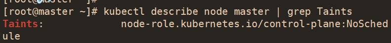

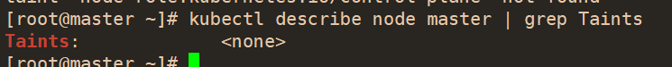

#### kubectl get

该命令的作用是从kubernetes中获取指定的api对象

```
获取所有namespace：kubectl get ns

在指定的namespace下获取资源：kubectl -n {$nameSpace} get pods
检查该节点上各个系统的pod状态，kube-system时kubernetes项目预留的系统pod的工作空间（他不是linux namespace，而是kubernetes划分的不同的工作空间。

以yaml格式输出资源：kubectl -n {$nameSpace} -o yaml

通用格式：kubectl get {$sourceType} --all-namespaces
```
```
常用的资源类型（{$resourceType}）有：
po（pod）
ns（命名空间namespace）
instance（实例）
svc（service服务）：定义了一个 Pod 的逻辑分组，一种可以访问它们的策略（微服务）。
cm（configMap）：存储全局配置变量的，将分布式系统中不同模块的环境变量统一到一个对象中管理。
ds（deamonSet）：在每台计算节点上运行一个守护进程（如日志采集等）,有时pod处于pending可能是因为某个deamonSet没起来。
deploy（deployment）：用于启动（上线/部署）一个Pod或者ReplicaSet。这个如果有问题，那么其他依赖它来部署的资源就肯定不会正常了
```

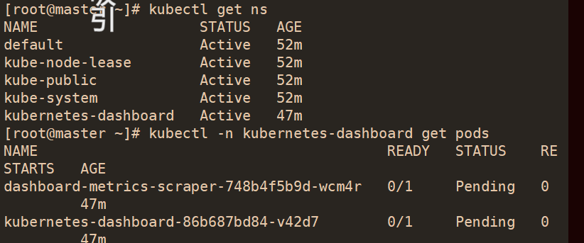


-  kubectl get nodes

查看节点


#### kubectl logs 

- 查看日志，--tail指定只看最后1000行：kubectl -n {$nameSpace} logs --tail=1000 {$podName} | less
- eg: kubectl logs --tail=20 nginx|less


#### kubectl describe pod <pod name>

查看pod具体情况

注意：经常会查看到以为镜像无法拉取而导致卡顿，可以手动使用docker pull拉取。


#### kubectl create -f 配置文件

运行YAML或者JSON格式的文件


#### kubectl replace

使用配置文件或stdin来替换资源。

更新配置


也可以用kubectl apply -f 取更新


#### kubectl expose

公开pod

```
kubectl expose deployment hello-node --type=LoadBalancer --port=8080
```

`--type=LoadBalancer`标志表示您希望在集群之外公开您的服务。应用程序代码`registry.k8s.io/echoserver`仅侦听 TCP 端口 8080。如果您曾经 `kubectl expose`公开不同的端口，客户端将无法连接到该其他端口。

#### kubectl run ****

运行一个应用

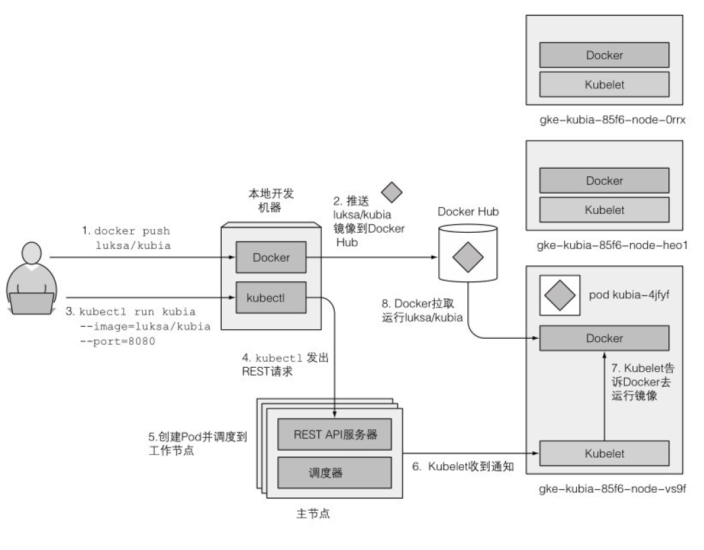


#### kubectl service

查看创建的服务

在支持负载平衡器的云提供商上，将提供一个外部 IP 地址来访问服务。在 minikube 上，该`LoadBalancer`类型使服务可以通过`minikube service` 命令访问


## YAML

kubernetes可以识别YAML或者JSON

一个kubernetes的api对象的定义，大多可以分为metadate和spec两个部分：

metadate存放的是这个对象的元数据，对所有api对象来说这部分的字段和格式基本相同；

而spec存放的是属于这个对象独有的定义，用来描述他所要表达的功能。

eg.

```YAML
apiVersion: apps/v1
kind: Deployment  #指定了这个API对象类型为Deployment
metadata:   #元数据，存放共享数据
  name: nginx-deployment
spec:
  selector:
    matchLabels:
      app: nginx #deployment会把正在运行携带app：nginx标签的pod识别为被管理对象，并确保这些pod的总数严格等于2，(spec.selector.matchLabels)
  replicas: 2 #定义了pod副本个数(spec.replicas)
  template:
    metadata:
      labels: #Deployement这样的控制器就可以通过该字段过过滤出他所关心的被控对象
        app: nginx 
    spec: #存放特有数据
      containers:
      - name: nginx
        image: nginx:1.7.9
        ports:
        - containerPort: 80
```


## 部署kubenetes

### 1.安装container runtme

安装docker 

```
curl -fsSL https://get.docker.com | bash -s docker --mirror Aliyun
```

### 2.环境配置

```bash
hostnamectl set-hostname #配置主机名

添加域名映射

systemctl stop firewalld && systemctl disable firewalld && setenforce 0 && sed -i 's/^SELINUX=enforcing$/SELINUX=permissive/' /etc/selinux/config && swapoff -a && sed -ri 's/.*swap.*/#&/' /etc/fstab#关闭防火墙和selinux和交换分区


#允许 iptables 检查桥接流量
cat <<EOF | sudo tee /etc/modules-load.d/k8s.conf
br_netfilter
EOF

cat <<EOF | sudo tee /etc/sysctl.d/k8s.conf
net.bridge.bridge-nf-call-ip6tables = 1
net.bridge.bridge-nf-call-iptables = 1
EOF
sudo sysctl --system
```

### 3.安装kubelet.kubeadm.kubectl

```bash
cat <<EOF | sudo tee /etc/yum.repos.d/kubernetes.repo
[kubernetes]
name=Kubernetes
baseurl=https://packages.cloud.google.com/yum/repos/kubernetes-el7-\$basearch
enabled=1
gpgcheck=1
gpgkey=https://packages.cloud.google.com/yum/doc/rpm-package-key.gpg
exclude=kubelet kubeadm kubectl
EOF


sudo yum install -y kubelet kubeadm kubectl --disableexcludes=kubernetes

systemctl enable --now kubelet   #kubelet 现在每隔几秒重启一次，因为它在崩溃循环中等待 kubeadm 告诉它该做什么。

kubectl completion bash | sudo tee /etc/bash_completion.d/kubectl > /dev/null#配置自动补全
```

### 4.使用kubeadm init初始化

### controller plane,启动核心组件(scheduler,etcd,api-server等)

```
kubeadm init

mkdir -p $HOME/.kube
sudo cp -i /etc/kubernetes/admin.conf $HOME/.kube/config
sudo chown $(id -u):$(id -g) $HOME/.kube/config

export KUBECONFIG=/etc/kubernetes/admin.conf

```


### 5.部署网络插件

网络插件还没有部署，和网络有关的pod都处于pending状态，即调度失败

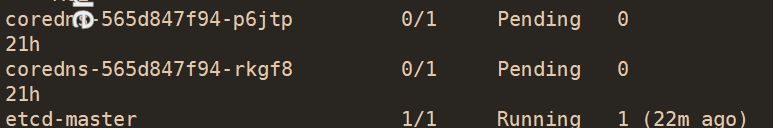

node也为notready

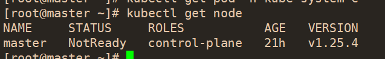

使用

```
wget http://static.corecore.cn/weave.v2.8.1.yaml
kubectl apply -f weave.v2.8.1.yaml
```


### 6.安装dshboard

```
$ wget https://raw.githubusercontent.com/kubernetes/dashboard/v2.5.1/aio/deploy/recommended.yaml
$ kubectl apply -f recommended.yaml
```

防止暴露隐患，需要通过proxy访问。


### 7.部署存储插件

部署容器持久化存储

很多时候我们需要用volume把外面宿主机上的目录或者文件挂载到容器的mount namespace中，从而实现容器和宿主机共享这些目录或者文件，容器里的应用也使用这些volume读写文件。

可是如果我在某台机器启动了一个容器，顯然無法在別的機器看到他的volume裏寫入的文件，這就是容器最典型的特徵之一：無狀態

容器持久化存儲就是保存容器粗出狀態的重要手段，存儲插件會在容器裏挂在一個基於網絡或其他機制的原創volume，使得在容器裏創建的文件實際上保存在遠程存儲服務器上，或者以分佈式的方式保存在多個節點上，而與當前宿主機沒有任何綁定。這樣無論我在那臺宿主機上啓動新的容器，都可以請求挂在指定的持久化存儲卷，從而範圍跟volume裏保存的内容。

ceph、glusterfs、nfs都可以為kubernetes提供持久化存儲能力。


```bash

```


### 常见初始化问题

- [WARNING Swap]: swap is enabled; production deployments should disable swap unless testing the NodeSwap feature gate of the kubelet

解决：swapon -a

- [WARNING Hostname]: hostname "master" could not be reached 	[WARNING Hostname]: hostname "master": lookup master on 192.168.30.2:53: no such host 

解决：添加hosts

- [ERROR CRI]: container runtime is not running: output

解决`rm -rf /etc/containerd/config.toml && systemctl restart containerd`

​		``

- [ERROR FileContent--proc-sys-net-bridge-bridge-nf-call-iptables]: /proc/sys/net/bridge/bridge-nf-call-iptables contents are not set to 1

解决：echo "1" >/proc/sys/net/bridge/bridge-nf-call-iptables

- runtime network not ready: NetworkReady=false reason:NetworkPluginNotReady message:Network plugin returns error: cni plugin not initialized

解決：部署好之後get node顯示notready，describe node master顯示這個，是因爲我們尚未部署任何網絡。

- [ERROR FileContent--proc-sys-net-ipv4-ip_forward]: /proc/sys/net/ipv4/ip_forward contents are not set to 1

解决 ：sysctl -w net.ipv4.ip_forward=1


- ubuntu安装cridocker

cri-dockerd项目提供了预制的二制格式的程序包，用户按需下载相应的系统和对应平台的版本即可完成安装，这里以Ubuntu 2004 64bits系统环境，以及cri-dockerd目前最新的程序版本v0.2.2为例。

```bash
curl -LO https://github.com/Mirantis/cri-dockerd/releases/download/v0.2.2/cri-dockerd_0.2.2.3-0.ubuntu-focal_amd64.deb
apt install ./cri-dockerd_0.2.2.3-0.ubuntu-focal_amd64.deb
```

- centos安装cridocker

```
https://github.com/Mirantis/cri-dockerd
```

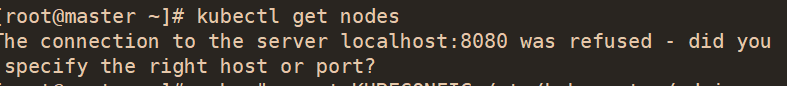

解决：

```
echo "export KUBECONFIG=/etc/kubernetes/admin.conf" >> /etc/profile

source /etc/profile
```


## 部署minikube

### 安装docker

```bash
wget http://mirrors.aliyun.com/docker-ce/linux/centos/docker-ce.repo
mv docker-ce.repo /etc/yum.repos.d/
yum list docker-ce --showduplicates | sort -r
yum install -y docker-ce-20.10.9-3.el7
systemctl start docker
systemctl enable docker
```

### 安装minikube和kubectl

```bash
wget https://github.com/kubernetes/minikube/releases/download/v1.23.1/minikube-1.23.1-0.x86_64.rpm
rpm -ihv minikube-1.23.1-0.x86_64.rpm
curl -Lo kubectl    http://kubernetes.oss-cn-hangzhou.aliyuncs.com/kubernetes-release/release/v1.22.1/bin/linux/amd64/kubectl
mv kubectl /usr/bin
chmod a+x /usr/bin/kubectl
minikube start --force --driver=docker --image-mirror-country="cn" --image-repository=http://registry.cn-hangzhou.aliyuncs.com/google_containers
```


### 常用命令

```
minikube 常用命令
# 检查安装结果
minikube help
minikube status
kubectl version
kubectl get nodes
kubectl get pods -A

# 查询运行的 pod
minikube kubectl -- get po -A

# 挂起虚拟机
minikube pause

# 停止虚拟机
minikube stop

# 修改虚拟机内存配置
minikube config set memory 16384

# 查看 minikube 的安装目录列表
minikube addons list

# 启动 dashboard 控制台
minikube dashboard
curl 127.0.0.1:23341

# 删除所有 minikube 虚拟机
minikube delete --all

# 部署目录
/var/lib/kubelet
/var/lib/minikube

# 使用minikube导入镜像,当本地镜像总是无法找到时，可以留意这个这种方式
minikube load xxx.tar

# 启动minikube
minikube start --force --driver=docker --image-repository=registry.cn-hangzhou.aliyuncs.com/google_containers
```

k8s

```
k8s 常用命令
# 创建带有终端的 Pod，并进入(后续测试用)
kubectl run busybox --image=busybox -it

# 部署 app 进行测试
kubectl run nginx02 --image=nginx
kubectl run hello-minikube --image=k8s.gcr.io/echoserver:1.4 --port=8081

# deployment
kubectl create deployment hello-minikube --image=k8s.gcr.io/echoserver:1.4
kubectl expose deployment hello-minikube --type=NodePort --port=8080
kubectl get service hello-minikube

# 使用 minikube 访问服务
minikube service hello-minikube

# 使用端口映射访问服务
kubectl port-forward service/hello-minikube 7080:8080
curl http://localhost:7080/

# 使用 LB 类型的 deployment 测试
kubectl create deployment balanced --image=k8s.gcr.io/echoserver:1.4  
kubectl expose deployment balanced --type=LoadBalancer --port=8080
minikube tunnel
kubectl get services balanced
```

