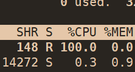
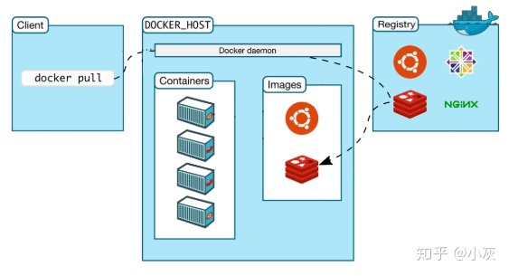

# docker

## 简介

容器共享一个操作系统，只隔离了运行环境。

容器运用了集装箱的概念，程序运行的环境（依赖）就是集装箱，里面装载了程序。


## 目标

提供一个简单、轻量的建模方法

职责的逻辑分离：程序开发人员关心容器中运行的程序，运维人员关心容器管理，降低“开发时正常，是运维的问题”的风险。

快速高效的开发生命周期：docker目标缩短代码从开发到测试到部署到上线的周期，让应用程序具备可以移植性，易于构建，并易于协作。

鼓励使用面向服务的架构：docker推荐单个容器运行一个应用程序，这样就形成了一个分布式的应用程序模型。


## 技术

容器实际是一种沙盒技术，就是能够像一个集装箱一样把你的应用装起来的技术。应用之间有了边界，不至于互相干扰，也可以方便的搬来搬去，实现了pass的最理想状态。

提供的数据+程序=可执行镜像（executable image）

cgroups技术用来制造约束，namespace技术是用来修改进程视图的主要方法。

### namespace（隔离）

在宿主机上运行一个程序系统就会给她分配一个PID，但在docker中运行就会对隔离应用的进程空间动手脚

他只是linux创建新进程的一个可选的参数，Linux系统中创建线程的系统调用是

```
int pid =clone(main_function, stack_size, SIGCHLD, NULL);
#在参数中指定创建新的进程
int pid =clone(main_function, stack_size, CLONE_NEWPID | SIGCHLD, NULL);
#指定参数后，此时新创建的这个进程将会看到一个全新的进程空间，再这个进程空间里，他的PID是1，但宿主机看到的还是100，多次执行clone（）就会创建多个PID Namespace，在这个namespce里的敬长都会仍未自己是当前容器里的一号进程，他看不到宿主机的进程空间。
```

除了PID Namespacelinux还有Mount\UTS\IPC\Network和USER这些namespace

Mount namesspace用于让被隔离进程只看得到当前namespace里的挂载点信息，networknamespace让被隔离进程只看得到当前namespoace里的网络设置。


可见容器只是一组特殊的进程，内核时共享的，即容器不能运行windows，windwos的容器不能运行linux。


在linux内核中有很多资源兑现格式不能被namespace化的，比如系统时间，如果容器中调用settimeofday（2）系统调用修改了时间，因为内核共享会导致整个宿主机的时间被修改，因为共享内核也会导致应用暴露攻击面变大。


容器虽然被namespace隔离但是他和其他进程时平等的，所以会共享cpu内存等，会被抢占也会被独占，这显然不符合沙盒，所以使用下面的

### Cgroups（限制）

Linux Cgroups(linux control groups)是linux内核中用来为进程设置资源限制的一个重要功能。

Cgroups=子系统目录+资源限制文件

linux cgroups最主要的功能是限制一个进程组能够使用的资源上限，包括cpu、内存、磁盘、网络带宽等等。

cgroup还能能够对进程进行优先级设置、审计、以及将进程挂起和恢复等操作。

在linux中，cgroups向用户暴露出来的操作接口是文件系统，他以文件和目录的方式组织在操作系统的/sys/fs/cgroup/。（可以用 mount -t cgroup查看）


在cgroup目录下面有很多文件，下面的这些子目录叫做子系统，这些都是这台及其可以被cgroup显示的资源种类。


cgroup的每一项子系统都有其独特的资源限制能力

blkio,为块设备设定I/O限制，一般用于磁盘等设备

cpuset,为进程分配单独的cpu核和对应的内存结点

memory，为进程设定内存使用限制


docker在每个子系统下面为每个容器创建一个控制组（目录），在容器启动后把这个进程pid写道对应控制组的tasks文件中即可

写的数由用户决定

```bash
docker run -it --cpu-period=100000 --cpu-guota=20000 ubuntu /bin/bash
cpu带宽等于quota+period,此处cpu带宽等于100000us(100ms)+20000(20ms)=在每100ms时间里，该控制组限制的进程只能使用20ms的cpu时间，即该进程只能是用到20%的带宽
```




cgroup对资源限制有很多不足的地方，比如/proc文件系统，在容器里面运行top你会发现他显示的是宿主机的，因为/proc文件系统不知道用户通过cgroups给这个容器进行了限制，即/proc不了解cgroups限制的存在。

### rootfs

容器镜像，根文件系统

创建新进程时候，mount namespace修改的是容器进程对文件系统挂载点的认知，这也意味着只有在挂载这个操作发生之后（即重新挂载），进程的视图才会改变，否则新创建的容器和其他进程一样直接继承宿主机的各个挂载点。

mount namespace跟其他的namespace略有不同就是：他对容器进程视图的改变一定要伴随着挂在操作才能生效。

可是我们希望没创建一个新的容器时，容器进程看到的文件系统就是一个独立的环境，而不是继承，那么我们可以在容器进程启动之前重新挂载他的整个根目录/，而由于mount namespace的存在这个挂载对于宿主不可见，容器可以随便倒腾。


chroot可以改变进程的根目录，mount namespace就是基于chroot改良过来。

change root file system 改变进程根目录到指定位置

为了让容器的根目录看起来更真实一般会在这个容器的根目录下挂载一套完整的操作系统的文件系统。

这个挂载在容器根目录上用来为容器进程提供隔离后执行环境的文件系统，就是所谓的“容器镜像”。他的另一个名字就叫rootfs（根文件系统），它不包含内核，rootfs只是一个操作系统所包含的文件、配置和目录。

一个常见的rootfs包括以下目录


rootfs给了容器：一致性

rootfs里打包的不只是应用，而是整个操作系统文件和目录，意味着应用以及它运行所需要的所有依赖都封装在了一起，所以容器有了最好的迁移性。


### UnionFS

在工作中，修改都是基于旧的rootfs，比如同事用ubuntu制作了一个rootfs并安装了java环境，用来部署我的java应用，那么我的朋友在发布他的java应用时想使用我安装过java环境的rootfs。那么我们可以增量修改，只需要去维护相对于base rootfs的增量内容，而不必每次都去制造一个fork。

因此引入了层的概念（layer），用户制作镜像的每一步操作都会生成一个层，也就是一个增量rootfs，这种技术使用了UnionFS（union file system,联合文件系统）。他将不同位置的目录联合挂在（union mount）道同一个目录下。


此时在c里对abx修改，A，和B中也会生效


#### AuFS

在docker中使用的unionFS式AuFS（Another UnionFS,后更名为Alternative UnionFS，再后来叫Advance UnionFS），所以他是原生linuxUnionFS的重写和改进


这个就有11层组成，即五个增量rootfs，run时docker会把增量联合起来统一挂载在一个点


1.只读层

只读层联合挂载的方式是只读（ro+wh，readonly+whiteout）


2.可读写层

挂载方式是rw，再写入文件前该目录是空的，一旦在容器里面进行了写操作，我的修改i内容就会以增量的方式写入该层。

如果我们要删除一个只读层的文件AuFS就会在可读写层创建一个witeout（白障）文件，把只读层里面的文件“遮挡”起来。

**所以该层是专门用来存放我修改rootfs后产生的增量的，无论增删减改**，修改完后可以用docker commit和push保存这个可读写层


3.Init层

该层是一个以-init结尾的层，是docker项目单独生成的一个内部层，专门存放/etc/hosts   /etc/resolv.conf等信息

这些文本本来属于只读ubuntu的一部分但是用户往往会给一些指定值（比如hostname），所以需要在可读写层修改他们，可是我们在commit时候不希望把这些消息也连同提交，所以docker把该层独立出来，在用户执行docker commit时候只会提交可读写层。


docker commit 激素hi在容器运行起来之后把最上层的可读写层加上原先的容器镜像的只读层，打包成一个镜像，下面这些只读层在宿主机上是共享的不会占用额外的空间。

由于使用了unionfs，因此在容器里对镜像rootfs所做的任何修改都会被操作系统先复制到这个可读写曾然后在修改，这就是copy-on-write写时复制


### 核心原理

所以docker项目最核心的原理就是：

1. 启用Linux Namespace配置；
2. 设置指定的Cgroups参数;
3. 切换进程的根目录（change root).


一個正在運行的linux容器可以由：

1. 一組聯合挂在在/var/lib/docker/aufs/mnt上的rootfs，這一部分稱爲容器鏡像（container images),是容器的靜態視圖；
2. 一個由namespace+cgroup構成的隔離環境，這一部分稱爲容器運行時(container runtime),是容器的動態視圖。


## docker的组件

##### Docker的核心组件：

1.Docker客户端和服务器，也成为docker引擎：docker是一个客户端、服务器（C/S）架构的程序


2.docker镜像（image)：用户基于镜像来运行自己的容器。镜像也是docker生命周期中“构建”的部分。镜像是基于联合（Union）文件系统的一种层式结构，由一系列指令一步一步构建出来。


3.docker容器：用户只需要把自己的应用程序或者服务打包放进容器即可，容器基于镜像启动，容器可以运行一个或多个进程。镜像是docker生命周期中的构建或打包阶段，容器则是启动或执行阶段。docker容器就是一个镜像格式；一系列标准操作；一个执行环境。

4.Registry：Docker用Registry来保护用户构建的镜像。Registry分为公共和私有，docker公司运营的公共Registry叫做Docker Hub。

Docker借鉴了集装箱概念，每个容器都包含一个软件镜像，也就是容器的货物，在这些操作中容器不关心塞了什么也不关心运到何方，和集装箱一样方便替换，可以叠加，易于分发，尽量通用。

##### Docker的技术组件：


##### docker工作流程

1.docker build

当我们写完dockerfile交给docker“编译”时使用这个命令，那么client在接收到请求后转发给docker daemon，接着docker daemon根据dockerfile创建出“可执行程序”image。


2.docker run

有了“可执行程序”image后就可以运行程序了，接下来使用命令docker run，docker daemon接收到该命令后找到具体的image，然后加载到内存开始执行，image执行起来就是所谓的container。


3.docker pull

那么docker pull是什么意思呢？

我们之前说过，docker中image的概念就类似于“可执行程序”，我们可以从哪里下载到别人写好的应用程序呢？很简单，那就是APP Store，即应用商店。与之类似，既然image也是一种“可执行程序”，那么有没有"Docker Image Store"呢？答案是肯定的，这就是Docker Hub，docker官方的“应用商店”，你可以在这里下载到别人编写好的image，这样你就不用自己编写dockerfile了。

docker registry 可以用来存放各种image，公共的可以供任何人下载image的仓库就是docker Hub。那么该怎么从Docker Hub中下载image呢，就是这里的docker pull命令了。

因此，这个命令的实现也很简单，那就是用户通过docker client发送命令，docker daemon接收到命令后向docker registry发送image下载请求，下载后存放在本地，这样我们就可以使用image了。



##### docker的底层实现

docker基于Linux内核提供这样几项功能实现的：

NameSpace
我们知道Linux中的PID、IPC、网络等资源是全局的，而NameSpace机制是一种资源隔离方案，在该机制下这些资源就不再是全局的了，而是属于某个特定的NameSpace，各个NameSpace下的资源互不干扰，这就使得每个NameSpace看上去就像一个独立的操作系统一样，但是只有NameSpace是不够。
Control groups
虽然有了NameSpace技术可以实现资源隔离，但进程还是可以不受控的访问系统资源，比如CPU、内存、磁盘、网络等，为了控制容器中进程对资源的访问，Docker采用control groups技术(也就是cgroup)，有了cgroup就可以控制容器中进程对系统资源的消耗了，比如你可以限制某个容器使用内存的上限、可以在哪些CPU上运行等等。
有了这两项技术，容器看起来就真的像是独立的操作系统了。


## Docker的使用


### Docker容器使用

##### docker run

Docker 允许你在容器内运行应用程序， 使用 docker run 命令来在容器内运行一个应用程序。

```
runoob@runoob:~$ docker run ubuntu:15.10 /bin/echo "Hello world"
Hello world
```

- **docker:** Docker 的二进制执行文件。

- **run:** 与前面的 docker 组合来运行一个容器。

- **ubuntu:15.10** 指定要运行的镜像，Docker 首先从本地主机上查找镜像是否存在，如果不存在，Docker 就会从镜像仓库 Docker Hub 下载公共镜像。

- **/bin/echo "Hello world":** 在启动的容器里执行的命令

- --name 命名

- --restart 让dockers自动重启因某种错误导致的容器停止运行

- --add-host可以添加hosts记录

- --hostname可以设置主机名

- -v 将宿主机的目录作为卷，挂载到容器里，卷式在一个或多个容器内被共享的目录，可以绕过分层的联合文件系统，为docker提供持久数据或者共享数据，对卷的修改会直接生效，镜像提交时候，卷不包括在内。在最后加上：后跟权限可以指定容器内的目录的读写

- --net= 指定了容器在哪个网络中运行(--net=host不使用network namespace即不创建网络，使用宿主机网络)，network namespace加入。

- ```
  sudo docker run -d -p 80 --name website -v $PWD/website:/var/www/html/website:ro jamtur01/ngin
  ```

  

以上命令完整的意思可以解释为：Docker 以 ubuntu15.10 镜像创建一个新容器，然后在容器里执行 bin/echo "Hello world"，然后输出结果。

```
runoob@runoob:~$ docker run -i -t ubuntu:15.10 /bin/bash
root@0123ce188bd8:/#
```

- **-t:** 在新容器内指定一个伪终端或终端。
- **-i:** 允许你对容器内的标准输入 (STDIN) 进行交互。

注意第二行 **root@0123ce188bd8:/#**，此时我们已进入一个 ubuntu15.10 系统的容器

我们可以通过运行 exit 命令或者使用 CTRL+D 来退出容器。

```
runoob@runoob:~$ docker run -d ubuntu:15.10 /bin/sh -c "while true; do echo hello world; sleep 1; done"
2b1b7a428627c51ab8810d541d759f072b4fc75487eed05812646b8534a2fe63
```

-d 创建一个运行在后台的容器

```
lrc@lrc:~$ sudo docker ps -a
CONTAINER ID   IMAGE     COMMAND                  CREATED          STATUS                      PORTS     NAMES
cd7d53698228   ubuntu    "/bin/sh -c 'while t…"   3 minutes ago    Up 3 minutes                          wc5
54ae0f2f771f   ubuntu    "/bin/sh -c 'while t…"   46 minutes ago   Up 46 minutes                         wc2
448bd0258b22   ubuntu    "/bin/bash"              54 minutes ago   Exited (0) 52 minutes ago             inspiring_cohen

```

输出详情介绍：

**CONTAINER ID:** 容器 ID。

**IMAGE:** 使用的镜像。

**COMMAND:** 启动容器时运行的命令。

**CREATED:** 容器的创建时间。

**STATUS:** 容器状态。

状态有7种：

- created（已创建）
- restarting（重启中）
- running 或 Up（运行中）
- removing（迁移中）
- paused（暂停）
- exited（停止）
- dead（死亡）

**PORTS:** 容器的端口信息和使用的连接类型（tcp\udp）。

**NAMES:** 自动分配的容器名称。


##### docker logs

在宿主主机内使用 **docker logs** 命令，查看容器内的标准输出


#####  docker stop && docker skill

docker stop 发送SIGTERM信号，缓慢停止

docker kill 发送SIGKILL信号，快速杀死容器


##### docker inspect

获取容器/镜像的元数据。

```
runoob@runoob:~$ docker inspect --format='{{range .NetworkSettings.Networks}}{{.IPAddress}}{{end}}' mymysql
172.17.0.3  获取正在运行的容器mymysql的 IP。
```

- **-f :**指定返回值的模板文件。
- **-s :**显示总的文件大小。
- **--type :**为指定类型返回JSON。
- --format：支持go语言

##### docker ps

查看容器

- **-a :**显示所有的容器，包括未运行的。
- **-f :**根据条件过滤显示的内容。
- **--format :**指定返回值的模板文件。
- **-l :**显示最近创建的容器。
- **-n :**列出最近创建的n个容器。
- **--no-trunc :**不截断输出。
- **-q :**静默模式，只显示容器编号。
- **-s :**显示总的文件大小。


##### docker attach

附着到容器上。

要attach上去的容器必须正在运行，可以同时连接上同一个container来共享屏幕（与screen命令的attach类似）。

官方文档中说attach后可以通过CTRL-C来detach，但实际上经过我的测试，如果container当前在运行bash，CTRL-C自然是当前行的输入，没有退出；如果container当前正在前台运行进程，如输出nginx的access.log日志，CTRL-C不仅会导致退出容器，而且还stop了。这不是我们想要的，detach的意思按理应该是脱离容器终端，但容器依然运行。好在attach是可以带上--sig-proxy=false来确保CTRL-D或CTRL-C不会关闭容器。

- 可以使用 `docker exec -it 容器id /bin/bash` 进入容器并开启一个新的bash终端。 **退出容器终端时，不会导致容器的停止。**
- 使用 `docker attach 容器id` 进入正在执行容器，不会启动新的终端， **退出容器时，会导致容器的停止。**

##### docker logs

获取容器日志

- **-f :** 跟踪日志输出
- **--since :**显示某个开始时间的所有日志
- **-t :** 显示时间戳
- **--tail :**仅列出最新N条容器日志


##### docker top

查看容器中运行的进程信息，支持 ps 命令参数。


##### docker stats

显示容器资源的使用情况，包括：CPU、内存、网络 I/O 等。

- **--all , -a :**显示所有的容器，包括未运行的。
- **--format :**指定返回值的模板文件。
- **--no-stream :**展示当前状态就直接退出了，不再实时更新。
- **--no-trunc :**不截断输出。

```
runoob@runoob:~$  docker stats
CONTAINER ID        NAME                                    CPU %               MEM USAGE / LIMIT     MEM %               NET I/O             BLOCK I/O           PIDS
b95a83497c91        awesome_brattain                        0.28%               5.629MiB / 1.952GiB   0.28%               916B / 0B           147kB / 0B          9
67b2525d8ad1        foobar                                  0.00%               1.727MiB / 1.952GiB   0.09%               2.48kB / 0B         4.11MB / 0B         2
e5c383697914        test-1951.1.kay7x1lh1twk9c0oig50sd5tr   0.00%               196KiB / 1.952GiB     0.01%               71.2kB / 0B         770kB / 0B          1
4bda148efbc0        random.1.vnc8on831idyr42slu578u3cr      0.00%               1.672MiB / 1.952GiB   0.08%               110kB / 0B          578kB / 0B          2
```

输出详情介绍：

**CONTAINER ID 与 NAME:** 容器 ID 与名称。

**CPU % 与 MEM %:** 容器使用的 CPU 和内存的百分比。

**MEM USAGE / LIMIT:** 容器正在使用的总内存，以及允许使用的内存总量。

**NET I/O:** 容器通过其网络接口发送和接收的数据量。

**BLOCK I/O:** 容器从主机上的块设备读取和写入的数据量。

**PIDs:** 容器创建的进程或线程数。

##### docker start/stop/restart

**docker start** :启动一个或多个已经被停止的容器

**docker stop** :停止一个运行中的容器

**docker restart** :重启容器


##### docker exec 

在运行的容器中执行命令

- **-d :**分离模式: 在后台运行
- **-i :**即使没有附加也保持STDIN 打开
- **-t :**分配一个伪终端

一个进程的每种linux namespace都在他对应的/proc/进程号/ns下雨哦一个对应的虚拟文件，并且连接到一个真实的namespace文件上，这样加入进程的某个已有namespce中即可进入

系统通过open（）系统调用打开指定的namespace文件，并且把该文件的描述符fd交给setns（）使用，在setns（）执行后，当前进程就加入了这个文件对应的了inuxnamespace中了。


可以使用 `docker exec -it 容器id /bin/bash` 进入容器并开启一个新的bash终端。 **退出容器终端时，不会导致容器的停止。**

使用 `docker attach 容器id` 进入正在执行容器，不会启动新的终端， **退出容器时，会导致容器的停止。**


##### docker rm

- **-f :**通过 SIGKILL 信号强制删除一个运行中的容器。
- **-l :**移除容器间的网络连接，而非容器本身。
- **-v :**删除与容器关联的卷。


### Docker镜像

##### docker images

- **-a :**列出本地所有的镜像（含中间映像层，默认情况下，过滤掉中间映像层）；

  

- **--digests :**显示镜像的摘要信息；

  

- **-f :**显示满足条件的镜像；

  

- **--format :**指定返回值的模板文件；

  

- **--no-trunc :**显示完整的镜像信息；

  

- **-q :**只显示镜像ID。


##### docker pull

- **-a :**拉取所有 tagged 镜像

  

- **--disable-content-trust :**忽略镜像的校验,默认开启


##### docker search

从Docker Hub查找镜像

- **--automated :**只列出 automated build类型的镜像；
- **--no-trunc :**显示完整的镜像描述；
- **-f <过滤条件>:**列出收藏数不小于指定值的镜像。


##### docker commit

从容器创建一个新的镜像。

- **-a :**提交的镜像作者；

  

- **-c :**使用Dockerfile指令来创建镜像；

  

- **-m :**提交时的说明文字；

  

- **-p :**在commit时，将容器暂停。


```
runoob@runoob:~$ docker commit -a "runoob.com" -m "my apache" a404c6c174a2  mymysql:v1 
sha256:37af1236adef1544e8886be23010b66577647a40bc02c0885a6600b33ee28057
runoob@runoob:~$ docker images mymysql:v1
REPOSITORY          TAG                 IMAGE ID            CREATED             SIZE
mymysql             v1                  37af1236adef        15 seconds ago      329 MB
```


##### docker rmi 

删除本地一个或多个镜像。

```
-f :强制删除；

--no-prune :不移除该镜像的过程镜像，默认移除；
```


#### dockerfire


在dockerfile中每个原语执行后，都会生成一个对应的镜像层

##### **FROM**

定制的镜像都是基于 FROM 的镜像，这里的 nginx 就是定制需要的基础镜像。后续的操作都是基于 nginx。

##### **RUN**

指定镜像被构建时要运行的。


```
shell 格式：

RUN <命令行命令>
# <命令行命令> 等同于，在终端操作的 shell 命令。
exec 格式：

以下通过数组传递是为了避免命令自动加入/binsh -c带来的错误**
RUN ["可执行文件", "参数1", "参数2"]
# 例如：
# RUN ["./test.php", "dev", "offline"] 等价于 RUN ./test.php dev offline
```

##### CMD

容器被启动时要运行的，推荐使用数组方式设置：CMD["/bin/true"]

```
CMD 在docker run 时运行。
RUN 是在 docker build。
如果 Dockerfile 中如果存在多个 CMD 指令，仅最后一个生效。
```

docker run 可以覆盖CMD指令

##### ENTRYPOINT

类似于 CMD 指令，但其不会被 docker run 的命令行参数指定的指令所覆盖，而且这些命令行参数会被当作参数送给 ENTRYPOINT 指令指定的程序。

**运行 docker run 时使用了 --entrypoint 选项，将覆盖 ENTRYPOINT 指令指定的程序。**

```

#优点：在执行 docker run 的时候可以指定 ENTRYPOINT 运行所需的参数。

#注意：如果 Dockerfile 中如果存在多个 ENTRYPOINT 指令，仅最后一个生#效。

FROM centos
RUN yum -y install wget \
  && **wget** -O redis.tar.gz "http://download.redis.io/releases/redis-5.0.3.tar.gz" \
  && tar -xvf redis.tar.gz
```

如上，以 **&&** 符号连接命令，这样执行后，只会创建 1 层镜像。

##### WORKDIR

指定工作目录。用 WORKDIR 指定的工作目录，会在构建镜像的每一层中都存在。（WORKDIR 指定的工作目录，必须是提前创建好的）。

docker build 构建镜像过程中的，每一个 RUN 命令都是新建的一层。只有通过 WORKDIR 创建的目录才会一直存在。

可以通过-w标制在运行时覆盖工作目录

##### ENV

设置环境变量，定义了环境变量，那么在后续的RUN指令中，就可以使用这个环境变量（如同在命令前指定了前缀。

```
ENV RVM_PATH /home/rvm
RUN gem install unicorn == RVM_PATH=/home/rvm/ gem install unicorn
```

也可使用docker run命令-e标制来传递环境变量。但只在运行时有效。

##### USER

用于指定执行后续命令的用户和用户组，这边只是切换后续命令执行的用户（用户和用户组必须提前已经存在）。

docker run -u 可以覆盖

##### VOLUME

基于镜像创建的容器添加卷，一个卷时可以存在于一个或者多个容器内的特定目录，这个目录可以绕过联合文件系统。可以让我们将数据、数据库、或者其他内容添加到镜像中而不是将他们提交到镜像中，并且允许我们在多个容器见共享这些内容。

```
VOLUME ["/opt/project"]#会基于镜像创建的任何容器创建一个名为/opt/project 的挂载点
```

作用：

- 避免重要的数据，因容器重启而丢失，这是非常致命的。
- 避免容器不断变大。
- 卷可以在容器间共享和重用
- 对卷的修改时立即生效的
- 对卷的修改不会对更新镜像产生影响
- 卷会一直存在直到没有任何容器使用它

在启动容器 docker run 的时候，我们可以通过 -v 参数修改挂载点。将宿主机的目录作为卷，挂载到容器里。

##### ADD

ADD 指令和 COPY 的使用格类似（同样需求下，官方推荐使用 COPY），将构建目录下的文件复制到镜像中的指定位置，指向源文件的位置参数可以是一个url，或者构建上下文或者环境中文件名或者目录，也可以时压缩文件，压缩文件会自动解压。功能也类似，不同之处如下：

- ADD 的优点：在执行 <源文件> 为 tar 压缩文件的话，压缩格式为 gzip, bzip2 以及 xz 的情况下，会自动复制并解压到 <目标路径>。
- ADD 的缺点：在不解压的前提下，无法复制 tar 压缩文件。会令镜像构建缓存失效，从而可能会令镜像构建变得比较缓慢。具体是否使用，可以根据是否需要自动解压来决定。

##### COPY

复制指令，从上下文目录中复制文件或者目录到容器里指定路径。

同ADD类似但是不会去做文件提取和解压。

##### LABEL

指令为Docker镜像添加元数据。元数据以键值对的形式展开。可以通过docker inspect查看

```
LABEL <key>=<value> <key>=<value> <key>=<value> ...
```

##### STOPSIGNAL

用来设置停止容器时发送什么系统调用信号给容器。这个信号必须时内核系统调用表中合法的数，如9或者SIGNAME格式中的信号名称，如SIGKILL

##### ARG

构建参数，与 ENV 作用一致。不过作用域不一样。ARG 设置的环境变量仅对 Dockerfile 内有效，也就是说只有 docker build 的过程中有效，构建好的镜像内不存在此环境变量。

构建命令 docker build 中可以用 --build-arg <参数名>=<值> 来覆盖。

##### ONBUILD

用于延迟构建命令的执行。简单的说，就是 Dockerfile 里用 ONBUILD 指定的命令，在本次构建镜像的过程中不会执行（假设镜像为 test-build）。当有新的 Dockerfile 使用了之前构建的镜像 FROM test-build ，这时执行新镜像的 Dockerfile 构建时候，会执行 test-build 的 Dockerfile 里的 ONBUILD 指定的命令。

##### docker build 

于使用 Dockerfile 创建镜像。

- **--build-arg=[] :**设置镜像创建时的变量；
- **--cpu-shares :**设置 cpu 使用权重；
- **--cpu-period :**限制 CPU CFS周期；
- **--cpu-quota :**限制 CPU CFS配额；
- **--cpuset-cpus :**指定使用的CPU id；
- **--cpuset-mems :**指定使用的内存 id；
- **--disable-content-trust :**忽略校验，默认开启；
- **-f :**指定要使用的Dockerfile路径；
- **--force-rm :**设置镜像过程中删除中间容器；
- **--isolation :**使用容器隔离技术；
- **--label=[] :**设置镜像使用的元数据；
- **-m :**设置内存最大值；
- **--memory-swap :**设置Swap的最大值为内存+swap，"-1"表示不限swap；
- **--no-cache :**创建镜像的过程不使用缓存；
- **--pull :**尝试去更新镜像的新版本；
- **--quiet, -q :**安静模式，成功后只输出镜像 ID；
- **--rm :**设置镜像成功后删除中间容器；
- **--shm-size :**设置/dev/shm的大小，默认值是64M；
- **--ulimit :**Ulimit配置。
- **--squash :**将 Dockerfile 中所有的操作压缩为一层。
- **--tag, -t:** 镜像的名字及标签，通常 name:tag 或者 name 格式；可以在一次构建中为一个镜像设置多个标签。
- **--network:** 默认 default。在构建期间设置RUN指令的网络模式


```
$ docker build -t nginx:v3 .
```

最后一个点是上下文路径，是指 docker 在构建镜像，有时候想要使用到本机的文件（比如复制），docker build 命令得知这个路径后，会将路径下的所有内容打包。

**解析**：由于 docker 的运行模式是 C/S。我们本机是 C，docker 引擎是 S。实际的构建过程是在 docker 引擎下完成的，所以这个时候无法用到我们本机的文件。这就需要把我们本机的指定目录下的文件一起打包提供给 docker 引擎使用。

如果未说明最后一个参数，那么默认上下文路径就是 Dockerfile 所在的位置。

**注意**：上下文路径下不要放无用的文件，因为会一起打包发送给 docker 引擎，如果文件过多会造成过程缓慢。

##### docker history

查看指定镜像的创建历史。

- **-H :**以可读的格式打印镜像大小和日期，默认为true；

  

- **--no-trunc :**显示完整的提交记录；

  

- **-q :**仅列出提交记录ID。


##### dockers port

列出指定的容器的端口映射，或者查找将PRIVATE_PORT NAT到面向公众的端口。

-p映射到特定端口


##### docker pull

从镜像仓库中拉取或者更新指定镜像

- **-a :**拉取所有 tagged 镜像

  

- **--disable-content-trust :**忽略镜像的校验,默认开启

##### docker push

将本地的镜像上传到镜像仓库,要先登陆到镜像仓库

- **--disable-content-trust :**忽略镜像的校验,默认开启

push到自己仓库时tag的username需要是自己

**perforin**/test:12121

##### docker tag

标记本地镜像，将其归入某一仓库。

```
将镜像ubuntu:15.10标记为 runoob/ubuntu:v3 镜像。

root@runoob:~# docker tag ubuntu:15.10 runoob/ubuntu:v3
root@runoob:~# docker images   runoob/ubuntu:v3
REPOSITORY          TAG                 IMAGE ID            CREATED             SIZE
runoob/ubuntu       v3                  4e3b13c8a266        3 months ago        136.3 MB
```


### Docker容器连接

#### 网络端口映射

**-P :**是容器内部端口**随机**映射到主机的端口。

```
runoob@runoob:~$ docker run -d -P training/webapp python app.py
fce072cc88cee71b1cdceb57c2821d054a4a59f67da6b416fceb5593f059fc6d

runoob@runoob:~$ docker ps
CONTAINER ID    IMAGE               COMMAND            ...           PORTS                     NAMES
fce072cc88ce    training/webapp     "python app.py"    ...     0.0.0.0:32768->5000/tcp   grave_hopper
```

**-p :** 是容器内部端口绑定到**指定**的主机端口。

```
runoob@runoob:~$ docker run -d -p 5000:5000 training/webapp python app.py
33e4523d30aaf0258915c368e66e03b49535de0ef20317d3f639d40222ba6bc0

runoob@runoob:~$ docker ps
CONTAINER ID        IMAGE               COMMAND           ...           PORTS                     NAMES
33e4523d30aa        training/webapp     "python app.py"   ...   0.0.0.0:5000->5000/tcp    berserk_bartik
fce072cc88ce        training/webapp     "python app.py"   ...   0.0.0.0:32768->5000/tcp   grave_hopper

```

我们可以指定容器绑定的网络地址，比如绑定 127.0.0.1。

```
runoob@runoob:~$ docker run -d -p 127.0.0.1:5001:5000 training/webapp python app.py
95c6ceef88ca3e71eaf303c2833fd6701d8d1b2572b5613b5a932dfdfe8a857c
runoob@runoob:~$ docker ps
CONTAINER ID        IMAGE               COMMAND           ...     PORTS                                NAMES
95c6ceef88ca        training/webapp     "python app.py"   ...  5000/tcp, 127.0.0.1:5001->5000/tcp   adoring_stonebraker
33e4523d30aa        training/webapp     "python app.py"   ...  0.0.0.0:5000->5000/tcp               berserk_bartik
fce072cc88ce        training/webapp     "python app.py"   ...    0.0.0.0:32768->5000/tcp              grave_hopper
```

上面的例子中，默认都是绑定 tcp 端口，如果要绑定 UDP 端口，可以在端口后面加上 **/udp**。

**docker port** 命令可以让我们快捷地查看端口的绑定情况。


#### Docker 容器互联

docker 有一个连接系统允许将多个容器连接在一起，共享连接信息。

docker 连接会创建一个父子关系，其中父容器可以看到子容器的信息。


##### docekr --link

可以一次性指定多个

docker在父容器的这些地方写了连接信息

- /etc/hosts
- 包含连接信息的环境变量中（可以在容器内用env查看）

```
docker run -p 1234 \
--name app \
--link test1:ab \  #连接test1容器并为该服务增加ab别名
-it \
-v $PWD/app:/opt/app \
ubuntu \
/bin/bash
```

把容器连接在一起可以让客户容器直接访问任一服务容器的公开端口，更重要的是只有--link标制连接到这个容器的容器才可以连接到这个端口，容器的端口不需要对本地宿主机公开。

启动docker守护进程时候加上--icc=false标制，可以关闭所有没有连接的容器间的通讯。


#### docker network 

docker0是一个虚拟的以太网桥，用于连接容器合本地宿主机网络，docker每创建一组互联的网络接口，这组接口就像管道的两端，这组接口其中一端作为容器eth0接口，而另一端统一命名为类似vethec6a这种名字，通过把每个veth*接口绑定到docker0网桥，docker就创建了一个虚拟子网，这个子网由宿主机合所有的docker容器共享。

##### docker  network create

-d：参数指定 Docker 网络类型，有 bridge、overlay。

其中 overlay 网络类型用于 Swarm mode，在本小节中你可以忽略它。

```
$ docker network create -d bridge test-net
```

##### docker connect  网络 容器

将容器添加到已有的网络

##### docker disconnect 网络 容器

将容器移除网络


**全局dns**

我们可以在宿主机的 /etc/docker/daemon.json 文件中增加以下内容来设置全部容器的 DNS：

```
{
  "dns" : [
    "114.114.114.114",
    "8.8.8.8"
  ]
}
```

**手动指定容器的配置**

如果只想在指定的容器设置 DNS，则可以使用以下命令：

```
$ docker run -it --rm -h host_ubuntu  --dns=114.114.114.114 --dns-search=test.com ubuntu
```

参数说明：

**--rm**：容器退出时自动清理容器内部的文件系统。

**-h HOSTNAME 或者 --hostname=HOSTNAME**： 设定容器的主机名，它会被写到容器内的 /etc/hostname 和 /etc/hosts。

**--dns=IP_ADDRESS**： 添加 DNS 服务器到容器的 /etc/resolv.conf 中，让容器用这个服务器来解析所有不在 /etc/hosts 中的主机名。

**--dns-search=DOMAIN**： 设定容器的搜索域，当设定搜索域为 .example.com 时，在搜索一个名为 host 的主机时，DNS 不仅搜索 host，还会搜索 host.example.com。


### Docker 编排

#### DockerCompose

用一个YAML文件定义一组要启动的容器，以及运行容器时的属性，dockercompose称这些容器为“服务”

容器通过某些方法并指定一些运行时的属性来和其他容器产生交互。

在测试目录中，执行以下命令来启动应用程序：

```
docker-compose up
```

如果你想在后台执行该服务可以加上 -d 参数：

```
docker-compose up -d
```

**yml 配置指令参考**
version
指定本 yml 依从的 compose 哪个版本制定的。

build
指定为构建镜像上下文路径：

例如 webapp 服务，指定为从上下文路径 ./dir/Dockerfile 所构建的镜像：

```
version: "3.7"
services:
  webapp:
    build: ./dir
```

或者，作为具有在上下文指定的路径的对象，以及可选的 Dockerfile 和 args：

```
version: "3.7"
services:
  webapp:
    build:
      context: ./dir
      dockerfile: Dockerfile-alternate
      args:
        buildno: 1
      labels:
        - "com.example.description=Accounting webapp"
        - "com.example.department=Finance"
        - "com.example.label-with-empty-value"
      target: prod
```

context：上下文路径。
dockerfile：指定构建镜像的 Dockerfile 文件名。
args：添加构建参数，这是只能在构建过程中访问的环境变量。
labels：设置构建镜像的标签。
target：多层构建，可以指定构建哪一层。
cap_add，cap_drop
添加或删除容器拥有的宿主机的内核功能。

  - ```
    cap_add:
    
      - ALL # 开启全部权限
    
    cap_drop:
    
      - SYS_PTRACE # 关闭 ptrace权限
    ```
    
    cgroup_parent
    为容器指定父 cgroup 组，意味着将继承该组的资源限制。

```
cgroup_parent: m-executor-abcd
```

command
覆盖容器启动的默认命令。

```
command: ["bundle", "exec", "thin", "-p", "3000"]
```

container_name
指定自定义容器名称，而不是生成的默认名称。

```
container_name: my-web-container
```

depends_on
设置依赖关系。

- docker-compose up ：以依赖性顺序启动服务。在以下示例中，先启动 db 和 redis ，才会启动 web。
- docker-compose up SERVICE ：自动包含 SERVICE 的依赖项。在以下示例中，docker-compose up web 还将创建并启动 db 和 redis。
- docker-compose stop ：按依赖关系顺序停止服务。在以下示例中，web 在 db 和 redis 之前停止。

```
version: "3.7"
services:
  web:
    build: .
    depends_on:
      - db
      - redis
  redis:
    image: redis
  db:
    image: postgres
```

注意：web 服务不会等待 redis db 完全启动 之后才启动。

deploy
指定与服务的部署和运行有关的配置。只在 swarm 模式下才会有用。

```
version: "3.7"
services:
  redis:
    image: redis:alpine
    deploy:
      mode：replicated
      replicas: 6
      endpoint_mode: dnsrr
      labels: 
        description: "This redis service label"
      resources:
        limits:
          cpus: '0.50'
          memory: 50M
        reservations:
          cpus: '0.25'
          memory: 20M
      restart_policy:
        condition: on-failure
        delay: 5s
        max_attempts: 3
        window: 120s
```

可以选参数：

endpoint_mode：访问集群服务的方式。

```
endpoint_mode: vip 
Docker 集群服务一个对外的虚拟 ip。所有的请求都会通过这个虚拟 ip 到达集群服务内部的机器。
endpoint_mode: dnsrr
DNS 轮询（DNSRR）。所有的请求会自动轮询获取到集群 ip 列表中的一个 ip 地址。
```

labels：在服务上设置标签。可以用容器上的 labels（跟 deploy 同级的配置） 覆盖 deploy 下的 labels。

mode：指定服务提供的模式。

replicated：复制服务，复制指定服务到集群的机器上。

global：全局服务，服务将部署至集群的每个节点。

图解：下图中黄色的方块是 replicated 模式的运行情况，灰色方块是 global 模式的运行情况。


replicas：mode 为 replicated 时，需要使用此参数配置具体运行的节点数量。

resources：配置服务器资源使用的限制，例如上例子，配置 redis 集群运行需要的 cpu 的百分比 和 内存的占用。避免占用资源过高出现异常。

restart_policy：配置如何在退出容器时重新启动容器。

condition：可选 none，on-failure 或者 any（默认值：any）。
delay：设置多久之后重启（默认值：0）。
max_attempts：尝试重新启动容器的次数，超出次数，则不再尝试（默认值：一直重试）。
window：设置容器重启超时时间（默认值：0）。
rollback_config：配置在更新失败的情况下应如何回滚服务。

parallelism：一次要回滚的容器数。如果设置为0，则所有容器将同时回滚。
delay：每个容器组回滚之间等待的时间（默认为0s）。
failure_action：如果回滚失败，该怎么办。其中一个 continue 或者 pause（默认pause）。
monitor：每个容器更新后，持续观察是否失败了的时间 (ns|us|ms|s|m|h)（默认为0s）。
max_failure_ratio：在回滚期间可以容忍的故障率（默认为0）。
order：回滚期间的操作顺序。其中一个 stop-first（串行回滚），或者 start-first（并行回滚）（默认 stop-first ）。
update_config：配置应如何更新服务，对于配置滚动更新很有用。

parallelism：一次更新的容器数。
delay：在更新一组容器之间等待的时间。
failure_action：如果更新失败，该怎么办。其中一个 continue，rollback 或者pause （默认：pause）。
monitor：每个容器更新后，持续观察是否失败了的时间 (ns|us|ms|s|m|h)（默认为0s）。
max_failure_ratio：在更新过程中可以容忍的故障率。
order：回滚期间的操作顺序。其中一个 stop-first（串行回滚），或者 start-first（并行回滚）（默认stop-first）。
注：仅支持 V3.4 及更高版本。

devices
指定设备映射列表。

  - ```
    devices:
    
      - "/dev/ttyUSB0:/dev/ttyUSB0"
        dns
    ```
    
    自定义 DNS 服务器，可以是单个值或列表的多个值。

  - ```
    dns: 8.8.8.8
    
    dns:
    
      - 8.8.8.8
      - 9.9.9.9
    ```
    
    dns_search
    自定义 DNS 搜索域。可以是单个值或列表。

  - ```
    dns_search: example.com
    
    dns_search:
    
      - dc1.example.com
      - dc2.example.com
    ```
    
    entrypoint
    覆盖容器默认的 entrypoint。

```
entrypoint: /code/entrypoint.sh
```

也可以是以下格式：

```
entrypoint:
    - php
    - -d
    - zend_extension=/usr/local/lib/php/extensions/no-debug-non-zts-20100525/xdebug.so
    - -d
    - memory_limit=-1
    - vendor/bin/phpunit
```

env_file
从文件添加环境变量。可以是单个值或列表的多个值。

```
env_file: .env
```

也可以是列表格式：

  - ```
    env_file:
    
      - ./common.env
      - ./apps/web.env
      - /opt/secrets.env
    ```

    environment
    添加环境变量。您可以使用数组或字典、任何布尔值，布尔值需要用引号引起来，以确保 YML 解析器不会将其转换为 True 或 False。

```
environment:
  RACK_ENV: development
  SHOW: 'true'
```

expose
暴露端口，但不映射到宿主机，只被连接的服务访问。

仅可以指定内部端口为参数：

 - ```
   expose:
   
    - "3000"
    - "8000"
   ```

   extra_hosts
   添加主机名映射。类似 docker client --add-host。

 - ```
   extra_hosts:
   
    - "somehost:162.242.195.82"
    - "otherhost:50.31.209.229"
   ```

   以上会在此服务的内部容器中 /etc/hosts 创建一个具有 ip 地址和主机名的映射关系：

```
162.242.195.82  somehost
50.31.209.229   otherhost
```

healthcheck
用于检测 docker 服务是否健康运行。

```
healthcheck:
  test: ["CMD", "curl", "-f", "http://localhost"] # 设置检测程序
  interval: 1m30s # 设置检测间隔
  timeout: 10s # 设置检测超时时间
  retries: 3 # 设置重试次数
  start_period: 40s # 启动后，多少秒开始启动检测程序
```

image
指定容器运行的镜像。以下格式都可以：

```
image: redis
image: ubuntu:14.04
image: tutum/influxdb
image: example-registry.com:4000/postgresql
image: a4bc65fd # 镜像id
logging
```

服务的日志记录配置。

driver：指定服务容器的日志记录驱动程序，默认值为json-file。有以下三个选项

```
driver: "json-file"
driver: "syslog"
driver: "none"
```

仅在 json-file 驱动程序下，可以使用以下参数，限制日志得数量和大小。

```
logging:
  driver: json-file
  options:
    max-size: "200k" # 单个文件大小为200k
    max-file: "10" # 最多10个文件
```

当达到文件限制上限，会自动删除旧得文件。

syslog 驱动程序下，可以使用 syslog-address 指定日志接收地址。

```
logging:
  driver: syslog
  options:
    syslog-address: "tcp://192.168.0.42:123"
network_mode
```

设置网络模式。

```
network_mode: "bridge"
network_mode: "host"
network_mode: "none"
network_mode: "service:[service name]"
network_mode: "container:[container name/id]"
networks
```

配置容器连接的网络，引用顶级 networks 下的条目 。

```
services:
  some-service:
    networks:
      some-network:
        aliases:
         - alias1
      other-network:
        aliases:
         - alias2
networks:
  some-network:
    # Use a custom driver
    driver: custom-driver-1
  other-network:
    # Use a custom driver which takes special options
    driver: custom-driver-2
```

aliases ：同一网络上的其他容器可以使用服务名称或此别名来连接到对应容器的服务。

restart

- no：是默认的重启策略，在任何情况下都不会重启容器。
- always：容器总是重新启动。
- on-failure：在容器非正常退出时（退出状态非0），才会重启容器。
- unless-stopped：在容器退出时总是重启容器，但是不考虑在Docker守护进程启动时就已经停止了的容器

```
restart: "no"
restart: always
restart: on-failure
restart: unless-stopped
```

注：swarm 集群模式，请改用 restart_policy。

secrets
存储敏感数据，例如密码：

```
version: "3.1"
services:

mysql:
  image: mysql
  environment:
    MYSQL_ROOT_PASSWORD_FILE: /run/secrets/my_secret
  secrets:
    - my_secret

secrets:
  my_secret:
    file: ./my_secret.txt
```

security_opt
修改容器默认的 schema 标签。

security-opt：

  - label:user:USER   # 设置容器的用户标签
  - label:role:ROLE   # 设置容器的角色标签
  - label:type:TYPE   # 设置容器的安全策略标签
  - label:level:LEVEL  # 设置容器的安全等级标签
    stop_grace_period
    指定在容器无法处理 SIGTERM (或者任何 stop_signal 的信号)，等待多久后发送 SIGKILL 信号关闭容器。

```
stop_grace_period: 1s # 等待 1 秒
stop_grace_period: 1m30s # 等待 1 分 30 秒 
```

默认的等待时间是 10 秒。

stop_signal
设置停止容器的替代信号。默认情况下使用 SIGTERM 。

以下示例，使用 SIGUSR1 替代信号 SIGTERM 来停止容器。

stop_signal: SIGUSR1
sysctls
设置容器中的内核参数，可以使用数组或字典格式。

  - ```
    sysctls:
      net.core.somaxconn: 1024
      net.ipv4.tcp_syncookies: 0
    
    sysctls:
    
      - net.core.somaxconn=1024
      - net.ipv4.tcp_syncookies=0
    ```

    tmpfs
    在容器内安装一个临时文件系统。可以是单个值或列表的多个值。

  - ```
    tmpfs: /run
    
    tmpfs:
    
      - /run
      - /tmp
    ```

    ulimits
    覆盖容器默认的 ulimit。

```
ulimits:
  nproc: 65535
  nofile:
    soft: 20000
    hard: 40000
```

volumes
将主机的数据卷或着文件挂载到容器里。

```
version: "3.7"
services:
  db:
    image: postgres:latest
    volumes:
      - "/localhost/postgres.sock:/var/run/postgres/postgres.sock"
            - "/localhost/data:/var/lib/postgresql/data"
```


### Docker 集群管理（Swarm)

Docker Swarm 是 Docker 的集群管理工具。它将 Docker 主机池转变为单个虚拟 Docker 主机。 Docker Swarm 提供了标准的 Docker API，所有任何已经与 Docker 守护程序通信的工具都可以使用 Swarm 轻松地扩展到多个主机。

支持的工具包括但不限于以下各项：

- Dokku
- Docker Compose
- Docker Machine
- Jenkins


### Docker API

Docker一共提供了三种API

-  Registry API:提供了和存储Docker镜像的Docker Registry集成的功能
-  Docker Hub API：提供了与Docker Hub集成的功能
-  Docker Remote API：提供了与Docker守护进程进行集成的功能


#### Docker Remote API


## YAML

YAML 是 "YAML Ain't a Markup Language"（YAML 不是一种标记语言）的递归缩写。在开发的这种语言时，YAML 的意思其实是："Yet Another Markup Language"（仍是一种标记语言）。

YAML 的语法和其他高级语言类似，并且可以简单表达清单、散列表，标量等数据形态。它使用空白符号缩进和大量依赖外观的特色，特别适合用来表达或编辑数据结构、各种配置文件、倾印调试内容、文件大纲（例如：许多电子邮件标题格式和YAML非常接近）。

YAML 的配置文件后缀为 **.yml**，如：**runoob.yml** 。

### 基本语法

- 大小写敏感
- 使用缩进表示层级关系
- 缩进不允许使用tab，**只允许空格**
- 缩进的空格数不重要，只要相同层级的元素左对齐即可
- '#'表示注释

### 数据类型

YAML 支持以下几种数据类型：

- 对象：键值对的集合，又称为映射（mapping）/ 哈希（hashes） / 字典（dictionary）
- 数组：一组按次序排列的值，又称为序列（sequence） / 列表（list）
- 纯量（scalars）：单个的、不可再分的值

### YAML 对象

对象键值对使用冒号结构表示 **key: value**，冒号后面要加一个空格。

也可以使用 **key:{key1: value1, key2: value2, ...}**。

还可以使用缩进表示层级关系；

```
key: 
    child-key: value
    child-key2: value2
```

较为复杂的对象格式，可以使用问号加一个空格代表一个复杂的 key，配合一个冒号加一个空格代表一个 value：

```
?  
    - complexkey1
    - complexkey2
:
    - complexvalue1
    - complexvalue2
```

意思即对象的属性是一个数组 [complexkey1,complexkey2]，对应的值也是一个数组 [complexvalue1,complexvalue2]

### YAML 数组

以 **-** 开头的行表示构成一个数组：

```
- A
- B
- C
```

YAML 支持多维数组，可以使用行内表示：

```
key: [value1, value2, ...]
```

数据结构的子成员是一个数组，则可以在该项下面缩进一个空格。

```
-
 - A
 - B
 - C
```

一个相对复杂的例子：

```
companies:
    -
        id: 1
        name: company1
        price: 200W
    -
        id: 2
        name: company2
        price: 500W
```

意思是 companies 属性是一个数组，每一个数组元素又是由 id、name、price 三个属性构成。

数组也可以使用流式(flow)的方式表示：

```
companies: [{id: 1,name: company1,price: 200W},{id: 2,name: company2,price: 500W}]
```

### 复合结构

数组和对象可以构成复合结构，例：

```
languages:
  - Ruby
  - Perl
  - Python 
websites:
  YAML: yaml.org 
  Ruby: ruby-lang.org 
  Python: python.org 
  Perl: use.perl.org
```

转换为 json 为：

```
{ 
  languages: [ 'Ruby', 'Perl', 'Python'],
  websites: {
    YAML: 'yaml.org',
    Ruby: 'ruby-lang.org',
    Python: 'python.org',
    Perl: 'use.perl.org' 
  } 
}
```

### 纯量

纯量是最基本的，不可再分的值，包括：

- 字符串
- 布尔值
- 整数
- 浮点数
- Null
- 时间
- 日期

使用一个例子来快速了解纯量的基本使用：

```
boolean: 
    - TRUE  #true,True都可以
    - FALSE  #false，False都可以
float:
    - 3.14
    - 6.8523015e+5  #可以使用科学计数法
int:
    - 123
    - 0b1010_0111_0100_1010_1110    #二进制表示
null:
    nodeName: 'node'
    parent: ~  #使用~表示null
string:
    - 哈哈
    - 'Hello world'  #可以使用双引号或者单引号包裹特殊字符
    - newline
      newline2    #字符串可以拆成多行，每一行会被转化成一个空格
date:
    - 2018-02-17    #日期必须使用ISO 8601格式，即yyyy-MM-dd
datetime: 
    -  2018-02-17T15:02:31+08:00    #时间使用ISO 8601格式，时间和日期之间使用T连接，最后使用+代表时区
```

### 引用

**&** 锚点和 ***** 别名，可以用来引用:

```
defaults: &defaults
  adapter:  postgres
  host:     localhost

development:
  database: myapp_development
  <<: *defaults

test:
  database: myapp_test
  <<: *defaults
```

相当于:

```
defaults:
  adapter:  postgres
  host:     localhost

development:
  database: myapp_development
  adapter:  postgres
  host:     localhost

test:
  database: myapp_test
  adapter:  postgres
  host:     localhost
```

**&** 用来建立锚点（defaults），**<<** 表示合并到当前数据，***** 用来引用锚点。

下面是另一个例子:

```
- &showell Steve 
- Clark 
- Brian 
- Oren 
- *showell 
```

转为 JavaScript 代码如下:

```
[ 'Steve', 'Clark', 'Brian', 'Oren', 'Steve' ]
```

> 参考地址：
>
> - https://www.ruanyifeng.com/blog/2016/07/yaml.html
> - https://www.jianshu.com/p/97222440cd08
> - https://daihainidewo.github.io/blog/yaml%E6%95%99%E7%A8%8B/


## docker项目

###  部署password+nginx+mysql

#### 步骤

安装docker

```bash
curl -fsSL https://get.docker.com | bash -s docker
```

拉取镜像

```bash
docker pull mysql wordpress jc21/nginx-proxy-manager
```

安装mysql

```bash
#先把mysql配置文件复制出来备用，再去创建，然后进去更改数据库密码
run -itd --name mysql -e MYSQL_ROOT_PASSWORD=123456 mysql

cp mysql:/etc/mysql/conf.d \~software/mysql/conf

docker rm -f mysql

docker run -itd --name mysql -p 3306:3306 -v /docker/software/mysql/conf/:/etc/mysql/conf.d -v /docker/software/mysql/logs/:/logs/ -v /docker/software/mysql/data/:/var/lib/mysql -e MYSQL_ROOT_PASSWORD=123456 mysql

docker exec -it mysql mysql  -uroot -p
#创建数据库wp
mysql> create database wp;

#创建用户wp 并设置密码为123456
mtsql> create user wp identified by "123456";

#给用户添加权限
mysql> grant all on wp.* to wp;

#最后退出
exit
```


安装wordpress

```
#穿件wordpress用来复制备份文件
docker run -it -d --name wordpress --link mysql:mysql -p 9001:80 wordpress

docker cp wordpress:/var/www/html /docker/software/wordpress

docker rm -f wordpress
#创建wordpress连接数据库
docker run -itd --name wordpress -p 30000:80 -v /docker/~software/wordpress/:/var/www/html --link mysql:mysql wordpress
```

安装nginx-proxy-manager

```
docker run -itd --name nginxmanager -p 80:80 -p 443:443 -p 81:81 -v /docker/software/nginxmanager/data:/data -v /docker/software/nginxmanager/letsencrypt:/etc/letsencrypt jc21/nginx-proxy-manager:latest

安装后登录
Email:    admin@example.com
Password: changeme

```


password美化

```
在服务器上找到WordPr7=ess站点目录，如笔者的是/www/wwwroot/[站点文件名]

再在目录底下找到 wp-content/themes/[WordPress使用的主题名称]/footer.php

在</body>之前添加下面的代码

<!--canvas-nest show start-->
<script type="text/javascript" color="0,205,205" opacity='0.7' zIndex="-2" count="99" 
	src="https://cdn.bootcss.com/canvas-nest.js/1.0.1/canvas-nest.min.js"></script>
<!--canvas-nest show end-->

color参数为背景粒子线颜色值
opacity参数为背景粒子线的透明度
count参数为背景粒子线的密度。友情提醒，太大容易导致页面卡死

```


```
勉强运行时间
<span id="runtime_span"></span>
<script type="text/javascript">
function show_runtime()
{window.setTimeout("show_runtime()",1000);
X=new Date("10/16/2017 5:22:00");
Y=new Date();
T=(Y.getTime()-X.getTime());
M=24*60*60*1000;
a=T/M;A=Math.floor(a);
b=(a-A)*24;B=Math.floor(b);
c=(b-B)*60;C=Math.floor((b-B)*60);
D=Math.floor((c-C)*60);
runtime_span.innerHTML="本站勉强运行: "+A+"天"+B+"小时"+C+"分"+D+"秒"}show_runtime(); 
</script> Date("10/16/2017 5:22:00")
```


```
//透明复制提示 // 
by：老奶狗博客 document.body.oncopy = function() {layer.msg('<p style="font-weight: 700;">【老奶狗博客】{www.owoc.cn}
<br>
复制成功，若要转载请务必保留原文链接！</p>', function(){});}; 
<!--透明复制提示开始-->
 <script src="https://cdn.bootcss.com/layer/2.3/layer.js"></script>

```


#### 问题

配置nginx的ssl证书之后出现css等效果图片无法显示

```
在wp-config.php下添加这个

/**强制使用SSL/HTTPS访问后台以及登录**/
define('FORCE_SSL_ADMIN', true);
define('FORCE_SSL_LOGIN', true);

/**请求标头告知**/
if (isset($_SERVER['HTTP_X_FORWARDED_PROTO']) 
    && $_SERVER['HTTP_X_FORWARDED_PROTO'] === 'https') { 
    $_SERVER['HTTPS'] = 'on'; 
}
```

nginx无法识别nginx证书，或者创建证书不加载，

创建一个docker网络加入


### 使用docker compose部署wordpress

#### 部署

```bash
1.安装docker-compose
sudo curl -L "https://github.com/docker/compose/releases/download/v2.2.2/docker-compose-$(uname -s)-$(uname -m)" -o /usr/local/bin/docker-compose

sudo chmod +x /usr/local/bin/docker-compose

sudo ln -s /usr/local/bin/docker-compose /usr/bin/docker-compose

docker-compose version
```

创建docker-compose.yml

```
version: "3.8"

services:
  mysql:
    image: mysql:5.7
    container_name: mysql
    command: --default-authentication-plugin=mysql_native_password
    environment:
      MYSQL_ROOT_PASSWORD: "gtz021026"
    volumes:
     - /docker/wordpress/mysql/my/:/etc/mysql
     - /docker/wordpress/mysql/logs/:/logs/
     - /docker/wordpress/mysql/data/:/var/lib/mysql
    ports:
     - 3306:3306
    networks:
     - web

  wordpress:
    image: wordpress
    container_name: wordpress
    volumes:
     - /docker/wordpress/wordpress/www/:/var/www/html
    links:
     - 'mysql:mysql'
    ports:
     - 31000:80
    networks:
     - web

  nginxmanager:
    image: jc21/nginx-proxy-manager
    container_name: nginxmanager
    volumes:
     - /docker/wordpress/nginxmanager/data:/data
     - /docker/wordpress/nginxmanager/letsencrypt:/etc/letsencrypt
    ports:
     - 80:80
     - 443:443
     - 81:81
    networks:
     - web

networks:
     web:
```

运行docker-compose up -d

## clash for windows

加速镜像拉取

#### 1.下载clash

https://github.com/Dreamacro/clash

#### 2.运行clash获取配置文件

导入自己配置文件命名为config.yaml

到config.yaml里设置一个密码secret= ''然后使用clash网页登陆http://clash.razord.top/#/proxies

#### 3.配置启动

vim /etc/systemd/system/clash.service

```bash
[Unit]
Description=Clash Daemon

[Service]
ExecStart=/usr/local/bin/clash -d /etc/clash/  #【程序】-d【指定程序配置目录】
Restart=on-failure

[Install]
WantedBy=multi-user.target
```

```bash
sudo systemctl daemon-reload #重新加载配置服务使其生效
sudo systemctl enable clash #设置开机启动
sudo systemctl start clash #开启
sudo systemctl status clash#状态
```

4.配置环境变量

```bash
 vim ~/.bashrc 

function proxy_off() {
        unset http_proxy
            unset https_proxy
                unset no_proxy
                    echo -e "Proxy Off"
                }

function proxy_on(){
      export http_proxy="http://127.0.0.1:7890"
        export https_proxy=$http_proxy
          export no_proxy="localhost,127.0.0.1,localaddress,.localdomain.com"
            echo -e "Proxy On"
	}
```

5.配置docker代理
在执行docker pull时，是由守护进程dockerd来执行。因此，代理需要配在dockerd的环境中。而这个环境，则是受systemd所管控，因此实际是systemd的配置。

```bash
sudo mkdir -p /etc/systemd/system/docker.service.d
sudo touch /etc/systemd/system/docker.service.d/proxy.conf
[Service]
Environment="HTTP_PROXY=http://proxy.example.com:8080/"
Environment="HTTPS_PROXY=http://proxy.example.com:8080/"
Environment="NO_PROXY=localhost,127.0.0.1,.example.com"
proxy.example.com:8080 要换成自己的
```


## v2ray for linux

### 1.下载v2ray

https://github.com/v2fly/v2ray-core/releases/tag/v4.31.0

https://github.com/v2fly/v2ray-core/releases/download/v4.31.0/v2ray-linux-64.zip

### 2.解压移动

```bash
cd v2ray-linux-64
#加权限
chmod 755 v2ray
chmod 755 v2ctl
chmod 755 systemd/system/v2ray.service
chmod 755 systemd/system/v2ray@.service
```

```bash
mv v2ray /usr/local/bin/
mv v2ctl /usr/local/bin/

mv systemd/system/v2ray.service /etc/systemd/system/
mv systemd/system/v2ray@.service /etc/systemd/system/

mkdir /usr/local/share/v2ray/
mv geoip.dat /usr/local/share/v2ray/
mv geosite.dat /usr/local/share/v2ray/

mkdir /var/log/v2ray/ #没有就创建
cp access.log /var/log/v2ray/
cp error.log /var/log/v2ray/
```

### 3.导入配置文件

```bash
#导出配置文件，加入
mkdir /usr/local/etc/v2ray/
cp config.json /usr/local/etc/v2ray/config.json
```

### 4.启动

```bash
# 启动V2ray
sudo systemctl start v2ray

# 检查V2ray状态
sudo systemctl status v2ray

# 设置V2ray开机自启动
sudo systemctl enable v2ray


#此时可以使用netstat -antup | grep 10808查看v2ray监听的端口，v2ray默认代理socks流量，所以linux上其他程序要实现代理都要把流量转发到10808端口才可以，除非本身支持socks5比如curl 可以用--socks5 127.0.0.1:10808走socks流量
```

### 5.配置环境变量

```bash
#第一种配置环境变量存在一些局限性，设置之后向curl这种支持socks代理的就会直接转发，但不支持socks5的无法使用
function proxy_off() {
        unset http_proxy
            unset https_proxy
                unset no_proxy
                    echo -e "Proxy Off"
                }

function proxy_on(){
        export http_proxy="socks5://127.0.0.1:10808"
                export https_proxy="socks5://127.0.0.1:10808"
                      export no_proxy="localhost,127.0.0.1,localaddress,.localdomain.com"
                         echo -e "Proxy On"
        }

source ~/.bashrc


#第二种使用proxychains
yum install -y git
git config –global http.proxy ‘socks5://127.0.0.1:1080’
git config –global https.proxy ‘socks5://127.0.0.1:1080’
先让git用上代理。
git clone https://github.com/rofl0r/proxychains-ng.git
cd proxychains-ng/
./configure --prefix=/usr --sysconfdir=/etc
make && make install && make install-config

此时proxychains安装成功了，修改对应的配置文件。
vim /etc/proxychains.conf

在文件的末尾添加上 
socks5 127.0.0.1 10808 
保存即可,注释socks4
在我们想要代理的程序前面加上proxychains4即可实现代理，不管程序本身是否支持代理都可以代理转发。
```

```bash
curl ifconfig.io #显示ip则正确
```

### 6.配置docker代理

```bash
mkdir -p /etc/systemd/system/docker.service.d
touch /etc/systemd/system/docker.service.d/http-proxy.conf
vim /etc/systemd/system/docker.service.d/http-proxy.conf
[Service]
Environment="HTTP_PROXY=socks5://127.0.0.1:10808" "HTTPS_PROXY=socks5://127.0.0.1:10808" "NO_PROXY=localhost,127.0.0.1,docker-registry.somecorporation.com"

systemctl daemon-reload
systemctl restart docker
```

