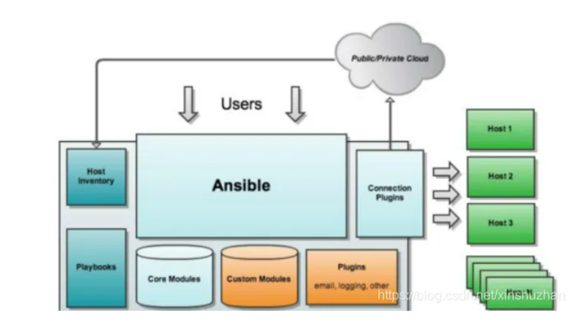
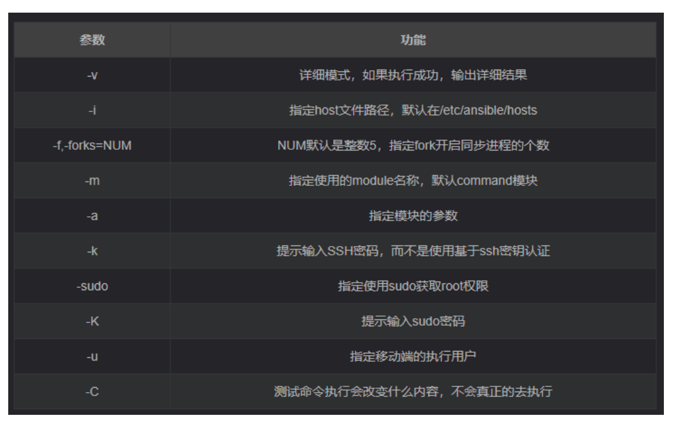
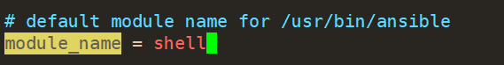
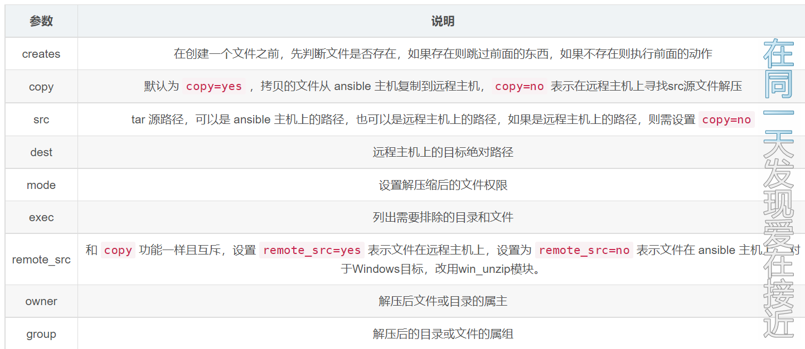
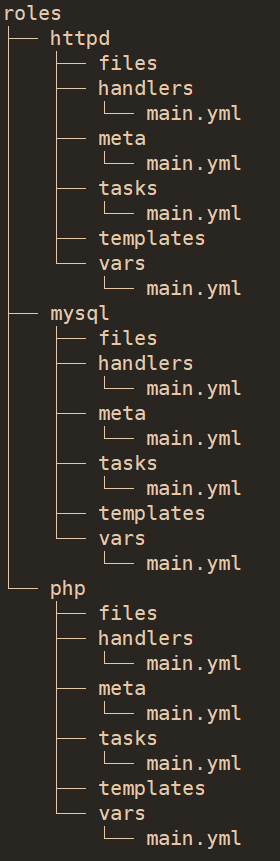

# Ansible

## 概念

Ansible是一款为类Unix系统开发的自由开源的配置和自动化工具。

ansible是新出现的自动化运维工具，基于[Python](https://baike.baidu.com/item/Python/407313?fromModule=lemma_inlink)开发，集合了众多运维工具（puppet、cfengine、chef、func、fabric）的优点，实现了批量系统配置、批量程序部署、批量运行命令等功能。Ansible架构相对比较简单，仅需通过SSH连接客户机执行任务即可

红帽公司于2015年10月收购了ansible，而ansible成立于2013年。

### 特点

1、部署简单，没有客户端，只需在主控端部署Ansible环境，被控端无需做任何操作；

\2. 模块化：调用特定的模块，完成特定任务

\3. 默认使用SSH协议对设备进行管理；

\4. 主从集中化管理；

5、配置简单、功能强大、扩展性强；

6、支持API及自定义模块，可通过Python轻松扩展；

7、通过Playbooks来定制强大的配置、状态管理

\8. 对云计算平台、大数据都有很好的支持；

\9. 具有幂等性：一个操作在一个主机上执行一遍和执行N遍的结果是一样的


ansible是基于模块工作的，本身没有批量部署的能力。**真正具有批量部署的是ansible所运行的模块，**ansible只是提供一种框架。主要包括：

(1)、连接插件connection plugins：负责和被监控端实现通信；

(2)、host inventory：指定操作的主机，是一个配置文件里面定义监控的主机；

(3)、各种模块核心模块、command模块、自定义模块；

(4)、借助于插件完成记录日志邮件等功能；

(5)、playbook：剧本执行多个任务时，非必需可以让节点一次性运行多个任务


### 工作机制

Ansible 在管理节点将 Ansible 模块通过 SSH 协议推送到被管理端执行，执行完之后自动删除，可以使用 SVN 等来管理自定义模块及编排



由图可以看出Ansible的组成由一下模块组成：

```text
Ansible： ansible的核心模块
Host Inventory：主机清单，也就是被管理的主机列表
Playbooks：ansible的剧本，可想象为将多个任务放置在一起，一块执行
Core Modules：ansible的核心模块
Custom Modules：自定义模块
Connection Plugins：连接插件，用于与被管控主机之间基于SSH建立连接关系
Plugins：其他插件，包括记录日志等
```


## 命令

anisble命令语法： ansible [-i 主机文件] [-f 批次] [组名] [-m 模块名称] [-a 模块参数]



### ansible-doc

模块帮助

#### ansible-doc -l列出所有模块

#### ansible-doc -s 模块名字

指定查看某个模块


## 模块

### ping

测试被管理主机

```
ansible all -m ping -u bruce  #使用bruce用户去ping
```

ansible在新版本中已经不支持sudo参数，

统一改为使用become方式来实现角色的切换

我们可以通过become方法实现sudo功能

```
become 激活权限提升

become_user  您要成为的用户

become_method 切换新用户的方法：包括：
```

参数：

```
-k	输入密码进行登录
```

对于Windows目标，请改用[win_pin]模块。对于网络目标，请使用[net_ping]m。


### [hostname](https://docs.ansible.com/ansible/latest/collections/ansible/builtin/hostname_module.html#hostname-module) 

hostname模块用于修改主机名（注意: 它不能修改/etc/hosts文件)

```bash
ansible node1 -m hostname -a 'name=wc'
						#-a指定参数[-a MODULE_ARGS]
node1 | CHANGED => {
    "ansible_facts": {
        "ansible_domain": "", 
        "ansible_fqdn": "wc", 
        "ansible_hostname": "wc", 
        "ansible_nodename": "wc", 
        "discovered_interpreter_python": "/usr/bin/python"
    }, 
    "changed": true, 
    "name": "wc"
}
```


### [file](https://docs.ansible.com/ansible/latest/collections/ansible/builtin/file_module.html#file-module)

file模块用于管理文件和文件属性，（创建, 删除, 软硬链接等)

```bash
#创建一个文件夹test1，recurse递归修改所属用户和所属用户组和权限
ansible node1 -m file -a 'path=test1 state=directory recurse=yes owner=bin group=daemon mode=1777'

#创建一个文件
ansible node1 -m file -a 'path=/tmp/111 state=touch owner=bin
group=daemon mode=1777'

#删除目录
ansible node1 -m file -a 'path=/test state=absent'
#删除文件
ansible node1 -m file -a 'path=/tmp/111 state=absent'

#创建软连接
ansible node1 -m file -a 'src=/etc/fstab path=/tmp/fstab state=link'
#创建硬链接
ansible node1 -m file -a 'src=/etc/fstab path=/tmp/fstab2 state=hard'
```


### [copy](https://docs.ansible.com/ansible/latest/collections/ansible/builtin/copy_module.html#copy-module)

copy模块用于对文件的远程拷贝操作（如把本地的文件拷贝到远程的机器上)目录使用不了

```bash
#拷贝一个文件到远程目录
ansible node1 -m copy -a 'src=/root/wc/wc dest=/root/
'
node1 | CHANGED => {
    "ansible_facts": {
        "discovered_interpreter_python": "/usr/bin/python"
    }, 
    "changed": true, 
    "checksum": "da39a3ee5e6b4b0d3255bfef95601890afd80709", 
    "dest": "/root/wc", 
    "gid": 0, 
    "group": "root", 
    "md5sum": "d41d8cd98f00b204e9800998ecf8427e", 
    "mode": "0644", 
    "owner": "root", 
    "secontext": "system_u:object_r:admin_home_t:s0", 
    "size": 0, 
    "src": "/root/.ansible/tmp/ansible-tmp-1668329263.48-20131-22120512414078/source", 
    "state": "file", 
    "uid": 0
}

#使用content参数直接往远程文件里面写入内容（会覆盖原来的内容，可以使用force=yes/no来控制），并考虑是否备份(backup=yes/no,yes则内容与原内容不一样则会备份一份)
ansible node1 -m copy -a 'src=/root/666 dest=/root/666 force=yes backup=yes owner=daemon group=daemon mode=1777'
node1 | CHANGED => {
    "ansible_facts": {
        "discovered_interpreter_python": "/usr/bin/python"
    }, 
    "backup_file": "/root/666.24591.2022-11-13@03:55:47~", 
    "changed": true, 
    "checksum": "7611ebc53a2e2b1f6f1b4c00e7a04f9e1a1b157b", 
    "dest": "/root/666", 
    "gid": 2, 
    "group": "daemon", 
    "md5sum": "279179d939240001f2f44c741dc895d5", 
    "mode": "01777", 
    "owner": "daemon", 
    "secontext": "unconfined_u:object_r:admin_home_t:s0", 
    "size": 10, 
    "src": "/root/.ansible/tmp/ansible-tmp-1668329747.16-20331-1800488694759/source", 
    "state": "file", 
    "uid": 2
}

#注意是否带/
/etc/yum.repos.d后面不带/符号，则表示把/etc/yum.repos.d整个目录拷贝到/tmp/目录下
master
# ansible group1 -m copy -a 'src=/etc/yum.repos.d dest=/tmp/'
/etc/yum.repos.d/后面带/符号，则表示把/etc/yum.repos.d/目录里的所有文件拷贝到/tmp/目录下
master
# ansible group1 -m copy -a 'src=/etc/yum.repos.d/ dest=/tmp/'
```


### yum

yum模块用于使用yum命令来实现软件包的安装与卸载。

```
#使用yum安装和卸载（前提是机器上的yum配置ok，state=latest表示最新版本）
安装：installed,present
删除：removed，absent
ansible node1 -m yum -a 'name=vim,vsftpd state=latest' && ansible node1 -m yum -a 'name=vim,vsftpd state=absent'  
node1 | SUCCESS => {
    "ansible_facts": {
        "discovered_interpreter_python": "/usr/bin/python"
    }, 
    "changed": false, 
    "changes": {
        "installed": [], 
        "updated": []
    }, 
    "msg": "", 
    "obsoletes": {
        "grub2": {
            "dist": "x86_64", 
            "repo": "@anaconda", 
            "version": "1:2.02-0.65.el7.centos.2"
        }, 
        "grub2-tools": {
            "dist": "x86_64", 
            "repo": "@anaconda", 
            "version": "1:2.02-0.65.el7.centos.2"
        }, 
        "iwl7265-firmware": {
            "dist": "noarch", 
            "repo": "@anaconda", 
            "version": "22.0.7.0-62.el7"
        }
    }, 
    "rc": 0, 
    "results": [
        "All packages providing vim are up to date", 
        "All packages providing vsftpd are up to date", 
        ""
    ]
}
node1 | CHANGED => {
    "ansible_facts": {
        "discovered_interpreter_python": "/usr/bin/python"
    }, 
    "changed": true, 
    "changes": {
        "removed": [
            "vim", 
            "vsftpd"
        ]
    }, 
    "msg": "", 
    "rc": 0, 
    "results": [
        "Loaded plugins: fastestmirror\nResolving Dependencies\n--> Running transaction check\n---> Package vim-enhanced.x86_64 2:7.4.629-8.el7_9 will be erased\n---> Package vsftpd.x86_64 0:3.0.2-29.el7_9 will be erased\n--> Finished Dependency Resolution\n\nDependencies Resolved\n\n================================================================================\n Package            Arch         Version                   Repository      Size\n================================================================================\nRemoving:\n vim-enhanced       x86_64       2:7.4.629-8.el7_9         @updates       2.2 M\n vsftpd             x86_64       3.0.2-29.el7_9            @updates       353 k\n\nTransaction Summary\n================================================================================\nRemove  2 Packages\n\nInstalled size: 2.6 M\nDownloading packages:\nRunning transaction check\nRunning transaction test\nTransaction test succeeded\nRunning transaction\n  Erasing    : vsftpd-3.0.2-29.el7_9.x86_64                                 1/2 \n  Erasing    : 2:vim-enhanced-7.4.629-8.el7_9.x86_64                        2/2 \n  Verifying  : 2:vim-enhanced-7.4.629-8.el7_9.x86_64                        1/2 \n  Verifying  : vsftpd-3.0.2-29.el7_9.x86_64                                 2/2 \n\nRemoved:\n  vim-enhanced.x86_64 2:7.4.629-8.el7_9      vsftpd.x86_64 0:3.0.2-29.el7_9     \n\nComplete!\n"
    ]
}

```


### [service](https://docs.ansible.com/ansible/latest/modules/service_module.html#service-module)

service模块用于控制服务的启动,关闭,开机自启动等。

```
#启动vsftpd服务并设置为开机启动（不启动则enabled=false）
ansible node1 -m service -a 'name=vsftpd state=started enabled=on'
```


### [command](https://docs.ansible.com/ansible/latest/collections/ansible/builtin/command_module.html)和[shell](https://docs.ansible.com/ansible/latest/collections/ansible/builtin/shell_module.html)

两个模块都是用于执行linux命令的,这对于命令熟悉的工程师来说，用起来非常high。
shell模块与command模块差不多（command模块不能执行一些类似$HOME,>,<,|等符号，但shell可
以)

```bash
master# ansible -m command group1 -a "useradd user2"
master# ansible -m command group1 -a "id user2"
master# ansible -m command group1 -a "cat /etc/passwd |wc -l" --报错
master# ansible -m shell group1 -a "cat /etc/passwd |wc -l" --成功
master# ansible -m command group1 -a "cd $HOME;pwd" 　　--报错
master# ansible -m shell 　group1 -a "cd $HOME;pwd" 　　--成功
```

可以把默认的command模块改为shell

```
module_name = command
修改为
module_name = shell
```




### unarchive

解包解压缩



```
在远程主机本地解压
ansible all -m unarchive -a "src=/root/latest.tar.gz dest=/root/ copy=no"

```


## [playbook](https://docs.ansible.com/ansible/latest/user_guide/playbooks_intro.html)

playbook(剧本): 是ansible用于配置,部署,和管理被控节点的剧本。用于ansible操作的编排。

Ansible Playbooks 提供了一个**可重复、可重用、简单的配置管理和多机部署系统**，非常适合部署复杂的应用程序。

Playbook 以 [YAML](https://docs.ansible.com/ansible/latest/reference_appendices/YAMLSyntax.html#yaml-syntax) 格式表示，语法最少。

剧本按从**上到下的顺序运行**。在每场比赛中，任务也按从上到下的顺序运行。具有多个“播放”的剧本可以协调多机部署，在您的网络服务器上运行一个播放，然后在您的数据库服务器上运行另一个播放，然后在您的网络基础设施上运行第三个播放，等等。至少，每场比赛都定义了两件事：

- 要定位的受管节点，使用[模式](https://docs.ansible.com/ansible/latest/user_guide/intro_patterns.html#intro-patterns)
- 至少要执行一项任务

在 Ansible 2.10 及更高版本中，我们建议您在 playbook 中使用完全限定的集合名称以确保选择正确的模块，因为多个集合可以包含具有相同名称的模块（例如，`user`）。

- 以.yaml或.yml结尾
- 文件的第一行以 "---"开始，表明YMAL文件的开始(可选的)
- 以#号开头为注释
- 列表中的所有成员都开始于相同的缩进级别, 并且使用一个 "- " 作为开头(一个横杠和一个空格)
- 一个字典是由一个简单的 键: 值 的形式组成(这个冒号后面必须是一个空格)
- ==注意: 写这种文件不要使用tab键，都使用空格==

### 常见语法

#### hosts

用于指定要执行任务的主机，其可以时一个或有多个冒号分隔主机组

#### remote_user

用于指定远程主机上的执行任务的用户

#### tasks

任务列表，按顺序执行任务，

如果一个host执行task失败，整个tasks都会回滚，修正playbook中的粗偶，然后重新执行即可


#### notify

Ansible模块设计为具有幂等性。表示在正确编写的playbook中，playbook及其任务可以运行多次而不会改变受管主机，除非需要进行更改使受管主机进入所需状态。

幂等性：通俗的解释就是，不对playbook做出更改，再次执行playbook，里面的内容不会执行。比如安装一个软件，再次执行，不会再次进行安装。

处理程序被视作非活动任务，只有在使用notify语句显式调用时才会被触发，handlers就是处理程序。

notify这个action可用于在每个play的最后被触发，这样可以避免多次有改变发生时每次都执行指定的操作，取而代之，仅在所有的变化发生完成后一次性地执行指定操作。


#### handlers

类似task，但需要使用notyfy通知调用

Handlers 是由通知者进行 notify, 如果没有被 notify,handlers 不会执行。

不管有多少个通知者进行了notify，等到play中的所有task执行完成之后，handlers也只会被执行一次.

handlers最佳的应用场景是用来重启服务,或者触发系统重启操作.除此以外很少用到了.

你可以把handlers理解成另外一种tasks，你可以理解成它们是’平级’的，所以，handlers与tasks是’对齐’的，handlers中的任务需要被tasks中的任务调用，我们使用notify关键字’调用’handlers中的任务，或者说，通过notify关键字’通知’handlers中的任务

```
	notify:
	- restart apache
- name: ensure apache is running (and enable it at boot)
  service: name=httpd state=started enabled=yes
handlers:
  - name: restart apache
     service: name=httpd state=restarted
```

#### variables变量

定义变量，用于被多次使用

```
---
- hosts: group1
	remote_user: root
	vars:
	- user: test1
	tasks:
	- name: create user
		user: name={{user}} state=present
```


In this example, the first play targets the web servers; the second play targets the database servers.

```yaml
--- ##开始
- name: Update web servers ##名字
  hosts: webservers ##主机
  remote_user: root ## 使用用户

  tasks: ##任务
  - name: Ensure apache is at the latest version #任务名称
    ansible.builtin.yum: ## 使用模块
      name: httpd ##名称
      state: latest ##确保为最新
  - name: Write the apache config file ##任务名称
    ansible.builtin.template: ##使用模块
      src: /srv/httpd.j2 ##源地址
      dest: /etc/httpd.conf ##，目标地址

- name: Update db servers ##名称
  hosts: databases ##主机
  remote_user: root ##使用用户

  tasks: ##任务
  - name: Ensure postgresql is at the latest version  ##任务名称
    ansible.builtin.yum: ##使用模块
      name: postgresql ##yum 安装名称
      state: latest ##保持为最新
  - name: Ensure that postgresql is started #任务名称
    ansible.builtin.service: #使用模块
      name: postgresql ##模块的参数
      state: started ##开启
```

写好之后使用ansible-playbook ***.yml运行


安装vim

```yaml
---
- name: install vim
  hosts: node1:node2
  remote_user: root

  tasks:
  - name: insatll vim
    ansible.builtin.yum:
      name: vim
      state: latest
      

[root@master playbook]# ansible-playbook ./example.yml 

PLAY [install vim] *************************************************************

TASK [Gathering Facts] *********************************************************
ok: [node1]
ok: [node2]

TASK [insatll vim] *************************************************************
ok: [node2]
changed: [node1]

PLAY RECAP *********************************************************************
node1                      : ok=2    changed=1    unreachable=0    failed=0    skipped=0    rescued=0    ignored=0   
node2                      : ok=2    changed=0    unreachable=0    failed=0    skipped=0    rescued=0    ignored=0   
```


## ansible.conf

### host_key_checking=false

Ansible1.2.1及其之后的版本都会默认启用公钥认证.

取消注释在第一次ping的时候就不需要输入yes了

取消注释可以直接使用密码去链接被管理主机

```bash
#取消注释
ansible 114.132.219.84 -m ping -k
SSH password: 
114.132.219.84 | SUCCESS => {
    "ansible_facts": {
        "discovered_interpreter_python": "/usr/bin/python"
    }, 
    "changed": false, 
    "ping": "pong"
}
#使用注释
ansible 192.168.30.167 -m ping -k
SSH password: 
192.168.30.167 | FAILED! => {
    "msg": "Using a SSH password instead of a key is not possible because Host Key checking is enabled and sshpass does not support this.  Please add this host's fingerprint to your known_hosts file to manage this host."
}

```


## roles

roles(角色): 就是通过分别将variables, tasks及handlers等放置于单独的目录中,并可以便捷地调用它们
的一种机制。
假设我们要写一个playbook来安装管理lamp环境，那么这个playbook就会写很长。所以我们希望把这
个很大的文件分成多个功能拆分, 分成apache管理,php管理,mysql管理，然后在需要使用的时候直接调
用就可以了，以免重复写。就类似编程里的模块化的概念，以达到代码复用的效果。


### 案例

实现lamp

第1步: 创建roles目录及文件,并确认目录结构

```
cd /etc/ansible/roles/
mkdir -p {httpd,mysql,php}/{files,tasks,handlers,templates,vars,meta}
touch {httpd,mysql,php}/{tasks,handlers,vars,meta}/main.yml
tree /etc/ansible/roles/
```



第2步: 准备httpd服务器的主页文件,php测试页和配置文件等

```bash
echo "test main page" >/etc/ansible/roles/httpd/files/index.html

echo -e "<?php\n\tphpinfo();\n?>" >/etc/ansible/roles/httpd/files/test.php

yum install httpd -y

vim /etc/httpd/conf/httpd.conf

cp /etc/httpd/conf/httpd.conf /etc/ansible/roles/httpd/files/


```


第3步: 编写httpd角色的main.yml文件

```yaml
---
 - name: 安装httpd
   yum: name=httpd,httpd-devel state=present
 - name: 同步httpd配置文件
   copy: src=/etc/ansible/roles/httpd/files/httpd.conf dest=/etc/httpd/conf/httpd.conf
   notify: restart httpd
 - name: 同步主页文件
   copy: src=/etc/ansible/roles/httpd/files/index.html
   dest=/var/www/html/index.html
 - name: 同步php测试页
   copy: src=/etc/ansible/roles/httpd/files/test.php dest=/var/www/html/test.php
 - name: 启动httpd并开机自启动
   service: name=httpd state=started enabled=yes
```

第4步: 编写httpd角色里的handler

```yaml
---
- name: restart httpd
  service: name=httpd state=restarted
```

第5步: 编写mysql角色的main.yml文件

```yaml
---
- name: 安装mysql
  yum: name=mariadb,mariadb-server,mariadb-devel state=present
- name: 启动mysql并开机自启动
  service: name=mariadb state=started enabled=yes
```

第6步: 编写php角色的main.yml文件

```yaml
---
- name: 安装php及依赖包
  yum: name=php,php-gd,php-ldap,php-odbc,php-pear,php-xml,php-xmlrpc,phpmbstring,php-snmp,php-soap,curl,curl-devel,php-bcmath,php-mysql state=present
  notify: restart httpd
```

第7步:编写lamp的playbook文件调用前面定义好的三个角色

```yaml
---
- hosts: group1
  remote_user: root
  roles:
   - httpd
   - mysql
   - php
```

第8步: 执行lamp的playbook文件

```
ansible-playbook /etc/ansible/playbook/lamp.yaml
```


## Ansible部署
### 安装

#### 从源码安装

```bash
git clone https://github.com/ansible/ansible.git
cd ./ansible
source ./hacking/env-setup #使用bash
. ./hacking/env-setup.fish #使用fish
curl https://bootstrap.pypa.io/get-pip.py | python #安装pip
sudo pip install paramiko PyYAML Jinja2 httplib2 six #安装pip模块

```

#### 用yum安装

```bash
yum install -y epel-release 
yum install -y ansible

```


### 部署

管理节点打开ssh服务

#### 配置master的/etc/ansible/hosts

```bash
#配置方式
# Ex 1: 未分组

## green.example.com
## blue.example.com
## 192.168.100.1
## 192.168.100.10


# Ex 2:属于webserver组

## [webservers]
## alpha.example.org
## beta.example.org
## 192.168.1.100
## 192.168.1.110

# 如果我有主机重复一种模式

## www[001:006].example.com
## node[1:10]
## 192.168.30.[110:120]
## db-[1:99]-node.example.com


#指定别名端口用户和密码
## nginx ansible_ssh_host=192.168.30.111
##ansible_ssh_port=9876
##ansible_ssh_user=root
##ansible_ssh_pass="123456"

# 使用别名分组
## nginx ansible_ssh_host=192.168.30.111 ansible_ssh_port=123 ansible_ssh_user=root ansible_ssh_pass="123456"
## password ansible_ssh_host=192.168.30.111 ansible_ssh_port=123 ansible_ssh_user=root ansible_ssh_pass="123456"
#[http]
#nginx
#password
```

#### 管理点配置免密

```
ssh-keygen
ssh-copy-id
```


## YAML

### 基础知识

For Ansible, nearly every YAML file starts with a list. Each item in the list is a list of key/value pairs, commonly called a “hash” or a “dictionary”. So, we need to know how to write lists and dictionaries in YAML.

YAML 还有一个小怪癖。所有 YAML 文件（无论它们是否与 Ansible 关联）都可以`---`开始以`...`结束. 这是 YAML 格式的一部分，指示文档的开始和结束。

- 以.yaml或.yml结尾
- 文件的第一行以 "---"开始，表明YMAL文件的开始(可选的)
- 以#号开头为注释
- 列表中的所有成员都开始于相同的缩进级别, 并且使用一个 "- " 作为开头(一个横杠和一个空格)
- 一个字典是由一个简单的 键: 值 的形式组成(这个冒号后面必须是一个空格)
- ==注意: 写这种文件不要使用tab键，都使用空格==


All members of a list are lines beginning at the same indentation level starting with a `"- "` (a dash and a space):

```yaml
---
# A list of tasty fruits
- Apple
- Orange
- Strawberry
- Mango
...
```

A dictionary is represented in a simple `key: value` form (the colon must be followed by a space):

```
# An employee record
martin:
  name: Martin D'vloper
  job: Developer
  skill: Elite
```

More complicated data structures are possible, such as lists of dictionaries, dictionaries whose values are lists or a mix of both:

```yaml
# Employee records
- martin:
    name: Martin D'vloper
    job: Developer
    skills:
      - python
      - perl
      - pascal
- tabitha:
    name: Tabitha Bitumen
    job: Developer
    skills:
      - lisp
      - fortran
      - erlang	
```

Dictionaries and lists can also be represented in an abbreviated form if you really want to:

```
---
martin: {name: Martin D'vloper, job: Developer, skill: Elite}
fruits: ['Apple', 'Orange', 'Strawberry', 'Mango']
```

值可以使用`|`或`>`跨越多行。使用“文字块标量”`|`跨越多行将包括换行符和任何尾随空格。使用“折叠块标量”`>`会将换行符折叠到空格；它用于使原本很长的行更易于阅读和编辑。在任何一种情况下，缩进都将被忽略。例子是

```
include_newlines: |
            exactly as you see
            will appear these three
            lines of poetry

fold_newlines: >
            this is really a
            single line of text
            despite appearances
```

虽然在上面的`>`示例中，所有换行符都折叠成空格，但有两种方法可以强制保留换行符：

```
fold_some_newlines: >
    a
    b

    c
    d
      e
    f
```

或者，可以通过包含换行符来强制执行它`\n`：

```
fold_same_newlines: "a b\nc d\n  e\nf\n"
```

```yaml
---
# An employee record
name: Martin D'vloper
job: Developer
skill: Elite
employed: True
foods:
  - Apple
  - Orange
  - Strawberry
  - Mango
languages:
  perl: Elite
  python: Elite
  pascal: Lame
education: |
  4 GCSEs
  3 A-Levels
  BSc in the Internet of Things
```

### ansible例子

在本例中，第一次播放针对的是 Web 服务器；第二个游戏以数据库服务器为目标。

```yaml
--- ##开始
- name: Update web servers ##名字
  hosts: webservers ##主机
  remote_user: root ## 使用用户

  tasks: ##任务
  - name: Ensure apache is at the latest version #任务名称
    ansible.builtin.yum: ## 使用模块
      name: httpd ##名称
      state: latest ##确保为最新
  - name: Write the apache config file ##任务名称
    ansible.builtin.template: ##使用模块
      src: /srv/httpd.j2 ##源地址
      dest: /etc/httpd.conf ##，目标地址

- name: Update db servers ##名称
  hosts: databases ##主机
  remote_user: root ##使用用户

  tasks: ##任务
  - name: Ensure postgresql is at the latest version  ##任务名称
    ansible.builtin.yum: ##使用模块
      name: postgresql ##yum 安装名称
      state: latest ##保持为最新
  - name: Ensure that postgresql is started #任务名称
    ansible.builtin.service: #使用模块
      name: postgresql ##模块的参数
      state: started ##开启
```

