# Big Data

## 概述

大数据，指无法在一定时间范围内常规软件工具进行捕捉、管理和处理的数据集合，因此需要新处理模式，该处理模式就是大数据

大数据指高速 (Velocity) 涌现的大量 (Volume) 多样化 (Variety) 数据，其特性可简单概括为 3V。加上价值性（value）即为大数据4v。

简而言之，大数据指非常庞大、复杂的数据集，特别是来自新数据源的数据集，其规模之大令传统数据处理软件束手无策，却能帮助我们解决以往非常棘手的业务难题。

大数据主要解决**海量数据存储**和海量数据运算

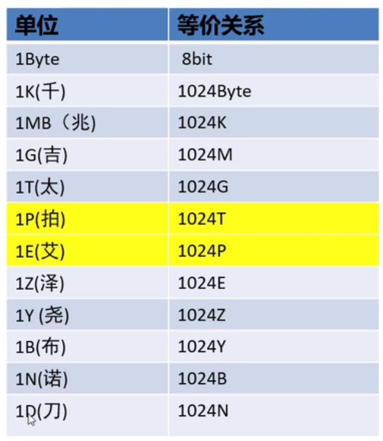

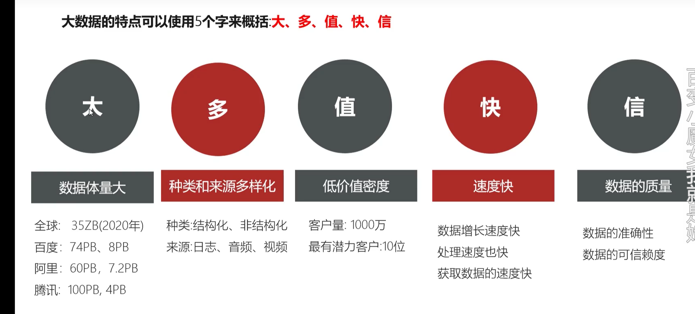

### 大数据分析业务步骤

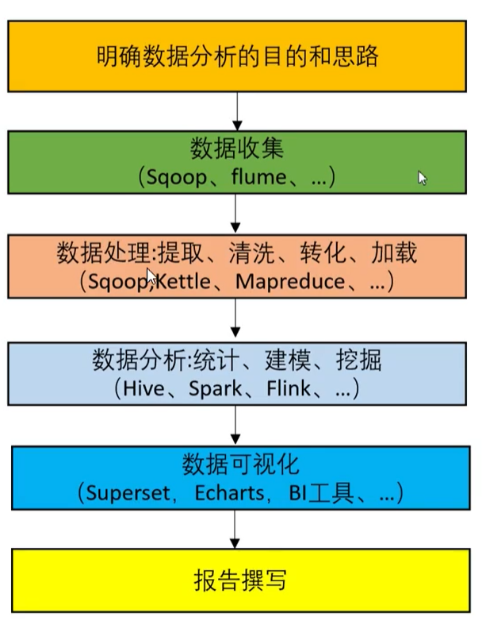

## 发展

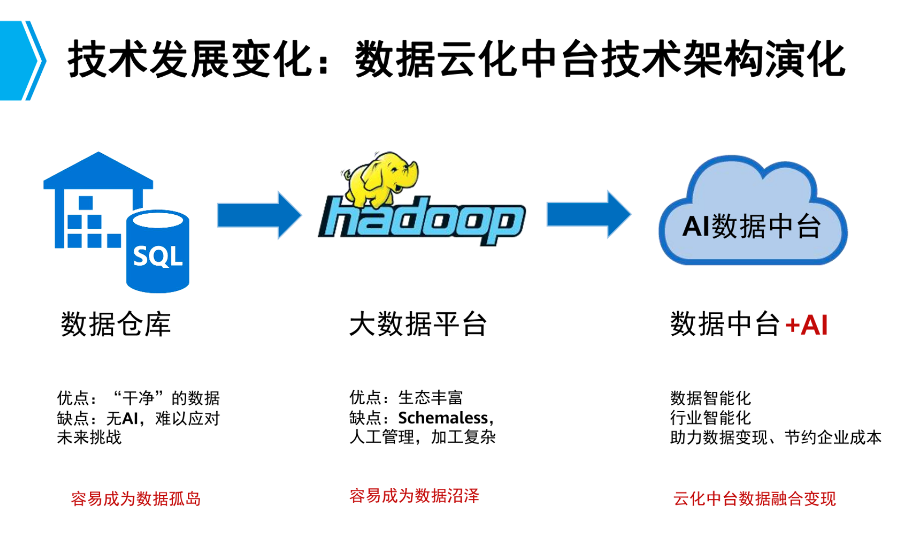

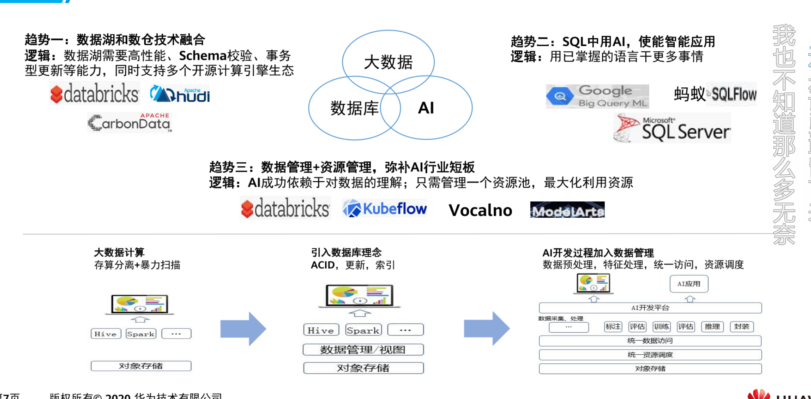

## Hadoop框架

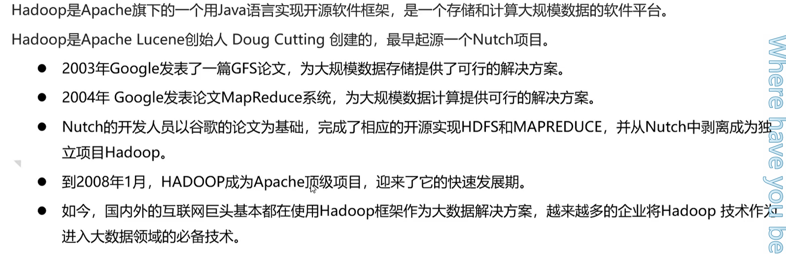

### 狭义Hadoop

指Apache这款开源框架

核心组件有：

HDFS（分布式文件系统）：解决海量数据的**存储**

MAPREDUCE（分布式运算编程框架）：解决海量数据计算

YARN（作业调度和集群资源管理框架）：解决资源任务**调度**

### 广义

指Hadoop这个生态圈

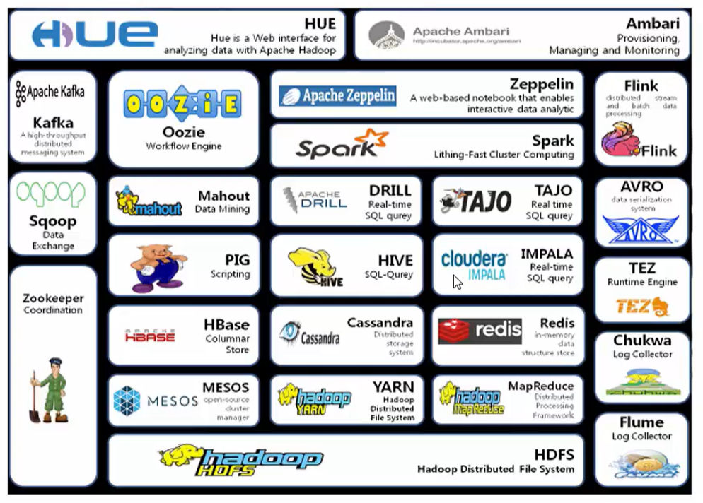

#### HBASE

（分布式列存数据库）

源自Google的Bigtable论文，发表于2006年11月，HBase是Google Bigtable克隆版

HBase是一个建立在HDFS之上，面向列的针对结构化数据的可伸缩、高可靠、高性能、分布式和面向列的动态模式数据库。

HBase采用了BigTable的数据模型：增强的稀疏排序映射表（Key/Value），其中，键由行关键字、列关键字和时间戳构成。

HBase提供了对大规模数据的随机、实时读写访问，同时，HBase中保存的数据可以使用MapReduce来处理，它将数据存储和并行计算完美地结合在一起。 

####  Zookeeper
（分布式协作服务）

源自Google的Chubby论文，发表于2006年11月，Zookeeper是Chubby克隆版

解决分布式环境下的数据管理问题：统一命名，状态同步，集群管理，配置同步等。

Hadoop的许多组件依赖于Zookeeper，它运行在计算机集群上面，用于管理Hadoop操作。 

#### HIVE
（数据仓库）

由facebook开源，最初用于解决海量结构化的日志数据统计问题。

Hive定义了一种类似SQL的查询语言(HQL),将SQL转化为MapReduce任务在Hadoop上执行。通常用于离线分析。

HQL用于运行存储在Hadoop上的查询语句，Hive让不熟悉MapReduce开发人员也能编写数据查询语句，然后这些语句被翻译为Hadoop上面的MapReduce任务。 

#### Pig
(ad-hoc脚本）

由yahoo!开源，设计动机是提供一种基于MapReduce的ad-hoc(计算在query时发生)数据分析工具

Pig定义了一种数据流语言—Pig Latin，它是MapReduce编程的复杂性的抽象,Pig平台包括运行环境和用于分析Hadoop数据集的脚本语言(Pig Latin)。

其编译器将Pig Latin翻译成MapReduce程序序列将脚本转换为MapReduce任务在Hadoop上执行。通常用于进行离线分析。

#### Sqoop
(数据ETL/同步工具）

Sqoop是SQL-to-Hadoop的缩写，主要用于传统数据库和Hadoop之前传输数据。数据的导入和导出本质上是Mapreduce程序，充分利用了MR的并行化和容错性。

Sqoop利用数据库技术描述数据架构，用于在关系数据库、数据仓库和Hadoop之间转移数据。

#### Flume
（日志收集工具）

Cloudera开源的日志收集系统，具有分布式、高可靠、高容错、易于定制和扩展的特点。

它将数据从产生、传输、处理并最终写入目标的路径的过程抽象为数据流，在具体的数据流中，数据源支持在Flume中定制数据发送方，从而支持收集各种不同协议数据。

同时，Flume数据流提供对日志数据进行简单处理的能力，如过滤、格式转换等。此外，Flume还具有能够将日志写往各种数据目标（可定制）的能力。

总的来说，Flume是一个可扩展、适合复杂环境的海量日志收集系统。当然也可以用于收集其他类型数据

#### Mahout

Mahout起源于2008年，最初是Apache Lucent的子项目，它在极短的时间内取得了长足的发展，现在是Apache的顶级项目。

Mahout的主要目标是创建一些可扩展的机器学习领域经典算法的实现，旨在帮助开发人员更加方便快捷地创建智能应用程序。

Mahout现在已经包含了聚类、分类、推荐引擎（协同过滤）和频繁集挖掘等广泛使用的数据挖掘方法。

除了算法，Mahout还包含数据的输入/输出工具、与其他存储系统（如数据库、MongoDB 或Cassandra）集成等数据挖掘支持架构。

#### Oozie
(工作流调度器）

Oozie是一个可扩展的工作体系，集成于Hadoop的堆栈，用于协调多个MapReduce作业的执行。它能够管理一个复杂的系统，基于外部事件来执行，外部事件包括数据的定时和数据的出现。

Oozie工作流是放置在控制依赖DAG（有向无环图 Direct Acyclic Graph）中的一组动作（例如，Hadoop的Map/Reduce作业、Pig作业等），其中指定了动作执行的顺序。

Oozie使用hPDL（一种XML流程定义语言）来描述这个图。

#### Yarn
(分布式资源管理器）

YARN是下一代MapReduce，即MRv2，是在第一代MapReduce基础上演变而来的，主要是为了解决原始Hadoop扩展性较差，不支持多计算框架而提出的。

Yarn是下一代 Hadoop 计算平台，yarn是一个通用的运行时框架，用户可以编写自己的计算框架，在该运行环境中运行。

用于自己编写的框架作为客户端的一个lib，在运用提交作业时打包即可。该框架为提供了以下几个组件：

  - 资源管理：包括应用程序管理和机器资源管理

  - 资源双层调度

  - 容错性：各个组件均有考虑容错性

  - 扩展性：可扩展到上万个节

#### Mesos
（分布式资源管理器）

  Mesos诞生于UC Berkeley的一个研究项目，现已成为Apache项目，当前有一些公司使用Mesos管理集群资源，比如Twitter。

  与yarn类似，Mesos是一个资源统一管理和调度的平台，同样支持比如MR、steaming等多种运算框架。

#### Tachyon
（分布式内存文件系统）

Tachyon（/'tæki:ˌɒn/ 意为超光速粒子）是以内存为中心的分布式文件系统，拥有高性能和容错能力，

能够为集群框架（如Spark、MapReduce）提供可靠的内存级速度的文件共享服务。

Tachy on诞生于UC Berkeley的AMPLab。

#### Tez
(DAG计算模型)

Tez是Apache最新开源的支持DAG作业的计算框架，它直接源于MapReduce框架，核心思想是将Map和Reduce两个操作进一步拆分，

即Map被拆分成Input、Processor、Sort、Merge和Output， Reduce被拆分成Input、Shuffle、Sort、Merge、Processor和Output等，

这样，这些分解后的元操作可以任意灵活组合，产生新的操作，这些操作经过一些控制程序组装后，可形成一个大的DAG作业。

目前hive支持mr、tez计算模型，tez能完美二进制mr程序，提升运算性能。

#### Spark
(内存DAG计算模型)

Spark是一个Apache项目，它被标榜为“快如闪电的集群计算”。它拥有一个繁荣的开源社区，并且是目前最活跃的Apache项目。

最早Spark是UC Berkeley AMP lab所开源的类Hadoop MapReduce的通用的并行计算框架。

Spark提供了一个更快、更通用的数据处理平台。和Hadoop相比，Spark可以让你的程序在内存中运行时速度提升100倍，或者在磁盘上运行时速度提升10倍

#### Giraph
(图计算模型)

Apache Giraph是一个可伸缩的分布式迭代图处理系统， 基于Hadoop平台，灵感来自 BSP (bulk synchronous parallel) 和 Google 的 Pregel。

最早出自雅虎。雅虎在开发Giraph时采用了Google工程师2010年发表的论文《Pregel：大规模图表处理系统》中的原理。后来，雅虎将Giraph捐赠给Apache软件基金会。

目前所有人都可以下载Giraph，它已经成为Apache软件基金会的开源项目，并得到Facebook的支持，获得多方面的改进。

#### GraphX
(图计算模型）

Spark GraphX最先是伯克利AMPLAB的一个分布式图计算框架项目，目前整合在spark运行框架中，为其提供BSP大规模并行图计算能力。

#### MLib
（机器学习库）

Spark MLlib是一个机器学习库，它提供了各种各样的算法，这些算法用来在集群上针对分类、回归、聚类、协同过滤等。

#### Streaming
（流计算模型）

Spark Streaming支持对流数据的实时处理，以微批的方式对实时数据进行计算

#### Kafka
（分布式消息队列）

Kafka是Linkedin于2010年12月份开源的消息系统，它主要用于处理活跃的流式数据。

活跃的流式数据在web网站应用中非常常见，这些数据包括网站的pv、用户访问了什么内容，搜索了什么内容等。

这些数据通常以日志的形式记录下来，然后每隔一段时间进行一次统计处理。

#### Phoenix
（hbase sql接口）

Apache Phoenix 是HBase的SQL驱动，Phoenix 使得Hbase 支持通过JDBC的方式进行访问，并将你的SQL查询转换成Hbase的扫描和相应的动作。 

#### ranger
(安全管理工具）

Apache ranger是一个hadoop集群权限框架，提供操作、监控、管理复杂的数据权限，它提供一个集中的管理机制，管理基于yarn的hadoop生态圈的所有数据权限。

#### knox
（hadoop安全网关）

Apache knox是一个访问hadoop集群的restapi网关，它为所有rest访问提供了一个简单的访问接口点，能完成3A认证（Authentication，Authorization，Auditing）和SSO（单点登录）等

#### falcon
（数据生命周期管理工具）

Apache Falcon 是一个面向Hadoop的、新的数据处理和管理平台，设计用于数据移动、数据管道协调、生命周期管理和数据发现。它使终端用户可以快速地将他们的数据及其相关的处理和管理任务“上载（onboard）”到Hadoop集群。

#### Ambari
（安装部署配置管理工具）

Apache Ambari 的作用来说，就是创建、管理、监视 Hadoop 的集群，是为了让 Hadoop 以及相关的大数据软件更容易使用的一个web工具。 

### 版本

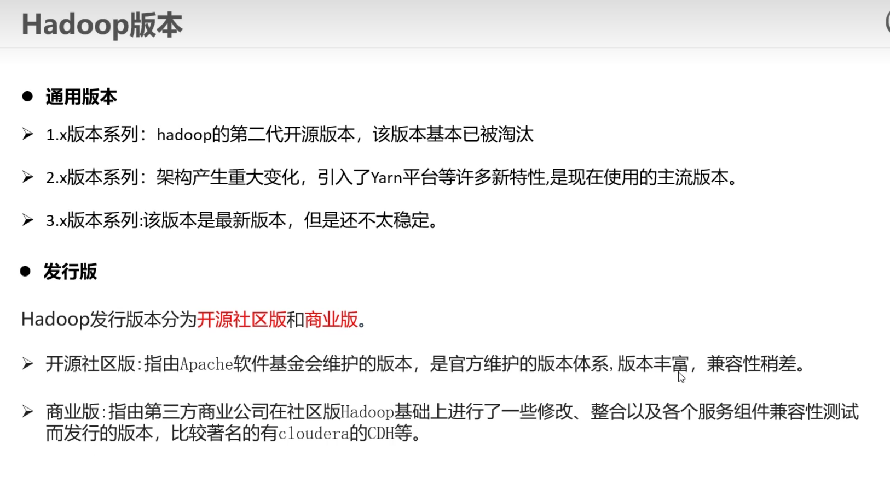

### 架构

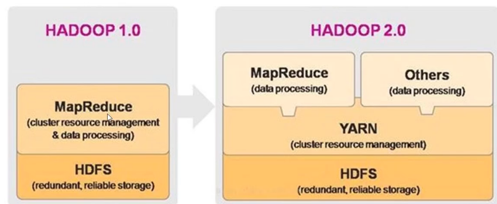

1.0 ->2.0多了个yarn调度资源

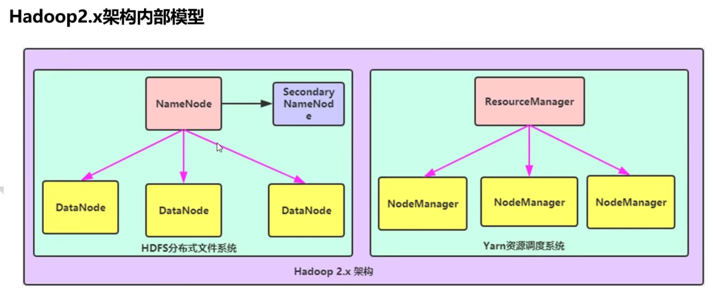

#### HDFS模块

namenode：集群当中的主节点，主要用于管理集群中的各种数据

secondarynamenode：主要用于hdfoop中元数据信息的辅助管理

datanode：集群中的从节点，主要用于存储集群中的各种数据

#### Yarn模块

RsourceManager：接受用户的计算请求任务，并负责集群的资源分配。

nodemanager：负责执行主节点分配的任务

#### MapReduce模块

mapreduce计算需要的数据和产生的结果需要hdfs来存储

mapreduce的运行需要由yarn集群来提供资源的调度

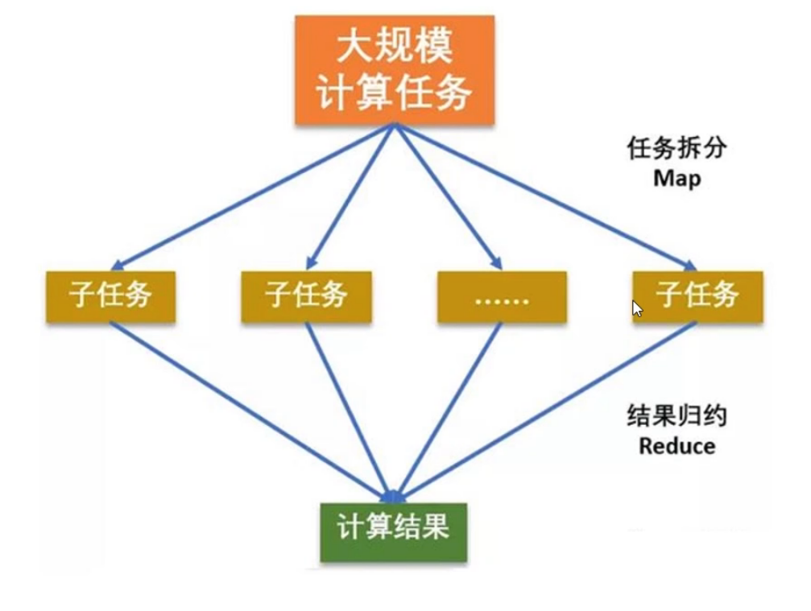

## HDFS

HDFS（Hadoop Distributed File System）是一种Hadoop分布式文件系统，具备高度容错特性，支持高吞吐量数据访问，可以在处理海量数据（TB或PB级别以上）的同时最大可能的降低成本。HDFS适用于大规模数据的分布式读写，特别是读多写少的场景。

hdfs使用多态计算机存储文件，并提供统一的访问接口，像是访问一个普通文件系统一样使用分布式文件系统。

解决了单机存储不足的问题，从而实现跨机器存储即分布式存储，解决了

大数据存储，增强可扩展性。

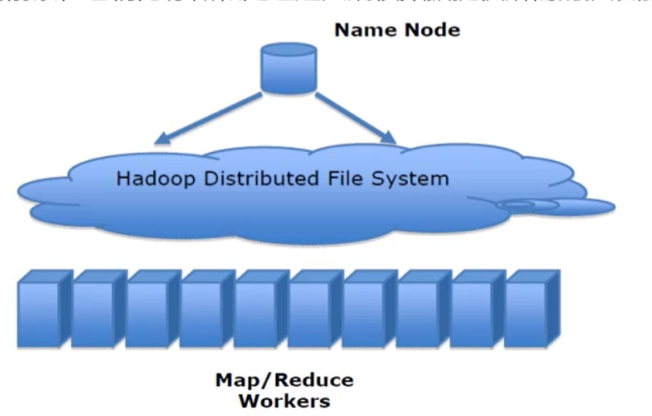

### 特性

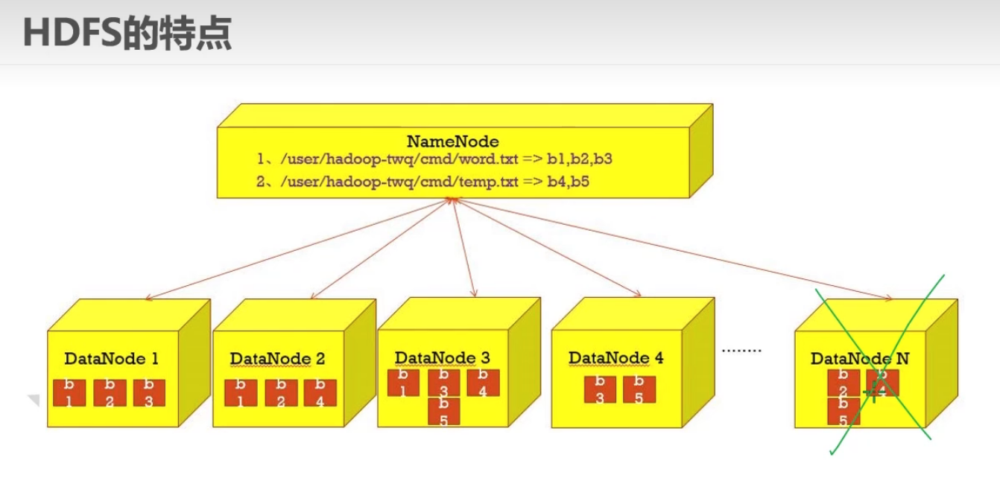

E-MapReduce集群中HDFS的优势如下：

- 具有高容错性和高可扩展性。
- 提供Shell命令接口。
- 提供Web可视化组件管理界面，方便管理。
- 拥有类似于Linux的文件权限管理。
- Locality感知，在分配存储空间时会考虑计算节点的位置。
- 当DataNode之间数据不平衡时，可以进行Rebalance操作。
- 支持滚动重启和升级操作。
- 可以存储超大文件，实效性稍差。
- 具有硬件故障检测和自动快速恢复
- 多副本存储
- 很强的扩张能力
- hdfs存储一般为一次写入，多次读取，只支持追加写入，不支持随即修改
- 可运行在普通廉价机器上运行

### 架構

HDFS是经典的Master和Slave架构，每一个HDFS集群包括一个NameNode和多个DataNode。

NameNode管理所有文件的元数据信息，并且负责与客户端交互。DataNode负责管理存储在该节点上的文件。每一个上传到HDFS的文件都会被划分为一个或多个数据块，这些数据块根据HDFS集群的数据备份策略被分配到不同的DataNode上，位置信息交由NameNode统一管理。

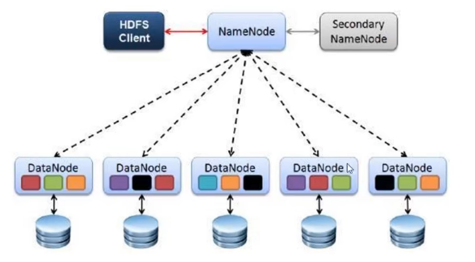

| 名称               | 描述                                                         |
| :----------------- | :----------------------------------------------------------- |
| NameNode           | 用于管理文件系统的命名空间、维护文件系统的目录结构树以及元数据信息，记录写入的每个数据块（Block）与其归属文件的对应关系。此信息以命名空间镜像（FSImage）和编辑日志（EditsLog）两种形式持久化在本地磁盘中。处理clent |
| DataNode           | DataNode是文件的实际存放位置。DataNode会根据NameNode或Client的指令来存储或者提供数据块，并且定期的向NameNode汇报该DataNode存储的数据块信息。 |
| Client             | 通过Client来访问文件系统，然后由Client与NameNode和DataNode进行通信。Client对外作为文件系统的接口，类似于POSIX。client还开源将文件切片，切分为一个一个block。client提供一些命令访问hdfs。 |
| Blocks             | HDFS将文件拆分成128 MB大小的数据块进行存储，这些Block可能存储在不同的节点上。HDFS可以存储更大的单个文件，甚至超过任何一个磁盘所能容纳的大小。一个Block默认存储3个副本（EMR Core节点如果使用云盘，则为2副本），以Block为粒度将副本存储在多个节点上。此方式不仅提高了数据的安全性，而且对于分布式作业可以更好地利用本地的数据进行计算，减少网络传输。 |
| Secondary NameNode | 对于非高可用集群，默认会启动一个Secondary NameNode进程。Secondary NameNode的作用是消费EditsLog，定期地合并FsImage和EditsLog，生成新的FsImage文件，降低了NameNode的压力。 |
| 高可用             | 对于高可用集群，默认会启动两个NameNode，一个是Active NameNode，另一个是Standby NameNode，两个NameNode承担不同角色。Active NameNode负责处理DataNode和Client的请求，Standby NameNode跟Active NameNode一样拥有最新的元数据信息，随时准备在Active NameNode出现异常时接管其服务。如果Active NameNode异常，Standby NameNode会感知到并切换成Active NameNode的角色处理DataNode和Client请求。 |

## hadoop搭建

使用三台主机

## 華爲

Hadoop中的mapreduce组件擅长处理离线计算

sprk自带的资源管理框架是standalone

HDFS默认情况副本机制一份文件HDFS会存3份。

fusionsight HD系统中HDFS默认的BLOCK size是128m

Elasticsearch的一个索引库默认有5个分片

kafka是一个分布式的消息发布订阅系统，他即进行消息的转发，并且会保存消息

Ldap默认使用UDP389端口

FLINK采用，checkpoint机制保障应用程序运行中的容错性

Hbase元数据MetaRegion路由信息保存在zookeeper

HDFS中namenode的主备仲裁，是由zookeeper failover controller

Elasticsearch的索引可以存储在多种存储类型，但不支持对象存储。

Hadoop的HBase不适合大文件应用场景

redis主要消耗内存资源

想把key中存储的数字值加1，应该使用incr

streaming主要通过zookeeper提供的watcher服务是实现时间侦听。

compaction有minor和major两种类型

fusioninsightHD系统中HDFS的Block默认保存三份

redis的有个字符类型存储最大容量是1G

HBase不适用于要求具有acid特性的应用场景

HFS中的NameNode的主备仲裁是由ZooKeeper FailoverController控制

、Flume用于收集数据，其传输数据的基本单位是event

HDFS的副本放置策略中，同一机架不同的服务器之间的距离是2

Flink的数据抓换操作在channel环节完成

spark自带的资源管理框架是standalone
