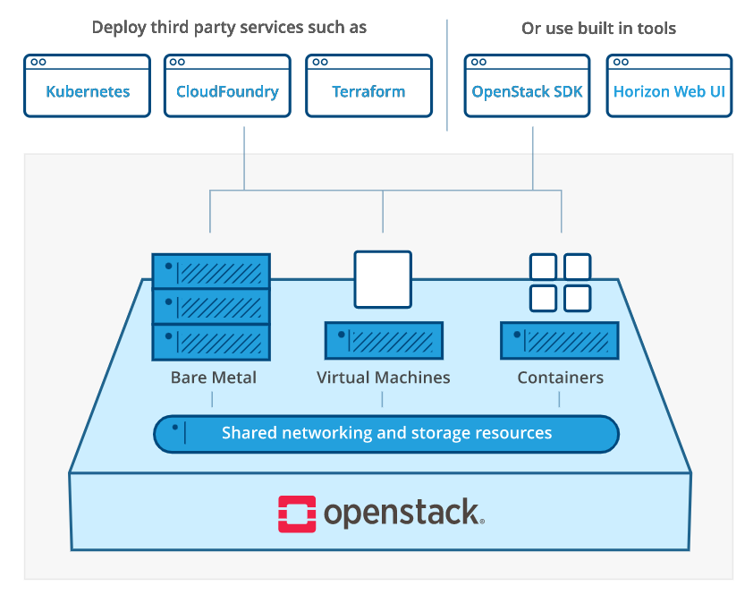
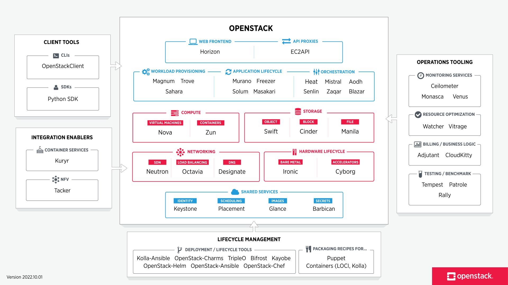

# OpenStack

## what is openstack

OpenStack 是一种云操作系统，可控制整个数据中心内的大型计算、存储和网络资源池，所有资源都通过具有通用身份验证机制的 API 进行管理和配置。

仪表板也可用，使管理员能够控制，同时授权用户通过 Web 界面配置资源。

除了标准的基础设施即服务功能之外，其他组件还提供编排、故障管理和服务管理以及其他服务，以确保用户应用程序的高可用性。



## the openstack landscape





## 使用devstack部署

### ubuntu

#### 1.安装基本文件和和环境配置

```bash
#更新源
sudo sed -i "s@http://.*archive.ubuntu.com@http://repo.huaweicloud.com@g" /etc/apt/sources.list
sudo sed -i "s@http://.*security.ubuntu.com@http://repo.huaweicloud.com@g" /etc/apt/sources.list

apt update && apt upgrade

#安装软件
apt install vim git python3-pip ntpdate

#配置pip源
mkdir .pip
sudo vim .pip/pip.conf
 [global]
index-url = https://pypi.tuna.tsinghua.edu.cn/simple
trusted-host = pypi.tuna.tsinghua.edu.cn

#更新时区
dpkg-reconfigure tzdata
ntpdate cn.pool.ntp.org

#配置用户

```

