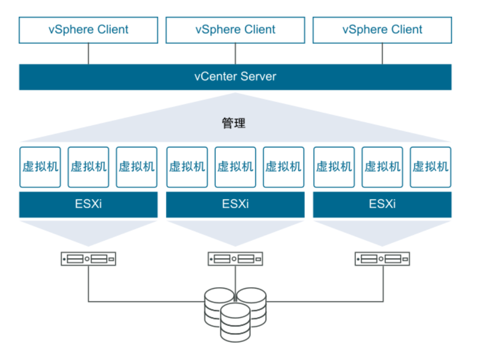

# Vsphere

VMware vSphere 是 VMware 的虚拟化平台，可将数据中心转换为包括 CPU、存储和网络资源的聚合计算基础架构。vSphere 将这些基础架构作为一个统一的运行环境进行管理，并为您提供工具来管理加入该环境的数据中心。

vSphere 的两个核心组件是 ESXi 和 vCenter Server。ESXi 是用于创建并运行虚拟机和虚拟设备的虚拟化平台。vCenter Server 是一项服务，用于管理网络中连接的多个主机，并将主机资源池化。

## 我的vsphere

VMware vSphere Hypervisor 8  激活码：1N48H-0611K-M89P1-003R4-8MK60