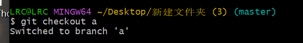

# git and github

## 概念

### [git](https://git-scm.com/)

是一个**[分布式版本控制](https://zh.wikipedia.org/wiki/分散式版本控制)软件**，最初由[林纳斯·托瓦兹](https://zh.wikipedia.org/wiki/林纳斯·托瓦兹)创作，于2005年以[GPL](https://zh.wikipedia.org/wiki/GPL)许可协议发布。最初目的是为了更好地管理[Linux内核](https://zh.wikipedia.org/wiki/Linux内核)开发而设计。应注意的是，这与GNU Interactive Tools（一个类似[Norton Commander](https://zh.wikipedia.org/w/index.php?title=Norton_Commander&action=edit&redlink=1)界面的[文件管理器](https://zh.wikipedia.org/wiki/软件包管理系统)）不同。

#### git三大分区

- 工作区，也叫Working Directory
  工作区应该不陌生，就是我们能看见，直接编辑的区域。对于一些新增的文件，如果没有被add到暂存区，就会以红色的形式放置在工作区。

- 暂存区，也叫stage，index

数据暂时存放的区域，对于**add** git版本控制的文件，就算是进入暂存区啦。可以理解为数据进入本地代码仓库之前存放的区域。由于还没对本地仓库生效，所以是数据暂时存放的区域。

对暂存区的文件修改后，会以蓝色的形式显示。如果第一次创建并add到暂存区的文件，由于远程仓库没有同步，所以会显示绿色。

- 版本库，也叫本地仓库，commit History

在暂存区**commit**的代码会被放入版本库中。可以理解为一个本地的代码仓库，push的时候，才会把版本库的数据全都发送到远程仓库中。

### [github](https://github.com/)

**GitHub**是一个在线软件[源代码](https://zh.wikipedia.org/wiki/源代码)托管服务平台，使用[Git](https://zh.wikipedia.org/wiki/Git)作为[版本控制](https://zh.wikipedia.org/wiki/版本控制)软件，由开发者[Chris Wanstrath](https://zh.wikipedia.org/w/index.php?title=Chris_Wanstrath&action=edit&redlink=1)、[P. J. Hyett](https://zh.wikipedia.org/w/index.php?title=P._J._Hyett&action=edit&redlink=1)和[汤姆·普雷斯顿·沃纳](https://zh.wikipedia.org/wiki/汤姆·普雷斯顿·沃纳)使用[Ruby on Rails](https://zh.wikipedia.org/wiki/Ruby_on_Rails)编写而成。在2018年，GitHub被[微软](https://zh.wikipedia.org/wiki/微软)公司收购。

## 使用

### git 

#### git init

Create an empty Git repository or reinitialize an existing one

初始化仓库

初始化不会删除文件

#### git status

查看仓库状态

有一个红色的未untracked firles,可以用git add添加到将要提交的内容中

#### git add

Add file contents to the index

将文件提交到索引

将文件添加到暂存区

*git add -u暂存您的所有更改,包括删除/更新的文件*

#### git commit

将文件提交到仓库

Record changes to the repository

-m [提交信息]

#### git log

查看提交记录，和内容等信息

Show commit logs

#### git branch

查看，删除，创建分支

List, create, or delete branches

-d [删除分支]  -D [强制删除]

branch [name]创建分支

#### git checkout

切换分支

Switch branches or restore working tree files

#### git merge

合并分支

Join two or more development histories together

合并分支时候要注意是否有冲突，如果有冲突则不可以合并，需要先解决冲突，反之可以直接合并。合并前可以先pull预防冲突。

#### git tag

为当前分支分支添加标签

Create, list, delete or verify a tag object signed with GPG

-d, --delete          delete tags

-l, --list            list tag names

通过git checkout v1可以切换到该标签下的代码状态

#### git-clean

Remove untracked files from the working tree

#### git clone

Clone a repository into a new directory

#### git diff

Show changes between commits, commit and working tree, etc

#### git mv

Move or rename a file, a directory, or a symlink

#### git notes

Add or inspect object notes

#### git pull

Fetch from and integrate with another repository or a local branch

#### git push

Update remote refs along with associated objects

#### git rm

Remove files from the working tree and from the index

### git hub

#### 连接git和github

git使用ssh-keygen生成密钥和公钥

把公钥(id_rsa.pub)添加到github

 ### 通过git提交代码到github

#### 本地没有git仓库的推送

先使用git clone 到本地文件夹即可生成一个仓库并且自动关联远程仓库

克隆会把整个仓库文件夹clone下来

查看untracked的文件

使用git add先推送到暂存区，在使用commit推送到本地仓库

推送到远程github仓库git push origin [name]

#### 本地有git仓库推送

本地有git仓库，且进行了多次commit

先使用git init

然后关联远程仓库 git remote add origin [远程仓库]

如果显示remote origin already exists

使用git remote rm origin删除远程源

先使用git pull origin [name]，同步远程仓库，防止冲突

在使用git push origin [name]，推送到远程仓库。

