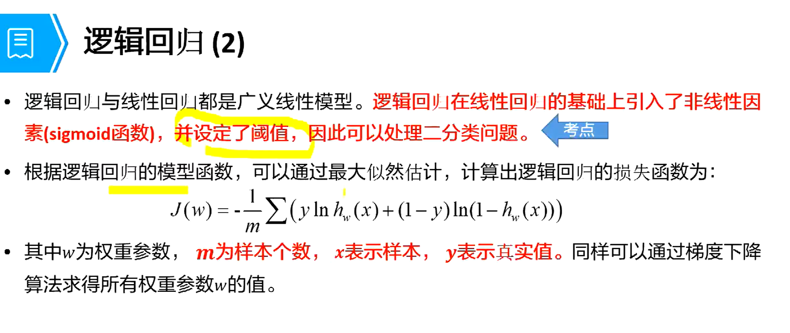
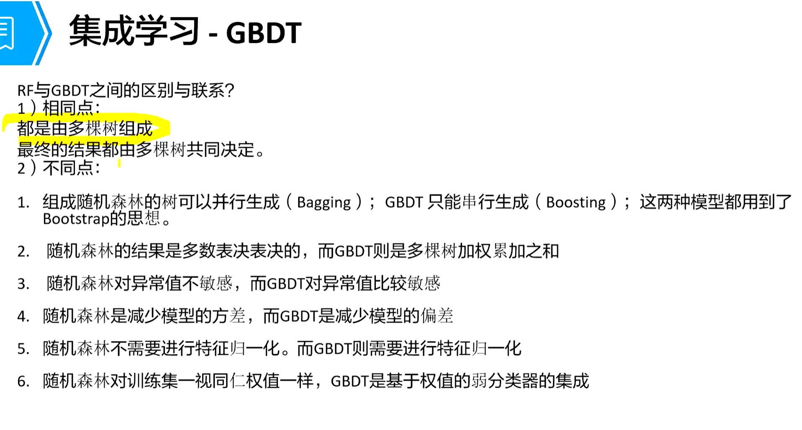

# AI

## 概述

“I propose to consider the question, 'can machines thick?'”   ---艾伦图灵（1950）

“让机器达到同样的行为，即与人类做同样的行为”    ----约翰麦卡锡（1956）

“人工智能是一门科学，是使机器做那些人需要通过智能来做的事情”    ---马文·闵斯基

### 何为智能？

七个范畴：

- 语言（veroal/linguistic）
- 逻辑（logical/mathematical）
- 空间（visual/spatial）
- 肢体动作（Bodily/kinesthetic）
- 音乐（musical/rhythmic）
- 人际（inter-personal/social）
- 内省（intra-personal/introspective）

### 什么是人工智能？

人工智能，他是研究、开发用于模拟、延申和扩张人的智能的理论、方法、技术及应用系统的一门新的技术科学。1956年由约翰·麦卡锡首次提出，当时的定义为“制造智能机器的科学与工程”。人工智能的目的就是让机器能偶像人一样思考，让机器拥有智能，时至今日，人工智能的内涵已经大大扩张，是一门交叉学科

### AI、ML、DL关系

人工智能：是研究、开发并用于模拟、延申和扩展人的智能的理论、方法及应用系统的一门新的技术科学。

机器学习：专门研究计算机怎**样模拟或实现人类的学习行为**，以获取新的知识或技能，重新组织已有的知识结构使之不断改善自身的性能。是人工智能的核心研究领域之一。（研究机器如何学习）

深度学习：源于**人工神经网络**的研究，**多层感知器**就是一种深度学习结构。深度学习是机器学习中的一个新的领域，他模仿人脑的机制来解释数据，例如图像，声音和文本。（强特征提取能力、巨量数据集上表现要优于机器学习）

### 人工智能四要素

数据、算法、算力、场景

### 三大主义学派

#### 符号学派

（推理、符号推理、机器推理）

基本思想：

- 人类认识过程是各种符号进行推理运算的过程。
- 人是一个物理符号系统，计算机也是一个物理符号系统，因此，能用计算机来模拟人的智能行为。
- 知识表示、知识推理、知识运用是人工智能的核心。符号主义认知知识和概念可以用符号表示，认知就是符号处理过程，推理就是采用启发式知识及启发式搜索对问题求解的过程

通过推理得出答案

#### 连接主义

（神经元网络、机器学习、深度学习）

基本思想：

- 思维的基本是神经元，而不是符号处理过程。
- 人脑不同于电脑，并提出连接主义的电脑工作模式，用于取代符号操作的电脑工作模式。

通过海量数据制造模型，通过模型得出答案

#### 行为主义

（行为控制、自适应、进化计算）

基本思想：

- 智能取决于感知和行动，提出智能行为的“感知-动作”模式。
- 智能不需要知识、不需要表示、不需要推理；人工智能可以像人类智能一样逐步进化；只能行为只能在现实世界中，通过于周围环境的不断交互而表现出来。

行动去感知，逐步学习，进化适应

##### 区别

### 发展

### 相关技术

应用、算法机理、工具链、器件、芯片、工艺和材料等技术层级

### 华为全场景AI解决方案

## 分类

### 强人工智能

有可能制造出真正能推理和解决问题的智能机器，并且这样的机器被认为是有知觉的，有自我意识的。可独立思考并指定解决问题的最优方案，有自己的价值观和世界观体系。有和生物一样的各种本能，比如生存安全需求。

### 弱人工智能

不能制造出真正的推理和解决问题的智能机器，这些机器只不过看起来像是智能的，但并不是真正拥有 智能，也不会由自主意识。

## 应用

### 应用技术方向

- 计算机视觉：研究如何让计算机“看”的科学。
- 语音处理：研究语音发生过程、语音信号的统计特性、语音识别、机器合成及语音感知等各种处理技术的统称。
- 自然语言处理：利用计算机技术来理解并运用自然语言的学科。
- 

### 语音处理

语音识别

语音合成

语音唤醒

声纹识别

音频事件检测

### 自然语言处理

机器翻译

文本挖掘

情感分析

知识图谱

智能文案

视频字幕

## MC

### MC认知

机器学习算法（包括深度学习分支）是研究“学习算法“的一门学问

所谓学习是之队友某类任务T和性能度量P，一个计算机程序在T上以P衡量性能随着经验E二自我完善，那么我们称这个计算机程序从经验E学习。

#### 理性认知

目标函数f位置，学习算法无法得到一个完美的函数f

假设函数g逼近函数f，但是可能和函数f不同

#### MC算法和传统编程区别

编程：使用逻辑判断；符号主义，显性编程（规则+数据=答案）

机器学习：使用数据训练得到模型，解释性差，机器根据算法自动学习（答案+数据=规则【模型】）

#### MC应用

问题的解决发难很复杂，或者问题可能涉及到大量的数据却没有明确却没有明确的数据分布函数；

有大量数据看上去很有规律的事情，但传统编程却无法解决

规则十分复杂或者无法描述；

人物的规则会随时间改变；比如词性标注，随时会产生新的词或词义。

数据分布本身随时间变化，需要程序不断的重新适应比如预测商品的销售趋势。

#### 主要解决的问题

##### 分类

计算机程序需要指定输入属于k类中的哪一类。为了完成这个任务，学习算法通常会输出一个函数R^n->(1,2....,k)。比如计算机视觉中的图像分类算法解决的就是一个分类任务。

##### 回归

预测

通过函数表达样本映射

计算机程序会给定输入预测输出数值。学习算法通常会输出一个函数F：R^n ->R，比如**预测**投保人的索赔金额（用于设置保险费），或者预测证券未来的价格

##### 聚类

对大量**未知标注的数据集**，按数据的内在相似性，将数据**划分为多个类别**，是类别内的数据相似度较大，而类别建的相似性较小。可以被运用在图片检索，用户画像等场景中。

分类和回归示是预测问题的两种主要的类型。分类的输出是离散的类别，而回归输出的是连续数值

### 分类

##### 监督学习

有标注数据的学习

利用**已知类别的样本**，训练学习得到一个最优**模型**，使其**达到所要求性能**，**再利用这个训练模型，将所有的输出映射为相应的输出**，对输出进行简单的判断，从而实现分类的目的，即可对未知数据进行分类。

###### 监督学习-回归问题

下周股票能给我带来多少收益

下周温度会是多少摄氏度

###### 监督学习-分类问题

明天早高峰时间段路上会堵车吗

那种手段更吸引顾客

有监督学习需要标注，成本高所以出现了无监督学习

##### 无监督学习

无标注数据的学习

对于**没有标记的样本**，学习算法直接对输入数据集**进行建模**，例如聚类，即”物以类聚，人以群分“。我们只要把相似度高的东西放在一起，对于新来的样本计算相似度之后，按照相似度进行归类就好。

###### 无监督学习-聚类问题

同各据类模型，将样本数据集中的样本分为几个类别，属于同一类别的**样本相似性**比较大

那些观众喜欢看同一题材电影

这些零部件中那些破损的方式是 相似的

##### 半监督学习

既有标注数据、又有非标注数据的学习。

在一个任务中，视图让学习器自动地对大量未标记数据直接帮助少量有标记数据进行模型训练。

##### 强化学习

感知环境做出行动，根据状态于奖惩做出调整。

如何基于环境而行动，以取得最大化的预期利益。

找出最佳答案

学习系统从环境到行为映射的学习，以实奖励信号（强化信号）函数值最大，强化学习不同于连接主义学习中的监督学习，主要表现在教师信号上，强化学习中由环境提供的强化信号是对产生动作的好坏作一种评价（通常为标量信号），而不是告诉强化学习系统如何去产生正确的动作。

###### 强化学习-找出最佳行为

强化学习总是在寻找什么样的行为才是最佳的》强化学习这对的对象是机器或者机器人

自动驾驶汽车：黄灯开始闪了，是刹车还是加速通过

吸尘机器人：是继续吸还是倒回去充电。

### 整体流程

#### 对数据预处理

- 数据清理：填充缺失值，发现并清理造成数据及异常点
- 数据降维：简化数据属性，避免维度爆炸
- 数据标准化：保准话数据减少噪声，以及提高模型的准确性

数据清理工作量

#### 数据清理

- 数据过滤
- 处理数据缺失
- 处理可能的异常、错误或者异常值
- 合并多个数据元数据
- 数据汇总

##### 脏数据

真实的数据通常有一些数据质量问题

不完整：数据中缺少属性或者包含一些确切的值

多噪音：数据包含错误的记录或者异常点

不一致数据中存在矛盾的、有差异的记录

##### 数据的转换

对数据进行初步的预处理后，需要将其转化为一种适合机器学习模型的表示形式，以下是一些常见的数据转化形式。

- 特征工程

  对特征进行归一化、标准化，以保证同一模型的不同输入变量的值域相同

  特征扩充：对现有变量进行组合或转换以生成新特征，比如指标、平均数、性价比

##### 特征选择

一个数据集中存在很多种不同特征，其中一些可能是多余的或者与我们要预测的值无关的。

特征选择的方法

- **过滤法**

  在选择特征的时候是独立的，与模型本身无关

  

  通过评估每个特征的目标属性之间的相关性，这些方法应用一个统计度量来为每个特征赋值。然后根据分数对这些特性进行排序，这可以用来帮助保留或消除特定特征

  常用方法：

  - 皮尔逊相关系数
  - 卡方戏输
  - 互信息

  过滤的极限

  过滤方法倾向于选择冗余的变量因为他们 没有考虑特征之间的关系

- **包装器（wrapper）方法**

  使用一个预测模型来对特征子集进行评分

  - 

    包装器方法将特征选择视为一个搜索问题，在这个问题中评估和比较不同组合。在这里预测模型用于评估特征的组合的工具，根据模型的准确性进行打分

  - 常见方法

    特征递归消除法

  包装法的局限

  因为包装器方法为每个子集训练一个新模型是，所以他们的计算量非常大

  其特征选择的方法通常为特定类型的模型提供了性能最好的特征集。

- 嵌入法

  将特征的选择作为模型构建的一部分

  

  最常见的嵌入式方法是正则化方法

  正则化方法也成为惩罚方法，他在优化预测算法是引入额外的约束，是模型的复杂程度降低，也就是减少了特征的数量

  - 最常见的

    LASSO回归

#### 模型构建

##### 什么是好的模型

##### 模型的有效性

##### 泛化能力

机器学习的目标是使学得得模型能够很好的适用于新的样本，而不是仅仅在训练样本上工作得很好，**学的得模型适用于新样本得能力称为泛化能力**，也成为鲁棒性

误差：学习到的模型在样本上的预测结果与样本的真是结果之间的差

- 训练误差：模型在训练集上的误差
- 泛化误差：在新的样本上的误差，显然，我们更希望得到泛化误差小的模型

欠拟合：训练误差很大（学的东西和学到的差距很大）

过拟合：如果学得得模型训练误差很小，而泛化能力较弱及泛化误差较大得现象（小测试成绩好，期末考成绩差，学习太过）

##### 模型的容量

指其拟合各种函数的能力，也称为模型的复杂度

容量适合于执行任务得复杂度和所提供训练数据的数量时，算法效果通常会最佳。

容量不足得模型不能解决复杂任务，可能出现欠拟合

容量高得模型能够解决复杂的任务，但是其容量高于任务所需时，有可能会过拟合

##### 过拟合原因

误差

最终预测的总误差=变差^2+方差+不可消解的误差

预测误差总的来说可以被拆解出两种主要的我们需要关注的形式

- 来源于偏差的误差
- 来源于方差的误差

方差（Varance）

稳定性差（每次考试一高一低）

模型的预测结果在均值附近的偏移的幅度

来源于模型在训练集上对小波动的敏感性的误差

偏差（Bias）

模型的期望预测（模型的预测结果的期望）与真实结果的偏离程度。偏离程度越大，说明模型的你和能力越差，此时造成欠拟合。

#### MC的性能评估

回归

### 基本概念

#### 数据集

类似平时的学习

在机器学习任务中使用的一组数据，其中的每一个数据成为一个样本。反应样本在某方面的表现或性质的事项或属性成为特征。

#### 训练集

类似平时的测试

训练过程中使用的数据集，其中每个训练样本成为训练样本。从数据中学得模型的过程称为学习（训练）

#### 测试集

类似期末考

学得模型后，使用其进行预测的过程称为测试，使用的数据集称为测试集，每个样本称为测试样本。

测试集和训练集没有交集

### MC算法

#### 线性回归

线性回归是利用数理统计中回归分析，来确定两种或两种以上变量相互以来的定量关系的一种统计分析方法

线性回归是一种有监督学习

##### 一元线性回归

w斜率b截距

##### 多元线性回归

- 线性多元回归的数据输入

  自变量可以是分类变量或连续变量，因变量必须是连续变量

  因变量与自变量之间是线性关系

  自变量个数不少于2

  自变量之间互相独立

- 多元线性回归的算法输出

  训练后的多元线性方程

  包含真实值和预测值的样本

##### 多项式回归

是线性回归拓张，通常数据集的复杂度会超过用一条直线来拟合的可能性，也就是使用原始的线性回归模型会明显欠拟合。解决办法是使用多项式会回归

##### 优点

- 线性一元回归

建模速度快，不需要很复杂计算

由于已知的变量少且简单，所以预测准确率通常都比较高

对异常值很敏感

##### 线性回归与防止过拟合

正则项技术

##### Lasso回归

- Lasso回归优点

弥补最小二乘法和逐步回归局部最优估计的不足，可以很好地进行特征的选择

可以有效解决各特征之间存在多重共线性的问题

- Lasso回归的缺点

如果存在一组高度相关的特征时，Lasso回归方法倾向于选择其中的一个特征，而忽视其他所有的特征，这种情况会导致结果的不稳定性。

- Lasso回归应用

  处理共线性问题

  - 当原始特征中存在多重共线性时，Lasso回归不失为一种很好的处理共线性的方法。它可以有效地对存在多重共线性的特征进行特征筛选

  用于处理特征降维

  - 在机器学习中面对海量的数据，往往会用到降维争取用尽可能少的数据解决问题，而用Lasso模型进行特征选择也是一种有效的降维方式

##### 常见的回归模型

#### 逻辑回归

逻辑回归模型是一种分类模型，用来解决分类问题。

###### 数据输入

数据输入要求

- 特征为数值型，标签概率值为0/1，多分类情况需要对标签进行独热编码处理
- 数据中不能存在在空值
- 特征与标签之间存在线性相关性
- 特征需要进行标准化处理
- 较为平衡的政府样本比例。

##### 算法输出

训练后的模型，可用于预测未知标签的样本

决策系数（算法公式中的各个未知系数），可用于特征选择与重要性排序，制约答案，重要性越高

##### 优缺点

##### 应用

##### 扩展softmax函数

softmax回归时逻辑回归的一般化，适用于k分类的问题

softmax函数的本质就是将一个k维的任意实数向量压缩（映射）成另一个k维的实数向量，其中向量的每个元素取值都介于（0，1）之间

#### 决策树

决策树是一个树结构（可能是二叉树或非二叉树）。其每个非叶节点表示一个特征属性上的测试，每个分支代表这个特征属性在某个值域上的输出，而每个也节点存放一个类别。使用绝册数进行决策的过程就是根节点开始，测试待分类项中相应的特征属性，并按照其值选择输出分支，直到到达叶子节点，将叶子节点存放的类别作为决策结果

##### 决策树的构建过程

##### 数据输入

特征类别无要求

可以允许缺失值

每个特征同等重要

较为平衡的政府样本比例

##### 算法输出

训练后的模型，可用于预测未知标签的样本，直接得出其类别

特征重要性排名，可用于特征工程

书转图，可以以用于可视化和理解模型

##### 优缺点

#### 支撑向量机

SVM，是一个二分类模型，他的基本模型是定义在特征空间上的间隔最大的线性分类器。svm还包括核技巧，这是他称为实质上的非线性分类器。支持向量机的学习算法是求解凸二次规划的最优化算法。

##### 线性支持向量机

##### 非线性支持向量机

##### 数据输入

特征类型为数值型

特征不允许缺失值

使用常规线性核是需要进行标准化

较为平衡的正负样本数

##### 算法输出

训练后得模型，可用于预测未知标签的样本，直接的出其类别

决策函数可以用于解读模型。

##### 优缺点

#### 朴素贝叶斯

naive bayes是一种简单的多类分类算法，基于贝叶斯定理，并假设特征之间是独立的。给定样本特征x，样本属于类别h的概率是：

垃圾邮件识别

##### 数据输入

特征类型无要求

特征之间相互独立

可以允许缺失值

每个特征同等重要

较为平衡的正负样本比例

##### 特征输出

通过训练后的输出主要为训练后的模型，可用于预测未知标签的样本直接得出其类别。

##### 优缺点

##### 应用

#### 集成学习

是一种机器学习的范式，多个学习者被训练和组合以解决同一个问题。通过使用多个学习者，集成的泛化能力可以比单个学习者强得多

如果随机向数千人提出一个复杂的问题，然后汇总他们的答案。在许多情况下会发现这个汇总的答案比专家的答案更好。这就是群众智慧

##### 分类

baging和boosting

随机森林

随机森林random forest=bagging+CART决策树

随机森林建立多个决策树，并将它们合并在一起，以获得个更准确和稳定的预测

##### GBDT

是boosting算法的一种

#### 无监督学习

K-means算法是输入聚类个数k，以及包含n各数据对象的数据集，输出满足于方差最小的标准的k各据类的一种算法。

k-means算法需要输入据类的最终个数k，然后将n各数据对象划分为k各据类，而最终所获得的聚类满足：（1）同意聚类中的对象相似度较高（2）而不同聚类中的对象相似度较小

##### 层次聚类

##### 优缺点

## DL

