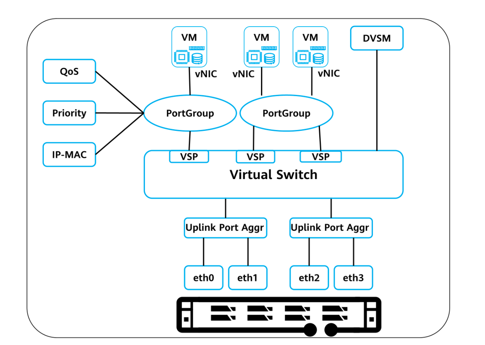
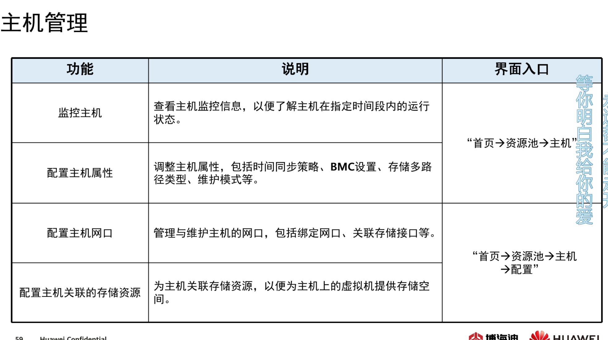
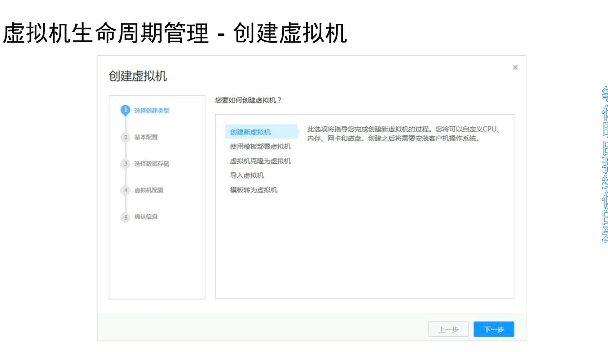
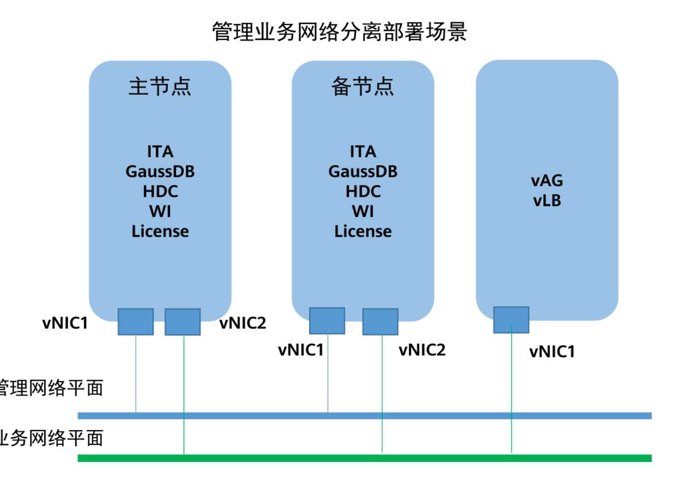
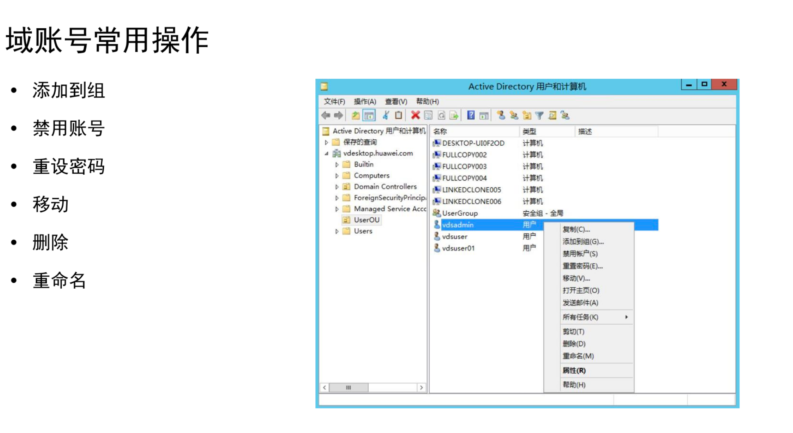
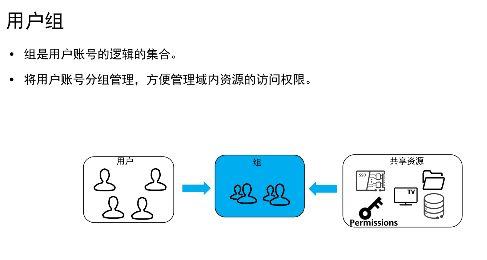

# FusionCompute

## 概述

### 目的

- 提升数据中心基础设施的资源利用率
- 缩短业务上线周期
- 降低数据中心能耗
- 利用虚拟化基础设施的高可用和强恢复能力实现业务快速自动化故障恢复，降低数据中心成本和增加系统应用的正常运行时间。

华为FC虚拟化套件通过再服务器上部署虚拟化软件，使一台物理服务器可以承载多台服务器的工作。通过整合现有的工作负载并利用剩余的服务器一部署新的应用程序和解决方案，实现较高的整合率。

### FC产品定位

FC是云操作系统软件，主要负责硬件资源的虚拟化，以及对虚拟资源、业务资源、用户资源的集中管理。他采用虚拟计算、虚拟存储、虚拟网络等技术，完成计算资源、存储资源、网络资源的虚拟化。

通过统一接口对虚拟资源进行集中调度和管理，从而降低业务的运行成本，保证系统的安全性和可靠性，协助运营商和企业构筑安全、绿色、节能的云数据中心能力。

### 套件架构

#### FC架构

##### CNA 

- 提供虚拟计算
- 管理计算节点上的虚拟机
- 管理计算节点上的计算、存储、网络资源。

##### VRM

- 管理集群内的的块存储、管理集群内的网络资源，为虚拟机分配ip。
- 管理集群内虚拟机的生命周期以及虚拟机在计算节点上的分布和迁移。
- 管理集群内资源的动态调整
- 通过对CNA纳管、对外提供弹性计算、存储、ip等服务。
- 通过统一的擦欧总维护管理结构，操作维护人员通过webui远程访问FC对整个系统进行操作维护、包含资源管理、资源监控、资源报表等。
- VRM的管理vlan id可以更改

### FC功能

#### 虚拟化计算

将物理服务器抽相成逻辑资源

#### 虚拟化存储

更好的管理虚拟基础架构的存储资源，实习用大幅提升存储资源利用率和灵活性

支持将san设备、计算节点本地硬盘以及华为分布式块存储提供的虚拟存储空间统一管理，以虚拟卷的形式分配给虚拟机使用。

虚拟化存储可以分为：块级虚拟化、文件级虚拟化

#### 虚拟化网络

FC支持分布式虚拟交换，可以向虚拟交换机提供独立的网络平面。不同网络平面可以进行vlan隔离。

## FC部署规划

### FC的网络规划

### 部署VRM逻辑视图

FCinstaller部署VRM虚拟机采用的方式是模板文件导入虚拟机

使用同一按照工具部署华为FC后IT会自动创建一个集群、管理员可以对该集群：移动到指定集群文件夹、修改名称、增加描述、但不能导出到本地

### 虚拟化技术

FC支持VHD、RAW、QCOW2格式虚拟机

## FC的计算虚拟化

计算虚拟化包括：内存虚拟化、cpu虚拟化、I/O虚拟化

### cpu/内存在线调整

### CPU-Qos

#### cpu资源份额

it管理员对虚拟机**设定资源利用率使用上线**，**防止非关键应用和恶意用户争抢共享资源。**

按比例分

例如：1ghz物理cpu，分配1：4则分配到1000hz和4000hz的虚拟cpu

#### cpu资源预留

创建虚拟机时可根据虚拟机预期部署业务对cpu性能要求而指定相应的cpu qos。不同的cpuqos代表虚拟机不同的计算能力。指定cpuqos虚拟机**，系统对其cpu的qos保障体现在计算能力的最低保障和资源分配的优先级。**

#### cpu资源限额

虚拟机的cpu qos用于把凭证虚拟机的资源分配，隔离虚拟机间由于业务不同而导致的计算能力互相影响，**满足不同业务对虚拟机计算性能要求，最大程度服用资源，降低成本。**

### 主机内存超分配（内存复用）

host memory 和gust memory不是一一对应的

可以超额分配给vm通过内存复用技术实现

华为额定值为150%超过这个值就会告警.

内存复用在集群开启热迁移

内存复用是实现内存资源qos的前提

使用内存复用会让虚fu拟机性能下降

管理员不可以随时开启或关闭内存复用

关闭内存服用要求集群下所有主机内存复用率小于等于100%

关闭内存复用后所有虚拟机的内存总和小于等于实际可用物理内存综合。

智能内存复用不可之开启或关闭其中一项功能

#### 内存共享、写时复制

内存共享：共享g内容相同的物理内存地址，此时虚拟机只做只读操作。需要修改则开辟新空间映射到另一个内存地址并修改。

#### 内存交换

虚拟机长时间未访问的内存条中的内容置换到存储中并建立映射，当虚拟机再次访问该内存内容时再置换回来

#### 内存气泡

htpervisor通过内存旗袍将较为空闲的虚拟机内存释放给内存使用率较高的虚拟机从而提升内存利用率。

### 虚拟机HA

计算节点的虚拟机出现故障时，系统自动将故障的虚拟机再正常的计算节点上快速恢复，时故障虚拟机快速恢复。

通过配置信息在正常的计算节点重建，重新连接文件系统。

主机故障会导致vm也故障需要使用HA技术在其他主机恢复，不可以直接迁移因为vm故障了。

当计算节点掉电以后，系统可以将计算节点上具有ha属性的虚拟机在其他计算节点拉起，必须的条件是：

虚拟机未与主机绑定、计算节点所属集群要开启HA、源目计算节点使用共享数据存储

管理员可以根据虚拟机的重要程度设置不同的ha

蓝屏系统会执行：HA虚拟机、重启虚拟机或者不处理

### 动态资源调度（DRS）

采用只能负载均衡调度算法，通过周期性检查同一集群资源内各个主机的负载情况，在不同的主机间迁移虚拟机，从而实现同一集群内不同主机间的负载均衡，并最大程度降低系统功耗。

对绑定usb设备无法生效

 DRS(分布式资源调度)原理：

DRS是将虚拟机按照负载均衡的分布在集群内的主机上，以提高集群中运行的虚拟机的整体性能，同时满足用户自定义策略和系统资源使用限制。

用户打开DRS后，会进行设置调度策略，包括自动化级别是“自动”和“手动”——请选择自动策略，否则无法启动进行迁移。

衡量因子包括“CPU”、“内存”

DRS：
集群动态资源调度功能，采用智能负载均衡调度算法，周期性检查集群内主机的负载情况，在不同的主机之间自动迁移虚拟机，从而达到集群内的主机之间负载均衡目的。

 #### DPM：
电源管理自动化功能会周期性地检查集群中服务器的资源实际配置，如果集群中资源利用率不足，则会将多余的主机下电节能，下电前会将虚拟机迁移至其他主机；如果集群资源过度利用，则会将离线的主机上电，以增加集群资源，减轻主机的负荷。

### 分布式电源管理

自动周期性检测集群中服务器资源使用情况，如果集群中的资源利用率不足，则会将多余的主机下电节能，下电前会将虚拟机迁移到其他主机。如果集群资源过度利用则会主机上点增加集群的资源，减轻主机负载。

### 虚拟机热迁移

在不中断业务的情况下，将一个集群中虚拟机从一台服务器移动另一台物理服务器

热迁移后内存数据和磁盘数据是重新建立连接（）映射，而不是真的迁移数据

热迁移与HA的区别：
虚拟机热迁移业务零中断，用户无感知，将虚拟机在保持服务稳定的情况下从集群中的一个节点迁移至另外的节点中运行，需要虚拟机安装 vmtools生成内存位图来确保内存数据的一致性，需要使用同一共享存储(迁移至目的端运行业务需要将数据续写)，触发条件为管理员手动触发(手动执行热迁移)或者是主机资源达到阈值(DRS），集群自动将负载比较高的节点上的虚拟机迁移至负载较低的节点上运行确保集群资源均衡，适用场景(作用）一般是扩容后需要在线降低主机负载，降低集群原有节点压力的场景。 HA 高可用是一种特性，具备高可用特性的集群我们可以叫做HA集群，大于两个节点组件的HA集群在主节点故障后可以将业务在备节点上重启，但是系统启动时业务是中断的(业务靠虚拟机承载) 业务中断用户有感知，触发条件是节点故障，比如被人下电或者硬件故障都可以触发HA，触发时间是不可预见的(不知道啥时候故障)，适用场景一般是对业务有冗余要求的，对业务连续性要求较高，要求发生故障时业务能迅速恢复的场景。所以**热迁移机制使得集群资源更加均衡，降低了节点负载，规避了单节点负载过高的问题(延长了节点寿命)**，**HA 机制使得集群带有冗余性质，可以在集群节点发生故障后业务迅速恢复。**

#### 迭代迁移

#### 内存分片

根据配置信息创建一台一摸一样的虚拟机，在迁移之前将内存变为只读且分片，然后再迁移直到脏数据迁完。

### 规则组

#### 聚集虚拟机

列出的虚拟机必须在同一主机运行

#### 互斥虚拟机

列出的虚拟机必须运行在不同主机上

#### 虚拟机到主机

虚拟机组的成员是否能在特定主机组的成员上运行。

### NUMA

UMA: uniform memory access. 一致性内存访问。我们的计算机由三部分组成，cpu、内存和disk。计算机里还有两块芯片，一个是南桥芯片，用来处理慢设备，例如磁盘、USB等，北桥芯片用来处理快设备，例如内存等。CPU作为计算机的核心，它的运行速度是最快的，内存次之，磁盘是最慢的。当我们的CPU需要访问磁盘中的数据时，CPU是不会直接访问磁盘中的数据的，因为太慢了，他会通过内存来调用磁盘中的数据。所以我们的CPU会频繁访问内存中的数据，而内存和cpu之间的访问链接是通过FSB（前端总线）实现的。FSB受带宽限制，带宽越高，那么数据传输速率越快。 

这里之所以说是一致性内存访问，是因为假如这里有两个内存条（甚至多个），CPU是可以访问每一个内存的，所有的CPU所访问的内存数据都是全局一致的。这就是一致性内存访问（UMA）。

NUMA：non uniform memory access。非一致性内存访问。随着计算机技术的不断发展，计算机配置不断升高，多CPU多内存已经是一种很常见的现象。如下图所示，如果这里有3个CPU，每个CPU都可以访问所有内存，这里就会存在一个问题，CPU很多可以内存很多可以，但是由于FSB带宽的限制，数据传输速率会很受影响。这就好比路上的车增加了很多，但是依然还是4车道，这就造成了堵塞的现象。

NUMA架构可以解决这个问题。在NAMA架构中**，一个CPU绑定一个内存，形成一个NUMA节点，一般情况下，CPU只能访问自己绑定内存中的数据，不可以访问别的内存数据，这就是非一致性内存访问。**但是**如果内存确实不够用了怎么办呢？那么这个CPU可以通过别的CPU来访问别的内存，这种方式也称为远程访问。**当然一个NUMA节点中，CPU对内存的访问我们称为本地访问。显然本地访问的速度要远远大于远程访问。

guest numa 就是通过虚拟机呈现NUMA结构，使guest OS及其内部应用识别NUMA结构，以达到提升性能的目的。

Host NUMA主要提供**cpu负载均衡机制**，解决cpu资源分配不平衡引起的VM性能瓶颈问题。

Host NUMA保证VM访问本地物理内存，减少了内存访问延迟，可以提升VM性能

虚拟NUMA：

拓扑呈现：虚拟机内部识别到NUMA,使Guest OS及应用NUMA优化功能生效

初始放置：根据虚拟机NUMA拓扑，选择物理node放置vcpu和内存，是vnode中vcpu和内存关系与物理实际一致

动态迁移：当vcpu与物理node亲和关系发生变化时，出发其对应node内存进行迁移

负载均衡：在调度过程中考虑node关联性，以及node与物理node对应关系，最大限度保证vcpu访问本地内存

### IMC模式

IMC：Incompatable migration cluster. 不兼容迁移集群。它的作用主要是：假设我们的集群中总共有3台主机，但是每台的CPU型号不一样，比如分别是inter1,intel3,initel5，这时候虽然我们做了集群高可用策略，但是主机1上的虚拟机是不会往主机2,3上迁移的，因为他们的CPU型号不一样。此时如果打开了IMC模式，那么就可以解决这个问题。这就是IMC模式的作用。

## FC的存储虚拟化

存储虚拟化可以分为：块级虚拟化、文件虚拟化。

在FC中管理员不能通过手动刷新或者扫描来发现存储设备

对逻辑卷进行管理的是LVM

FC中删除存储资源的步骤：1.删除或迁移虚拟机磁盘；2.销毁数据存储；3.解除关联主机；4.删除存储资源

存储接口ip地址不可和管理平面处于同一网段

存储接口支持手动添加和批量添加；

通过添加多个存储接口可以实现存储的多路径传输

本地磁盘和FC san不用添加存储接口就可以实现存储设备对接

常见的外挂存储解决方案：NAS和SAN

### 存储概念

#### 存储资源

存储资源表示物理设备，IPSAN、fusionstorage、nas等

FC支持的存储资源类型有：fusionstorage、NAS、IP SAN

在FC中共享磁盘：绑定了该类磁盘的虚拟机不支持快照功能、虚拟机不支持对此类硬盘更改数据存储、此类硬盘可以绑定给多台虚拟机

#### 存储设备

表示存储资源中的管理单元，类似LUN、Fusionsotrage存储池、nas共享目录等。

#### 数据存储

数据存储表示虚拟化平台中克管理、操作的存储逻辑单元。

### FC的存储架构

###  VIMS虚拟集群存储文件系统

vims是一种高新能的集群文件系统，使虚拟化技术的应用超出了单个存储系统的限制，可以让多个虚拟机共同访问一个整合的集群式存储池，从而显著提高了资源利用率率。vims时跨多个存储服务器实现虚拟化的基础。它可以使用的特性由：热迁移、DRS和High AValiability等各种服务。

### FC的磁盘技术

在存储虚拟化中所有用户存储都是以文件形式呈现，虚拟机磁盘、快照、虚拟机配置都一对应一个独立的文件，常见的磁盘文件配置模式分为：

#### 普通磁盘

直接分配然后置零

将所有文件填0即格式化，占用空间大，置备时间长，性能最好，数据最安全，适用于对IOPS要求高的场景。

#### 普通延迟置零磁盘

先创建使用边用边置零（写前置零）

占用空间较大，置备时间短，提高存储设备利用率，性能较普通磁盘有所下降，适用于对于发放速度要求高，但对IOPS要求不高的场景。

#### 精简磁盘

随着使用内存不断增长

创建时含有少量元数据，随着写入则更加，提高存储设备利用率。精简磁盘使用动态磁盘技术，节省空间，性能较普通磁盘有所下降，适用于用户对存储需求不明确或者是规划的容量比实际使用的容量多的场景。

最快创建

精简磁盘不能改为普通

**从数据安全性来看**

#### 持久化

持久化对数据写入会永久写入，回滚并不会清空数据

#### 非持久化

非持久化把数据写入差分磁盘，关机则还原，回滚会清楚数据

再启动虚拟机时候，对非持久先创建差分磁盘，在虚拟机运行过程中，将由更改的数据全部写入差分磁盘，在虚拟机关机后将差分磁盘全部删除，达到还原磁盘的目的、常用于公共计算机、计算机数据自动还原的场景。

##### 差分磁盘

差分磁磁盘必须基于一个已有的副磁盘创建，他只记录修改了相对于副磁盘的数据库，包括数据的增改，如果副磁盘进行了修改，则差分磁盘的数据将不再可以用。

常用于快照、非持久磁盘、连接克隆等、起到保护源盘不被修改，并可以跟踪虚拟机磁盘差异数据的作用。

#### 从属

持久化和非持久化结合，关机不还原，但快照还原随着还原，最普通和VMware快照一样

### FC存储虚拟化的特性

#### 快照

虚拟机可以将当前保存在快照文件中，包括祠旁内容、内存和寄存器数据。用户可以通过恢复快照多次回到这一状态。

原理：使用ROW（**Redirect-on-write**） 

https://www.cnblogs.com/yunjisuanchengzhanglu/p/16107680.html

​			使用COW（Copy-On-Write）

https://blog.csdn.net/qq_34474071/article/details/125199163

FC支持：

##### 普通快照

只对磁盘做快照，恢复时候是会恢复磁盘的数据，不回复内存中的。

##### 一致性快照

对当前磁盘和内存一起做快照

##### 内存快照

把内存中的文件刷盘到磁盘中再做快照

#### 存储热迁移

冷迁移是再虚拟机关机时候将其磁盘文件从一个存储移动到另一个存储

热迁移再业务不中断前提将磁盘迁移。

存储热迁移不可在不同虚拟磁盘之间进行

在FC中虚拟机的系统盘可以解绑

原理：
在原磁盘创建差分磁盘，再在目的数据存储创建差分磁盘，通过io双写向两边差分磁盘写入，然后将原数据迁移，双写可以保证迁移失败不会导致丢失，迁移完成后再将磁盘映射迁移。

#### 存储资源裸设备映射（RDM）

提供一直机制让虚拟机直接访问底层存储。用于某些程序对磁盘高度写需求。

裸设备映射类型不支持快照、存储精简置备、存储热迁移。

## FC的网络虚拟化

### 网络虚拟化技术

#### Linux Bridge

网桥

工作于二层的虚拟网络设备，功能类似于物理交换机

#### OVS

Open vSwitch

是一款基于软件实现的开源虚拟以太网交换机

Ovs支持多种标准的管理接口和协议，还支持跨多个物理服务器的分布式环境。

Ovs提供了对OpenFlow协议的支持，并且能够和众多的开源的虚拟化平台整合。

传递虚拟机vm之间的流量，以及实现vm和外界网络的通信

### FS的网络解决方案

#### DVS

分布式虚拟交换机，功能类似于普通的物理交换机，每台主机都连接到分布式交换机中。分布式虚拟交换机的一端是与虚拟机相连的虚拟端口，另一端与虚拟机所在主机上的物理网络以太网适配器相连的上行链路。通过他可以丽娜姐主机和虚拟机，实现系统网络互通。另外，分布式虚拟交换机在所有关联主机之间作为的那个虚拟交换机使用。此功能可以使虚拟交换机在跨主机进行迁移时保持网络配置一致。

对应的传统网络设备是二层交换机。

为DVS配置的VLANID需要在物理交换机上配置，否则会影响虚拟机正常通信。

一个主机可以有多个DVS，但多个DVS不能共享使用同一网口

没必要为每个DVS都配一个管理IP地址

每张虚拟网卡可以关联一个DVS

多张虚拟网卡可以关联同一个dvs

FC中管理员无法查看虚拟机连接的dvs端口

向虚拟机提供独立的网络平面，像物理交换机一样，不同的网络平面间通过VLAN进行隔离

流量走向

同一CNA同一VLAN：直接通过DVS

同一CNA不同VLAN：通过DVS到上行链路然后通过 物理交换机到另一台主机

不同CNA同一VLAN：通过DVS到上行链路然后通过物理交换机到另一台主机

不同CNA不同VLAN：通过DVS到上行链路然后通过物理交换机到另一台主机

#### 虚拟交换模型

将VNIC加入portGRoup可以使用Qos和priority（安全组）和IP绑定MAC等策略

通过VSP连接DVS再通过上行链路（DVS连接到物理端口组）

交换机类型三种可选

- - 普通模式：上行链路关联的主机物理网卡为普通网卡，也是实验默认所选

  - SRIOV直通模式：上行链路关联的主机物理网卡为SRIOV直通网卡

什么是SRIOV：SR-IOV（Single Root I/O Virtualization and Sharing Specification）技术是一种基于硬件的虚拟化解决方案，可提高性能和可伸缩性
    SR-IOV标准允许在虚拟机之间高效共享PCle（Peripheral Component Interconnect Express，快速外设组件互连）设备，并且它是在硬件中实现的，可以获得能够与本机性能媲美的I/O性能

##### 端口组

- 具有相同属性的端口就会形成一个端口组，这样做是为了方便管理员管理，不需要对每一个端口做配置，如果属性一致，只需要对端口组配置修改即可。端口类型有两种可选：普通类型（Access）和中继类型（Trunk），实验选的普通类型

- 普通类型的虚端口只能属于一个VLAN，中继类型的虚端口可以允许多个VLAN接收和发送报文。普通虚拟机选择普通类型的端口，虚拟机的网卡启用VLAN设备的情况下选择中继类型的端口，否则虚拟机的网络可能不通
- VLAN ID设置为0表示不带VLAN标签！而使用install部署创建出的分布式交换机和端口组默认VLAN ID是0
- 测试得出可以创建VLAN ID一样的端口组，不冲突，但没有什么意义

一个端口组只能配置一个ip

##### trunk

中继类型

trunk 收到带vlan的帧和自己所属vlan比较，相同转发，不相同丢弃。

trunk 收到不带vlan的帧，打上自己所属vlan的tag进行转发。

##### access

普通类型

access收到带vlan的帧和自己所属vlan比较，相同转发，不相同丢弃。

access收到不带vlan的帧，打上自己所属vlan的tag进行转发

#### 二层网络安全策略

防止用户虚拟机ip和MAC地址仿冒，防止用户虚拟机和DHCP server仿冒

#### 安全组

用户可以根据虚拟机需求创建安全组，每个安全组可以设定一组访问的规则。当虚拟机加入安全组，即可受该访问规则组的保护。用户通过再创建虚拟机时选定要加入的安全组来对自身的虚拟机进行安全隔离和访问控制。安全组是针对网络

待删除安全组和其他安全组之间的授权行为不影响删除操作

安全组内存在虚拟机需要将虚拟机移除安全组

安全组删除后，组内的安全组规则不会被同时删除

#### Trunk口

控制vlan的收发，通过vlanid聚合多个端口

相同则去签转发，不同则丢弃，没有则打上转发

#### 网络qos

控制带宽、流量整形

#### 网口绑定

## FS虚拟化平台的管理

### 维护管理

#### FS账户管理

FS账户分为：本地用户、域用户、接口对接用户。

本地用户用于登录、管理系统；

在配置域后，可用域用户登录系统；

接口对接用户用于其他用户对接；

#### 告警管理

#### 监控管理

### 配置管理

### 集群资源管理

#### 集群管理

#### 主机管理

#### 存储管理

#### 网络资源管理

#### 虚拟机生命周期

##### 创建虚拟机

导入虚拟机的方式支持的格式有**ova\ovf**不支持vmdk和qcow2

##### 克隆虚拟机

在FC中克隆虚拟机可以调整虚拟机规格

##### 下电删除

## FusionAccess

华为FusionAccess桌面与时基于华为云平台FC的一种虚拟化桌面应用，通过在云平台上部署华为桌面云软件，使终端用户通过瘦客户端或其他设备来访问跨平台的整个客户端桌面和应用

FC是构建了一个虚拟化平台；而FA是跑在虚拟化平台上的一个典型应用。

### 架构

#### VDI

virtual desktop Infrastructure

计算和数据都在云端，集中管理，集中运行

#### IDV

intelligent desktop virtuazalition

智能桌面虚拟化，镜像集中管理计算和数据还是在本地终端，集中管理，分散运行。

##### 华为桌面云逻辑架构

### 对比

### 桌面云优势

##### 数据安全

终端与数据隔离，防泄密

高可靠性架构，防丢失

##### 运维效率

桌面标准化

桌面快速发放，集中运维

##### 灵活性

资源按需调整

移动办公

### FA组件

#### 接入访问和控制层

##### WI

web interface

为用户提供web界面，转发信息给liteas验证身份

通过之后将HDC提供虚拟机列表给用户，为用户访问虚拟机提供接口

##### vAG

Virtual access gateway虚拟接口网关

实现桌面接入网关和自助维护网关。当用户虚拟机出现故障无法通过桌面协议登录到虚拟机，需要通过VNC自主维护台登录到虚拟机进行自主维护。

VNC是一款轻量远程控制软件

被控制的计算机需要安装软件成为VNCserver

##### vLB

Virtual load Balance虚拟负载均衡器

在用户访问WI时，进行负载均衡，防止超多用户登录到同一个WI。

##### UNS

单一名称服务（unify nameserver）

用户可通过统一的域名（如无域名则使用统一的IP地址）访问具有不同WI域名（或IP地址）的多套FusionAccess系统。一般情况下，用户通过一个WI域名，仅能访问该WI对应的FusionAccess系统，但对于一些企业来说，或因容灾、地域等原因，一般会部署多套FusionAccess系统（对应多个WI域名），如果员工需要访问不同FusionAccess系统的桌面，需要在不同的WI域名间进行切换，部署UNS后，员工即可通过统一的域名，访问不同FusionAccess系统中的桌面。

#### 虚拟桌面管理层

##### ITA

IT Adaptor，IT适配器

ITA为用户管理虚拟机提供接口，其通过与HDC（huawei desktop controller）的交互、以及与云平台软件fusioncompute的交互，实现虚拟机创建与分配、虚拟机状态管理、虚拟机模板管理、虚拟机系统操作维护功能。

all in one 时候直接输入ip会解析到WI，需要进入ITA要加入8448端口

##### HDC

huawei desktop controller，华为云桌面控制器

虚拟桌面管理软件的核心组件，根据ITA发送的请求进行桌面组的管理、用户和虚拟桌面的关联管理，处理虚拟机登录的相关请求等。

##### TCM

thin client management，瘦终端管理服务器

TCM为升腾曦帆桌面管理系统，管理员通过TCM对TC进行日常维护管理。

##### AUS

用于升级HDA的软件

##### License服务器

license（认证文件）管理与发放系统，负责HDC的license管理与发放

华为盈利的东西，不购买，无法使用

FA桌面管理软件主要用到其HDP连接数License，当用户连接虚拟机时会到License服务器上检测license，判断是否可以连接到虚拟机。

##### GaussDB数据库

为ITA、HDX提供数据库，用于存储数据信息

##### Backup server备份服务器

备份各个组件的关键文件和数据

策略：每天1点定时备份并上传到备份服务器，目录是/var/ftpsite/配套的ITA名称/各组件的文件夹

备份空间充足时，备份服务器会保存10天的备份数据，备份空间不足，系统会自动删除最早的备份文件。

##### cache

提供高速读写

#### 核心组件

##### HDA

huawei desktop agent，安装在每个用户的虚拟桌面中，提供终端与虚拟桌面之间的连接功能

TC（SC）要通过HDP协议连接到虚拟机必须要在虚拟机上安装HDA

HDA实际上是一系列桌面连接服务，为TC（SC）使用虚拟机提供支持

### 协议

#### HDP

huawei desktop protocol

华为自研的新一代云接入桌面协议，相对比于传统桌面协议

##### 架构

##### 常见的桌面协议

ICA/HDX

PCoIP(PC-over-IP)

SPICE

RDP/RemoteFX

##### 对比

#### 协议功能

##### 2d图形显示技术

桌面云要实现远程显示，要通过服务端侧的操作系统接口，抓取屏幕内容，在金国一定的处理后传送到客户端测显示出来。

##### 语音技术

通过桌面协议服务器端可以在虚拟机里实现一个音频驱动，音频驱动会和windows的音频子系统进行交互。

##### 视频显示技术

目前在云桌面中，支持多媒体视频播放，通常由两种方式：

1.将服务端的多媒体视频播放图像重新进行视频编码处理，然后将视频编码数据创数到客户端进行解码播放

2.视频重定向，直接截获视频编码流，直接将视频编码流发送到客户端惊醒解码播放

##### 外设重定向技术

在云桌面场景下，把TC/SC终端侧的外围设备，通过桌面协议映射到远程桌面中，并能通过远程桌面使用这些外围设备的技术。基于外设实现原理分为两种：

端口重定向：是指在远程桌面的操作系统中，针对端口底层协议进行重定向技术；usb端口重定向

设备重定向：是指在远程桌面操作系统中，针对设备应用协议进行重定向的技术；如摄像头重定向

端口重定向，没有压缩，会占用很多带宽

设备重定向，占用贷款小，兼容新低

##### 3D图形显示技术

根据3d原理主要有：

GPU直通

GPU硬件虚拟化

图形工作站纳管

### 规划和部署

#### 安装规划

##### 合一部署

##### 标准部署

#### 桌面云关联组件

##### AD

活动目录（Active Directory）用来存储网络上的用户账户、计算机、打印机等资源的信息，方便用户查找和使用。

**一种目录服务，可以提供对象的存储、快速查找于定位，并且能够统一、集中、安全地管理计算机资源。**

是微软windows server中，负责架构中大型网络环境的集中式目录管理服务

在windows server ad域内的目录式用来存储用户账户、组、打印机、共享文件夹等对象

AD能够管理和保护系统的用户账户、客户机及应用程序，提供统一的界面，增强内网信息的安全性

##### 管理对象

AD的最小管理单元为对象（object），也是一种属性的集合，一个ad网域中，以树状结构，组织如以下基本对象：

区域控制器（Domain controller），存储网域所属的网域控制站（简称设备上下文、域控）

计算机（computes），存储加入网域的电脑对象。

系统默认账户组群（builtin），存储自带的账户组群。

用户（users）存储AD中的用户对象

组织单元（Organization unit，OU）可以在OU之中存放AD对象，包括用户，组群，电脑等，让组织结构在AD中可以被真实反映出来，便于组织结构方式的管理对象。

