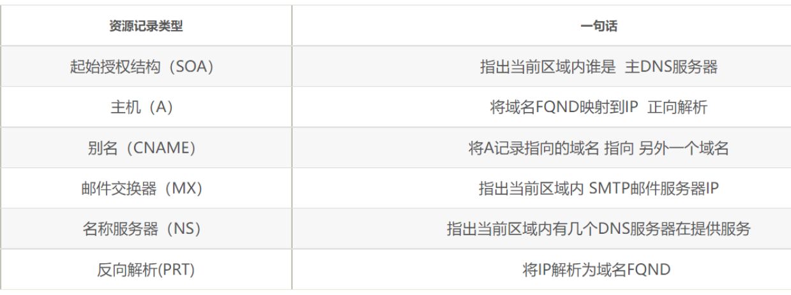

# 常用命令

## echo

在终端输出字符串或变量提取后的值

echo 字符串    ； echo $变量


## date

显示或设置系统时间和日期

年月日小分秒查看    date "+%Y-%m-&d %H:%M:%S"

默认格式 date

查看本年第几天/本月第几天 echo "+%j"  echo "+%d"

设置时间  date -s "年月日 时:分:秒"


## timedatectl

查看修改时区

查看 timedatectl status

修改 timedatectl set-timezone Asia/Shanghai

设置时间 timedatectl set-time 时:分

列出已知时区  timedatectl list-timezones


## reboot

重启


## poweroff

关机


## wget

下载文件

下载页面所有资源 递归下载 后台下载 下载到指定目录linux

 最大尝试3    断点续传

wget -p -r -b -p linux -t 3 -c 


## ps

查看系统中进程状态

显示所有进程 详情信息 没有控制终端的进程

ps aux    （不可用-）

R运行 S中断 D不可中断 Z僵死 T停止

< 高优先级  N低优先级  L被锁进内存  s包含子进程  I多线程


## pstree

以树状图显示进程及之间关系


## top

动态监视进程活动和系统负载等

PR 和 NI值代表进程优先级 数字越低优先级越高（-20~19)


## nice

调整进程优先级

调整bash为最高级   nice -n -20 bash


## pidof 

用于查询pid

查询sshd的pid  pidof sshd


## kill

终止指定PID服务进程

kill  2156

最高级别杀死 kill -9 2156


## killall

终止某个名称的服务对应的全部进程

killall httpd (+& 可在后台进行)


## ifconfig

获取网卡配置与网络状态


## uname

查看内核版本和系统架构

详细查看 uname -a


## uptime

查看系统负载信息

负载越低越好


## free 

显示系统内存使用量

free -h(易读模式)


## who

查看登入主机的用户终端信息


## last

调取主机的被访记录


## ping

测试连接性

-c 发送次数

-l 网卡名字

-I 每次间隔

-w 最长等待时间


## tracepath

显示数据包到达目的地主机时途中经过的所有路由信息

tracerpath www.baidu.com


## netstat

显示网络连接，路由表，接口状态等网络信息

-a 显示所有链接中的socket

-p 显示正在使用的socket

-t 显示tcp协议链接状态

-u 显示udp协议连接状态

-n 使用ip，不用域名

-l 仅列出正在监听的服务状态

-i 现在网卡列表信息

-r 显示路由表信息


## history

显示执行过的历史命令

也可用cat在 ~/.bash_history中查看


## sosreport

收集系统配置及架构并输出诊断文档


## pwd

显示用户当前所处工作目录


## cd

切换工作路径

撤回cd -

进入上级目录cd..

切换到当前用户家目录cd ~

切换到其他用户的家目录cd ~ username


## ls

显示目录中的文件信息

查看全部文件（包括隐藏文件）ls -a

查看文件的属性、大小等详细信息 ls -l

查看目录属性 -ls -d


## tree

以树状图列出目录内容和结构


## find

按指定条件查找文件所对应的位置

-name 匹配名称

-perm 匹配权限（mode完全匹配，-mode包含即可）

-user 匹配所有者

-group 匹配所属组

-exec 用于把find命令搜索到的结果交由紧随其后的命令进一步处理

find / -user linuxprobe -exec cp -a { } /root/findresults/  \;将归属于linuxprobe用户的文件并复制到/root/findresults目录（{}表示find命令搜索出的每一个文件，并且结尾必须是"\；")


## locate

按照名称快速搜索文件所对应的位置

使用locate前先用updatedb生成一个索引库（/var/lib/mlocate/mlocate/db)后续使用locate搜索时就是在该库中进行查找操作，速度比find快。


## whereis

按照名称快速搜索二进制程序（命令）、源代码以及帮助文件所对应的位置。该命令也是基于updatedb库搜索，与locate区别是不关心相同名称文件，仅仅是快速找到命令对应文件和帮助文件所在位置。


## which

用于按照指定名称快速查找二进制程序（命令）所对应位置，即不关心同名文件也不关心对应源代码和帮助文件，仅仅要找所在路径。


## cat

查看内容较少的纯文本文件

-n 显示行号


## more

查看内容较多的纯文本文件

空格与回车可以翻页


## head

查看纯文本文件前n行

head -n 10 fuck 查看fuck文件前10行


## tail 

查看纯文本文件后n行

tail -n 10 fuck 查看fuck文件后10行

tail -f fuck 实时查看最新的日志文件（可持续刷新）


## tr

替换文本内容的字符

cat fuck | tr [a-z] [A-Z]   查看fuck文件并且将其中小写全换成大写


## wc

统计指定文本文件的行数、字数、字节数。

-l 行  -w单词数  -c字节数


## stat

用于查看文件的具体存储细节和时间等信息

Access Time[Atime]  (内容最后一次访问时间)

Modify Time[Mtime]  (内容最后一次被修改时间)

Change Time[Ctime]  (文件属性最后一次被修改的时间)


## grep

按行提取文本内容

-n 显示行号

-v反选信息

-b 将可执行文件当作文本文件搜索

-c仅显示找到的行数

-I忽略大小写

grep /sbin/nologin /etc/passwd  查找/etc/passwd中终端为/sbin/nologin


## cut

按”列“提取文本内容

-f设置要查看的列数

-d设置间隔符号

cut -d : -f 1 /etc/passwd 提取该文件中以冒号为间隔的第一列用户名


## diff

用于多个文件之间内容的差异

--brief 确认两个文件是否相同（仅给出是否相同）

-c 详细比较出多个文件的差异之处 （详细的哪里不同）


## uniq

去除文本重复的行


## sort

对文本内容进行再排序（默认按字母顺序）

-f 忽略大小写	-b 忽略缩进和空格	-n 以数值型排列

-r 反向排序	-u 去除重复行 	 -t 指定间隔符	 -k 设置字段范围


## touch

创建空白文件或设置文件时间

-a 仅修改”访问时间“（Atime）   -m 仅修改”修改时间“（Mtime）

-d 同时修改Atime和Mtime

touch -d "2020-05-04 15:44"  fuck 修改fuck文件的Atime和Mtime


## mkdir

穿建空目录

-p创建具有嵌套层叠关系的目录文件


## cp

复制文件或者目录

-r 递归持续复制（用于目录）  	-p 保留原始文件属性

-d对象为链接文件则保留链接文件属性   -i 若目标文件存在则询问

-a 相当于 -pdr


## mv

用于剪切或者重命名文件

mv fuck look  原理还是剪切覆盖，删除源文件fuck保留剪切后的文件look


## rm

删除

-f强制	-i 删除目前询问 	-r 删除目录	 -v显示过程


## dd

用于按照大小和个数的数据块来复制文件或转换文件，还可以制作iso

dd if=输入的文件夹 of=输出文件名 bs=设置每个”块“大小 count=设置要复制”块“的个数


## file

用于查看文件类型


## tar 

用于对文件打包压缩解压

-c 创建压缩文件	-x 解压文件	-t 查看压缩文件内的文件

-z/-j 用gzip/bzip2压缩或解压	-v 显示压缩或解压过程

-f 目标文件名	-P 保留原始的权限与属性	-p 使用绝对路径压缩

-c 解压到指定目录

一般用 “tar -czvf 压缩包名称.tar.gz” 来指定文件进行打包压缩

一般用”-tar -xzvf 压缩包名称.tar.gz"来指定文件进行解压


## export

将变量提升为全局变量，使其他用户也可用

## unset

可以取消全局变量设置


## id

用于显示用户的详细信息


## useradd

用于创建新用户账户

-d指定用户的家目录

-e账户的到期时间

-u账户默认uid

-g指定初始的用户基本组

-G指定一个或多个扩展用户组

-N不创建与用户同名的基本用户组

-s指定该用户的默认shell解释器（设置为nologin则用户登录不到系统）


## groudadd

创建用户组


## usermod

用于修改用户属性

 usermod命令中的参数以及作用

| 参数  | 作用                                                         |
| ----- | ------------------------------------------------------------ |
| -c    | 填写用户账户的备注信息                                       |
| -d -m | 参数-m与参数-d连用，可重新指定用户的家目录并自动把旧的数据转移过去 |
| -e    | 账户的到期时间，格式为YYYY-MM-DD                             |
| -g    | 变更所属用户组                                               |
| -G    | 变更扩展用户组                                               |
| -L    | 锁定用户禁止其登录系统                                       |
| -U    | 解锁用户，允许其登录系统                                     |
| -s    | 变更默认终端                                                 |
| -u    | 修改用户的UID                                                |


## passwd

修改用户密码、过期时间等

  passwd命令中的参数以及作用

| 参数    | 作用                                                         |
| ------- | ------------------------------------------------------------ |
| -l      | 锁定用户，禁止其登录                                         |
| -u      | 解除锁定，允许用户登录                                       |
| --stdin | 允许通过标准输入修改用户密码，如echo "NewPassWord" \| passwd --stdin Username |
| -d      | 使该用户可用空密码登录系统                                   |
| -e      | 强制用户在下次登录时修改密码                                 |
| -S      | 显示用户的密码是否被锁定，以及密码所采用的加密算法名称       |


## userdel

删除已有账户

-f强制

-r强制删除以及家目录


## chattr

设置文件隐藏权限

如果想要把某个隐藏功能添加到文件上，则需要在命令后面追加“+参数”，如果想要把某个隐藏功能移出文件，则需要追加“-参数”。chattr命令中可供选择的隐藏权限参数非常丰富，具体如表5-8所示。

表5-8                 chattr命令中的参数及其作用

| 参数 | 作用                                                         |
| ---- | ------------------------------------------------------------ |
| i    | 无法对文件进行修改；若对目录设置了该参数，则仅能修改其中的子文件内容而不能新建或删除文件 |
| a    | 仅允许补充（追加）内容，无法覆盖/删除内容（Append Only）     |
| S    | 文件内容在变更后立即同步到硬盘（sync）                       |
| s    | 彻底从硬盘中删除，不可恢复（用0填充原文件所在硬盘区域）      |
| A    | 不再修改这个文件或目录的最后访问时间（atime）                |
| b    | 不再修改文件或目录的存取时间                                 |
| D    | 检查压缩文件中的错误                                         |
| d    | 使用dump命令备份时忽略本文件/目录                            |
| c    | 默认将文件或目录进行压缩                                     |
| u    | 当删除该文件后依然保留其在硬盘中的数据，方便日后恢复         |
| t    | 让文件系统支持尾部合并（tail-merging）                       |
| x    | 可以直接访问压缩文件中的内容                                 |


## chown 

用於修改文件所有者和所有組

-R遞歸操作、


## chattr

chattr命令用于设置文件的隐藏权限，英文全称为change attributes，语法格式为“chattr [参数] 文件名称”。

如果想要把某个隐藏功能添加到文件上，则需要在命令后面追加“+参数”，如果想要把某个隐藏功能移出文件，则需要追加“-参数”。chattr命令中可供选择的隐藏权限参数非常丰富，

| 参数 | 作用                                                         |
| ---- | ------------------------------------------------------------ |
| i    | 无法对文件进行修改；若对目录设置了该参数，则仅能修改其中的子文件内容而不能新建或删除文件 |
| a    | 仅允许补充（追加）内容，无法覆盖/删除内容（Append Only）     |
| S    | 文件内容在变更后立即同步到硬盘（sync）                       |
| s    | 彻底从硬盘中删除，不可恢复（用0填充原文件所在硬盘区域）      |
| A    | 不再修改这个文件或目录的最后访问时间（atime）                |
| b    | 不再修改文件或目录的存取时间                                 |
| D    | 检查压缩文件中的错误                                         |
| d    | 使用dump命令备份时忽略本文件/目录                            |
| c    | 默认将文件或目录进行压缩                                     |
| u    | 当删除该文件后依然保留其在硬盘中的数据，方便日后恢复         |
| t    | 让文件系统支持尾部合并（tail-merging）                       |
| x    | 可以直接访问压缩文件中的内容                                 |


## lsattr

查看隐藏权限


## setfacl

setfacl命令用于管理文件的ACL权限规则，英文全称为“set files ACL”，语法格式为“setfacl [参数] 文件名称”。

ACL权限提供的是在所有者、所属组、其他人的读/写/执行权限之外的特殊权限控制。使用setfacl命令可以针对单一用户或用户组、单一文件或目录来进行读/写/执行权限的控制。其中，针对目录文件需要使用-R递归参数；针对普通文件则使用-m参数；如果想要删除某个文件的ACL，则可以使用-b参数。setfacl命令的常用参数如表5-9所示。

表5-9                       setfacl命令中的参数以及作用

| 参数 | 作用             |
| ---- | ---------------- |
| -m   | 修改权限         |
| -M   | 从文件中读取权限 |
| -x   | 删除某个权限     |
| -b   | 删除全部权限     |
| -R   | 递归子目录       |


## getfacl

getfacl命令用于查看文件的ACL权限规则，英文全称为“get files ACL”，语法格式为“getfacl [参数] 文件名称”。

Linux系统中的命令就是这么又可爱又好记。想要设置ACL，用的是setfacl命令；要想查看ACL，则用的是getfacl命令。下面使用getfacl命令显示在root管理员家目录上设置的所有ACL信息：


## chomd

- u 表示该文件的拥有者，g 表示与该文件的拥有者属于同一个群体(group)者，o 表示其他以外的人，a 表示这三者皆是。
- \+ 表示增加权限、- 表示取消权限、= 表示唯一设定权限。
- r 表示可读取，w 表示可写入，x 表示可执行，X 表示只有当该文件是个子目录或者该文件已经被设定过为可执行。

其他参数说明：

- -c : 若该文件权限确实已经更改，才显示其更改动作
- -f : 若该文件权限无法被更改也不要显示错误讯息
- -v : 显示权限变更的详细资料
- -R : 对目前目录下的所有文件与子目录进行相同的权限变更(即以递归的方式逐个变更)
- --help : 显示辅助说明
- --version : 显示版本


## mount

命令是经常会使用到的命令，它用于挂载Linux系统外的文件。

- -V：显示程序版本
- -h：显示辅助讯息
- -v：显示较讯息，通常和 -f 用来除错。
- -a：将 /etc/fstab 中定义的所有档案系统挂上。
- -F：这个命令通常和 -a 一起使用，它会为每一个 mount 的动作产生一个行程负责执行。在系统需要挂上大量 NFS 档案系统时可以加快挂上的动作。
- -f：通常用在除错的用途。它会使 mount 并不执行实际挂上的动作，而是模拟整个挂上的过程。通常会和 -v 一起使用。
- -n：一般而言，mount 在挂上后会在 /etc/mtab 中写入一笔资料。但在系统中没有可写入档案系统存在的情况下可以用这个选项取消这个动作。
- -s-r：等于 -o ro
- -w：等于 -o rw
- -L：将含有特定标签的硬盘分割挂上。
- -U：将档案分割序号为 的档案系统挂下。-L 和 -U 必须在/proc/partition 这种档案存在时才有意义。
- -t：指定档案系统的型态，通常不必指定。mount 会自动选择正确的型态。
- -o async：打开非同步模式，所有的档案读写动作都会用非同步模式执行。
- -o sync：在同步模式下执行。
- -o atime、-o noatime：当 atime 打开时，系统会在每次读取档案时更新档案的『上一次调用时间』。当我们使用 flash 档案系统时可能会选项把这个选项关闭以减少写入的次数。
- -o auto、-o noauto：打开/关闭自动挂上模式。
- -o defaults:使用预设的选项 rw, suid, dev, exec, auto, nouser, and async.
- -o dev、-o nodev-o exec、-o noexec允许执行档被执行。
- -o suid、-o nosuid：
- 允许执行档在 root 权限下执行。
- -o user、-o nouser：使用者可以执行 mount/umount 的动作。
- -o remount：将一个已经挂下的档案系统重新用不同的方式挂上。例如原先是唯读的系统，现在用可读写的模式重新挂上。
- -o ro：用唯读模式挂上。
- -o rw：用可读写模式挂上。
- -o loop=：使用 loop 模式用来将一个档案当成硬盘分割挂上系统。


##  chroot 

把根目录换成指定的目的目录。

- --help 　在线帮助。
- --version 　显示版本信息。


##  passwd

 用来更改使用者的密码

- -d 删除密码
- -f 强迫用户下次登录时必须修改口令
- -w 口令要到期提前警告的天数
- -k 更新只能发送在过期之后
- -l 停止账号使用
- -S 显示密码信息
- -u 启用已被停止的账户
- -x 指定口令最长存活期
- -g 修改群组密码
- 指定口令最短存活期
- -i 口令过期后多少天停用账户


## yum

是一个在 Fedora 和 RedHat 以及 SUSE 中的 Shell 前端软件包管理器。

基于 RPM 包管理，能够从指定的服务器自动下载 RPM 包并且安装，可以自动处理依赖性关系，并且一次安装所有依赖的软件包，无须繁琐地一次次下载、安装。

-y 全选yes

-q不显示过程

- \1. 列出所有可更新的软件清单命令：**yum check-update**
- \2. 更新所有软件命令：**yum update**
- \3. 仅安装指定的软件命令：**yum install <package_name>**
- \4. 仅更新指定的软件命令：**yum update <package_name>**
- \5. 列出所有可安裝的软件清单命令：**yum list**
- \6. 删除软件包命令：**yum remove <package_name>**
- \7. 查找软件包命令：**yum search <keyword>**
- \8. 清除缓存命令:
  - **yum clean packages**: 清除缓存目录下的软件包
  - **yum clean headers**: 清除缓存目录下的 headers
  - **yum clean oldheaders**: 清除缓存目录下旧的 headers
  - **yum clean, yum clean all (= yum clean packages; yum clean oldheaders)** :清除缓存目录下的软件包及旧的 headers


## apt

是一个在 Debian 和 Ubuntu 中的 Shell 前端软件包管理器。

apt 命令提供了查找、安装、升级、删除某一个、一组甚至全部软件包的命令，而且命令简洁而又好记。

apt 命令执行需要超级管理员权限(root)。

-y（当安装过程提示选择全部为"yes"）

-q（不显示安装的过程）

- 列出所有可更新的软件清单命令：**sudo apt update**

- 升级软件包：**sudo apt upgrade**

  列出可更新的软件包及版本信息：**apt list --upgradeable**

  升级软件包，升级前先删除需要更新软件包：**sudo apt full-upgrade**

- 安装指定的软件命令：**sudo apt install <package_name>**

  安装多个软件包：**sudo apt install <package_1> <package_2> <package_3>**

- 更新指定的软件命令：**sudo apt update <package_name>**

- 显示软件包具体信息,例如：版本号，安装大小，依赖关系等等：**sudo apt show <package_name>**

- 删除软件包命令：**sudo apt remove <package_name>**

- 清理不再使用的依赖和库文件: **sudo apt autoremove**

- 移除软件包及配置文件: **sudo apt purge <package_name>**

- 查找软件包命令： **sudo apt search <keyword>**

- 列出所有已安装的包：**apt list --installed**

- 列出所有已安装的包的版本信息：**apt list --all-versions**


# 防火墙

### iptable

老款防火墙管理服务

iptables服务把用于处理或过滤流量的策略条目称之为**规则**（规则匹配顺序从上至下），多条规则可以组成一个**规则链**，而规则链则依据数据包处理位置的不同进行分类，具体如下：

> 在进行路由选择前处理数据包（PREROUTING）；
>
> 处理流入的数据包（INPUT）；
>
> 处理流出的数据包（OUTPUT）；
>
> 处理转发的数据包（FORWARD）；
>
> 在进行路由选择后处理数据包（POSTROUTING）。
>
> **action**：
>
> ACCEPT（允许流量通过）
>
> REJECT（拒绝流量通过）拒绝流量后再回复一条“信息已经收到，但是被扔掉了”信息
>
> LOG（记录日志信息）
>
> DROP（拒绝流量通过）直接将流量丢弃而且不响应,对方会看到响应超时，但不知是主机不在线还是被拒绝，**规则链默认拒绝只可是这个不能是REJECT**

| 参数                                        | 作用                                         |
| ------------------------------------------- | -------------------------------------------- |
| -P                                          | 设置默认策略                                 |
| -F                                          | 清空规则链                                   |
| -L                                          | 查看规则链                                   |
| -A                                          | 在规则链的末尾加入新规则                     |
| -I num                                      | 在规则链的头部加入新规则                     |
| -D num                                      | 删除某一条规则                               |
| -s                                          | 匹配来源地址IP/MASK，加叹号“!”表示除这个IP外 |
| -d                                          | 匹配目标地址                                 |
| -i 网卡名称                                 | 匹配从这块网卡流入的数据                     |
| -o 网卡名称                                 | 匹配从这块网卡流出的数据                     |
| -p                                          | 匹配协议，如TCP、UDP、ICMP                   |
| --dport num                                 | 匹配目标端口号                               |
| --sport num                                 | 匹配来源端口号                               |
| -j                                          | 指定action                                   |
| iptables-save/red567为service iptables save | 让配置永久生效                               |


### firewalld

  firewalld中常用的区域名称及策略规则

| 区域     | 默认规则策略                                                 |
| -------- | ------------------------------------------------------------ |
| trusted  | 允许所有的数据包                                             |
| home     | 拒绝流入的流量，除非与流出的流量相关；而如果流量与ssh、mdns、ipp-client、amba-client与dhcpv6-client服务相关，则允许流量 |
| internal | 等同于home区域                                               |
| work     | 拒绝流入的流量，除非与流出的流量相关；而如果流量与ssh、ipp-client与dhcpv6-client服务相关，则允许流量 |
| public   | 拒绝流入的流量，除非与流出的流量相关；而如果流量与ssh、dhcpv6-client服务相关，则允许流量 |
| external | 拒绝流入的流量，除非与流出的流量相关；而如果流量与ssh服务相关，则允许流量 |
| dmz      | 拒绝流入的流量，除非与流出的流量相关；而如果流量与ssh服务相关，则允许流量 |
| block    | 拒绝流入的流量，除非与流出的流量相关                         |
| drop     | 拒绝流入的流量，除非与流出的流量相关                         |

​    firewall-cmd命令中使用的参数以及作用

| 参数                          | 作用                                                 |
| ----------------------------- | ---------------------------------------------------- |
| --get-default-zone            | 查询默认的区域名称                                   |
| --set-default-zone=<区域名称> | 设置默认的区域，使其永久生效                         |
| --get-zones                   | 显示可用的区域                                       |
| --get-services                | 显示预先定义的服务                                   |
| --get-active-zones            | 显示当前正在使用的区域与网卡名称                     |
| --add-source=                 | 将源自此IP或子网的流量导向指定的区域                 |
| --remove-source=              | 不再将源自此IP或子网的流量导向某个指定区域           |
| --add-interface=<网卡名称>    | 将源自该网卡的所有流量都导向某个指定区域             |
| --change-interface=<网卡名称> | 将某个网卡与区域进行关联                             |
| --list-all                    | 显示当前区域的网卡配置参数、资源、端口以及服务等信息 |
| --list-all-zones              | 显示所有区域的网卡配置参数、资源、端口以及服务等信息 |
| --add-service=<服务名>        | 设置默认区域允许该服务的流量                         |
| --add-port=<端口号/协议>      | 设置默认区域允许该端口的流量                         |
| --remove-service=<服务名>     | 设置默认区域不再允许该服务的流量                     |
| --remove-port=<端口号/协议>   | 设置默认区域不再允许该端口的流量                     |
| --reload                      | 让“永久生效”的配置规则立即生效，并覆盖当前的配置规则 |
| --panic-on                    | 开启应急状况模式                                     |
| --panic-off                   | 关闭应急状况模式                                     |
| --permanent                   | 当前不生效重启后生效                                 |
| --runtime                     | 当前立即生效，重启后失效                             |

实现转发的格式

firewall-cmd --permanent --zone=<区域> --add-forward-port=port=<源端口号>:proto=<协议>:toport=<目标端口号>:toaddr=<目标ip地址>

# 名称对应内容

  ## Linux系统中常见的目录名称以及相应内容

| 目录名称    | 应放置文件的内容                                             |
| ----------- | ------------------------------------------------------------ |
| /boot       | 开机所需文件—内核、开机菜单以及所需配置文件等                |
| /dev        | 以文件形式存放任何设备与接口                                 |
| /etc        | 配置文件                                                     |
| /home       | 用户主目录                                                   |
| /bin        | 存放单用户模式下还可以操作的[命令](https://www.linuxcool.com/) |
| /lib        | 开机时用到的函数库，以及/bin与/sbin下面的命令要调用的函数    |
| /sbin       | 开机过程中需要的命令                                         |
| /media      | 用于挂载设备文件的目录                                       |
| /opt        | 放置第三方的软件                                             |
| /root       | 系统管理员的家目录                                           |
| /srv        | 一些网络服务的数据文件目录                                   |
| /tmp        | 任何人均可使用的“共享”临时目录                               |
| /proc       | 虚拟文件系统，例如系统内核、进程、外部设备及网络状态等       |
| /usr/local  | 用户自行安装的软件                                           |
| /usr/sbin   | Linux系统开机时不会使用到的软件/命令/[脚本](https://www.linuxcool.com/) |
| /usr/share  | 帮助与说明文件，也可放置共享文件                             |
| /var        | 主要存放经常变化的文件，如日志                               |
| /lost+found | 当文件系统发生错误时，将一些丢失的文件片段存放在这里         |


## 物理设备的命名规则

在Linux系统中一切都是文件，硬件设备也不例外。既然是文件，就必须有文件名称。系统内核中的udev设备管理器会自动把硬件名称规范起来，目的是让用户通过设备文件的名字可以猜出设备大致的属性以及分区信息等；这对于陌生的设备来说特别方便。另外，udev设备管理器的服务会一直以守护进程的形式运行并侦听内核发出的信号来管理/dev目录下的设备文件。Linux系统中常见的硬件设备及其文件名称如表6-2所示。

表6-2                       常见的硬件设备及其文件名称

| 硬件设备      | 文件名称           |
| ------------- | ------------------ |
| IDE设备       | /dev/hd[a-d]       |
| SCSI/SATA/U盘 | /dev/sd[a-z]       |
| virtio设备    | /dev/vd[a-z]       |
| 软驱          | /dev/fd[0-1]       |
| 打印机        | /dev/lp[0-15]      |
| 光驱          | /dev/cdrom         |
| 鼠标          | /dev/mouse         |
| 磁带机        | /dev/st0或/dev/ht0 |


# vim键盘图


# bind（dns服务）

## 程序文件

###  **主配置文件（/etc/named.conf）**：

只有59行，而且在去除注释信息和空行之后，实际有效的参数仅有30行左右，这些参数用来定义bind服务程序的运行。

```
10 options {
 11         listen-on port 53 { any; }; //可以提供dns解析服務的ip地址
 12         listen-on-v6 port 53 { ::1; };
 13         directory       "/var/named";
 14         dump-file       "/var/named/data/cache_dump.db";
 15         statistics-file "/var/named/data/named_stats.txt";
 16         memstatistics-file "/var/named/data/named_mem_stats.txt";
 17         secroots-file   "/var/named/data/named.secroots";
 18         recursing-file  "/var/named/data/named.recursing";
 19         allow-query     { any; }; //允許對本服務器發送dns查詢的計算機
 20 
 21         /* 
 22          - If you are building an AUTHORITATIVE DNS server, do NOT enable recursion.
 23          - If you are building a RECURSIVE (caching) DNS server, you need to enable 
 24            recursion. 
 25          - If your recursive DNS server has a public IP address, you MUST enable access 
 26            control to limit queries to your legitimate users. Failing to do so will
 27            cause your server to become part of large scale DNS amplification 
 28            attacks. Implementing BCP38 within your network would greatly
 29            reduce such attack surface 
 30         */
 31         recursion yes;
 32 
 33         dnssec-enable yes;
 34         dnssec-validation yes;
 35 
 36         managed-keys-directory "/var/named/dynamic";
 37 
 38         pid-file "/run/named/named.pid";
 39         session-keyfile "/run/named/session.key";
 40 
 41         /* https://fedoraproject.org/wiki/Changes/CryptoPolicy */
 42         include "/etc/crypto-policies/back-ends/bind.config";
 43 };
 44 
 45 logging {
 46         channel default_debug {
 47                 file "data/named.run";
 48                 severity dynamic;
 49         };
 50 };
 51 
 52 zone "." IN {
 53         type hint;
 54         file "named.ca";
 55 };
 56 
 57 include "/etc/named.rfc1912.zones";  //包含的區域配置文件
 58 include "/etc/named.root.key";
 59 
```


### **区域配置文件（/etc/named.rfc1912.zones）**：

用来保存域名和IP地址对应关系的所在位置。类似于图书的目录，对应着每个域和相应IP地址所在的具体位置，当需要查看或修改时，可根据这个位置找到相关文件。

```
[root@linuxprobe ~]# vim /etc/named.rfc1912.zones
zone "linuxprobe.com" IN {  //表示正向解析
        type master; //服務類型
        file "linuxprobe.com.zone";  //域名與ip地址解析規則保存的文件位置對應到/var/named
        allow-update {none;};   //允許那些客戶機動態更新解析信息
};
zone "10.168.192.in-addr.arpa" IN {  //表示該網段反向解析
        type master;
        file "192.168.10.arpa";
        allow-update {none;};
};
```

如遇到bind啓動失敗可以使用named-checkconf（主配置）和named-checkzone（區域配置文件）來檢查文件語法錯誤

### **数据配置文件目录（/var/named）**：

该目录用来保存域名和IP地址真实对应关系的数据配置文件。

## dns常用记录

### SOA记录
起始授权记录，用于一个区域的开始，SOA记录后的所有信息均是用于控制这个区域的，每个区域数据库文件都必须包含一个SOA记录，并且必须是其中的第一个资源记录，用以标识DNS服务器管理的起始位置，SOA说明能解析这个区域的dns服务器中哪个是主服务器
例如，NS记录说明了有两个DNS服务器负责baidu.com的域名解析，但哪个是主服务器呢？这个任务由SOA记录来完成

### A记录

A记录也称为**主机记录**，A记录的基本作用就是一个主机域名对应的ip地址是多少，即是域名和ip地址的对应关系。

### NS记录
NS记录称为域名服务器记录，用来指定该域名由哪个DNS服务器来进行解析。假设baidu.com区域有两个DNS服务器负责解析，ns1.baidu.com是主服务器，ns2.baidu.com是辅助服务器，ns1.baidu.com的ip是202.99.16.1，ns2.baidu.com的ip是202.99.16.2。那么我们应该创建两条NS记录，当然，NS记录依赖A记录的解析，我们首先应该为ns1.baidu.com和ns2.baidu.com创建两条A记录
注：ns记录说明，在这个区域里，有多少个服务器承担解析的任务


### CNAME记录

又称为别名记录，其实就是让一个服务器有多个域名，大致相当于给一个人起个外号。

为什么需要Cname记录呢？一方面是照顾用户的使用习惯，例如我们习惯把邮件服务器命名为mail，把ftp服务器命名为ftp；
那如果只有一台服务器，同时提供邮件服务和FTP服务，那我们究竟该么命名呢？
我们可以把服务器命名为mail.baidu.com，然后再创建一个Cname记录叫ftp.baidu.com就可以两者兼顾了。
另外使用Cname记录也有安全方面的考虑因素？
例如我们不希望别人知道某个网站的真实域名，那我们可以让用户访问网站的别名，例如我们访问的百度网站的真实域名就是www.a.shifen.com，我们使用的www.baidu.com只是www.a.shifen.com的别名而已


### MX记录
又称为邮件交换记录，MX记录用于说明哪台服务器是当前区域的邮件服务器，例如在baidu.com区域中，mail.baidu.com是邮件服务器，而且IP地址是202.99.16.125。那么我们就可以在DNS服务器中进行下列处理：1、为邮件服务器创建A记录，我们首先为邮件服务器创建一条A记录，这是因为**MX记录中描述邮件服务器时不能使用IP地址，只能使用完全合格域名**

例如：
magedu.com. IN MX 10 mx1.magedu.com. 
IN MX 20 mx2.magedu.com

### PRT记录

又称为**逆向查询记录**，用于从ip地址中查询域名。PTR记录是A记录的逆向记录，作用是把IP地址解析为域名


