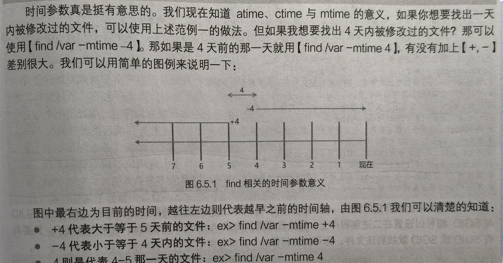
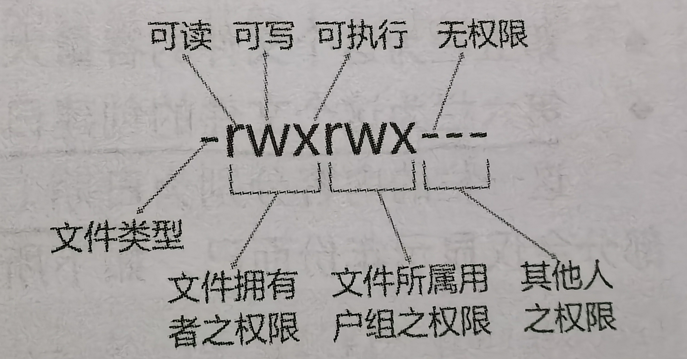
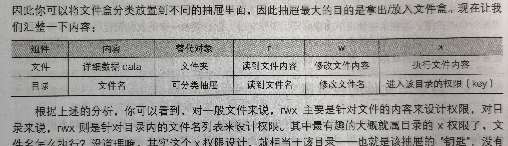
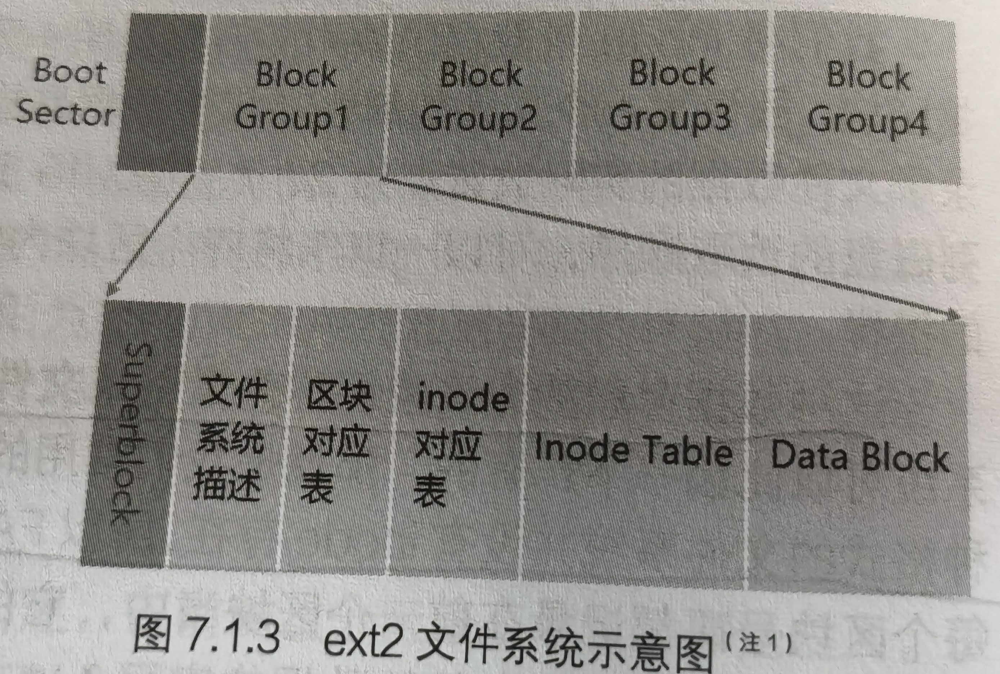

# 命令和解析

## 帮助信息

### man page

man page数据放在/usr/share/man目录里

查询数据后数字

| 代号 | 代表内容                                        |
| ---- | ----------------------------------------------- |
| 1    | **用户在shell环境中可以操作的命令或可执行文件** |
| 2    | 系统内核可调用的函数与工具等                    |
| 3    | 一些常用的函数与函数库，大部分为c的             |
| 4    | 设备文件的说明，通常在/dev下                    |
| 5    | **配置文件或者是某些文件的格式**                |
| 6    | 游戏                                            |
| 7    | 协议等                                          |
| 8    | **系统管理员可用的管理命令**                    |
| 9    | 跟内核有关的文件                                |

常用按键（按下/）即可输入

| 按键      | 进行工作                                            |
| --------- | --------------------------------------------------- |
| 空格      | 向下翻一页                                          |
| page down | 向下翻一页                                          |
| page up   | 向上翻一页                                          |
| home      | 去到第一页                                          |
| end       | 去到最后一页                                        |
| /string   | 向下查找                                            |
| ?string   | 向上查找                                            |
| n,N       | 利用/或？查找时可以用n向下继续查找，或N向上继续查找 |
| q         | 结束这次的man page                                  |

| 命令             |                                        |                               |
| ---------------- | -------------------------------------- | ----------------------------- |
| man -f  = whatis | 取得更多信息 ，仅查找完全匹配命令      | 以root权限使用mandb后才可使用 |
| man -k = apropos | 有关键字存在不需要完全相同的就可以查找 |                               |

### info page

与man不同info是把文件数据拆成一个一个段落，并且在各个页面有类似超链接的来跳转到不同的页面中，每个独立的页面叫做节点（node），文件默认放在/usr/share/info/

| 按键      | 进行工作                                 |
| --------- | ---------------------------------------- |
| 空格      |                                          |
| page down |                                          |
| page up   |                                          |
| tab       | 在节点间移动                             |
| enter     | 当光标在节点上面时，按下可进入           |
| b         | 移动光标到该info界面当中的第一处         |
| e         | 移动光标到该info界面当中的最后一个节点处 |
| n         | 前往下一个节点处                         |
| p         | 前往上一个节点处                         |
| u         | 向上移动一层                             |
| s(/)      | 在info page当中进行查找                  |
| h,?       | 显示帮助选项                             |
| q         | 结束这次的info page                      |

### nano

| 按键   | action                         |
| ------ | ------------------------------ |
| ctrl+G | 获得联机帮助文件               |
| +X     | 离开nano若有修改会询问是否保存 |
| +O     | 保存文件                       |
| +R     | 从其他文件读入数据             |
| +W     | 查找字符串                     |
| +C     | 说明当前所在行数列数           |
| +号    | 跳转行号                       |
| +Y     | 语法校验功能                   |
| +M     | 支持鼠标移动光标               |

## 文件查看、查找与目录管理

### pwd

查看当前所在目录

| -P   | 显示出真正路径而非链接路径 |
| ---- | -------------------------- |

### mkdir

创建目录

| -m （权限 目录） | 设置文件权限 |
| ---------------- | ------------ |
| -p               | 递归创建     |

### rmdir

删除空目录

| -p   | 递归删除 |
| ---- | -------- |

### ls

列出目录下的文件

| -a                   | 显示全部文件包括隐藏（开头为.）的文件                        |
| -------------------- | ------------------------------------------------------------ |
| -A                   | 显示全部文件包括隐藏（不包括开头为.）的文件                  |
| -d                   | 仅列出目录本身，而不是目录内的文件数据（目录内的 . )         |
| -f                   | 直接列出结果，不排序                                         |
| -F                   | 根据文件、目录等信息基于附加数据结构，eg.*:可执行文件；/:代表目录；=：代表socket文件；\| ：代表FIFO文件 |
| -h                   | 将文件容量以易读方式显示                                     |
| -i                   | 列出inode号码                                                |
| -l=ll                | 详细信息，包括属性和权限等                                   |
| -n                   | 列出UID与GID而非使用者和用户组                               |
| -r                   | 反向输出排序结果                                             |
| -R                   | 同子目录一起列出                                             |
| -S                   | 以文件容量大小进行排序                                       |
| -t                   | 依时间顺序而不是文件名                                       |
| --color=never        | 不要依据文件特性给予颜色                                     |
| --color=always       | 显示颜色                                                     |
| --color=auto         | 自动设置颜色                                                 |
| --full-time          | 以完整时间模式输出（包括年月日时分）                         |
| --time={atime,ctime} | 输出access时间或改变权限属性时间（ctime），而非修改内容时间（mtime） |

### cp

复制文件，注意如果源文件有两个以上则最后一个目标文件一定时目录才可以复制。

| -a             | 相当于-dr                                                |
| -------------- | -------------------------------------------------------- |
| -d             | 若源文件为链接文件的属性，则复制链接文件属性而非文件本身 |
| -f             | 强制                                                     |
| -i             | 若目标文件存在，则询问是否覆盖                           |
| -l             | 进行硬链接，而非复制文件本身(hlink)                      |
| -p             | 连同属性（权限用户时间）一起复制过去（备份用）           |
| -r             | 递归                                                     |
| -s             | 复制成为符号链接文件（快捷方式slink）                    |
| -u             | 所复制文件比存在文件新才可以（更新），或无文件存在       |
| --preserve=all | 全属性（selinux,links,xattr)                             |

### rm

删除文件，

| -f           | 忽略不存在的文件，不出现警告                                 |
| ------------ | ------------------------------------------------------------ |
| -I           | 交互模式，询问                                               |
| -r           | 递归删除，前面加上 \rm 可以忽略掉alias（别名命令）的指定选项，即递归删除的询问 |
| 避过首位字符 | 加上本目录“./”                                               |

### mv

移动文件与目录或者**重命名**

| -f   | 强制，不会询问直接覆盖                                       |
| ---- | ------------------------------------------------------------ |
| -i   | 询问                                                         |
| -u   | 若目标文件存在且源文件较新才会更新，可测试新旧文件，看是否需要移动 |

### cat/tac

直接查看一个文件，由第一行开始显示/倒着开始显示

| -A   | -vET的整合，即列出特殊字符和一些符号       |
| ---- | ------------------------------------------ |
| -b   | 列出行号，仅针对非空白行显示，空白行不显示 |
| -E   | 将皆为的换行符以$显示                      |
| -n   | 打印处行号，空白行也会显示                 |
| -T   | 将tab以^I形式打印出来                      |
| -v   | 列出一些看不出来的特殊字符                 |

### nl

添加行号答应

| -b   | -b a不论是否为空行同样列出行号         |
| ---- | -------------------------------------- |
|      | -b t 如有空行，空行不列出行号          |
| -n   | -n ln 行号在屏幕最左方显示  12000      |
|      | -n rn行号在最右方显示且不加0  0200=200 |
|      | -n rz行号在最右方显示且加0 0020        |
| -w   | 行号栏的位数                           |

### more

一页一页翻动查看

| space     | 向下翻一页                                                |
| --------- | --------------------------------------------------------- |
| enter     | 向下翻一行                                                |
| /字符串   | 在显示内容中，向下查找字符串的这个关键词，，查找下一个按n |
| ：f       | 立刻显示出文件名和目前显示的行数                          |
| q         | 立刻离开                                                  |
| b或ctrl-b | 往回翻页，只对文件有用对管道无用                          |
| 输入/     |                                                           |

### less

一页一页翻动

| space    | 向下翻动一页                      |
| -------- | --------------------------------- |
| pagedown | 向下翻动一页                      |
| pageup   | 向上翻动一页                      |
| /字符串  | 向下查找字符串的功能              |
| ？字符串 | 向上查找字符串功能                |
| n        | 重复前一个查找（与/或？有关）     |
| N        | 反向重复前一个查找（与/或？有关） |
| g        | 前进到这个数据的第一行            |
| G        | 前进到这个数据的最后一行          |
| q        | 离开                              |

### head

取出文件前几行

| -n   | 后跟数字，代表显示几行 eg. head -n 100 显示前100行； head -n -100 显示除后面100行的行 |
| ---- | ------------------------------------------------------------ |

### tail

取出后面几行

| -n   | 后跟数字，代表显示几行                                       |
| ---- | ------------------------------------------------------------ |
| -f   | 持续刷新显示后面所接文件中的内容  eg. tail -n +100 显示100行以后； tail -n -100 显示除后面100行的行 |

### od

查看非文本文件，默认按照int读取数字

| -t   | a       | 默认字符输出      |
| ---- | ------- | ----------------- |
|      | c       | 使用ASCLL字符输出 |
|      | d[size] | 十进制            |
|      | f[size] | 浮点              |
|      | o[size] | 八进制            |
|      | x[size] | 十六进制          |

eg.    echo passwd | od -t oCc 释：查找passwd这几个字的ascll对照，oC表示八进制输出每个整数一个按照char来截取

### file

想知道某个文件的基本信息，和有没有使用到动态链接库等信息。

eg. file  /root/.bashrc

​		/root/.bashrc:ASCII text 告诉我们是ASCII是纯文本文件

### which

查找执行文件，查找完整文件名，注意京仅可以找PATH中的命令，以外的找不到

| -a   | 将所有由PATH目录中可以找到的同名命令均列出，不止第一个被找到的命令 |
| ---- | ------------------------------------------------------------ |

### whereis

由一些特定的目录中查找文件,主要针对/bin/sbin下的执行文件，以及/usr/share/man下的manpage等几个特定的文件

| -l   | 列出whereis会去查询的几个主要目录    |
| ---- | ------------------------------------ |
| -b   | 只找二进制格式的文件                 |
| -m   | 只找在说明文件manul路径下的文件      |
| -s   | 之找source源文件                     |
| -u   | 查询不在上述三个项目中的其他特殊文件 |

### locate 

仅查找已经建立的数据库/var/lib/mlocate/（updatedb可以更新）里面的数据，数据库建立每天默认建立一次。

updatedb：依据/etc/updatedb.conf的设置去查找系统硬盘内的文件，并更新数据库。

| -i   | 忽略大小写的差异                                             |
| ---- | ------------------------------------------------------------ |
| -c   | 不输出文件名，仅计算找到的文件数量                           |
| -l   | 仅输出几行的意思                                             |
| -S   | 输出locate所使用的数据库文件的相关信息，包括该数据库记录的文件/目录数量等 |
| -r   | 后面可以接正则表达式的显示方式                               |

### find

| 与时间有关               | -mtime n                                                 | n为数字，即在n天之前的（一天之内）被修改过的文件内容         |
| ------------------------ | -------------------------------------------------------- | ------------------------------------------------------------ |
|                          | -mtime +n                                                | 列出在n天前（不包含n天本身）被修改过内容的文件               |
|                          | -mtime -n                                                | 列出在n天内（包含n天本身）被修改过内容的文件                 |
|                          | -newer file                                              | file为一个存在的文件，列出比这个还要新的文件                 |
| 与使用者或用户组名称有关 | -uid n                                                   | n为数字，这个数字是使用者账号id，即uid，记录在/etc/passwd里面 |
|                          | -gid n                                                   | n为数字，这个数字是用户组名称id，即gid，记录在/etc/group里面 |
|                          | -user name                                               | name为使用者账号名称                                         |
|                          | -group name                                              | name为用户组名称                                             |
|                          | -nouser                                                  | 查找文件的拥有者不在/etc/passwd                              |
|                          | -nogroup                                                 | 查找文件的拥有用户组不在/etc/group的文件                     |
| 与文件权限及名称有关     | -name filename                                           | 查找文件名为filename的文件                                   |
|                          | -siize [+-]SIZE                                          | 查找比size还要大（+）或小（-）的文件；size（c代表bytes;k 1024B） |
|                          | -type TYPE                                               | 查找文件类型为TYPE的文件（正规文件f；设备文件b，c；目录d；链接文件l；socket s；fifo p等 |
|                          | -perm mode                                               | 查找文件权限刚好等于mode的文件，mode类似于chmod的值          |
|                          | -perm -mode                                              | 查找文件权限必须全部包括mode的权限的文件，mode类似于chmod的值 |
|                          | -perm /mode                                              | 查找文件权限包含任一mode的权限的文件，mode类似于chmod的值    |
| 额外                     | -exec command                                            | command为其他命令，-exec后面可以在接额外的命令来处理查找到的结果 |
|                          | -print                                                   | 将结果打印到屏幕上，该操作为默认操作                         |
|                          | eg.find /usr/bin /usr/sbin -perm /7000 -exec ls -l {} \; | {}代表由find找到的内容及结果放到这个里面； -exec一直到\；是关键词，代表find额外操作的开始（-exec）到结束（\；），在中间的就是find命令内的额外操作 ；在bash下有特殊意义，使用\来转义 |

### touch

创建文件,改变时间

| 修改时间（modification time,mtime） | 内容数据即文件内容变更会改变该数字                   |
| ----------------------------------- | ---------------------------------------------------- |
| 状态时间（status time,ctime）       | 文件状态改变，即权限或者属性被改变了就会改变这个时间 |
| 读取时间（access time,atime)        | 当文件的内容被读取就会改变这个时间                   |

| -a   | 仅自定义atime;                                               |
| ---- | ------------------------------------------------------------ |
| -c   | 仅修改文件的时间，若该文件不存在则不会新建文件               |
| -d   | 后面可以接自定义的日期而不用目前的日期，也可以用--date=“日期或者时间” |
| -m   | 仅修改mtime                                                  |
| -t   | 后面可以接自定义的时间而不用目前的时间，格式为[YYYYMMDDhhmm] |

# 文件权限与目录配置

chgrp:修改用户组 （账号 用户组 文件） chown:修改拥有者 （账号  拥有者:用户组  文件或目录）  

chmod：修改文件权限 （权限 文件或目录）

### 文件类型

”d “目录

“-” 常规文件：纯文本文件、二进制文件、数据文件

”|“ 链接文件(类似快捷方式)

“b“ 设备文件里面的可供存储的周边设备：区块设备文件eg.硬盘和软盘

”c"设备文件里的串行端口 eg.鼠标

“s”数据接口文件（sockets）：用于网络上数据交换

"p"（FIOFO）：解决多个程序同时读写一个文件造成的错误

### 文件与目录权限

r：读取；对一个目录为可查询目录下文件名数据

w：编辑，修改（但不含删除）；对目录表示可以建立、删除、改名、移动已经存在的文件或目录，

x：可被系统执行，跟文件名无关；对于目录能否进入该目录

	默认权限与隐藏权限（用chattr设置，lsattr查看)

### umask

文件默认权限，默认以四组数字显示，第一个数字为**特殊权限**（用chattr设置），这些数字时该默认权限需减去的权限

若用户建立为文件系统默认没有可以执行（x）权限；使用umask后（-rw-rw-rw-) - (-----w--w-) ==>-rw-r--r--

若用户建立为目录系统默认权限全部开放；使用umask后(drwxrwxrwx) -(d----w--w-) ==> drwxr-xr-x

| -S   | 以符号形式显示处默认权限 |
| ---- | ------------------------ |

### chattr

设置文件隐藏属性

| +    | 增加某一个特殊参数                                           |
| ---- | ------------------------------------------------------------ |
| -    | 删除某一个特殊参数                                           |
| =    | 直接设置参数，且仅有后接的参数                               |
| A    | 若存取此文件或目录时，存取时间将不会被修改，可以避免i/o较慢的机器过度读写磁盘 |
| S    | 一般文件时非同步写入磁盘，加上这个时就会同步写入             |
| a    | 设置后这个文件将**只能增加数据**，而不能删除也不能修改数据，只有root可以设置 |
| c    | 设置后会将文件自动压缩，在读取时自动解压，在存储时会进行压缩再存储对大文件有用 |
| d    | 当dump被执行时，设置了该权限的文件或目录不会被备份           |
| i    | 可以**让一个文件不能被删除、改名、设置连接也无法写入和数据新增**，只有root可以设置 |
| s    | 文件被删除则将会完全从硬盘中删除，误删则无法恢复             |
| u    | 与s相反，文件删除后数据内容还存储在硬盘中，可以用来回复文件  |

### lsattr

显示隐藏文件

| -a   | 将隐藏文件的属性也显示出来                             |
| ---- | ------------------------------------------------------ |
| -d   | 如果接的是目录，仅列出目录本身的属性而非目录内的文件名 |
| -R   | 连同子目录数据也列出来                                 |

### 文件特殊权限

大写S和T代表原来该位权限为空。可以用符号法设置也可以用数字法设置

| Set UID=SUID(s出现再文件拥有者的x权限上)      4      s+u     | 仅对二进制文件有效，（不能用于shell，shell是调用很多二进制程序）； 执行者对该程序需要拥有x的可执行权限； 本权限仅再执行该程序的过程中有效； 执行者将具有该程序拥有者的权限； |
| ------------------------------------------------------------ | ------------------------------------------------------------ |
| Set GID=SGID(s出现在用户组的x权限上)        6       s+g      | 对二进制程序： 程序执行者对于该程序来说需要具备x权限 执行者在执行的过程中将会获得该程序用户组的支持 对目录： 用户若对于此目录具有r于x的权限时，该用户可以进入此目录 用户在此目录下的有效用户组将会变成该目录的用户组 若用户在此目录下具有w权限（可以新建文件），则用户所建立的新文件，该新文件的用户组与此目录的用户组相同 |
| Sticky Bit=SBIT(t出现在其他人的x权限上；粘滞位)       7     o+t | 仅对目录有效： 当用户对于此目录具有x、w权限，即具有写入的权限； 当用户在该目录下建立文件或目录时，仅有自己与root才有权力删除该文件 |

### linux目录

绝对路径：由根目录开始的路径写法（是/开头）

相对路径：相对于当前路径的写法（不是/开头）

“  .  ”表示当前目录

”  ..  "表示上一层目录

# linux磁盘与文件系统管理

磁盘分区后需要格式化（format）让其成为操作系统可用的文件系统格式（FAT,NTFS,ext2)

LVM和RAID可用将一个分区格式化为多个文件系统，也可将多个分区合为一个文件系统。

## 文件系统存放：

- 超级区块：记录此文件系统的整体信息，包括inode与数据区块的总量、使用量、剩余量以及文件系统的格式与相关信息。
- inode：记录文件的属性，一个文件占用一个inode，同时记录此文件的数据所在的
- 数据区块：实际记录文件的内容，找到inode就可以找到这个。

## 索引式文件系统

通过inode找出实际文件存放点，然后读取

## 顺序读取文件系统（FAT）

一般u盘使用，系统会依据顺序读取，所以需要碎片整理，否则太过离散会影响性能。

## ext2

使用以inode为基础的linux文件系统。

文件系统一开始就将inode于数据区块规划好，固定后不在改动。

ext2文件系统格式化的时候是区分为多个区块和群组（block group）。

整体规划：

文件系统最前面有一个启动扇区（boot sector)，此启动扇区可用安装引导程序。

每个区块群组的六个主要内容：

1.数据区块（data block)：用来放置文件数据的地方，在ext2

文件系统中所支持的区块大小有1K\2K\4K,在格式化时候区块大小就确定了，且每个区块都有编号，方便inode记录。每个区块仅容纳一个文件，如果每个文件较小却用大区块则会浪费内存。

2.inode table（inode表）

该文件的读写属性(r,w,e);

该文件的拥有者于用户组( owner 、group);

该文件的大小；

该文件建立或状态改变的时间（ctime）；

最近一次的读取时间（atime）；

最近修改的时间（mtime）；

定义文件特性的标识（flag）；

该文件真正内容的指向（pointer）；

每个inode大小均固定为128b（ext4于xfs可用设置256b）

每个文件会占用一个inode；

系统读取文件时需找到inode并分析inode所记录的权限与用户是否符合，若符合才能够读取区块的内容；

3.Superblock(超级区块)

记录整个文件系统相关信息

数据区块于inode数量

未使用与已使用的inode与数据区块数量

数据区块与inode的大小1（block为1、2、4k，inode为128b或256b）；

文件系统的挂在时间、最近一次写入数据的时间、最近一次检验磁盘（fsck）的时间等文件系统的相关信息；

一个有效位数值，若此文件系统已被拦截，则有效位为0、若未被挂载，则有效位为1；

4.filesystem Description(文件系统描述说明)

用于描述每个区块群组的开始与结束的区块，以及说明每个区段(超级区块、对照表、inode对照表、数据区块)分别介于哪一个区块之间

5.inode对照表

记录使用与未使用的inode号码

6.dumpe2fs：查询ext系列超级区块信息的命令

## 目录树

挂载就是利用一个目录作为磁盘的进入点，把磁盘文件放置到目录下。挂载点的目录的子目录的文件都保存在该挂载点目录。目录树从/开始，所以/一定要挂载一个分区

设置多个挂载点的意义：分开频繁读写和不经常读写的文件，防止产生坏道破坏该挂载点

# 文件的压缩

## gzip

可用解开compress\zip\gip，压缩文件为.gz

| -c   | 将压缩数据输出到屏幕                  |
| ---- | ------------------------------------- |
| -d   | 解压                                  |
| -t   | 可用用来检验一个压缩文件的一致性      |
| -v   | 显示出源文件/压缩文件的压缩比等信息   |
| -#   | 代表数字-1~-9压缩率越高时间越长默认-6 |

zcat/zmore/zless可用读取纯文本文件被压缩后的压缩文件

## bzip2

替换gzip提供更佳的压缩比

| -c   | 将压缩的过程产生的数据输出到屏幕上      |
| ---- | --------------------------------------- |
| -d   | 解压缩的参数                            |
| -k   | 保留原始文件，而不会删除源文件          |
| -z   | 压缩的参数（默认                        |
| -v   | 可用显示出源文件/压缩文件的压缩比等信息 |
| -#   | 同gzip                                  |

bzcat/bzmore/bzless/bzgrep

## xz

时间比gzip久

| -d   | 解压                 |
| ---- | -------------------- |
| -t   | 测试压缩文件完整性   |
| -l   | 列出压缩文件相关信息 |
| -k   | 保留源文件           |
| -c   | 将数据在屏幕上输出   |
| -#   | 同前                 |

xzcat/xzmore/xzless/xzgrep

## tar

可以将多个文件/目录打包便于压缩

| -c        | 建立打包文件                                           |
| --------- | ------------------------------------------------------ |
| -t        | 查看打包文件中的文件名                                 |
| -x        | 解包或解压缩搭配大C在特定目录解压                      |
| -z        | 通过gzip压缩或解压文件名填.tar.gz                      |
| -j        | 通过bzip2压缩或解压.tar.bz2                            |
| -J        | 通过xz压缩或解压.tar.xz                                |
| -v        | 再压缩或解压过程中将待处理文件名显示出来               |
| -f        | 后接处理文件夹名称                                     |
| -C        | 指定特定文件夹解压                                     |
| -P（大    | 保留绝对路劲，允许备份数据含有根目录                   |
| -p        | 百六本分数据原本的权限和属性，常用于备份重要的配置文件 |
| --exclude | 打包目录而不包含目录下的某文件                         |

常用

压缩：tar (-j/z/J)cv -f filename.tar.bz2/gz/xz

查询：tar（-j/z/J)tv -f filename.tar.bz2/gz/xz

解压缩:tar (-j/z/J)xv -f filename.tar.bz2/gz/xz

# 杂

## $PATH

​	环境变量，由目录组成“；”分割，且有顺序之分

添加环境变量：PATH="${PATH}:目录"

注：

1. 不同身份用户默认PATH不同，默认可执行命令也不同
2. PATH可修改
3. 使用绝对路径或相对路径直接指定某个命令的文件名来执行，会比查找PATH来的正确；
4. 本目录  .  最好不要放到PATH中
5. 命令要放到正确目录下执行才方便
6. 命令执行顺序与填写环境变量顺序有光
