# storage
## 基础知识

### 数据

•数据是指所有能输入到计算机并被计算机程序处理的符号，是用于输入计算机进行处理，具有一定意义的数字、字母和符号等的通称。

•DAMA对数据的定义：数据是以文本、数字、图形、图像、声音和视频等格式对事实进行表现。

DAMA是指The Global Data Management Community，即国际数据管理协会。

#### 数据种类

##### 结构化数据

•结构化数据

▫可以使用关系型数据库表示和存储，常表现为二维表。

▫SQL server，MySQL，Oracle。

##### 半结构化数据

•半结构化数据

▫不符合关系型数据库或其他数据表的形式，但使用相关标记分隔语义元素、或对记录和字段分层。

▫XML，HTML，JSON。

##### 非结构化数据

•非结构化数据

▫数据结构不规则或不完整，没有预定义的数据模型。

▫文本、图片、各类报表、图像和音频/视频信息。

现在大约又80%的数据时非结构化数据

#### 数据处理周期

### 信息

信息是已经被处理、具有逻辑关系的数据，是对数据的解释。

信息是经过处理的数据，其中包括具有上下文，相关性和目的的数据。

##### 信息的生命周期

•数据创建阶段：数据从终端产生并保存到存储设备。

•数据保护阶段：信息生命周期管理将按照数据和应用系统的等级，采用不同的数据保护技术， 以保证各类数据和信息得到及时有效的保护。存储系统会提供数据保护功能，如RAID、HA、容灾和权限管理。

•数据访问阶段：信息必须便于访问，可以在企业的多个业务环节和业务应用之间共享，以提供最大限度的业务价值。

•数据迁移阶段：IT设备使用过程中，经常需要设备升级和替换，设备中的数据需要从旧设备迁移到新的设备中。

•数据归档阶段：数据归档系统可以从多个方面支持企业的业务运作，提供交易和决策记录查询。数据的重删压缩功能常会应用在此场景中。

•数据销毁阶段：数据在一段时期后，没有再继续保存的价值。对没有必要保留或保存的数据进行销毁或回收，从存储，以及数据仓库中清除。

### 数据存储系统

•存储技术不是一个单独而孤立的技术，实际上，完整的存储系统应该是由一系列组件构成。

•存储系统分为存储硬件、存储软件以及存储解决方案。硬件部分又分为存储设备和连接设备，主要是指存储设备和存储网络连接设备，比如磁盘阵列、磁带库和FC交换机等。存储软件使存储设备的可用性得到了大大的提高，数据的镜像、复制、自动的数据备份等数据操作都可以通过对存储软件的控制来完成。

#### 存储的结构

•一个单一的存储设备包括硬盘子系统、控制子系统、连接子系统和存储管理软件子系统四大部分。

•存储从物理结构上来看，底层主要是磁盘，其通过相关的连接件如光纤线、串口线等，与存储的内部后端卡和控制器相连。

•存储通过前端板卡与存储网络交换设备连接为主机提供数据访问服务。

•存储管理的软件是用于配置、监控和优化存储内部的众多子系统和连接件。

### 存储的发展

#### 存储架构的发展

•存储架构的发展历程经历了传统存储、外挂存储、存储网络、分布式存储和云存储几个阶段。

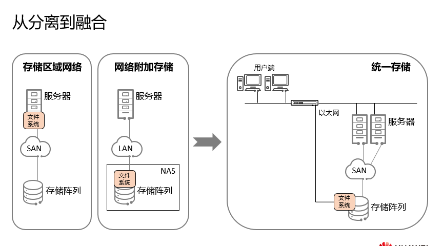

##### 传统存储（1950）

•传统存储是由单硬盘组成，1956年IBM发明了世界上第一块机械硬盘，这个硬盘有50个24英寸盘片，容量只有5MB。体积与两台冰箱差不多大，重量超过一吨。被用于当时的工业领域，且独立于主机以外。

•硬盘在服务器内部时存在的问题：

▫槽位有限，容量不足；

▫单盘存放数据，可靠性差；

▫硬盘成为系统性能瓶颈；

▫存储空间利用率低；

▫数据分散，存储在不同服务器本地。

##### 外挂存储（1980）

•外挂存储即直连存储，最早的形态是JBOD，仅仅是将一些磁盘串联在一起，被称为JBOD（Just a Bunch Of Disks，磁盘簇），主机看到的就是一堆独立的硬盘，只增加了容量，无法提供安全保障。

•JBOD的出现一定程度上解决了槽位有限的问题，后续RAID技术的出现则帮助解决了可靠性和性能的问题。随着时间的发展，外挂存储渐渐发展为存储阵列带有控制器，控制器中包含Cache，支持RAID（Redundant Arrays of Independent Disks，冗余独立磁盘阵列）功能，可以配置专用管理软件，主机看到的是一块大的、高性能的、有冗余特性的硬盘。

##### 存储网络（1990）

•SAN是典型的存储网络，主要使用FC网络传输数据，随后出现了IP存储区域网络。

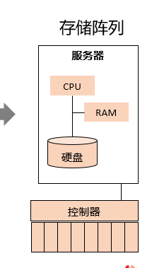

•DAS（Direct-Attached Storage，直连式存储）的特点：

▫数据分散

▫存储空间利用率低

•存储发展需求：

▫数据共享

▫提升资源利用率

▫距离延长

•网络的出现给存储带来了新的生机

▫SAN（Storage Area Network，存储区域网络）：在存储设备与服务器之间组成网络，主要提供块存储服务。san提供给主机的是一块没有建立文件系统的裸磁盘，在上面建立什么文件系统完全取决于主机的操作系统

▫NAS（Network Attached Storage，网络附加存储）：使用网络连接服务器与带有文件系统的存储，主要提供文件存储服务。

•2011年左右，支持SAN和NAS多协议的统一存储迅速成为热点，融合的趋势再次出现：通过整合降低成本，将NAS和SAN结合起来，同时提供数据库与文件共享服务，简化存储管理，提高存储利用率。

##### 分布式存储、云存储（本世纪）

•分布式存储采用通用服务器硬件构建存储资源池，更适合云计算的场景。

•传统架构扩展能力和灵活性有限。

•分布式存储架构：

▫通用硬件、架构统一、存储和网络不被绑定；

▫性能、容量线性扩展，目前可达数千个节点；

▫资源弹性伸缩，利用率高。

•在物理存储系统和服务器之间增加一个虚拟层，它管理和控制所有存储并对服务器提供存储服务。

•存储硬件的增减、调换、分拆、合并对服务器完全透明。

•作用：

▫隐藏物理设备复杂度；

▫集成使用现有的功能；

▫摆脱物理容量的局限。

•通过集群应用、网格技术或分布式文件系统等功能，将网络中不同类型的存储设备通过应用软件集合起来协同工作，共同对外提供数据存储和业务访问功能。

#### 硬盘的发展
##### 机械硬盘的发展

•机械硬盘的发展：

▫1970年到1991年间，硬盘盘片的存储密度以每年25%到30%的速度增长；

▫1991年开始，以每年60%到80%的速度增长；

▫从1997年开始以100%甚至200%的惊人速度提升，这得益于IBM的GMR（Giant Magneto Resistive，巨磁阻）技术，它使磁头灵敏度进一步提升，进而提高了储存密度。

•IBM 1301：使用空气轴承消除了摩擦力，容量达到了28MB。

•IBM 3340：被装进了盒子，容量达到了30MB，恰好是当时的“温彻斯特来福枪”的口径和填弹量，因此也被称为“温彻斯特”。

•1992年，1.8寸HDD诞生。

##### 固态应硬盘的发展

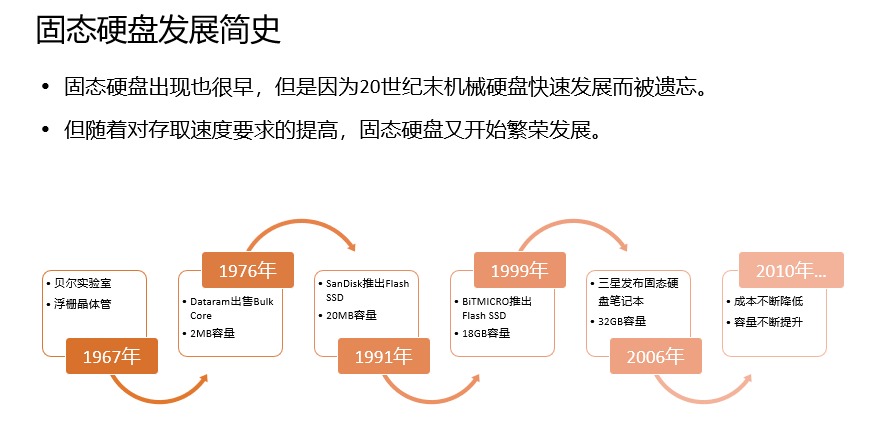

•浮栅晶体管，Floating Gate Transistor：由韩裔科学家姜大元和华裔科学家施敏一起发明，是NAND Flash技术的基础。

•Bulk Core：介质使用的是RAM，2MB，8块大电路板，每个板子有18个256K的RAM。

###### 闪存介质的发展

•介质发展趋势

▫容量更大，速度更快。

▫闪存介质空间持续扩大。

•SCM，Storage Class Memory非易失性存储

▫读写快

▫能耗低

▫寿命长

#### 接口协议发展

•接口的作用是在硬盘缓存和主机内存之间传输数据；不同的硬盘接口决定着硬盘与控制器之间的连接速度。

•在整个系统中，硬盘接口的性能高低对磁盘阵列整体性能有直接的影响。

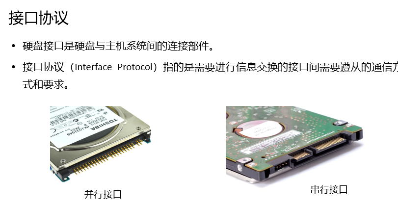

•存储协议一方面是传输速率的提升，另一方面随着介质从机械硬盘发展到固态存储，协议从SCSI演进到NVMe，包括基于PCIe的NVMe协议和前端接主机网络的NVMe over Farbic（NVMe-oF）协议。

•NVMe Over Fabric（简称NVMe-oF）借助RDMA等超低延时的传输协议，可远程访问SSD，解决了下一代数据中心在横向扩展 (Scale-Out) 时所遭遇的性能、功能、容量三者之间难以取舍的权衡问题。

•最初NVMe-oF规范发布于2016年，它支持通过光纤通道（Fibre Channel）和远程直接内存访问（RDMA），在RDMA协议框架下，InfiniBand支持融合以太网和广域Internet RDMA协议。

•2018年11月发布的NVMe-oF1.1规范中，添加了TCP作为架构选项，即RoCE（RDMA over Converged Ethernet），不需要缓存，CPU可直接访问硬盘。

##### 并行传输

效率高，会干扰，线缆长度限制

##### 串行传输

##### 华为存储产品的发展

### 计算机中的存储主要分为两类

- non-volatile memory是指即使对计算机停止供电，所有的数据依然能够保存下来的memory。（非挥发性记忆体）;( ROM, NAND Flash, NOR Flash和SSD)
- volatile memory是指必须无时无刻给计算机供电才能保存数据的memory。（挥发性记忆体）;(SRAM, DRAM)

综上所述===>   non-volatile  <(speed)  volatile memory

#### non-volatile memory

##### ROM
（Read Only Memory, 唯读记忆体）

理论上，ROM只能写入一次，然后就只能读取。这种memory一般被在硬件中，固定下来最底层的硬件执行逻辑或驱动，然后无法更改。这就是我们常说的“刻在电路板上的程序”。用户无法更改内部的特性，一定程度上保证了硬件不会被破坏。开机程序和BIOS就是写在这种memory里的。

但是完全只能写一次的ROM容错率太低。于是发展出了几个版本：

###### **PROM**
（Programmable Read Only Memory, 可程式唯读记忆体)

又名OTP（One-Time Programmable) ROM（**一次编程唯读记忆体**）。操作者能够对其进行**一次修改**，然后所有的性质都与ROM相同。

###### EPROM 
（Erasable Programmable Read Only Memory, 可擦可程式唯读记忆体）

当该记忆体中的IC package暴露在特定的紫外线下一定时间后，memory中的所有数据就会被擦除。然后它的所有性质都和PROM相同。

###### EEPROM 
（Electrically Erasable Programmable Read-Only Memory，带电可擦可程式唯读记忆体）

不需要像EPROM一样用紫外线进行擦除，EEPROM可以用电进行数据清除并重写。这大大简化了重构的过程。现在大多数电脑中使用的ROM是EEPROM。

EEPROM**清除和重写的次数十分有限**，并不适合做需要不断修改的存储。

##### Flash Memory

Flash memory是根据Floating Gate Technology(FGT)制作的memory。它**可以直接以电子的方式进行写入和修改。相比较EEPROM而言有着更多的写入次数且更廉价。**

Flash 的存储结构一般是 block->page->byte。**每次擦除必须要擦除整个block**。读取的大小视类别而定，如果闪存类型是NAND，则每次读取一个page。如果类型是NOR，则每次读取一个block。

存储介质：

slc\mlc\tlc\qlc

从数电课上我们知道，对于多个电子元件，我们可以用不同的逻辑门将其连接。工程师们在设计闪存的时候发现有两种可行的连接存储单元的方式：与非门(NOR)，或非门(NAND)

###### NOR Flash

NOR Flash有着**更快的读取速度**，相对而言更不容易出错，而且**支持随机地址读取和写入**（random access）。随机地址读取指的是给定一个地址，我们可以直接得知这个地址上存储单元的数据（你没有看错，这个性质并不是所有memory都应该有的基本素养）。这一点是由NOR Gate的性质决定的：只有bit line和word line都是0的时候才会assert当前地址的存储单元，从而读取数据。感兴趣的同学可以自行查阅电路图。

**NAND Flash的写入速度则比NOR Flash快很多**，而且价格较低。

随机地址读取和写入给了NOR Flash一个重要的性质：execute in place（）。如果你继续往下读的话，就会看到很多种memory是不能直接在存储器上运行程序的，因为它们的设计不支持代码的随即跳转（NAND Flash只支持同一page上的跳转，往后看就懂了）。因此**各种驱动等需要直接在memory上运行的程序需要写在支持XIP的memory里，一般都是ROM和NOR Flash。**

###### NAND flash

主要由NAND Flash构成，有着写入次数的限制。

为了缓解写入次数限制，它有一个non-volatile memory的buffer用来存放当前经常更改的数据。所以我们拔掉固态硬盘之前，要先“弹出设备”，这样才能够保证buffer里的数据安全更新到Flash里。如果直接拔会导致数据丢失。

#### volatile memory

##### SRAM

（Static Random Access Memory 静态随机存取存储器）

再次回顾一下，SRAM是**拔掉电源就会丢失数据的存储类型**。它的读写速度远快于上面描述的那几种存储设备，而且**没有读写次数限制**。是做buffer和register的良好选择！

SRAM比DRAM快，但是也更贵。

一般来说，CPU等运算核心的速度是远快于各种存储设备的读写的。为了能够更好的和CPU进行匹配，越靠近核心的内存零件就需要有越快的速度。当然了鱼和熊掌不可兼得，有着更快的速度往往意味着昂贵的价格，所以大规模使用靠近核心的存储设备是不现实的。于是各种存储设备之间就会出现“分层”的现象。**SRAM就是那几乎最靠近CPU的一层**。SRAM非常稳定，只需要通电，不需要任何额外操作就能存储信息。由于DRAM还需要通电给电容充能，所以SRAM比DRAM要快一些。SRAM常用于嵌入式设备的main memory（也就是我们常说的内存。但是PC的一般不用SRAM，手机上用的多），微处理器上的存储，register寄存器，buffer缓存器，cache memory缓冲器。

##### DRAM

（Dynamic Random Access Memory 动态随机存取存储器）

和SRAM不同，DRAM使用的是一个个小电容来存储相应的信息。当电容中有电荷的时候，它所代表的信息就是1，当电容中没有电荷的时候，它所代表的信息就是0。电容和bit line之间有一个MOS晶体管，能够控制通路和断路。

在读取数据的时候，整个行的信息都会被复制到buffer里面。然后会有相应的列地址来导出我们想要的数据。在写入数据的时候，我们也会先允许整行数据的写入，然后再需要改变的列上更改它的0或1。

在写入的时候，bit line中先加载上我们想要写入的数据，然后word line将MOS元件变成通路。这样一来，如果bit line中的数据是0，那么电容中的电荷也就会被导出，自身也变成0，如果bit line中的数据是1，电容中也会被插入电荷，于是自身也变成1。

##### SDRAM

（Synchronous DRAM 同步动态随机存取存储器）

SDRAM是DRAM的进化版。现在市面上已经很难找到单纯的DRAM了，用的一般都是SDRAM。SDRAM有两种读取方式：连续读取和随机读取。连续读取就是先给定一个列地址，然后设备就会连续的依次将这个列地址后面的数据读出来。随机读取就是每次clock都会传入一个新的列地址，然后设备就会按照传入的列地址读取相应的信息。具体方式如上图所示。

### 硬盘的基础知识

#### 硬盘三大类

#####  传统硬盘

（HDD，Hard Disk Drive）

传统硬盘又叫机械硬盘，主要由：盘片，磁头，盘片转轴及控制电机，磁头控制器，数据转换器，接口，缓存等几个部分组成。

磁头可沿盘片的半径方向运动，加上盘片每分钟几千转的高速旋转，磁头就可以定位在盘片的指定位置上进行数据的读写操作。信息通过离磁性表面很近的磁头，由电磁流来改变极性方式被电磁流写到磁盘上，信息可以通过相反的方式读取。硬盘作为精密设备，尘埃是其大敌，所以进入硬盘的空气必须过滤。

•硬盘可以分为单碟盘和多碟盘，前者在盘体内只有一张盘片，后者则有多张。但是硬盘每个时刻只允许一个磁头来读写数据，因此盘片和磁头再多，也不能提高硬盘的吞吐量和IO性能，只能提高容量。

###### 盘片（platter） 磁头（head）

硬盘中一般会有多个盘片组成，每个盘片包含两个面，每个盘面都对应地有一个读/写磁头。受到硬盘整体体积和生产成本的限制，盘片数量都受到限制，一般都在5片以内。盘片的编号自下向上从0开始，如最下边的盘片有0面和1面，再上一个盘片就编号为2面和3面。 如下图：

###### 磁道（track） 扇区（sector） 

下图显示的是一个盘面，盘面中一圈圈灰色同心圆为一条条磁道，从圆心向外画直线，可以将磁道划分为若干个弧段，**每个磁道上一个弧段被称之为一个扇区**（图践绿色部分）。**扇区是磁盘的最小组成单元**，通常是512字节。（由于不断提高磁盘的大小，部分厂商设定每个扇区的大小是4096字节）

扇区地址成为CHS地址，编制顺序时：柱面，磁头，扇区

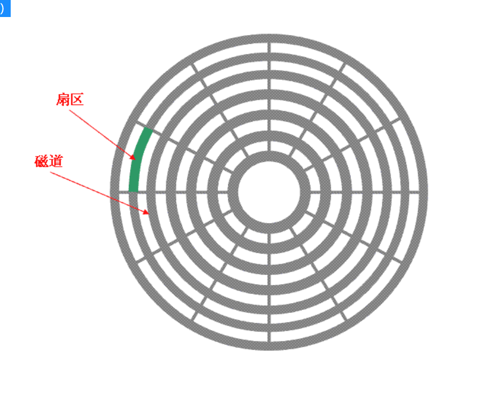

###### 柱面（cylinder）

硬盘通常由重叠的一组盘片构成，**每个盘面都被划分为数目相等的磁道**，**并从外缘的“0”开始编号，具有相同编号的磁道形成一个圆柱，称之为磁盘的柱面。**磁盘的柱面数与一个盘面上的磁道数是相等的。由于每个盘面都有自己的磁头，因此，盘面数等于总的磁头数。 如下图

###### 容量计算

存储容量 ＝ 磁头数 × 磁道(柱面)数 × 每道扇区数 × 每扇区字节数

图3中磁盘是一个 3个圆盘6个磁头，7个柱面（每个盘片7个磁道） 的磁盘，图3中每条磁道有12个扇区，所以此磁盘的容量为：

存储容量 6 * 7 * 12 * 512 = 258048

###### 响应时间

**寻道时间**：磁头从开始移动到数据所在磁道所需要的时间，寻道时间越短，I/O操作越快，目前磁盘的平均寻道时间一般在3－15ms，一般都在10ms左右。 

**旋转延迟**：盘片旋转将请求数据所在扇区移至读写磁头下方所需要的时间，**旋转延迟取决于磁盘转速**。普通硬盘一般都是7200rpm，慢的5400rpm。 

**数据传输时间**：完成传输所请求的数据所需要的时间。

 小结一下：从上面的指标来看、其实最重要的、或者说、我们最关心的应该只有两个：寻道时间；旋转延迟。 读写一次磁盘信息所需的时间可分解为：寻道时间、延迟时间、传输时间。为提高磁盘传输效率，软件应着重考虑减少寻道时间和延迟时间。

###### 块/簇和page

磁盘块/簇（虚拟出来的）。

 **块是操作系统中最小的逻辑存储单位**。操作系统与磁盘打交道的最小单位是磁盘块。

 通俗的来讲，在Windows下如NTFS等文件系统中叫做簇；在Linux下如Ext4等文件系统中叫做块（block）。每个簇或者块可以包括2、4、8、16、32、64…2的n次方个扇区。

操作系统经常与[内存](https://so.csdn.net/so/search?q=内存&spm=1001.2101.3001.7020)和硬盘这两种存储设备进行通信，类似于“块”的概念，都需要一种虚拟的基本单位。所以，**与内存操作，是虚拟一个页的概念来作为最小单位。**与硬盘打交道，就是以块为最小单位。

扇区： 硬盘的最小读写单元 

块/簇： 是操作系统针对硬盘读写的最小单元

page： 是内存与操作系统之间操作的最小单元。

扇区 <= 块/簇 <= page

###### 硬盘的IOPS和传输带宽

IOPS

IOPS (Input/Output Per Second)指每秒的输入输出量(或读写次数)，是衡量硬盘性能的主要指标之一。

IOPS的计算：由寻道时间、旋转延迟和数据传输时间三部分组成。

传输带宽（Throughput吞吐量）

指单位时间内成功传输的数据数量，即传输数据流的速度。例如写入10000个1KB的文件需要10s，则此时传输带宽只达到1MB/s；若写入一个10MB的文件用了0.1s，则此时的传输带宽为100MB/s。

###### 并行和串行

•并行传输：

▫并行传输的传输效率高，但是传输距离不长，传输频率不高；

▫在长距离上，使用多条线路要比使用一条单独线路昂贵；

▫长距离传输要求较粗的导线，以便降低信号的衰减，但把它们捆到一条单独电缆中相当困难；

▫长距离传输时，受导线电阻或其他因素影响，每条线上的数据到达对方的速度不同，从而导致接收方必须等8条线上的所有数字都到达后，才能发起下一轮传送。

▫传输频率太高时，电路高速震荡的时候，数据线之间会产生很大的干扰，因此并行传输的频率不能太高。

•串行传输：

▫串行传输在效率上显然比并行传输低得多，但是可以通过提高传输频率来搞传输速度，总体来说串行传输反而比并行传输的总体速率更快。

▫串行传输用于远距离传输，目前如PCI接口都转向串行传输方式。PCIE接口就是典型的串行传输方式，其单条线路传输速率高达2.5Gb/s。

###### 硬盘的接口技术

##### 固态硬盘

（SSD，Solid State Drive)

又称固盘，是用固态电子存储芯片阵列而制成的硬盘，由控制单元和存储单元组成。在接口的规范和定义、功能及使用方法上与普通硬盘相同，在产品外形和尺寸上也与普通硬盘一致。

•SSD特点：

▫SSD盘并不像传统硬盘那样采用磁性材料来存储数据，而是采用基础单位被称为cell（存储单元）的NAND flash来存储数据。NAND Flash是一种非易失性随机访问存储介质，其特点是断电后数据不消失，这种技术可以很快很紧凑存储数字信息。

▫SSD无高速旋转部件，性能高，功耗低，无噪音。

▫SSD没有内部机械部件，但是，这并不意味着他们的生命周期是无限的。由于NAND Flash是非易失性介质，在写入新数据之前必须擦除原有数据，再写入数据。但是每个cell的擦写次数是有限的，当被擦写次数达到极限，则该cell就不能继续读或写数据了。

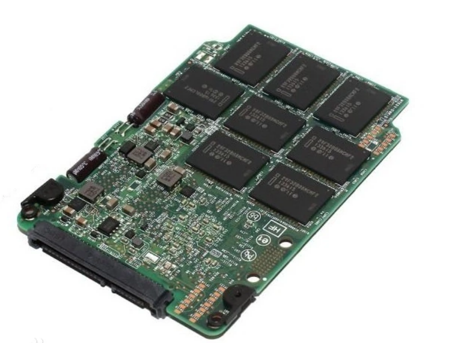

- 优点：读写速度快；防震抗摔性；低功耗；无噪音；工作温度范围大；轻便
- 缺点：容量小；寿命有限；售价高

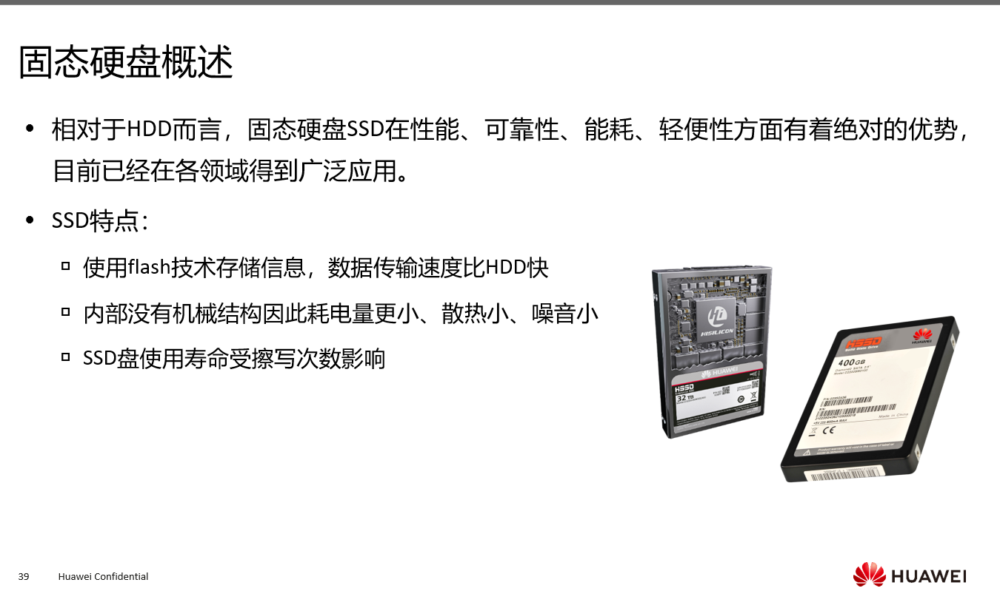

###### 架构

•主机接口：主机访问SSD的协议和物理接口，如SATA、SAS和PCIe。

•SSD控制器：负责主机到后端介质的读写访问和协议转换，表项管理、数据缓存及校验等，是SSD的核心部件。

•DRAM：FTL（Flash translation layer，闪存转换层）表项和数据的缓存，以提供数据访问性能。

•NAND FLASH：数据存储的物理器件，是一种非易失性随机访问存储介质。

•多通道并发，通道内Flash颗粒复用时序。支持TCQ/NCQ，一次响应多个IO请求。

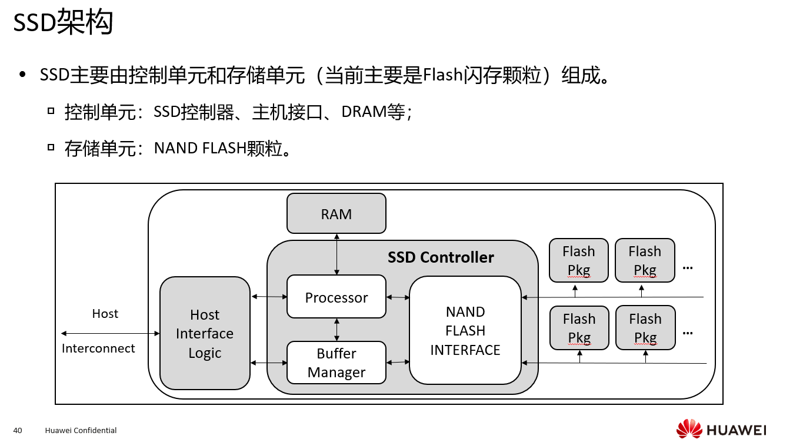

###### NAND Flash

•NAND Flash存储原理：

▫NAND Flash采用浮栅晶体管存储数据，其工作原理是利用浮栅上是否储存有电荷或储存电荷的多少来改变晶体管的阈值电压，通过读取到的晶体管阈值电压来实现数据信息的表征。

•LUN：能够独立封装的最小物理单元，通常包含多个plane。

•Plane：拥有独立的Page寄存器，通常LUN包含1K或2K奇数Block或偶数Block。

•Block：能够执行擦除操作的最小单元，通常由多个Page组成。

•Page：能够执行编程和读操作的最小单元，通常大小为16KB等。

•Cell：Page中的最小操作擦写读单元，对应一个浮栅晶体管，可以存储1bit或多bit。

•编程和读的基本操作单位是Page，擦除的基本单位是Block。

•擦写过程会对浮栅晶体管的绝缘层造成一定程度的损坏，在擦除失败或编程失败后会置操作的Block为坏块，厂商定义当坏块数量达到一定程度（4%以内）的时候，则认为NAND Flash达到使用寿命上限。

###### 地址映射

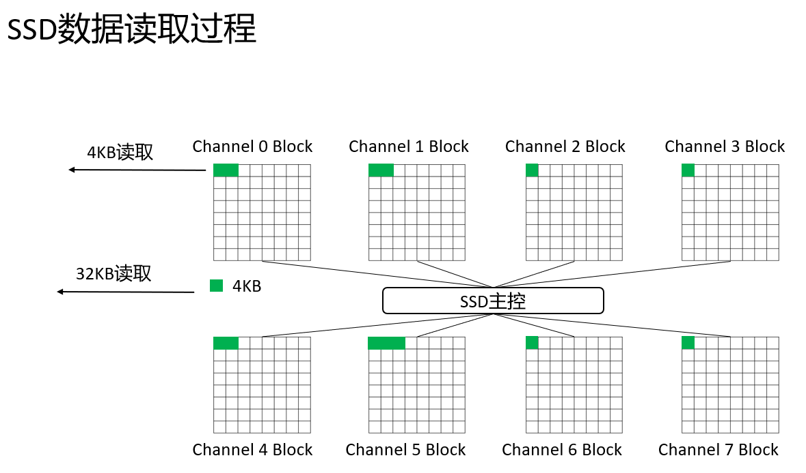

v

##### 混合硬盘

（hybrid hard drive，HHD）

混合硬盘是一块基于传统机械硬盘诞生出来的新硬盘，除了机械硬盘必备的碟片、马达、磁头等等，还内置了NAND闪存颗粒，这颗颗粒将用户经常访问的数据进行储存，可以达到如SSD（就是固态硬盘）效果的读取性能 。

、

硬盘的组成：

## 开放系统存储

### 外挂存储

#### 直连式存储（DAS）

 DAS（Direct Attached Storage）直接附加存储，直接附加存储是指将存储设备通过总线（SCSI、PCI、IDE等）接口直接连接到一台服务器上使用。DAS购置成本低，配置简单，因此对于小型企业很有吸引力。

#### 网络存储（FAS）

##### 网络接入存储（NAS）

[NAS](https://so.csdn.net/so/search?q=NAS&spm=1001.2101.3001.7020)（Network Attached Storage）网络附加存储。在NAS存储结构中，存储系统不再通过I/O总线附属于某个服务器或客户机，而直接通过网络接口与网络直接相连，由用户通过网络访问。

##### 存储区域网络（SAN）

SAN存储 （存储区域网络Storage Area Network）存储区域网络，从名字上亲们也可以看出，这个是通过光纤通道交换机连接存储阵列和服务器主机，最后成为一个专用的存储网络。SAN经过十多年历史的发展，已经相当成熟，成为业界的事实标准（但各个厂商的光纤交换技术不完全相同，其服务器和SAN存储有兼容性的要求）。

san提供给主机的是一块没有建立文件系统的裸磁盘，在上面建立什么文件系统完全取决于主机的操作系统

###### IP-SAN

IP-SAN 是由ISCSI卡存储组成的。SAN是一种将存储设备、连接设备和接口集成在一个高速网络中的技术。SAN本身就是一个存储网络，承担了数据存储任务，SAN网络与LAN业务网络相隔离，存储数据流不会占用业务网络带宽。

###### FC-SAN

面对迅速增长的数据存储需求，企业和服务提供商渐渐开始选择FC-SAN作为网络基础设施，因为SAN具有出色的可扩展性。事实上，SAN比传统的存储架构具有更多显著的优势。例如，传统的服务器连接存储通常难于更新或集中管理。每台服务器必须关闭才能增加和配置新的存储。相比较而言，FC-SAN不必宕机和中断与服务器的连接即可增加存储。FC-SAN还可以集中管理数据，从而降低了总体拥有成本。

## 存储组成

### 存储接口

硬盘上可以看到的插槽类型

主要是SATA和M.2

#### IDE（ATA）

“Integrated Drive Electronics”

即“电子集成[驱动器](https://baike.baidu.com/item/驱动器?fromModule=lemma_inlink)”，它的本意是指把“[硬盘控制器](https://baike.baidu.com/item/硬盘控制器?fromModule=lemma_inlink)”与“盘体”集成在一起的[硬盘驱动器](https://baike.baidu.com/item/硬盘驱动器?fromModule=lemma_inlink)。把盘体与控制器集成在一起的做法减少了硬盘接口的电缆数目与长度，数据传输的可靠性得到了增强，硬盘制造起来变得更容易，因为硬盘生产厂商不需要再担心自己的硬盘是否与其它厂商生产的控制器兼容。对用户而言，[硬盘安装](https://baike.baidu.com/item/硬盘安装?fromModule=lemma_inlink)起来也更为方便。IDE这一接口技术从诞生至今就一直在不断发展，性能也不断的提高，其拥有的价格低廉、兼容性强的特点，为其造就了其它类型硬盘无法替代的地位。

•ATA接口具有以下优缺点：

▫优点： 价格低廉、兼容性非常好； 

▫缺点： 速度慢、只能内置使用、对接口电缆的长度有很严格的限制 

•在当今的许多大型企业中，PATA现有的传输速率已经逐渐不能满足用户的需求。

采用并行传输，速率133mb/s

最多可以接两个硬盘

#### SATA

（Serial ATA）

串行的ATA接口
串行传输协议
速率一般在150MBps—600MBps，一般是6Gb/s
优点：采用点对点连接，支持热插拔，接口采用7+15针，单通道，抗干扰能力比ATA更强
缺点：价格更贵
补充：在数据传输的过程中，数据线和信号线独立使用，并且传输的时钟频率保持独立，因此同以往的PATA相比，SATA的传输速率可以达到并行的30倍。可以说：SATA技术并不是简单意义上的PATA技术的改进，而是一种全新的总线架构。

•在数据传输的过程中，数据线和信号线独立使用，并且传输的时钟频率保持独立，因此与PATA相比，SATA的传输速率可以达到并行的30倍。

•优点：

▫SATA接通常为7+15针，采用单通道，传输速率要比ATA更快。

▫SATA对指令及数据封包采用CRC循环冗余校验技术，保障数据传输可靠性。

▫SATA具有比ATA更好的抗干扰能力。

#### SAS

向下兼容sata

串行的SCSI接口
串行传输协议
优点：点对点，全双工，速度快，支持多个窄端口捆绑形成多个宽端口，扩展性高（一个SAS域最多可以接16384块硬盘，每个扩展器可以最多连接 128 个物理连接，其中包括其它主控连接，其它 SAS 扩展器或硬盘驱动器。）
缺点：价格昂贵

•SAS和Serial ATA(SATA)硬盘相同，都是采用串行技术以获得更高的传输速度，并通过缩短连结线改善内部空间等。

•SAS是并行SCSI接口之后开发出的全新接口，此接口的设计是为了改善存储系统的效能、可用性和扩充性，并且SAS可以向下兼容SATA，二者的兼容性主要体现在物理层和协议层的兼容。

•优点：

▫SAS在传输速率、抗干扰性方面强于SCSI，实现更长的连接距离。

•缺点：

▫SAS接口硬盘价格相对更高

#### NL SAS、

近线sas

将不常用到的或者是数据访问量不大的数据存放在性能较低的存储设备上，但又要求较好的访问性，寻址速度，传输速率高

使用sas接口sata盘是因为sas口快，sata盘便宜

#### SCSI

（Smart Compute System Interface）

“Small Computer System Interface”（[小型计算机系统接口](https://baike.baidu.com/item/小型计算机系统接口?fromModule=lemma_inlink)），是同IDE（ATA）完全不同的接口，IDE接口是普通PC的标准接口，而SCSI并不是专门为硬盘设计的接口，是一种广泛应用于[小型机](https://baike.baidu.com/item/小型机?fromModule=lemma_inlink)上的高速数据传输技术。[SCSI接口](https://baike.baidu.com/item/SCSI接口/493790?fromModule=lemma_inlink)具有应用范围广、多任务、[带宽](https://baike.baidu.com/item/带宽?fromModule=lemma_inlink)大、[CPU](https://baike.baidu.com/item/CPU/120556?fromModule=lemma_inlink)占用率低，以及热插拔等优点，但较高的价格使得它很难如IDE硬盘般普及，因此SCSI硬盘主要应用于中、高端服务器和高档[工作站](https://baike.baidu.com/item/工作站?fromModule=lemma_inlink)中。
优点：适用面广，高性能（多任务，高带宽，CPU占用率低（有独立的芯片负责数据处理）），支持热插拔（SCSI硬盘也有专门支持热拔插技术的SCA2接口(80-pin)）
缺点：价格昂贵，安装复杂

•SCSI英文全称：Small Computer System Interface，它出现的原因主要是因为原来的IDE接口的硬盘转速太慢，传输速率太低，因此高速的SCSI硬盘出现。其实SCSI并不是专为硬盘设计的，实际上它是一种总线型接口，独立于系统总线工作。

•优点：

▫适应面广，在一块SCSI控制卡上就可以同时挂接15个设备 ；

▫高性能（具有多任务、CPU占用率低、转速快及传输率高等特点）；

▫具有外置和内置两种 ，支持热插拔。

•缺点：

▫价格昂贵，安装设置复杂。

主流320mb/s，现640mb/s

采用并行

#### FC

光纤通道的英文拼写是Fiber Channel，和[SCSI接口](https://baike.baidu.com/item/SCSI接口?fromModule=lemma_inlink)一样光纤通道最初也不是为硬盘设计开发的接口技术，是专门为网络系统设计的，但随着[存储系统](https://baike.baidu.com/item/存储系统?fromModule=lemma_inlink)对速度的需求，才逐渐应用到硬盘系统中。光纤通道硬盘是为提高多硬盘存储系统的速度和灵活性才开发的，它的出现大大提高了多硬盘系统的通信速度。光纤通道的主要特性有：[热插拔](https://baike.baidu.com/item/热插拔?fromModule=lemma_inlink)性、高速[带宽](https://baike.baidu.com/item/带宽?fromModule=lemma_inlink)、[远程连接](https://baike.baidu.com/item/远程连接?fromModule=lemma_inlink)、连接设备数量大等。

[光纤通道](https://baike.baidu.com/item/光纤通道?fromModule=lemma_inlink)是为在像服务器这样的多硬盘系统环境而设计，能满足高端[工作站](https://baike.baidu.com/item/工作站?fromModule=lemma_inlink)、[服务器](https://baike.baidu.com/item/服务器/100571?fromModule=lemma_inlink)、海量存储子网络、外设间通过[集线器](https://baike.baidu.com/item/集线器?fromModule=lemma_inlink)、[交换机](https://baike.baidu.com/item/交换机?fromModule=lemma_inlink)和点对点连接进行双向、串行[数据通讯](https://baike.baidu.com/item/数据通讯?fromModule=lemma_inlink)等系统对高[数据传输率](https://baike.baidu.com/item/数据传输率?fromModule=lemma_inlink)的要求。

•FC和SCSI接口一样，最初也不是为硬盘设计开发的接口技术，而是专门为网络系统设计的，但随着存储系统对速度的需求，才逐渐应用到硬盘系统中。

•优点：

▫具有很好的升级性 ，可以用非常长的光纤电缆，可超过10公里；

▫具有非常高的带宽； 

▫具有很强的通用性 。

•缺点：

▫价格非常昂贵； 

▫组建复杂。 

#### M.2

#### PCle

（PCI Experss）

### 总线

#### PCIE 

高速互联总线
优点：采用点对点，全双工方式，每1x为两对差分线，一收一发（1x，2x，4x，8x，16x，32x），最高速度64GB/s，高可靠，树形组网

#### SAS

#### SATA

### 上层协议

#### ATA

（Advanced Technology Attachment）

 AT attachment 是IDE(Integrated Drive Electronics)硬盘的接口标准。包括PIO(Programming I/O)和DMA(Direct Memory Access) 两种传输模式。ATA本身可以支持串行或并行。

高级技术附件
ATA硬盘又称IDE硬盘 并行传输协议”
速率一般在133MB/s
优点：价格低廉，兼容性好
缺点：速度慢，对接口电缆有严格限制（理论最长12m，推荐5m）
补充：一方面，硬盘制造技术的成熟使ATA硬盘的单位价格逐渐降低，另一方面，由于采用并行总线接口，传输数据和信号的总线是复用的，因此传输速率会受到一定的限制。如果要提高传输的速率，那么传输的数据和信号往往会产生干扰，从而导致错误。

#### SCSI

SCSI协议是**主机与存储磁盘通信的基本协议**，DAS使用SCSI协议实现主机服务器与存储设备的互联
SCS协议栈
主机------------------------------------------------------存储磁盘
应用层---------------------------------------------------应用层
传输层---------------------------------------------------传输层
互联层---------------------------------------------------互联层
应用层：SCSI协议采用C/S体系架构，SCSI协议客户端位于主机，代表上层应用程序，文件系统，和操作系统发起IO请求
传输层：SCSI设备之间通过一系列的命令实现数据块的传送，大致分为三个阶段：命令的执行，数据的传输，命令的确认
互联层：完成SCSI设备对总线的连接，以及发送方和目标方的选择功能

SCSI协议寻址
SCSI总线------>设备ID------>逻辑单元号
SCSI总线：区分不同的SCSI总线
设备ID ：区分同一个SCSI总线上的不同设备
逻辑单元号：区分SCSI设备中的子设备（LUN）

SCSI协议传输过程
①总线忙：在开始总线通信之前，总线必须处于空闲状态，启动器设备首先会发一个测试信号来确认总线是否空闲
②寻址：通过发送方和接收方的地址来确认通信双方
③协商：通信双方协商确定后面的数据包大小和传输速度
④连接：数据包的实际传输
⑤断开连接：传输完成，释放总线

侦听-寻址-协商-连接-断开连接

SCSI读写操作过程
①、API接口将用户读写操作转换为SCSI读写操作
②、获得对总线的使用权和对目标方的选择和寻址
③、通过CDB发送SCSI命令
④、在逻辑单元号中执行命令请求的操作
⑤、传输数据
⑥、传输完成后，发送命令完成报告
⑦、接受到目标方命令完成的响应，总线回复到空闲状态
SCSI协议的缺点
①、数据位漂移现象：作为一个总线传输协议，数据会在多根数据线上进行传输，由于总线之间存在串扰，且总线在材质上存在细小的差别，这就会导致同时从发起端发出的数据会在不同的时间到达目标端，我们称之为数据位漂移（漂移窗口，最先到达和最后达到的数据位之间的时间差）
②、SCSI允许连接设备数量较少
③、SCSI连接设备的距离非常有限（由于串扰和信号衰减极其严重，最高支持25米传输距离）
所以产生了iSCSI

先来看下6:0:0:0表示什么意思，
  6表示scsi target设备所属的host->host_no  0表示channel  0表示目标器id  0表示lun

#### ISCSI

iSCSI
iSCSI把SCSI命令和数据块封装在TCP中在IP网络中传输，基本出发点是利用成熟的IP网络技术来实现和延申SAN，为用户提供高速，低价，长距离的存储解决方案
iSCSI节点将SCSI指令和数据封装成iSCSI包，然后该数据封装被传送到TCP/IP层，再由TCP/IP协议将iSCSI包封装成IP协议数据，以适合在网络中传输
iSCSI协议栈
SCSI（应用程序、文件系统、数据块）
SCSI块指令 | SCSI流指令 | 其他SCSI指令
SCSI指令 、数据和状态
iSCSI
TCP
IP
以太网等
iSCSI在此处作为桥梁，连接两种不同协议，承上启下

iSCSI中的目标器和启动器
启动器：发起端，Initiator，发起IO请求
SCSI层负责生成CDB，将CDB传给iSCSI
iSCSI层负责生成iSCSI PDU，并通过IP网路将PDU发给target
目标器：接收端，Target，响应请求并进行实际IO操作
iSCSI层收到PDU，将CDB传给SCSI层
SCSI层负责解释CDB的意义，必要时发送响应
在Initiator和Target建立连接后，Target在操作中作为主设备控制整个过程
iSCSI协议为Initiator和Target定义了一套命令和寻址方法，所有的iSCSI节点都是通过其iSCSI名称被识别的

iSCSI连接方式
①、以太网+软件Initiator
软件Initiatro用于封装SCSI成iSCSI，完成iSCSI报文到TCP/IP报文的转换
Initiator软件可以将以太网卡虚拟为iSCSI卡，接受和发送iSCSI数据报文，从而实现主机和iSCSI设备之间的iSCSI协议和TCP/IP协议传输功能

②、TOE网卡+软件Initiator
硬件TOE网卡可以完成iSCSI报文到TCP/IP报文的转换，该部分不占用主机资源，可以减轻主机负担
与第一种方式相比，采用TOE卡可以大幅度提高数据的传输速率。TCP/IP协议栈功能由TOE卡完成，而iSCSI层的功能仍旧由主机来完成。
由于TOE卡也采用TCP/IP协议，相当于一块高性能的以太网卡，所以第二种方式也可以看做是第一种连接方式的特殊情况。

③、iSCSI HBA卡
iSCSI HBA卡完成SCSI到TCP/IP的转换，完全不占用主机资源

性能：iSCSI HBA卡 > TEO网卡+Initiator软件 > 网卡+Initiator软件
价格： iSCSI HBA卡 > TEO网卡+Initiator软件 > 网卡+Initiator软件

3） 、SAS
SAS协议采用点对点连接的结构，在通信的两个设备间建立了专用链路进行通信，通信速度快很多，因为两个设备通信不需要检测是否被允许使用链路
SAS协议栈
应用层：描述如何在不同类型的应用下使用SAS的细节
传输层：定义了如何将所传输的命令，状态，数据封装在SAS帧中，以及如何分解SAS帧
端口层：描述的是链路层和传输层的接口，包括如何请求，中断，如何建立连接
链路层：描述的是如何控制phy层连接管理，以及原语，CRC检验和加解扰，速率匹配处理
PHY层：包括了最低协议，比如编码方案和供电/复方序列等
物理层：对于线缆，接头，收发器等硬件进行了定义

SAS子协议
SMP：对于SAS进行管理的子协议
SSP：兼容SCSI协议栈的子协议
STP：兼容ATA指令集的子协议

#### SAS

SAS（Serial Attached SCSI，串列SCSI）

与并行方式相比，串列方式提供更快速的通信传输速度以及更简易的配置。此外SAS支持与串列ATA设备兼容，且两者可以使用相类似的电缆。SATA的硬盘可接在SAS的控制器使用，但SAS硬盘并不能接在SATA的控制器使用。

SAS是点对点（point-to-point）连接，并允许多个端口集中于单个控制器上，可以创建在[主板](https://zh.wikipedia.org/wiki/主機板)（mother board）也可以另外添加。该技术创建在强大的并行SCSI通信技术基础上。SAS是采用SATA兼容的电缆线采取点对点连接方式，从而在计算机系统中不需要创建[菊花链](https://zh.wikipedia.org/wiki/菊花鏈)（daisy-chaining）方式便可简单地实现线缆安装。

- SAS采用点对点的设计使得通信的两个设备间建立了专用链路进行通信, 而在并行SCSI中采用的多点总线设计则是多个设备共享同一条总线. 使用点对点连接, 通信速度也快得多, 因为通信的两个设备之间不需要在通信前检测是否被允许使用连接链路. 每个设备连接到指定的数据通路上提高了带宽
- 串行接口结构简单, 支持热插拔, 传输速度快, 执行效率高. 一般情况下, 较大的并行电缆会带来电子干扰, SAS的电缆结构可以解决这个问题. SAS的电缆结构节省了空间, 从而提高了使用SAS硬盘服务器的散热, 通风能力

SAS
SAS协议采用点对点连接的结构，在通信的两个设备间建立了专用链路进行通信，通信速度快很多，因为两个设备通信不需要检测是否被允许使用链路
SAS协议栈
应用层：描述如何在不同类型的应用下使用SAS的细节
传输层：定义了如何将所传输的命令，状态，数据封装在SAS帧中，以及如何分解SAS帧
端口层：描述的是链路层和传输层的接口，包括如何请求，中断，如何建立连接
链路层：描述的是如何控制phy层连接管理，以及原语，CRC检验和加解扰，速率匹配处理
PHY层：包括了最低协议，比如编码方案和供电/复方序列等
物理层：对于线缆，接头，收发器等硬件进行了定义

SAS子协议
SMP：对于SAS进行管理的子协议
SSP：兼容SCSI协议栈的子协议
STP：兼容ATA指令集的子协议

#### SATA

SATA 代表串行高级技术附件或串行 ATA，是 2001 年推出的一种连接存储协议。 现在最新的 SATA 接口版本是 SATA 3，SATA 3 SSD，连接速度约为 550MB/s 读取和 520MB/s写入速度或每秒 6Gb。尽管与 SAS 硬盘相比转速较低，但 SATA 硬盘具有更大的存储容量并且更具成本效益。SATA 是一种非常常见的存储接口，用于将 SSD 连接到计算机。SATA 使用支持 IDE 的 AHCI 命令协议，IDE 最初是为较慢的旋转磁盘而不是基于闪存的内存驱动器创建的。

#### FC

**网状通道**（**Fibre Channel**，简称**FC**）是一种高速网络互联技术（最高速度128Gbps），主要用于连接[计算机](https://zh.wikipedia.org/wiki/计算机)存储设备。[[1\]](https://zh.wikipedia.org/wiki/光纤通道#cite_note-Using_SANs_and_NAS-1)网状通道由[信息技术标准国际委员会](https://zh.wikipedia.org/w/index.php?title=信息技术标准国际委员会&action=edit&redlink=1)（INCITS）的[T11技术委员会](https://zh.wikipedia.org/w/index.php?title=T11技术委员会&action=edit&redlink=1)标准化。INCITS受[美国国家标准学会](https://zh.wikipedia.org/wiki/美国国家标准学会)（ANSI）官方认可。过去，网状通道大多用于[超级计算机](https://zh.wikipedia.org/wiki/超级计算机)，但它也成为企业级存储[SAN](https://zh.wikipedia.org/wiki/存储区域网络)中的一种常见连接类型。

FC光纤通道5层协议：

FC-0：连接物理介质的界面、电缆等；定义编码和解码的标准。规定了各种介质和与之有关的能以各种速率运行的驱动机和接收机；　

　　FC-1：传输协议层或数据链接层，编码或解码信号。该码型使控制字节与数据字节分离且可简化比特、字节和字同步；　

　　FC-2：网络层，光纤通道的核心, 定义了帧、流控制、和服务质量等。　

　　FC-3：定义了常用服务，如数据加密和压缩。是光纤通道节点的多个N端口所公用的

　　FC-4：协议映射层，定义了光纤通道和上层应用之间的接口，上层应用比如：串行SCSI 协 议，**网状通道协议**（**Fibre Channel Protocol**，**FCP**）是一种类似于[TCP](https://zh.wikipedia.org/wiki/传输控制协议)的传输协议，大多用于在光纤通道上传输[SCSI](https://zh.wikipedia.org/wiki/SCSI)命令。

FC拓扑结构
点对点：
两个设备背对背连接，这是一种最简单的一种拓扑连接能力受限
最多两个设备
仲裁环：
通过添加光纤通道集线器的方法，能够将众多设备连接到一起，形成一个逻辑上的环路，并且能够旁路故障节点，使得环上节点的故障不会影响这个环路通信
可以连接127个设备，设备间寻址用的是8位ID
交换网络：
所有设备或者设备环都被连接到光纤网络交换机，交换机对结构形式进行管理，提供了最好的互联方式，多个节点可以同时通信，各个节点的故障是孤立的不会危及到其他节点的工作
可以连2^24=1600万左右的设备

FC端口类型
FC交换机
N端口是节点上使用的端口
F端口是光交换机上使用的端口
E端口是光交换机进行级联使用的端口
G端口是通用端口，可以适应任何端口
光集线器端口
FL端口是光Hub上使用的端口类型或者光交换机与光Hub连接使用端口类型
NL端口是节点与光Hub连接使用的端口类型

FC Zone
与以太网交换机VLAN功能相似，都是为了实现特定组设备之间的相应通道通信，避免广播包的泛洪

#### FCOE

**以太网光纤通道标准**（英语：Fibre Channel over Ethernet，缩写为FCoE），是一种通信技术标准。它利用[以太网](https://zh.wikipedia.org/wiki/乙太網路)，发送[光纤通道](https://zh.wikipedia.org/wiki/光纤通道)（Fibre Channel）的帧，让光纤通信的资料可以在[10 Gigabit/100 Gigabit以太网](https://zh.wikipedia.org/w/index.php?title=10_Gigabit/100_Gigabit乙太網路&action=edit&redlink=1)骨干中传输，但仍然是使用[光纤通道](https://zh.wikipedia.org/wiki/光纤通道)的协议。

#### IB
IB（InfiniBand）技术不是用于一般网络连接的，它主要是设计目的针对服务器端的连接问题

被应用于服务器与服务器，服务器与存储设备以及服务器和网络之间的通信

IB可以用於：

分佈式存儲節點見互聯

fusioncube設備閒的互聯

存儲控制器閒互聯

IB特点
基于标准协议
高带宽，低时延
远程直接内存存取功能
传输卸载

IB协议栈
应用层：
传输层：信息包的按序分发，分割，通道多路技术以及传输服务
网络层：提供信息包从一个子结构到另一个子结构的路由机制
链路层：提供局部子系统中信息设计，点到点连接以及包交换等
物理层：定义了三种速率的连接，1x ，4x，12x

IB接口
HCA（Host Channel Adapter）：主机通道适配器
TCA（Target Channel Adapter）：目标通道适配器
用于IB交换机，存储系统的IO接口
IB的信令模式

IB性能快的原因
基于通道的端到端互联结构，不共享总线，没有相关电子限制，仲裁冲突和内存一致性问题
协议简单高效，开销小，协议硬件卸载
QoS：16级的VL和16级的SL，实现了高效服务质量管理和基于信用度的双层流控制
RDMA+数据零拷贝
支持多并发链接：理论上并发越多，速度越快

#### CIFS

##### 简介

**服务器消息块**（Server Message Block，缩写为SMB），又称**网络文件共享系统**（Common Internet File System，缩写为CIFS, [/ˈsɪfs/](https://zh.wikipedia.org/wiki/Help:英語國際音標)），一种[应用层](https://zh.wikipedia.org/wiki/应用层)[网络传输协议](https://zh.wikipedia.org/wiki/网络传输协议)，由[微软](https://zh.wikipedia.org/wiki/微软)开发，主要功能是使网络上的机器能够[共享](https://zh.wikipedia.org/wiki/共享)[计算机文件](https://zh.wikipedia.org/wiki/计算机文件)、[打印机](https://zh.wikipedia.org/wiki/打印机)、[串行端口](https://zh.wikipedia.org/wiki/串行端口)和通讯等资源。它也提供经认证的[进程间通信](https://zh.wikipedia.org/wiki/行程間通訊)机能。它主要用在装有Microsoft Windows的机器上，在这样的机器上被称为Microsoft Windows Network。

**CIFS是SMB（Server Message Block）的一个公共版本。SMB协议是一个网络文件访问协议，使本机程序可以访问局域网内计算机上的文件并请求此计算机的服务。**

存储系统支持CIFS共享特性，使得Windows客户端能够识别并访问网络中存储系统提供的共享资源，客户端用户能够像使用本机一样对保存在存储系统中的文件进行读、写、创建等操作。

存储系统支持CIFS共享特性，使得Windows客户端`能够识别并访问网络中存储系统提供的共享资源`，客户端用户能够像使用本机一样对保存在存储系统中的文件进行读、写、创建等操作。CIFS`解决了大量用户访问共享文件速度下降和系统响应慢的问题`。

##### 优势

高并发

高性能

数据完整性

高安全

应用广泛

统一编码

##### 配置cifs

###### 无域环境中配置CIFS共享

 存储系统使用CIFS共享的方式，把文件系统以目录的形式共享给某个用户，并且存储系统还可以为不同的用户设置共享文件，使存储系统共享的目录和用户名一致，该用户无法查看或访问其他用户的共享目录。

###### AD域环境中配置CIFS共享

随着局域网、广域网规模越来越大，很多企业使用AD域进行Windows网络管理，使得管理更便捷、更具有扩展性。

##### Homedir

**Homedir**：Homedir是CIFS共享方式的一种，是指把文件系统以私有目录的形式共享给用户。和普通CIFS共享的区别在于用户访问Homedir共享时是访问用户自己的私有目录。Homedir共享可以像普通CIFS共享一样进行创建（包括配置共享权限和共享特性开关）、查询、修改和删除操作。

Homedir共享的使用特点如下：

- 客户可以根据业务需要划分不同用户的Homedir目录到不同的文件系统路径。
- 支持单个用户配置多个Homedir共享，用户可以根据配置的Homedir共享名进行访问。
- Homedir共享支持普通CIFS共享支持的特性开关，可以对用户访问Homedir业务进行特性控制。
- 映射规则支持自动创建路径，可以避免管理员为每个用户创建Homedir目录，减轻管理员的运维负担。

##### CIFS共享的配置流程

##### CIFS Homedir共享配置流程

共享權限從大小依次為：禁止，完全控制，讀寫，只讀

CIFS文件共享的認證方式有：

AD域認證、全局認證、本地認證

#### PCle

特征：

全双工、点到点连接、高可靠

#### NFS

NFS（Network File System，网络文件系统）是SUN公司开发，现在由IETF（Internet Engineering Task Force）主持新版本开发的文件共享协议，主要应用于Linux和UNIX等操作系统环境的文件系统共享协议。

NFS使用**客户端/服务器**（C/S）架构。服务器程序向其他计算机提供对文件系统的访问，客户端程序对共享文件系统进行访问。NFS通过网络让不同类型操作系统的客户端彼此共享文件。

存储系统支持NFS协议，为用户提供更加灵活和方便的客户端使用和配置环境。当存储系统启动NFS服务时，它为使用NFS协议的客户端提供对共享文件系统的访问。通过使用NFS，用户可以将数据集中存放到存储系统中，客户端通过网络像访问本地文件一样访问远程文件系统，从而减少客户端本地使用的硬盘容量。

NFS可以基於fc網絡進行傳輸

認證方式：本地認證、LDAP認證、NIS認證

nfs支持多用户访问

#### NVME

•NVMe（Non-Volatile Memory Express）是一个SSD控制器接口标准，为基于PCIe接口的SSD设计，它的目标是最大限度释放闪存性能。在数据密集型行业，如生命科学、金融服务、多媒体和娱乐领域为企业级工作负载提供密集计算能力。

•NVMe SSD常用于数据库应用场景，如果利用NVMe速度和低延迟来设计文件系统，则通过NVME的全闪存阵列可实现卓越的读写性能。可以通过NVMe+全闪存性能实现存储、网络交换、元数据高效通信。 

NVMe 或 Non-Volatile Memory Express 旨在克服 SSD 之前存在的 SATA 接口的速度瓶颈，该接口具有每秒 6Gb 的瓶颈。它是与 PCIe(外围组件互连快速)技术相辅相成的现代高性能和优化存储协议。PCIe SSD 比传统 SATA 3 SSD 快得多，有更多通道可以在不同设备之间传输数据。PCIe NVMe SSD 是 SSD 的最新创新，因为它们提供超快、低延迟和高带宽的存储驱动器，非常适合 AI 边缘计算。

可以实现设备直接跟cpu通信

#### NDMP

**NDMP**，或者**网络数据管理协议**，是NetApp和Legato公司共同研发的一种协议，用来在[网络附加储存](https://baike.baidu.com/item/网络附加储存?fromModule=lemma_inlink)设备和[备份](https://baike.baidu.com/item/备份?fromModule=lemma_inlink)设备之间传输数据。该协议省去了在备份服务器内传输数据，所以加快了备份服务器的速度并且消除了备份服务器的负担。 大多数现代跨平台商业[备份软件](https://baike.baidu.com/item/备份软件?fromModule=lemma_inlink)，如[Amanda](https://baike.baidu.com/item/Amanda?fromModule=lemma_inlink)，CA ARCserve,EMC Networker,EMC Avamar，Symantec NetBackup和Backup Exec（v11d之后），CommVault Simpana，IBM Tivoli，Hitachi Data Systems（HDS），Quest Software NetVault和其他一些软件都支持该协议。

#### RDMA

RDMA是Remote Direct Memory Access的缩写，意思是远程直接数据存取，就是为了解决网络传输中服务器端数据处理的延迟而产生的。

### 硬盘

## 存儲系統硬件

存儲系統組件包括：控制框、硬盤框、級聯模塊、硬盤、接口模塊

### 不同的存儲產品形態

#### 盤控一體：控制器裏可以插硬盤

#### 盤控分離：控制框裏不可以插硬盤

#### 整機櫃：全組裝好

u是高度單位，1u≈4.445cm

### 控制框

控制框采用部件模块化设计，主要由系统插框、控制器、BBU模块、电源模块、管理模块和接口模块组成。

#### 系统插框

#### 控制器（内含风扇模块）

控制器是设备中的核心部件，主要负责处理存储业务、接收用户的配置管理命令、保存配置信息、接入硬盘和保存关键信息到保险箱硬盘。

#### BBU模块和电源模块

BBU能够在系统外部供电失效的情况下，提供后备电源支持，以保证存储阵列中业务数据的安全性。在系统电源输出正常时处于备份状态，当外部电源断开时，BBU能够继续给系统供电。BBU支持失效隔离，当BBU出故障时不会影响系统的正常运行。当系统掉电时BBU能确保系统将Cache数据写入控制器内置硬盘，保证数据不丢失。在系统外部电源故障恢复时，驱动软件将保存在控制器内置硬盘上的数据读出恢复至Cache中。使用锂电池备电的系统，都需要通过对电池进行充放电来刷新和检测电池容量，用于提前发现电池部件在网长时间不使用导致容量衰减，无法满足系统备电应用，导致数据备份失败的问题，提升系统掉电数据保护的可靠性。

脏数据：保存在cache里还没有下盘的数据

#### 硬盘模块

#### 管理模块

管理模块主要提供管理接口，包括管理网口、串口和维护网口。

#### 接口模块

### 硬盘框

硬盘框采用部件模块化设计，主要由系统插框、级联模块、风扇模块、电源模块和硬盘模块组成。

硬盘框分类：

#### SAS硬盘框

#### 智能SAS硬盘框；智能NVMe硬盘框

#### 高密硬盘框

高密硬盘框采用模块化结构设计，主要由系统插框、硬盘模块、风扇模块、电源模块和级联模块组成。

智能硬盘框内又华为芯片，可以替代控制框处理一些东西，释放cpu压力

硬盘框还分为智能硬盘框和普通硬盘框

#### 系统插框

系统插框通过背板为各种接口模块提供可靠的连接，实现各个模块之间的信号互连与电源互连。

#### 级联模块

每个级联模块提供4个级联端口P0、P1、P2和P3。级联模块通过级联端口来级联控制框或硬盘框，实现与控制框或硬盘框的通信，是控制框与硬盘框之间进行数据传输的连接点。

#### 风尚模块

风扇模块为系统提供散热功能，可以支持控制框在最大功耗下的正常运行。

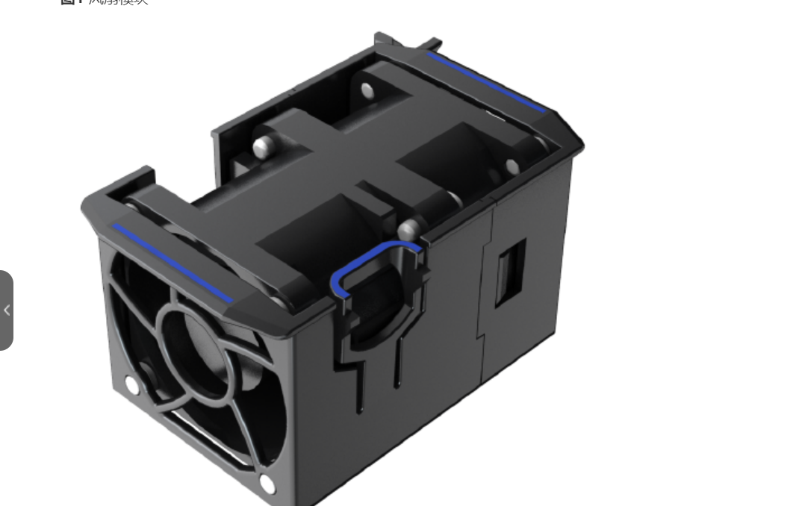

#### 电源模块

#### 硬盘模块

硬盘模块为存储系统提供存储容量，并且可以实现业务数据、系统数据和缓存数据的存储作用。

### 保险箱盘

存储系统中存在两种保险箱盘：内置的保险箱盘和外置的保险箱盘。保险箱盘用于保存存储系统的数据、系统配置信息和日志、系统掉电后Cache中的数据。

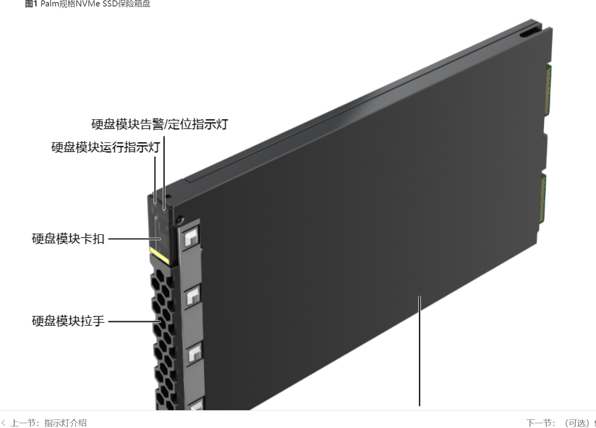

#### 内置的保险箱盘

每个控制器内置硬盘作为数据保险箱。内置的保险箱盘的容量分区如[表1](http://127.0.0.1:51299/icslite/hdx/pages/HDXYZI0808D_12_zh/HDXYZI0808D_12_zh/resources/prod_desc_104_0.html#prod_desc_104_0__table2178621)所示。

#### 外置保险箱盘

存储系统前4块硬盘规划为保险箱盘。保险箱盘必须使用SAS、NL-SAS或者SSD硬盘，并且四块保险箱盘的硬盘类型必须一致。

### 接口模块

#### GE电接口模块

GE电接口模块提供4个传输速率为1Gbit/s的电端口。不支持降速至100Mbit/s和10Mbit/s。

#### 10GE电接口模块

10GE电接口模块主要用于存储设备与应用服务器之间的连接。

10GE电接口模块提供4个传输速率为10Gbit/s的电端口，电模块速率需要与接口模块上的标签速率一致，否则存储系统会触发告警且该端口将无法使用。

#### 25GB RDMA接口模块

25Gb RDMA接口模块主要用于控制框之间的连接。

25Gb RDMA接口模块提供4个传输速率为25Gbit/s的光口。

**

#### 40GE接口模块

40GE接口模块主要用于存储设备与应用服务器之间的连接。

40GE接口模块提供2个传输速率为40Gbit/s的光口。

#### 100GE接口模块

100GE接口模块主要用于存储设备与应用服务器之间的连接。

100GE接口模块提供2个传输速率为100Gbit/s的光口。

#### 100Gb RDMA接口模块

100Gb RDMA接口模块主要用于控制框与控制框之间的连接，或控制框与智能硬盘框之间的连接。

100Gb RDMA接口模块提供2个传输速率为100Gbit/s的光口。

100Gb RDMA接口模块如[图1](http://127.0.0.1:51299/icslite/hdx/pages/HDXYZI0808D_12_zh/HDXYZI0808D_12_zh/resources/prod_desc_047_0.html#prod_desc_047_0__fd8f00fbd868f42978e8ea5be210c0a1b)和[图2](http://127.0.0.1:51299/icslite/hdx/pages/HDXYZI0808D_12_zh/HDXYZI0808D_12_zh/resources/prod_desc_047_0.html#prod_desc_047_0__fig111151587586)所示，其中标签中的SO表示Scale-Out，BE表示Back-end。

#### SmartIO接口

SmartIO接口模块支持8Gbit/s，10Gbit/s，16Gbit/s，25Gbit/s，32Gbit/s五种速率的光模块。光模块的速率需与接口模块上的标签速率一致，否则会触发存储系统告警且该端口将无法使用。

对于FC光模块，配置自适应后，最大支持向下3级的速率自适应；对于ETH光模块，不支持速率自适应。存储侧光模块类型和支持的对端光模块如[表1](http://127.0.0.1:51299/icslite/hdx/pages/HDXYZI0808D_12_zh/HDXYZI0808D_12_zh/resources/prod_desc_048_0.html#prod_desc_048_0__table484617436106)所示。

#### 12Gb SAS级联模块

级联模块通过级联端口连接控制框和SAS硬盘框，是控制框和SAS硬盘框之间进行数据传输的连接点。

12Gb SAS级联模块提供4个传输速率为4 × 12Gbit/s的mini SAS HD级联端口，用于级联硬盘框。SAS级联模块通过mini SAS HD线缆与存储系统的后端硬盘阵列连接。当连接的设备传输速率低于级联端口速率时，级联端口将自动适应传输速率，以保证数据传输通道的连通性和数据传输速率的一致性。

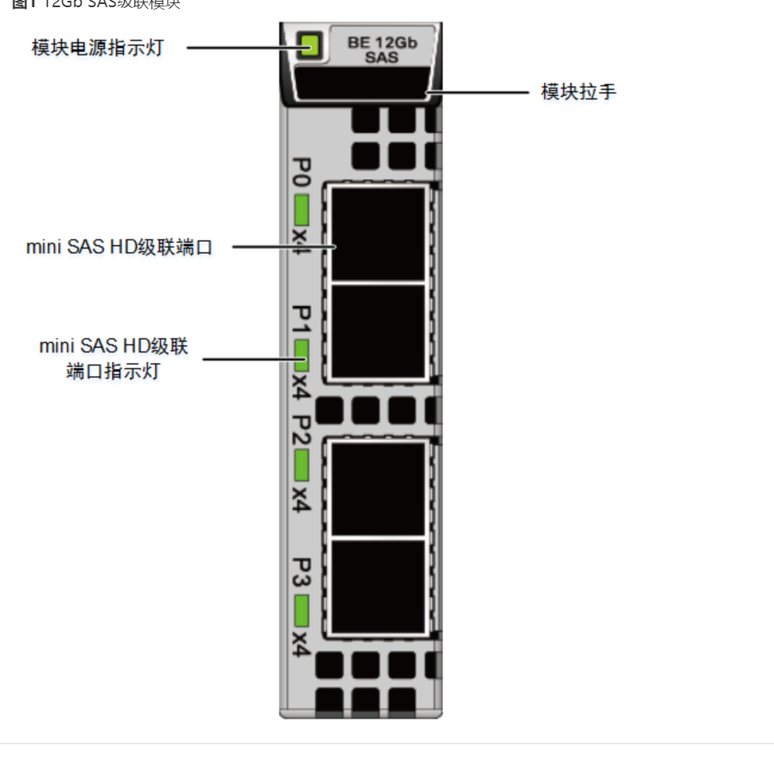

#### 12Gb SAS V2共享级联模块

级联模块通过级联端口连接控制框和SAS硬盘框，是控制框和SAS硬盘框之间进行数据传输的连接点。

12Gb SAS V2共享级联模块提供4个传输速率为4 × 12Gbit/s的mini SAS HD级联端口，用于级联SAS硬盘框。SAS级联模块通过mini SAS HD线缆与存储系统的后端硬盘阵列连接。当连接的设备传输速率低于级联端口速率时，级联端口将自动适应传输速率，以保证数据传输通道的连通性和数据传输速率的一致性。

### 线缆

•串口线缆用来连接设备的系统串口到维护终端。

•mini SAS HD线缆：存储系统中mini SAS HD线缆用于连接级联端口，连接控制框到硬盘框。mini SAS HD线缆分为mini SAS HD电缆和mini SAS HD光缆。

•AOC线缆（Active Optical Cable）：用于连接存储系统控制框上控制器的PCIe接口至数据交换机。

•100G QSFP28线缆：100G QSFP28线缆主要用于多控间直连组网或连接智能硬盘框。

•25G SFP28线缆：25G SFP28线缆主要用于前端主机组网。

•FDR线缆（Fourteen Data Rate）：是56Gb IB接口模块专用线缆。

•光纤：设备通过光纤与光纤交换机进行通信。光纤的一端可连接FC（Fibre Channel ） HBA（Host Bus Adapter）卡，另一端连接光纤交换机或存储。光纤两端都为LC（Lucent Connector）连接器。存储到光纤交换机可以使用MPO-4*DLC光纤线连接，MPO-4*DLC光纤是8Gb FC接口模块（8端口）和16Gb FC接口模块（8端口）专用线缆。

#### 数据交换机

#### 仲裁服务器

## RAID

硬件RAID是使用RAID卡

软件RAID是通过软件实现，消耗主机性能

Redundant Arrays of Independent Disks，独立磁盘冗余阵列

利用虚拟化存储技术把多个硬盘组合起来，成为一个或多个硬盘阵列组，目的为**提升性能或资料冗余**，或是两者同时提升。

在运作中，取决于 RAID 层级不同，资料会以多种模式分散于各个硬盘，RAID 层级的命名会以 RAID 开头并带数字，例如：RAID 0、RAID 1、RAID 5、RAID 6、RAID 7、RAID 01、RAID 10、RAID 50、RAID 60。每种等级都有其理论上的优缺点，不同的等级在两个目标间获取平衡，分别是增加资料可靠性以及增加存储器（群）读写性能。

简单来说，RAID把多个[硬盘](https://zh.wikipedia.org/wiki/硬碟)组合成为一个逻辑硬盘，因此，[操作系统](https://zh.wikipedia.org/wiki/作業系統)只会把它当作一个实体硬盘。RAID常被用在[服务器](https://zh.wikipedia.org/wiki/伺服器)电脑上，并且常使用完全相同的硬盘作为组合。

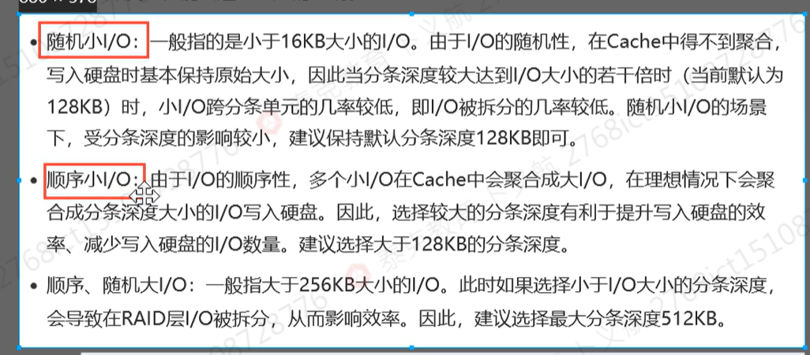

### 磁盘阵列比较表

| RAID等级 | 最少硬盘 | 最大容错 | 可用容量 | 读取性能 | 写入性能 |             安全性             |              目的              |       应用产业       |
| :------: | :------: | :------: | :------: | :------: | :------: | :----------------------------: | :----------------------------: | :------------------: |
| 单一硬盘 |  (参考)  |    0     |    1     |    1     |    1     |               无               |                                |                      |
|   JBOD   |    1     |    0     |    n     |    1     |    1     |         无（同RAID 0）         |            增加容量            | 个人（暂时）存储备份 |
|    0     |    2     |    0     |    n     |    n     |    n     | 一个硬盘异常，全部硬盘都会异常 |       追求最大容量、速度       |   视频剪接缓存用途   |
|    1     |    2     |   n-1    |    1     |    n     |    1     |        高，一个正常即可        |         追求最大安全性         |    个人、企业备份    |
|    5     |    3     |    1     |   n-1    |   n-1    |   n-1    |            中下至中            |     追求最大容量、最小预算     |  个人、小型企业备份  |
|    6     |    4     |    2     |   n-2    |   n-2    |   n-2    |  中至中高,仅安全性较RAID 5高   |       同RAID 5，但较安全       |    个人、企业备份    |
|    10    |    4     |          |          |          |          |               高               | 综合RAID 0/1优点，理论速度较快 |  大型数据库、服务器  |
|    50    |    6     |          |          |          |          |               高               |          提升资料安全          |                      |
|    60    |    8     |          |          |          |          |               高               |          提升资料安全          |                      |

### 标准RAID

#### RAID 0

RAID 0亦称为带区[卷](https://zh.wikipedia.org/wiki/卷_(計算))。它将两个以上的磁盘并联起来，成为一个大容量的磁盘。在存放数据时，分段后分散存储在这些磁盘中，因为读写时都可以并行处理，所以在所有的级别中，RAID 0的速度是最快的。但是RAID 0既没有冗余功能，也不具备容错能力，如果一个磁盘（物理）损坏，所有数据都会丢失，危险程度与[JBOD](https://zh.wikipedia.org/wiki/RAID#JBOD)相当。

#### RAID 1

[

两组以上的N个磁盘相互作[镜像](https://zh.wikipedia.org/wiki/磁碟鏡像)，在一些多线程操作系统中能有很好的读取速度，理论上读取速度等于硬盘数量的倍数，与RAID 0相同。另外写入速度有微小的降低。只要一个磁盘正常即可维持运作，可靠性最高。其原理为在主硬盘上存放数据的同时也在镜像硬盘上写一样的数据。当主硬盘（物理）损坏时，镜像硬盘则代替主硬盘的工作。因为有镜像硬盘做数据备份，所以RAID 1的数据安全性在所有的RAID级别上来说是最好的。但无论用多少磁盘做RAID 1，仅算一个磁盘的容量，是所有RAID中磁盘利用率最低的一个级别。

如果用两个不同大小的磁盘建RAID 1，可用空间为较小的那个磁盘，较大的磁盘多出来的空间也可以分割成一个区来使用，不会造成浪费。

RAID 1没有校验机制。用两个磁盘组成RAID 1阵列，如果两个硬盘上的数据出现差异，RAID 1会不知道该相信哪一个硬盘，这种情形称作[大脑分裂](https://zh.wikipedia.org/w/index.php?title=大脑分裂&action=edit&redlink=1)。事实上，RAID 1的磁盘数量越多，越有可能其中某个磁盘的数据变得不一致（但仍然工作），RAID 1只会从第一个工作的硬盘里提供数据，没有办法检测到底哪个硬盘的数据不对。[[1\]](https://zh.wikipedia.org/wiki/RAID#cite_note-1)

#### RAID 2

[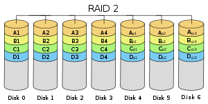](https://zh.wikipedia.org/wiki/File:RAID2_arch.svg)

这是RAID 0的改良版，以[汉明码](https://zh.wikipedia.org/wiki/汉明码)（Hamming Code）的方式将数据进行编码后分割为独立的比特，并将数据分别写入硬盘中。因为在数据中加入错误修正码（ECC，Error Correction Code），所以数据整体的容量会比原始数据大一些。

RAID 2最少要**三台磁盘驱动器**方能运作。

数据会比raid0大

#### RAID 3

采用Bit－interleaving（数据交错存储）技术，它需要通过编码再将数据比特分割后分别存在硬盘中，而将同比特检查后单独存在一个硬盘中，但由于数据内的比特分散在不同的硬盘上，因此就算要读取一小段数据资料都可能需要所有的硬盘进行工作，所以这种规格比较适于读取大量数据时使用。

数据分散在不同磁盘，读取慢，适用于存储大数据

#### RAID 4

采用块交织技术（Block interleaving）。它与RAID 3不同的是它在**分割时是以区块为单位**分别存在硬盘中，但每次的数据访问都必须从同比特检查的那个硬盘中取出对应的同比特数据进行核对，由于过于频繁的使用，所以对硬盘的损耗可能会提高。

同3一样，但是式以块分割

#### RAID 5

RAID 5是一种储存性能、*数据安全和存储成本兼顾的存储解决方案*。它使用的是Disk Striping（硬盘分割）技术。

**至少需要四块硬盘**

RAID 5使用“[奇偶校验位](https://zh.wikipedia.org/wiki/奇偶校验位)”。与 RAID-4 一样，有效大小是 N-1 个磁盘的大小。 然而，由于**奇偶校验信息也在 N 个驱动器之间均匀分布**，因此避免了每次写入都必须更新奇偶校验磁盘的瓶颈。防止单个磁盘故障，而且访问速度快[[2\]](https://zh.wikipedia.org/wiki/RAID#cite_note-RAID-5-2)。

RAID 5不是对存储的数据进行备份，**而是把数据和相对应的[奇偶校验](https://zh.wikipedia.org/wiki/奇偶校验)信息存储到组成RAID 5的各个磁盘上**，并且奇偶校验信息和相对应的数据分别存储于不同的磁盘上。当RAID 5的一个磁盘数据发生损坏后，可以利用剩下的数据和相应的奇偶校验信息去恢复被损坏的数据。RAID 5可以理解为是RAID 0和RAID 1的折衷方案。RAID 5可以为系统提供数据安全保障，但保障程度要比[镜像](https://zh.wikipedia.org/wiki/鏡像)低而磁盘空间利用率要比镜像高。RAID 5具有和RAID 0相近似的数据读取速度，只是因为多了一个奇偶校验信息，**写入数据的速度相对单独写入一块硬盘的速度略慢**，若使用“回写缓存”可以让性能改善不少。同时由于多个数据对应一个奇偶校验信息，RAID 5的磁盘空间利用率要比RAID 1高，存储成本相对较便宜。

冗余磁盘阵列在最可能发生的单个磁盘故障情况下提供保护，在这种情况下，单个磁盘只是停止工作。这消除了构建大型 EIDE（增强型IDE） 磁盘阵列的主要障碍。

RAID-5 并不能完全防止其他类型的磁盘故障。 RAID-5 将在单个磁盘停止工作但导致整个 EIDE 总线发生故障（或整个 EIDE 控制器卡发生故障）但只是暂时停止运行的情况下提供有限的保护。这将暂时禁用整个 RAID-5 阵列。如果更换坏盘解决了问题，即故障没有永久损坏其他磁盘上的数据，那么 RAID-5 阵列将正常恢复。 相似的如果只是控制器卡损坏，则更换它将使 RAID-5 阵列正常恢复。 但是，如果不止一个磁盘损坏，尤其是文件或目录结构信息损坏，整个 RAID-5 阵列就会损坏。 剩余的故障模式是磁盘正在传送损坏的数据。 RAID-5 没有对此固有的保护；但是，可以在事件标头中内置对数据的纵向奇偶校验，例如校验和记录计数 (CRC)，以标记问题。

#### RAID 6

与RAID 5相比，**RAID 6增加第二个独立的奇偶校验信息块**。两个独立的奇偶系统使用不同的算法，数据的可靠性非常高，任意两块磁盘同时失效时不会影响数据完整性。RAID 6需要分配给奇偶校验信息更大的磁盘空间和额外的校验计算，相对于RAID 5有更大的IO操作量和计算量，其“写性能”强烈取决于具体的实现方案，因此RAID 6通常不会通过软件方式来实现，而更可能通过硬件方式实现。

**同一数组中最多容许两个磁盘损坏**。更换新磁盘后，资料将会重新算出并写入新的磁盘中。

依照设计理论，**RAID 6必须具备四个以上的磁盘才能生效**。可使用的容量为硬盘总数减去2的差，乘以最小容量，公式为：

同理，数据保护区域容量则为最小容量乘以2。

RAID 6在硬件磁盘阵列卡的功能中，也是最常见的磁盘阵列等级。

### 混合RAID

#### JBOD

JBOD（Just a Bunch Of Disks）在分类上，JBOD并不是RAID的等级。由于并没有规范，市场上有两类主流的做法

1. 使用单独的链接端口如SATA、USB或1394同时控制多个各别独立的硬盘，使用这种模式通常是较高端的设备，还具备有RAID的功能，不需要依靠JBOD达到合并逻辑扇区的目的。
2. 只是将多个硬盘空间合并成一个大的逻辑硬盘，没有错误备援机制。

资料的存放机制是由第一颗硬盘开始依序往后存放，即操作系统看到的是一个大硬盘（由许多小硬盘组成的）。但如果硬盘损毁，则该颗硬盘上的所有数据将无法救回。若第一颗硬盘损坏，通常无法作救援（因为大部分文件系统将磁盘分割表（partition table）存在磁盘前端，即第一颗），失去磁盘分割表即失去一切数据，若遭遇磁盘阵列资料或硬盘出错的状况，危险程度较RAID 0更剧。它的好处是不会像RAID 0，每次访问都要读写全部硬盘。但在部分的JBOD数据恢复实践中，可以恢复未损毁之硬盘上的数据。同时，因为每次读写操作只作用于单一硬盘，JBOD的传输速率与I/O表现均与单颗硬盘无异。

#### RAID 10/01

RAID 10是先分割资料再镜像，再将所有硬盘分为两组，视为以RAID 1作为最低组合，然后将每组RAID 1视为一个“硬盘”组合为RAID 0运作。

RAID 01则是跟RAID 10的程序相反，是先镜像再将资料到分割两组硬盘。它将所有的硬盘分为两组，每组各自构成为RAID 0作为最低组合，而将两组硬盘组合为RAID 1运作。

当RAID 10有一个硬盘受损，其余硬盘会继续运作。RAID 01只要有一个硬盘受损，同组RAID 0的所有硬盘都会停止运作，只剩下其他组的硬盘运作，可靠性较低。如果以六个硬盘建RAID 01，镜像再用三个建RAID 0，那么坏一个硬盘便会有三个硬盘离线。因此，RAID 10远较RAID 01常用，零售[主板](https://zh.wikipedia.org/wiki/主機板)绝大部分支持RAID 0/1/5/10，但不支持RAID 01。

#### RAID 50

RAID 5与RAID 0的组合，先作RAID 5，再作RAID 0，也就是对多组RAID 5彼此构成Stripe访问。由于RAID 50是以RAID 5为基础，而RAID 5至少需要3颗硬盘，因此要以多组RAID 5构成RAID 50，至少需要6颗硬盘。以RAID 50最小的6颗硬盘配置为例，先把6颗硬盘分为2组，每组3颗构成RAID 5，如此就得到两组RAID 5，然后再把两组RAID 5构成RAID 0。

RAID 50在底层的任一组或多组RAID 5中出现1颗硬盘损坏时，仍能维持运作，不过如果任一组RAID 5中出现2颗或2颗以上硬盘损毁，整组RAID 50就会失效。

RAID 50由于在上层把多组RAID 5构成Stripe，性能比起单纯的RAID 5高，容量利用率比RAID5要低。比如同样使用9颗硬盘，由各3颗RAID 5再组成RAID 0的RAID 50，每组RAID 5浪费一颗硬盘，利用率为(1-3/9)，RAID 5则为(1-1/9)。

### [RAID2.0](https://www.bilibili.com/video/BV1tg411w7Qo/?spm_id_from=333.337.search-card.all.click&vd_source=3e5ace3e5ba68132ae5588aa7bcb7f91)

RAID2.0+是一种块级的虚拟化技术，它由不同类型的硬盘组成硬盘域，硬盘域内将每块硬盘分成64M大小的chrunk，由**同种类型**的硬盘chrunk（简称CK）组成chrunk group（简称CKG），CKG又分成默认大小为4M打extent，由extent组成thick lun，extent细分为默认64K大小的grain，grain可以组成我们的thin lun。

 #### 硬盘域

硬盘域是由多块**相同或不同类型的硬盘组合而成**。不同的硬盘域间相互隔离，如果将不同的业务承载到不同硬盘域中，就隔离了业务之间的性能影响和故障影响。

硬盘域支持在线添加

#### 存储池

存储池创建于硬盘域中，是存放存储空间资源的容器，所有应用服务器使用的存储空间都来自于存储池。**存储池根据存储介质的不同，可以划分为3个存储层，分别是高性能层、性能层和容量层。**

存储池支持在线扩容

 #### 存储层

存储池中相同性能的存储介质集合，**用于管理不同性能的存储介质**，**以便为不同性能要求的应用提供不同存储空间**。不同存储池extent大小可以不同，但同意存储池中extent大小统一

#### CHUNK

硬盘上划分的连续的固定大小的物理空间，简写为CK。

#### CHUNK Group

**由不同硬盘的CK组成的逻辑集合**。CHUNK Group具有RAID属性，简写为CKG。

#### Extent

**Extent是在CKG中划分的固定大小的块**（默认4MB）。它是**组成thick LUN**的基本单位，**也是存储池中申请空间、释放空间和迁移数据的最小单位**（即存储池中管理空间的最小单位）。**Extent大小可以在创建存储池时候的属性进行修改。**LUN可以包含一种或多种类型的extent。

#### Grain

**Grain是在Extent中按照固定大小进一步划分的更细粒度的块，系统默认值为64KB（当存储池的硬盘为全SSD时，默认值为8KB）。**它是**组成thin LUN的基本单位**，Grain内的LBA（Logical Block Address）是连续的。Grain大小可以在存储的命令行进行修改。

其中ckg和ck是華爲春初系統内部對象,對外不體現.

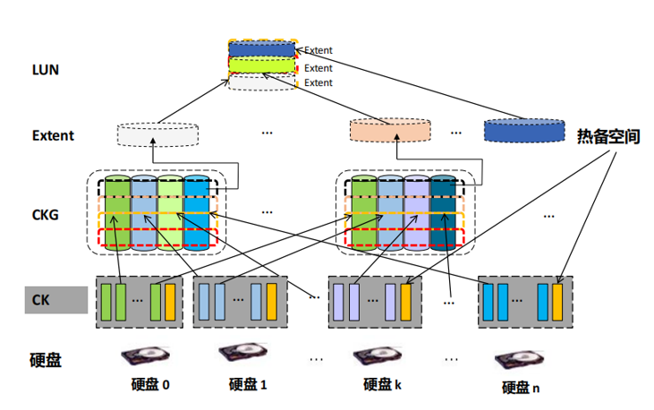

#### 技术特点

自动负载平衡降低了整体故障率。快速瘦重构，提高双盘故障率；快速瘦重构，提高双盘故障率；故障自检测和自愈确保系统可靠性。

#### 可靠性

负载分担：RAID2.0+使硬盘工作更均匀，防止硬盘过度工作。

重构健壮：通过RAID2.0+技术，在重构过程中使用更多的磁盘分担重构负载，减少了每个硬盘的重构工作量，降低了重构过程中硬盘故障的风险。

快速重构：RAID2.0+大大缩短了重构的时间窗口。这样可以使系统尽快恢复到容错状态，从而提高系统的可靠性。

简化重构：RAID2.0+可以通过元数据检测分配空间中的已用空间。因此，重构时只重构已用空间，减少了重构数据量，缩短了重构时间，降低了重构风险。

自检测自愈：RAID2.0+采用分布式热备空间。当系统检测到故障时，只要磁盘有空闲空间（CK），系统就会自动开始重建。这提高了可靠性并降低了管理成本。

无效数据卷：如果传统RAID组出现故障，RAID组中的所有数据都会受到影响。当 RAID2.0+ 上多个磁盘发生故障时，只有与故障磁盘关联的数据无效。大多数数据仍然可以访问。与传统RAID相比，无效数据量减少了一个数量级。

#### 双盘故障分析

RAID技术是存储数据保护的基础。它仍然是RAID的容错能力。

对于RAID 5，可以容忍的故障数是1。对于传统RAID，单位是硬盘。对于 RAID2.0+，该单元被阻止。

对于 RAID 6，可以容忍的故障数为 2。

因此，如果使用双奇偶校验保护类型，如RAID 6，则在发生双盘故障时，无论是传统RAID还是基于块的RAID2.0+都不会丢失。

如果使用RAID5，对于传统RAID，双盘故障会导致数据丢失，而采用RAID2.0+技术的HVS系列存储系统只要双盘出现故障，每个CKG中就不会出现两个故障块。(CK)，则数据不会丢失。

RAID 2.0+具备

业务负载均衡，避免热点

快速重构

全盘参与重构

## 華爲

基於windows系統的服務器要使用華爲oceanstor存儲設備提供的存儲資源，需要1.安裝Initiator軟件到服務器上，2.鏈接服務器至存儲設備，3.創建硬盤域和存儲池；4.創建LUN和LUN組；5.創建主機和主機組；6.在服務器和存儲設備上配置啓動器（Initiator）；7.映射；8.格式化邏輯硬盤。

### 重構

### 衝裁服務器

衝裁服務器可以通過存儲的管理網絡通訊，也可以通過存儲的業務網絡通訊

衝裁服務器故障不會影響業務的正常下發

### 分佈式存儲組網

網絡管理

前端製業務網絡

後端存儲網絡

### 華爲存儲高級技術

#### SmartThin

智能精简配置以一种按需分配的方式来管理存储设备。

智能精简不会预先分配所有的空间，而是将大于物理存储空间的容量形态呈现给用户，是用户看到的存储空间远远大于系统实际分配的空间。用户对这部分空间的使用实行按需分配的原则，整个扩容过程无需业务系统停机，对用完全透明。

应用场景：

对业务连续性要求高的系统核心业务，使用smartthin可以在线对系统扩容，不会中断业务。

应用系统数据增长速度无法准确评估的业务，使用smartthin可以按需分批物理存储空间，避免浪费。

多种业务混杂并且对存储需求不一的业务，使用smartthin可以让不同业务去竞争物理存储空间，实现物理存储空间的优化配置。

#### hipermetro

阵列双活

阵列级A/A双活技术，部署双活的两套存储系统可以同意啊嘎尔机房、同一个城市或者像相聚300km的两地。

oceanstor存储系统同时支持san双活和nas双活

特性：

支持存儲故障的自動切換

本端站點和遠端站點可以同時運行業務

##### LUN

  LUN：全称是Logical Unit Number，中文名是**逻辑单元号**。LUN是在存储设备上可以被应用服务器识别的独立[存储单元](https://so.csdn.net/so/search?q=存储单元&spm=1001.2101.3001.7020)。一个LUN的空间来源于存储池Pool，Pool的空间来源于组成磁盘阵列的若干块硬盘。从应用服务器的角度来看，一个LUN可以被视为一块可以使用的硬盘。例如，在Linux系统中，它在/dev/rdsk、/dev/dsk目录下有相应的设备名称；在Windows系统中，格式化后的新LUN会对应一个类似于D E F的盘符。

##### ThickLUN

  Thick LUN：中文名是传统非精简LUN，是LUN类型的一种，支持虚拟资源分配，能以较为简便的方式进行创建、扩容和压缩操作。Thick LUN在创建完成后就会从存储池Pool中分配满额的存储空间，即LUN的大小完全等于分配的空间。因此，它拥有较高的可预测性。

##### ThinLUN

  Thin LUN：中文名是精简LUN，也是LUN类型的一种，支持虚拟资源分配，能够以较简便的方式进行创建、扩容和压缩操作。Thin LUN在创建的时候，可以设置一个初始分配容量。创建完成后，存储池Pool只会分配这个初始容量大小的空间剩余的空间仍然放在存储池中。当Thin LUN已分配的存储空间的使用率达到阈值时，存储系统才会再从Pool中划分一定的配额给Thin LUN。如此反复，直到达到Thin LUN最初设定的全部容量。因此，它拥有较高的存储空间利用率。

#### SmartTier

smarttier中文名叫**动态分级存储特性**。

能够自动将不同活跃度的数据和不同特点的存储介质动态匹配

通过以监控数据的IO大小、IO热度、IO顺序度来把访问频率高的数据迁移到性能好的层次上

把访问频率低、占用空间大的数据放到容量层上，以提高我们存储系统的性能并且降低用户成本。

smarttier共有三个层次：**性能层、容量层、高性能层**。

那么我们要想实现smarttier的话，我们**在创建硬盘域的时候至少选择两种类型的硬盘**，**创建存储池的时候至少要选择两种才能开启**，然后通过设置存储池的属性中的监控时间以及迁移时间来对IO进行监控。这里需要注意的是：我们在存储池开启了IO监控，不代表我们就一定能实现smarttier，**最终其实取决于我们的LUN的属性设置中的迁移策略**，

那么迁移策略主要有以下几种：**不迁移、自动迁移、优先向高性能层迁移和优先向低性能层迁移**

 自动迁移：smarttier根据存储池中数据块的排名结果进行数据迁移。自动迁移依据I/O监控得出的分析数据进行迁移，因此必须启用I/O监控并设置业务监控时段后，自动迁移才能生效。

 向高性能层迁移：**某些LUN对响应时间、IOPS、带宽等性能要求较高**，这**样的LUN适合向高性能层迁移策略**，其数据块将被优先迁移至高性能层和性能层，例如OLTP数据库。具有向高性能层迁移策略的数据块对高性能层和性能层存储容量有第一高的优先权。**当设置为向高性能层迁移的LUN容量比高性能层（或性能层）存储容量更大时，相对更活跃的数据块将优先占用高性能层（或性能层）存储容量。**

向低性能层迁移：**某些对性能要求不敏感的LUN适合优先向下迁移策略，例如文件共享服务。**不论这些LUN是什么活动级别，smarttier会将他们的数据块优先迁移至性能层和容量层。

不迁移：不迁移策略表示smarttier不会迁移LUN的任何数据块。只有当LUN的数据迁移策略改变后，smarttier才会对LUN进行数据迁移。

#### smartQOS

**智能服务质量控制特性**，可以通过动态的分配存储系统的资源来满足某些应用程序的特定性能目标。Smart QOS特性允许用户根据应用程序数据的一系列上限目标，准确限制应用程序的性能，避免非关键应用程序强占过多的存储资源，影响关键应用程序的性能。

Smart qos采用基于LUN、fs或快照的io优先级调度技术和io流量控制技术两种方式来保证数据业务的服务质量。

 **I/O优先级调度技术**：通过为业务设置优先级来区分不同业务的重要性。在存储系统紧张的情况下为高优先级的业务分配较多的资源，以此尽可能保证高优先级业务的服务质量。

**I/O流量控制技术**：smartQOS特性的io流量控制技术是对应用程序I/O的队列管理，通过对I/O请求处理、令牌分发和出队控制三部分实现。针对用户设置的性能控制目标（IOPS、带宽）进行流量限制，通过I/O流控机制，限制某些业务由于流量过大而影响其他业务。

#### smartQuota

在nas文件服务环境中，通常以共享目录的方式将资源提供给使用的部门组织或个人，而每个部门或个人都有其独特资源需求或限制，因此系统需要基于共享目录，因地制宜的对各个使用者进行资源分配和限制文件，

系统配额特征称为smartquota正是用于满足此需求的技术，该技术可以针对**目录，用户，用户组**这三类资源的使用者分别进行资源控制，smart quota可以配置的配额选项又容量软配额、容量硬配额、文件软配额、文件硬配额。

#### SmartMotion

智能数据迁移

该特性可以在系统扩容时，通过自动对数据进行迁移，将数据均衡的存放在所有硬盘上。有效的降低购买成本，从而降低TCO。

#### hyperclone

###### LUN克隆

HyperClone在**不中断业务的前提下**，为存储系统的LUN建立一份某时刻的完整物理拷贝，并且在分裂后对物理拷贝的读写操作不会影响源LUN上的数据。

#### hyper

### 容灾

#### RPO

Recovery Time Objective，复原时间目标)是指灾难发生后，**从IT系统当机导致业务停顿之时开始，到IT系统恢复至可以支持 各部门运作、恢复运营之时，此两点之间的时间段称为RTO**。比如说灾难发生后半天内便需要恢复，RTO值就是十二小时。

16点系统宕机，23点恢复，RPO则为7

坏了的时间， 修复时间的差

#### RPO

Recovery Point Objective，复原点目标)是指从系统和应用数据而言，要实现能够恢复至可以支持各部门业务运作，恢复得数据所对应时的间点。如果现时企业每天凌晨零时进行备份一次，当服务恢复后，系统内储存的只会是最近灾难发生前那个凌晨零时的资料。

16点宕机，恢复到12点数据，则RPO为4

坏了的时间， 能恢复到的时间的差

#### TCO

数据集<应用级<业务级

### scaleup and scaleout

Scale Out（也就是Scale horizontally）横向扩展，向外扩展
Scale Up（也就是Scale vertically）纵向扩展，向上扩展

云数据中心的发展趋势时：业务烟囱、云数据中心、分布式云数据中心、业务驱动的分布式云数据中心。

### ＡＮ組網

常見協議

ＦＣ、ＩＳＣＳＩ

### IP漂移

ip漂移不支持在不同类型的接口模块之间进行漂移

### OceanStor V3

该系列产品中的smartcache特性只能提升读性能，不能提升写性能。

该系列存储系统的初始容量分配策略默认为自动分配

该系列存储系统中，一个LUN可以创建多个快照，可以多个快照处于以激活状态

该系列存储系统中NFS系统默认的是同步写入

华为oceanstor分部署存储适用于：虚拟化、大数据分析、私有云

华为oceanstor分布式存储，关于软件架构存储中存储接口层：支持hdfs协议、支持s3和swiftt协议、支持scsi和iscsi协议、**不支持ib**
