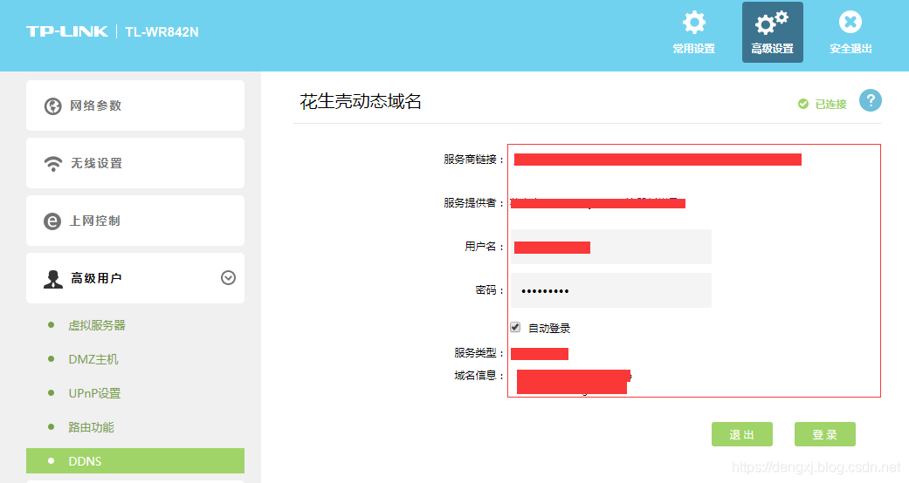
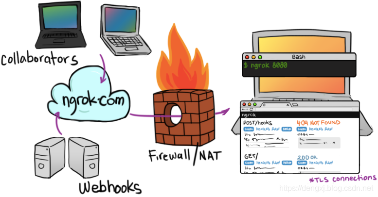

# 内网穿透

## 名词解释

### 私有地址

因特网域名分配组织IANA组织（Internet Assigned Numbers Authority）保留了以下三个IP地址块用于私有网络。

```javascript
10.0.0.0 - 10.255.255.255     (10/8比特前缀)

172.16.0.0 - 172.31.255.255   (172.16/12比特前缀)

192.168.0.0 - 192.168.255.255 (192.168/16比特前缀)
```

我们可以看到其中有1个A类地址块，32个B类地址块和256个C类地址块。

主流的家用路由器使用C类私有地址作为路由器LAN端的IP地址较多，所以我们可以看到路由器设置页面的IP一般都为192.168开头。

### DHCP

（动态主机设置协议）

路由器怎么分配内网IP？

DHCP是一个局域网的网络协议，使用UDP协议工作，主要用于内部网络或网络服务供应商自动分配IP地址给用户，同时也可以作为内部网络管理员作为对所有电脑作中央管理的手段。


### NAT

（网络地址转换）

NAT（Network Address Translation）即网络地址转换，NAT能将其本地地址转换成全球IP地址。利用路由器作为内网和公网的划分，将内网与外网进行映射，并负责这两者的信息传递。

路由器负责将内网的IP与端口号映射到公网的IP与端口号，并以该IP与端口号与外网进行通讯，并作为中间桥梁控制其间的数据传输。

目前，NAT的主要技术类型有 **静态NAT** 、**动态NAT** 和 **网络地址端口转换NAPT**（Port-Level NAT）三种。

静态NAT设备中NAT地址映射表确定了一个内部IP地址与一个全局IP地址的对应关系（一一对应），只要管理员不重新设置，这种对应关系就一直保持。——即用户被分配到的是**静态公网IP**。

动态NAT设备被管理员分配了一些全局IP地址，这些全局的IP地址构成了NAT地址池，当内部主机需要访问外部网络时，设备就会在NAT地址池中为该主机选择一个目前未被占用的IP地址，当通信结束时，NAT设备将会收回该全局IP地址。——即用户被分配到的是**动态公网IP**。

网络地址端口转换NAPT（Port-Level NAT）是目前最常使用的一种NAT类型，较为成功的解决了目前IP地址短缺问题，通过分配不同端口，是内部网络的多个主机和用户共享少数几个全局IP地址。但是，这也使得外部的网络主机不能主动访问内部网络中的主机，这是由于NAT地址映射表中不存在到达内部机器的映射，因此，外部主机发起的访问内部机器的数据报在到达NAT设备时将被抛弃，这种隐藏内部主机的方式，一定程度上提高了内部网络的安全性，但也给一些网络应用（如P2P）带来了一些问题，那些应用常常希望内部网主机和外部网主机之间能够自由的进行通信。

此外，NAPT同样可以配置地址池。配置NAPT功能后，NAT转换时，首先将复用地址池中所选择的地址，端口达到能力极限后， 再选择另一个地址完成转换。对比单一的多对多地址转换，这可大大减少地址池中公有地址的数目。


### NAPT

（网络端口地址转换）

将多个内部地址映射为一个合法公网地址，但以不同的协议端口号与不同的内部地址相对应，也就是<内部地址+内部端口>与<外部地址+外部端口>之间的转换。

如果内网有主机向公网设备发起了请求，内网主机的请求数据包传输到了NAT网关上，那么NAT网关会修改该数据包的源IP地址和源端口为NAT网关自身的IP地址和任意一个不冲突的自身未使用的端口，并且把这个修改记录到那张映射表上。最后把修改之后的数据包发送到请求的目标主机，等目标主机发回了响应包之后，再根据响应包里面的目的IP地址和目的端口去映射表里面找到该转发给哪个内网主机。这样就实现了内网主机在没有公网IP的情况下，通过NAPT技术借助路由器唯一的一个公网IP来访问公网设备。

Easy IP是一种特殊方式的NAPT。直接使用网关出接口的ip地址，不存在多个公网ip地址。特别适合小型局域网接入Internet 的情况。这里的小型局域网主要指中小型网吧、小型办公室等环境。


举例：内网机器（192.168.1.101） 访问目标主机（1.2.3.4）
**1、客户机发送数据包：**
目的主机 1.2.3.4
目的端口 80
源主机 192.168.1.101 (内网的私有IP）
源端口 1920 （随机打开）
**2、进行地址转换**
目的主机 1.2.3.4
目的端口 80
源主机 2.3.4.5 （NAT服务器的公网IP）
源端口 2345 （随机打开）
**3、记录映像**
192.168.1.101 tcp 1920 ----- 2.3.4.5 tcp 2345
**4、外部网络主机向NAT主机发送响应信息**
目的主机 2.3.4.5
目的端口 2345
源主机 1.2.3.4
源端口 80
**5、查找映像关系将数据包发给客户机**
目的主机 192.168.1.101
目的端口 1920
源主机 2.3.4.5
源端口 2345


### DDNS（动态域名解析）

DDNS是将用户的动态IP地址映射到一个固定的域名解析服务上，用户每次连接网络的时候客户端程序就会通过信息传递把该主机的动态IP地址传送给位于服务商主机上的服务器程序，服务器程序负责提供DNS服务并实现动态域名解析。


### 端口映射

公网ip只是路由器的，要实现外网访问，还需要设置端口映射把内网中的机器映射到公网去。端口映射就是将公网IP地址的一个端口映射到内网中一台机器，提供相应的服务。当用户访问该IP的这个端口时，服务器自动将请求映射到对应局域网内部的机器上。

端口映射过程就如同：你的朋友来找你，找到小区门口，不知道你住在几层，然后问保安，保安查到你的名字然后告诉你在几楼，所以你的朋友很轻松的找到了你的家，在这个过程中，保安通过业主的名字查到业主的门牌号这就是一种映射关系。

**端口映射 不等于 端口转发**
**端口映射 不等于 端口转发**
**端口映射 不等于 端口转发**


相同效果：如果公网ip为 x.x.x.x，在浏览器中输入x.x.x.x:端口a，即可看到内网服务器端口b下的实时画面。
不同原理：端口映射发生于节点与路由/网关之间，以NAT（Network Address Translation，网络地址翻译）为原理；而端口转发以反向隧道、反向代理为原理，需要借助一台公网IP服务器转发端口，发生于两个网络节点的端口之间。


## 内穿概述

### 1. 基本情况介绍

在互联网中唯一定位一台主机的方法是通过公网的IP地址，但**固定IP**是一种非常稀缺的资源，不可能给每个公司都分配一个，且许多中小公司不愿意为高昂的费用买单，多数公司直接或间接的拨号上网，电信部门会给接入网络的用户分配IP地址，以前上网用户少的时候基本分配的都是**临时的静态IP地址**，租约过了之后可能会更换成另一个IP地址，这样外网访问就不稳定，因为内网的静态IP地址一直变化，为了解决这个问题可以使用动态域名解析的办法变换域名指向的静态IP地址。但是现在越来越多的上网用户使得临时分配的静态IP地址也不够用了，电信部门开始分配一些虚拟的静态IP地址，这些IP是公网不能直接访问的，以前单纯的动态域名解析就不好用了。

关于如何判断自己家庭网络是否是公网IP：

首先如果发现ip在上文讲**私有地址**时提到的三个用于私有网络的IP地址块中，那么排除公网IP可能。使用保留地址的网络只能在内部进行通信，而不能与其他网络互连。

其次，对比 路由自动分配的IP（WAN口地址）与 网络查询到的本机IP地址 是否一致，如果不一致，则不具有公网IP。

> 此处有一个坑，在使用长城宽带等第三方宽带运营商提供的网络服务环境下，直接在网页输入IP回显的IP地址一般和WAN口IP地址相同，这样很容易产生错误判断，上面提供的网址（网址右边显示的IP）有效解决了这个误导。

最后，使用 tracert 来查看跟踪，第一跳是路由器网关，如果后面的每一个hops不是内网IP，那么自己就是外网IP了，反之，如果自己是内网IP，那么hops显示的就是网关的内网IP，下面的例子显然说明是外网IP，但此方法针对长城宽带等第三方宽带运营商网络判断无效。


> 一般来说，代理网络运营商99.99%都是内网IP，如长城带宽、聚友E家等。具体检测方法一方面可以通过比较wan口和实际IP，也可以通过DDNS域名解析后比对IP（后文“动态域名解析”处有相关图文参考）进行验证。


### 2. 将内网的服务暴露到公网上方式

#### （1） 拥有静态公网IP情况下：

直接在路由器上设置一下**端口映射**（使用带端口映射功能的路由器，或者使用DMZ主机功能，把内网中的一台主机完全暴露给互联网，开放所有端口，等同于全部端口映射。等于直接使用公网IP。），将内网IP与端口映射到公网IP的一个端口上。当外界需要访问内网端口的服务时，只需要向公网IP对应的端口发起请求即可。（当然不要忘记先固定内网IP）

###### Step 1 路由器静态分配内网IP

使用浏览器登录路由器（登陆地址见路由器背面），默认的账号密码都是admin（详情同见路由器背面），将IP与MAC绑定。


###### Step 2 端口映射或DMZ映射


TP-LINK部分路由器端口映射服务被称为“虚拟服务器”，需要在下图处增加端口映射。


配置时，以树莓派为例，其中外部端口是外网访问的端口，例如可选9000，建议不要太小，因为服务提供商可能屏蔽较小的一些端口；内网端口如果用树莓派的motion，就写motion的端口，为8081或8080；协议选TCP；内部IP是树莓派的局域网ip。

例如你的公网ip为 x.x.x.x，这些设置完以后就可以在浏览器中输入x.x.x.x:9000，即可看到实时画面。

#### （2） 拥有动态公网IP情况下（动态NAT设备）：

这种情况下依然可以做端口映射，但是由于IP地址不固定，所以需要通过方法来告知连接者IP到底是多少。解决这个问题可以采用DDNS（动态域名解析）技术。

通过域名 访问获取端口映射客户端动态域名解析DDNS服务器动态域名解析DDNS服务器局域网关出口处的公网IP局域网关出口处的公网IP内网服务器

###### Step 1 路由器静态分配内网IP

###### Step 2 端口映射或DMZ映射

###### Step 3 动态域名解析

DDNS（动态域名解析）技术就是首先获得一个域名，并要求内网设备每隔一段时间对于DDNS服务器发起请求，DNS服务器将请求的IP记录下来并且刷新相关域名的解析记录。最终可以通过该域名找到当前的IP地址。


路由器DDNS解析之后，无需登陆花生壳等服务端，相反，登陆花生壳服务端予以配置后，会互相冲突，影响动态域名解析。

动态域名解析检测方法是 ping 域名:端口 ，查看回显IP是否为本机分配到的公网IP

（用该方法也可以**检测是否分配到的是公网IP**，下面以长城宽带为例，动态域名解析后ping域名：）


#### （3） 家庭路由器上面一层连接的是ISP的另一层路由器，甚至有层层链接情况下：

#### （4） NAT类型为NAPT（非Full Cone）情况下：

这两种情况下，通过固定IP并在自己的路由器上设置映射是没有作用的。需要使用**内网穿透**技术。


### 3. 内网穿透原理

内网穿透，又叫NAT（Network Address Translation）穿透。对于在NAT之后的节点来说，其不是不能主动访问公网端口，而是不能反过来有效的被公网访问。内网穿透的主要思路就是利用这一点，让在NAT之后的节点主动访问一个拥有公网IP地址的服务器，并由中间服务器搭桥，打通经过该服务器从其他主机到NAT之后节点的隧道。

同样该技术除了可以访问隐藏在NAT之后的节点，同样可以穿透防火墙。由于防火墙只拦截了入站没有拦截出站，所以可以让防火墙内的服务器主动连接到一个公网服务器打通隧道，并通过该隧道最终链接到本地的其他端口。

###### Step 1：打通隧道

出于安全起见，除非是主机主动向对方发出了连接请求（这时会在该主机的数据结构中留下一条记录），否则，当主机接收到数据包时，如果在其数据结构中查询不到对应的记录，那些不请自来的数据包将会被丢弃。因此，位于不同局域网内的两台主机，即使是知道了对方的 IP 地址和端口号，“一厢情愿”地将数据包发送过去，对方也是接收不到的，所以我们首先需要打通隧道。

假设公网IP为X.X.X.X，内网IP为192.168.1.2。公网主机先监听80端口，监听这个端口是用于向外部提供一个HTTP服务，80是WEB服务器的默认端口。同时其他任意一个端口（这里我们假设为7777），监听这个端口是用于让内网服务器主动连接进来打通一个隧道。接着内网再主动向公网主机的7777发起一个请求，这样内网就成功与公网主机建立了一个连接通道。然后当有任何客户端主动连接公网的80端口时，公网接收到连接请求之后马上把这连接请求通过先前建立好的隧道转发到内网主机。

****


###### Step 2：端口转发（公网主机80端口 转发至 内网80端口）

当有任何客户端主动连接公网的80端口时，公网接收到连接请求之后马上把这连接请求通过先前建立好的隧道转发到内网主机，内网主机接收到来自隧道的数据包后再主动连接内网主机自身的80端口，连接成功之后将数据包原封不动地转发数据包给80端口


###### Step 3：原路转发响应报文

内网主机接收到来自隧道的数据包后再主动连接内网主机自身的80端口，连接成功之后将数据包原封不动地转发数据包给80端口，待HTTP服务器程序处理完这个数据包，生成了响应报文之后再原路转发回去，最终到达公网的80端口，然后返回给最开始请求公网服务器80端口的客户端。


### 4. 内网穿透种类

##### 类型一:服务器中转穿透

根据上述原理搭建的内网穿透环境，数据经过中转公网服务器进行传输，被视为是最为常见的内网穿透种类，市面上大多数内网穿透产品都是采用这种类型实现穿透。

##### 类型二:点对点穿透

在内网穿透传输大量数据时如果都经过服务器中转的话，这样会对服务器端带宽压力比较大。

只要是数据量很大，而一般利用中转服务器又需要一定规模投入的应用，我们都可以考虑用P2P技术。


###### （1） UDP打洞技术

最为常见的实现P2P的方式是采用**UDP打洞技术**，UDP打洞技术是通过中间服务器的协助在各自的NAT网关上建立相关的表项，使P2P连接的双方发送的报文能够直接穿透对方的NAT网关，从而实现P2P客户端互连。如果两台位于NAT设备后面的P2P客户端希望在自己的NAT网关上打个洞，那么他们需要一个协助者——集中服务器，并且还需要一种用于打洞的Session建立机制。

**Session建立机制：**

假定客户端A要发起对客户端B的直接连接，具体的“打洞”过程如下：

（1）A最初不知道如何向客户端B发起连接，于是A向集中服务器（本质上是一台被设置在公网上的服务器，建立P2P的双方都可以直接访问到这台服务器。位于NAT网关后面的客户端A和B都可以与一台已知的集中服务器建立连接，并通过这台集中服务器了解对方的信息并中转各自的信息）发送消息，请求集中服务器帮助建立与客户端B的UDP连接。

（2）集中服务器将含有B的外网和内网的地址二元组发给A，同时，集中服务器将包含有A的外网和内网的地址二元组信息的消息也发给B。这样一来， A与B就都知道对方外网和内网的地址二元组信息了。

（3）当A收到由集中服务器发来的包含B的外网和内网的地址二元组信息后， A开始向B的地址二元组发送UDP数据包，并且A会自动锁定第一个给出响应的B的地址二元组。同理，当B收到由集中服务器发来的A的外网和内网地址二元组信息后，也会开始向A的外网和内网的地址二元组发送UDP数据包，并且自动锁定第一个得到A回应的地址二元组。一旦A与B都向对方的NAT设备在外网上的地址二元组发送了数据包，就打开了A与B之间的“洞”，A与B向对方的外网地址发送数据，等效为向对方的客户端直接发送UDP数据包了。一旦应用程序确认已经可以通过往对方的外网地址发送数据包的方式让数据包到达NAT后面的目的应用程序，程序会自动停止继续发送用于“打洞”的数据包，转而开始真正的P2P数据传输。

当然，UDP转换协议提供的“洞”不是绝对可靠的，多数NAT设备内部都有一个UDP转换的空闲状态计时器，如果在一段时间内没有UDP数据通信，NAT设备会关掉由“打洞”过程打出来的“洞”。如果P2P应用程序希望“洞”的存活时间不受NAT网关的限制，就最好在穿越NAT以后设定一个穿越的有效期。

###### （2） TCP打洞技术

从现在的主流应用的角度上来看，基于TCP的P2P应用显然不如基于UDP的应用那么广泛，但是也存在打洞的需求。

TCP相对于UDP而言要复杂的多，TCP连接的建立要依赖于三次握手的交互，所以NAT网关在处理TCP连接的时候，需要更多的开销。但是，由于TCP协议完备的状态机机制，TCP反而比UDP更能精确的获取某个Session的生命期。

一种新的代理类型 XTCP 能解决这个问题，实现方式可以是采用搭建FRP服务器的方式，在传输数据的两端都部署上 FRP 客户端上用于建立直接的连接。[实现方法点击此处](https://dengxj.blog.csdn.net/article/details/89187944)

## 常见的内网穿透产品

##### 需要实现的功能：

1. 内网地址映射
2. 内网端口映射
3. 动态域名解析（DDNS）

### 1. 花生壳 官网

花生壳既是内网穿透软件、内网映射软件,也是端口映射软件。规模最大，较正规，完善，使用简单但收费高。

### 2. Nat123 官网

nat123是内网端口映射与动态域名解析（DDNS）软件，在内网启动映射后，可在外网访问连接内网网站等应用。

### 3. NATAPP 官网

NATAPP基于ngrok的国内内网穿透服务，免费版会强制更换域名。

### 4. ngrok

ngrok是一个反向代理，通过在公共的端点和本地运行的Web服务器之间建立一个安全的通道。ngrok可捕获和分析所有通道上的流量，便于后期分析与响应。主要用途是给网站或者安装开发提供部署环境，但是也同样可以用来进行端口转发。




### 5. Frp [搭建方法](https://dengxj.blog.csdn.net/article/details/88952420)

相比ngrok，frp内网穿透无需多复杂的配置就可以达到比较好的穿透效果，具有较强的扩展性，支持 tcp, udp, http, https 协议，并且 web 服务支持根据域名进行路由转发。此外，FRP 提供了一种新的代理类型 XTCP ，可以在传输大量数据时让流量不经过服务器中转，用于实现点对点穿透。

在了解frp原理前，首先需要理解什么是代理。

Proxy即代理，被广泛应用于计算机领域，主要分为正向代理与反向代理：

#### 正向代理

正向代理隐藏了真实的请求客户端。服务端不知道真实的客户端是谁，客户端请求的服务都被代理服务器代替来请求，某些科学上网工具扮演的就是典型的正向代理角色。用浏览器访问http://www.google.com时被墙了，于是你可以在国外搭建一台代理服务器，让代理帮我去请求 google，代理把请求返回的相应结构再返回给我。

当多个客户端访问服务器时服务器不知道真正访问自己的客户端是那一台。正向代理中,proxy和client同属一个LAN,对server透明。


#### 反向代理

反向代理隐藏了真实的服务端，当我们请求 ww.baidu.com 的时候，背后可能有成千上万台服务器为我们服务，但具体是哪一台，你不知道，也不需要知道，你只需要知道 www.baidu.com 是我们的反向代理服务器，反向代理服务器会帮我们把请求转发到真实的服务器那里去。Nginx就是性能非常好的反向代理服务器，用来做负载均衡。

反向代理中,proxy和server同属一个LAN,对client透明。


FRP实现内网穿透，就在于使用反向代理，使得真实的服务端得以隐藏。当外部用户（client）请求访问服务端VPS的时候，服务端VPS是下图中的客户端（实质上是上图中的server）的反向代理服务器，反向代理服务器会帮我们把请求转发到真实的服务器（下图中的客户端）那里去。这样就实现了内网穿透。

即：
Client = 外部用户
proxy = 公网服务器（需要在服务器上搭建FRP服务端）
Server = 内网服务器（需要在服务器上搭建FRP客户端）


## 使用fpr进行p2p


https://conimi.com/archives/128/#_0x03-%E6%8E%A7%E5%88%B6%E7%AB%AF-%E7%94%B5%E8%84%91-%E5%AE%89%E8%A3%85frpc

https://dengxj.blog.csdn.net/article/details/89187944


