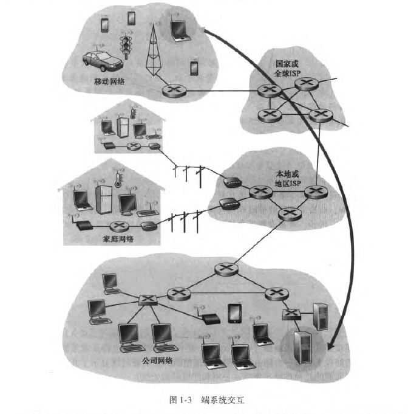
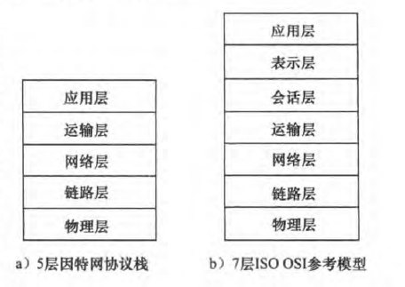
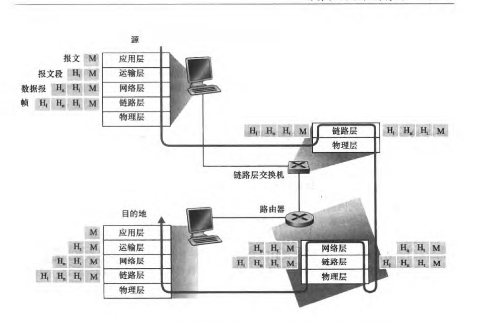

# 计算机网络

## 因特网

一个世界范围的计算机网络，他是一个互联了遍及全世界数十亿计算设备的网络。

### 构成因特网的基本硬件和软件组件

**端系统**（end system)或**主机**（host）将数据分段，加上首部字节，经过入**通信链路**（communication link,即物理媒体，同轴电缆，光纤等）送入**分组交换机**（packet switch，分组交换机最出名的类型有`<路由器“router"通常用于网络核心>`,和`<链路层交换机"link-layer switch"常用于接入网中>`)然后从出通信链路向着目的地转发该分组（packet），到达目的地后重新装配成为初始数据。

- 一个分组经过的一系列设备成为该网络的**路径**（route或path）;
- 端系统通过**因特网服务提供商**（ISP）接入因特网;
- 较低层的ISP通过国家的、国际的、较高层的ISP互联起来；
- 网络上的设备遵循着一系列**协议**（protocol)这些协议（**TCP/IP**,传输控制协议/网际协议)控制着因特网中信息的收发。
- 因特网标准(Internet standard) 由因特网工程任务组(Internet Engineering Task Force ; **IETF**) [ IETF
  2016] 研发,IETF 的标准文档称为**请求评论**(Request For Comment, **RFC**),
- RFC 文档往往是技术性很强并相当详细的。它们定义了TCP 、IP 、HTTP(用于Web) 和SMTP (用千电子邮件）等协议。
- 通常把与因特网相连的计算机和其他设备称为端系统。它们位于因特网的边缘， 故而被称为端系统。
- 端系统也称为主机( host ) 主机有时又被进一步划分为两类：客服(client，桌面PC 、移动PC 和智能手机等) 和服务器(server，用于存储和发布Web 页面、流视频、中继电子邮件等) 。

### 应用程序提供服务的基础设施的角度来描述因特网

应用程序涉及多个相互交换数据的端系统，故它们被称为**分布式应用程序**(distributed application)

与因特网相连的端系统提供了一个**套接字接口**(socket interface) , 该接口规定了运行
在一个端系统上的程序请求因特网基础设施向运行在另一个端系统上的特定目的地程序交
付数据的方式。

### 协议（protocol）

**是什么：**

是定义了在两个或多个通信实体之间交换的报文的格式和顺序，以及报文发送和／ 或接收一条报文或其他事件所采取的动作。

### 从外到内

#### 网络边缘

通常把与因特网相连的计算机和其他设备称为端系统。因为它们位于因特网的边缘， 故而被称为端系统。因特网的端系统包括了桌面计算机（例如，桌面PC 、Mac 和Linux 设备） 、服务器（例如， Web 和电子邮件服务器）和移动计算机（ 例如，便携机、智能手机和平板电脑）

#### 接入网

接入网，这是指将端系统物理连接到其**边缘路由器**(edge router) 的网络。边缘路由器是端系统到任何其他远程端系统的路径上的**第一台路由器**。

##### 接入链路和使用接入网的几种环境（家庭、公司和广域移动无线） 

1 . 家庭接人： 数字用户线（DSL） 、电缆、光纤到户（FTTH） 、拨号和卫星

2. 企业（和家庭）接人：以太网和WiFi
3. 3. 广域无线接人： 3G 和LTE

物理媒体分成两种类型：导引型媒体(guided media) 和非导引型媒体(unguided media )

#### 网络核心

由互联因特网端系统的分组交换机和链路构成的网状网络

##### 分组交换

在各种网络应用中、端系统彼此交换报文( message，可用执行一种控制功能，也可以包含数据) 。

从源端系统向目的端系统发送一个报文、源将长报文划分为较小的数据块，称之为**分组**
( packet ) 。在源和目的地之间，每个分组都通过**通信链路**和**分组交换机**( packet switch)传送。

(交换机主要有两类：**路由器**( router) 和**链路层交换机**( link-layer switch) 。)分组以等于该链路最大传输速率的速度传输通过通信链路。

如果某源端系统或分组交换机经过一条链路发送一个L 比特的分组，链路的传输速率为R 比特／秒，则传输该分组的时间为L/R 秒。

1. **存储转发传输**:多数分组交换机在链路的输入端使用**存储转发传输**(store-and- forw盯d transmission)机制。存储转发传输是指在交换机能够开始向输出链路传输该分组的第一个比特之前，必须接收到整个分组。
2. **排队时延和分组丢失**:每台分组交换机有多条链路与之相连。对于每条相连的链路，该分组交换机具有一个**输出缓存**(output buffer, 也称为**输出队列**(output queue)) , 它用千存储路由器准备发往
   那条链路的分组。如果到达的分组需要传输到某条链路， 但发现该链路正忙于传输其他分组，该到达分组必须在输出缓存中等待。因此，除了**存储转发时延**以外，分组还要承受输出缓存的**排队时延**(queuing delay) 。这些时延是变化的，变化的程度取决于网络的拥塞程度。因为缓存空间的大小是有限的， 一个到达的分组可能发现该缓存巳被其他等待传输的分组完全充满了。在此情况下，将出现**分组丢失**（丢包） (packet loss) , 到达的分组或已经排队的分组之一将被丢弃。
3. **转发表和路由选择协议**:在因特网中，每个端系统具有一个称为IP 地址的地址当源主机要向目的端系统发送一个分组时，源在该分组的首部包含了目的地的IP 地址,该地址具有一种等级结构。当一个组到达网络中的路由器时， 路由器检查该分组的目的地址的一部分， 并向一台相邻路由器转发该分组。每台路巾器具有一个**转发表**( forwarding table) , 用于将目的地址（或目的地址的一部分）映射成为输出链路,一些路由选择协议可用自动的设置路由表。

## 协议

### 协议分层

各层的所有协议被称为协议栈(protocol stack) 。

#### 五层因特网协议栈

1.应用层

网络应用程序及它们的应用层协议存留的地方。因特网的应用层包括许多协议，例如HTTP (它提供了W~b 文档的请求和传送）、SMTP (它提供了电子邮件报文的传输）和FTP (它提供两个端系统之间的文件传送） 。位于应用层的信息分组称为报文(message ) 。

2.运输层

因特网的运输层在应用程序端点之间传送应用层报文。在因特网中，有两种运输协议，即TCP 和UDP, 利用其中的任一个都能运输应用层报文。TCP 向它的应用程序提供了面向连接的服务。这种服务包括了应用层报文向目的地的确保传递和流量控制（即发送方／接收方速率匹配） 。TCP 也将长报文划分为短报文，并提供拥塞控制机制，因此当网络拥塞时，源抑制其传输速率。UDP 协议向它的应用程序提供无连接服务。这是一种不提供不必要服务的服务，没有可靠性，没有流量控制，也没有拥塞控制。在本书中，我们把运输层的分组称为报文段(segment ) 。

3.网络层

因特网的网络层负责将称为数据报(datagram) 的网络层分组从一台主机移动到另一台主机。在一台源主机中的因特网**运输层协议(TCP 或UDP) 向网络层递交运输层报文段和目的地址**，就像你通过邮政服务寄信件时提供一个目的地址一样。因特网的网络层包括著名的网际协议IP, 该协议定义了在数据报中的各个字段以及端系统和路由器如何作用于这些字段。IP 仅有一个，所有具有网络层的因特网组件必须运行IP 。因特网的网络层也包括决定路由的路由选择协议，它根据该路由将数据报从源传输到目的地。因特网具有许多路由选择协议。尽管网络层包括了网际协议和一些路由选择协议，但通常把它简单地称为**IP 层**，这反映了IP 是将因特网连接在一起的黏合剂这样的事实。

4.链路层

因特网的网络层通过源和目的地之间的一系列路由器路由数据报。为了将分组从一个节点（ 主机或路由器） 移动到路径上的下一个节点，网络层必须依靠该链路层的服务。特别是在每个节点，网络层将数据报下传给链路层，链路层沿着路径将数据报传递给下一个节点。在该下一个节点，链路层将数据报上传给网络层。由链路层提供的服务取决千应用于该链路的特定链路层协议。例如，某些协议基于链路提供可靠传递，从传输节点跨越一条链路到接收节点。值得注意的是，这种可靠的传递服务不同于TCP 的可靠传递服务， TCP 提供从一个端系统到另一个端系统的可靠交付。链路层的例子包括以太网、WiFi 和电缆接入网的DOCSIS 协议。因为数据报从源到目的地传送通常需要经过几条链路， 一个数据报可能被沿途不同链路上的不同链路层协议处理。例如，一个数据报可能被一段链路上的以太网和下一段链路上的PPP 所处理。网络层将受到来自每个不同的链路层协议的不同服务。在本书中，我们把链路层分组称为帧(frame ) 。

5.物理层

虽然链路层的任务是将整个帧从一个网络元素移动到邻近的网络元素，而物理层的任务是将该帧中的一个个比特从一个节点移动到下一个节点。在这层中的协议仍然是链路相关的，并且进一步与该链路（ 例如，双绞铜线、单模光纤）的实际传输媒体相关。例如，以太网具有许多物理层协议： 一个是关于双绞铜线的，另一个是关于同轴电缆的，还有一个是关于光纤的， 等等。在每种场合中，跨越这些链路移动一个比特是以不同的方式进行的。

#### osi模型

OSI 参考模型的7 层是：应用层、表示层、会话层、运输层、网络层、数据链路层和物理层。这些层次中， 5 层的功能大致与它们名字类似的因特网对应层的功能相同。所以，我们来考虑OSI 参考模型中附加的两个层，即表示层和会话层。表示层的作用是使通信的应用程序能够解释交换数据的含义。

#### 封装

封装(encapsulation) 。在发送主机端， 一个应用层报文(application-layer message)被传送给运输层。在最简单的情况下，运输层收取到报文并附上附加信息，该首部将被接收端的运输层使用。应用层报文和运输层首部信息一道构成了运输层报文段 。运输层报文段因此封装了应用层报文。附加的信息也许包括了下列信息：允许接收端运输层向上向适当的应用程序交付报文的信息； 差错检测位信息，该信息让接收方能够判断报文中的比特是否在途中已被改变。运输层则向网络层传递该报文段，网络层增加了如源和目的端系统地址等网络层首部信息（图1-24 中的H" )' 生成了网络层数据报(network-layer datagram) 。该数据报接下来被传递给链路层，链路层（自然而然地）增加它自己的链路层首部信息并生成链路层帧(link- layer frame) 。所以我们看到，在每一层，一个分组具有两种类型的字段： 首部字段和有效载荷字段(payload field) 。有效载荷通常是来自上一层的分组。

